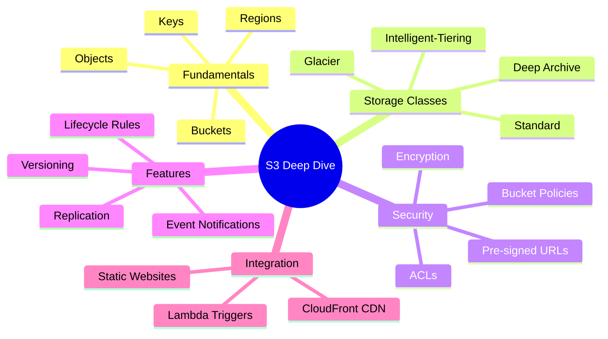

# S3 Storage

Amazon Simple Storage Service (S3) is one of the oldest and most fundamental AWS services. It provides virtually unlimited object storage with industry-leading durability, availability, and performance. Understanding S3 deeply is essential for any AWS developer.

## Alex's Story: The Image Storage Challenge

PetTracker's breed identification feature is a hit! Users are uploading thousands of pet photos daily. Alex is storing images on the EC2 instance's EBS volume, but problems are mounting:
- Storage costs are high
- Images aren't accessible from multiple servers
- No automatic backups
- Need to serve images quickly to users worldwide

"I need a better storage solution," Alex tells Sam. "Something that scales automatically, is super reliable, and doesn't cost a fortune."

"Welcome to S3," Sam smiles. "The Swiss Army knife of AWS storage."

## What You'll Learn

By the end of this chapter, you'll understand:

- S3 bucket creation and configuration
- Object operations and metadata
- Storage classes and cost optimization
- Security with bucket policies and ACLs
- Versioning and lifecycle management
- Static website hosting
- Event notifications and integrations
- Pre-signed URLs for secure access
- Multipart uploads for large files

## Chapter Architecture

## Why This Matters for the Exam

S3 is heavily tested on the DVA-C02 exam:

- Bucket policies vs ACLs vs IAM policies
- Storage class selection and transitions
- Encryption options (SSE-S3, SSE-KMS, SSE-C)
- Pre-signed URLs for temporary access
- Event notifications to Lambda/SQS/SNS
- Cross-region replication
- Versioning and MFA Delete

## Characters in This Chapter

- **Alex** - Learning S3 for pet image storage
- **Maya** - Frontend developer handling image uploads
- **Sam** - DevOps mentor with S3 architecture experience
- **The Finance Team** - Very interested in storage cost optimization
