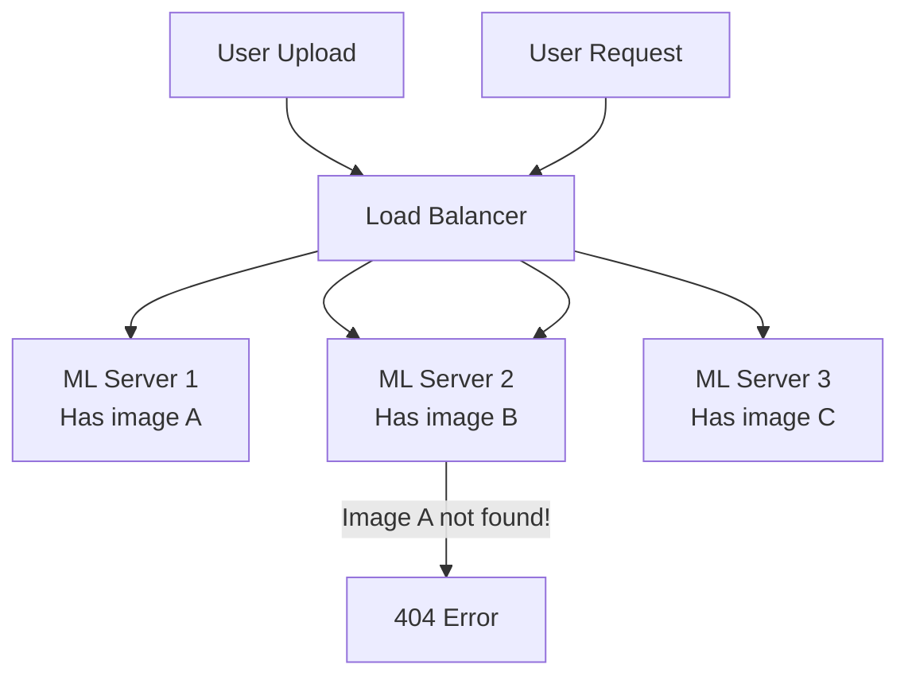
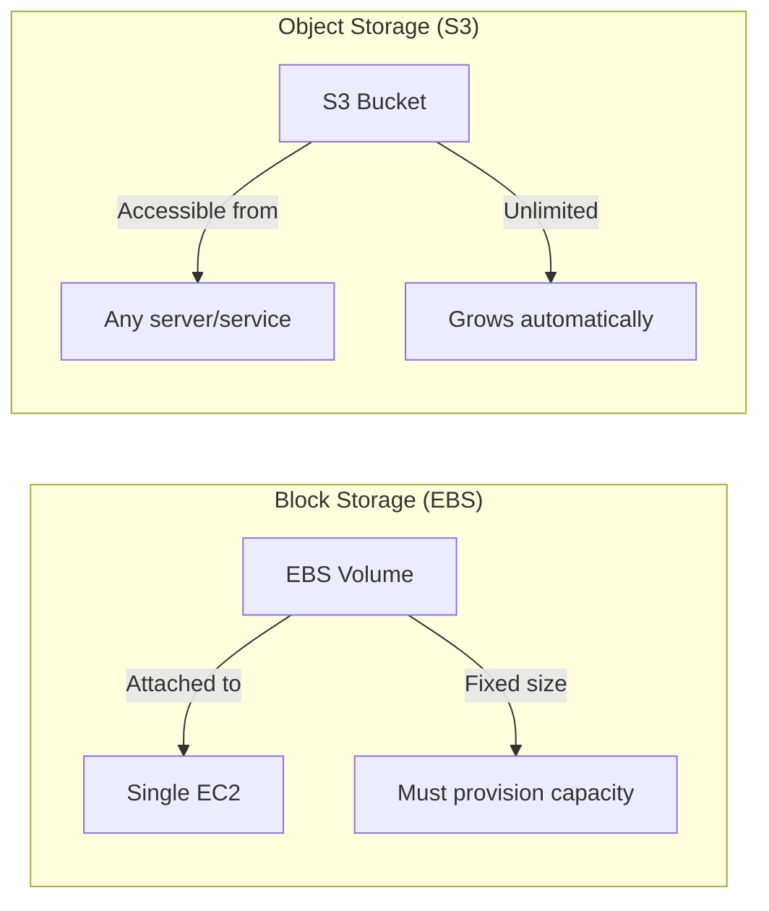
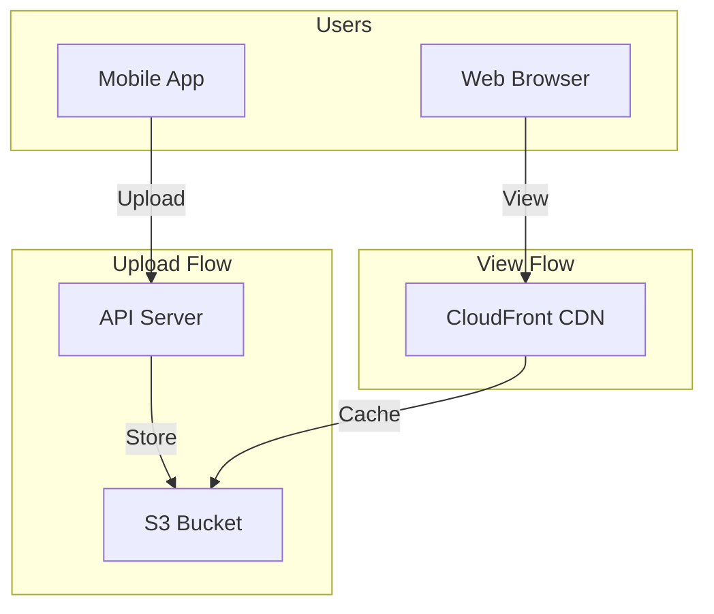
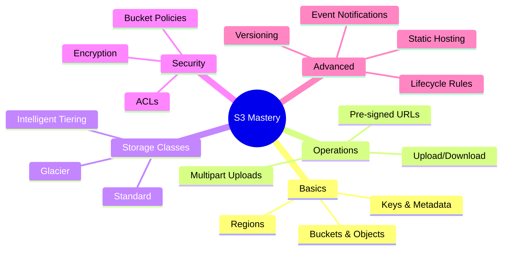

# Alex's Challenge: Image Storage Crisis

## The Growing Pain

PetTracker's breed identification is wildly successful. Users love it. But success brings problems.

```bash
# Alex checks the ML server's disk usage
$ df -h /var/app/current/uploads
Filesystem      Size  Used Avail Use% Mounted on
/dev/xvda1       50G   48G  2.0G  96% /

# 96% full! And growing fast
```

Alex runs the numbers:

```markdown
## Storage Growth Analysis

Daily uploads: 5,000 images
Average image size: 2.5 MB
Daily storage growth: 12.5 GB
Monthly growth: 375 GB

Current storage: 50 GB EBS
Days until full: 2 days!

Options:
1. Expand EBS volume (expensive, doesn't scale)
2. Delete old images (users won't like that)
3. Find a better solution (?)
```

## The Multi-Server Problem

It gets worse. Alex has multiple ML servers behind a load balancer:



"The image was uploaded to Server 1, but when the user tries to view it, they hit Server 2 which doesn't have it!"

## Alex's Storage Requirements

```markdown
## What We Need

### Functional Requirements
- Store millions of images
- Access from any server
- Fast retrieval for users
- Support image metadata (pet breed, confidence, etc.)

### Non-Functional Requirements
- High durability (never lose images)
- High availability (always accessible)
- Cost-effective (can't afford $1000/month)
- Scalable (no capacity planning)

### Nice to Have
- Automatic backups
- Serve images directly to users (no server load)
- Trigger processing on upload
- Geographic distribution
```

## The EBS Reality Check

Alex calculates what EBS would cost:

```markdown
## EBS Cost Analysis

Current: 50 GB EBS
Growth: 375 GB/month
After 6 months: 2.3 TB needed

EBS gp3 cost: $0.08/GB/month
6-month storage cost: $2,300 × $0.08 = $184/month

Plus:
- Need on each server (×3)
- Need to sync between servers (complex)
- Need backup solution (more cost)

Total estimated: $600+/month
```

## Sam Introduces S3

Sam overhears Alex's frustration:

"You're using the wrong tool. EBS is block storage, designed for a single server. You need object storage."

"What's the difference?"



## S3 Quick Comparison

| Aspect | EBS | S3 |
|--------|-----|-----|
| Access | Single EC2 | Anywhere via HTTP |
| Capacity | Fixed, must expand | Unlimited |
| Durability | 99.999% | 99.999999999% (11 9's) |
| Price | $0.08/GB/month | $0.023/GB/month |
| Scaling | Manual | Automatic |
| Backup | Manual snapshots | Built-in redundancy |

## S3 Pricing Preview

```markdown
## S3 Cost Estimate

Storage: $0.023/GB/month (Standard)
After 6 months: 2.3 TB × $0.023 = $53/month

Requests:
- PUT/POST: $0.005 per 1,000
- GET: $0.0004 per 1,000

Data Transfer:
- To Internet: $0.09/GB (first 10TB)
- To CloudFront: FREE!

Estimated total: $60-80/month
vs EBS: $600/month

Savings: ~90%!
```

## The Vision

Sam sketches the architecture:



"Users upload through your API, which stores in S3. When viewing images, they go through CloudFront which caches globally. Fast for everyone, cheap for you."

## What Alex Needs to Learn



## The Plan

Sam helps Alex outline the migration:

```markdown
## Migration Plan

### Phase 1: Basic Setup
1. Create S3 bucket
2. Configure security
3. Set up IAM permissions
4. Test upload/download

### Phase 2: Integration
1. Modify app to use S3
2. Generate pre-signed URLs for uploads
3. Serve images from S3
4. Add metadata to objects

### Phase 3: Optimization
1. Add CloudFront CDN
2. Configure lifecycle rules
3. Set up event notifications
4. Implement cost monitoring

### Phase 4: Migration
1. Migrate existing images
2. Verify all images accessible
3. Remove local storage
```

## Alex's Mindset Shift

```
Old Thinking:
"Storage is a server concern"
"I need to manage disk space"
"Files live on the server"

New Thinking:
"Storage is a service"
"Capacity is infinite"
"Objects live in the cloud, servers just process them"
```

## Key Takeaway

> **"S3 isn't just 'cloud storage' - it's a foundational service that changes how you architect applications. Think of objects, not files. Think of URLs, not file paths. Think of events, not polling."**

---

*Next: Alex learns the fundamentals of S3 - buckets, objects, and keys.*

---
*v2.0*
