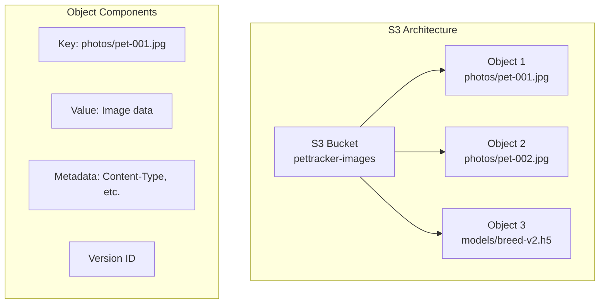
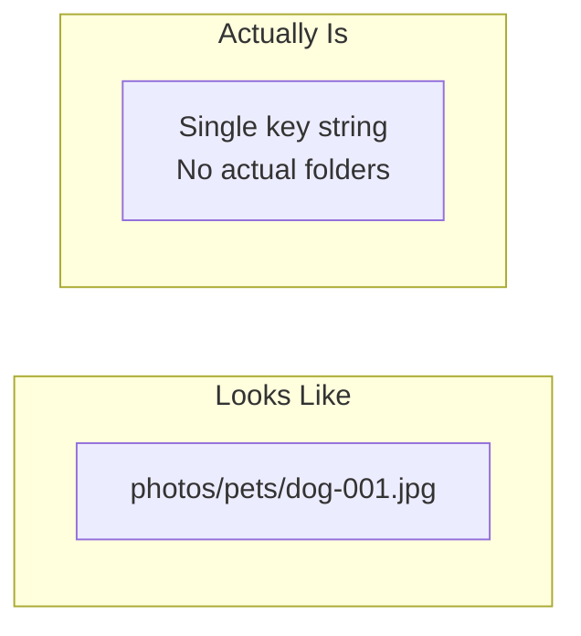
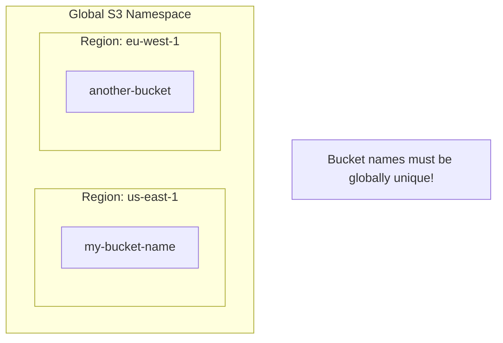
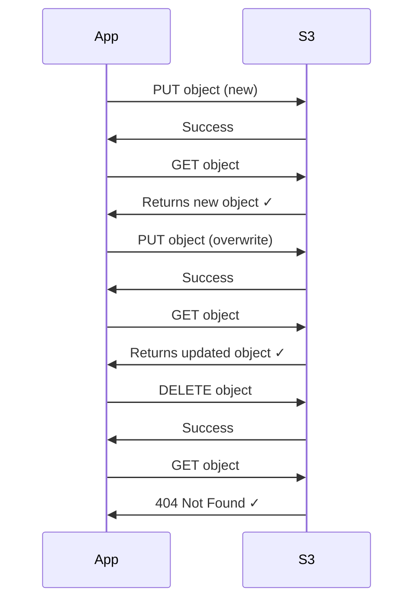

# S3 Fundamentals

## What is S3?

Amazon Simple Storage Service (S3) is an object storage service that offers:
- **Unlimited storage** - No capacity planning needed
- **11 9's durability** - 99.999999999% (designed to sustain loss of 2 facilities)
- **High availability** - 99.99% for Standard storage
- **Global accessibility** - Access from anywhere via HTTP/HTTPS



## Core Concepts

### Buckets

Buckets are containers for objects. Think of them as root folders.

```bash
# Bucket naming rules:
# - 3-63 characters
# - Lowercase letters, numbers, hyphens
# - Must start with letter or number
# - Globally unique across ALL AWS accounts!

# Valid names:
pettracker-images
my-app-uploads-2024
production-data-bucket

# Invalid names:
PetTracker-Images     # No uppercase
my..bucket            # No consecutive dots
-mybucket             # Can't start with hyphen
```

### Objects

Objects are the files you store. Each object consists of:

| Component | Description | Example |
|-----------|-------------|---------|
| **Key** | Unique identifier (path) | photos/pets/dog-001.jpg |
| **Value** | The actual data | Image bytes |
| **Metadata** | Key-value pairs | Content-Type: image/jpeg |
| **Version ID** | Unique version (if versioning enabled) | abc123xyz |
| **Access Control** | Who can access | Bucket owner |

### Keys

Keys are the "path" to your object. They look like file paths but are actually flat:



```bash
# These are all valid keys:
photos/pets/dog-001.jpg
photos/cats/cat-001.jpg
data.json
my-file.txt
2024/01/15/backup.tar.gz

# The "/" is just a character - no real folders exist!
# Console shows "folders" for convenience only
```

## S3 Namespace



- Bucket names are **globally unique** across all AWS accounts
- Objects are stored in a **specific region** (you choose when creating bucket)
- Data doesn't leave the region unless you configure replication

## S3 URLs

Every S3 object has multiple URL formats:

```bash
# Virtual-hosted style (recommended)
https://pettracker-images.s3.amazonaws.com/photos/pet-001.jpg
https://pettracker-images.s3.us-east-1.amazonaws.com/photos/pet-001.jpg

# Path style (legacy, being deprecated)
https://s3.amazonaws.com/pettracker-images/photos/pet-001.jpg
https://s3.us-east-1.amazonaws.com/pettracker-images/photos/pet-001.jpg

# S3 URI (for AWS CLI and SDKs)
s3://pettracker-images/photos/pet-001.jpg

# ARN (for IAM policies)
arn:aws:s3:::pettracker-images/photos/pet-001.jpg
```

## Object Size Limits

| Operation | Minimum | Maximum |
|-----------|---------|---------|
| Single PUT | 0 bytes | 5 GB |
| Multipart Upload | 5 MB parts | 5 TB total |
| Total object size | 0 bytes | 5 TB |

```bash
# For files > 5 GB, you MUST use multipart upload
# Recommended: Use multipart for files > 100 MB
```

## Metadata

Every object has metadata - information about the object:

```mermaid
graph TB
    subgraph "Object: photos/pet-001.jpg"
        subgraph "System Metadata"
            Content[Content-Type: image/jpeg]
            Length[Content-Length: 2456789]
            Modified[Last-Modified: 2024-01-15]
            ETag[ETag: "abc123def456"]
        end

        subgraph "User Metadata"
            Custom1[x-amz-meta-breed: golden-retriever]
            Custom2[x-amz-meta-confidence: 0.94]
            Custom3[x-amz-meta-upload-user: alex]
        end
    end
```

### System Metadata

Set by S3 automatically:

| Metadata | Description |
|----------|-------------|
| Content-Type | MIME type |
| Content-Length | Size in bytes |
| Last-Modified | When last changed |
| ETag | Hash of content |
| x-amz-version-id | Version (if versioning on) |

### User Metadata

Custom key-value pairs you define:

```python
import boto3

s3 = boto3.client('s3')

# Upload with custom metadata
s3.put_object(
    Bucket='pettracker-images',
    Key='photos/pet-001.jpg',
    Body=image_data,
    ContentType='image/jpeg',
    Metadata={
        'breed': 'golden-retriever',
        'confidence': '0.94',
        'upload-user': 'alex'
    }
)

# Retrieve metadata
response = s3.head_object(
    Bucket='pettracker-images',
    Key='photos/pet-001.jpg'
)

print(response['Metadata'])
# {'breed': 'golden-retriever', 'confidence': '0.94', 'upload-user': 'alex'}
```

## Consistency Model

S3 provides **strong read-after-write consistency**:



**Strong consistency** means:
- After a successful PUT, any GET returns the new data
- After a successful DELETE, any GET returns 404
- List operations reflect changes immediately

## Alex Creates First Bucket

```bash
# Create bucket using AWS CLI
aws s3 mb s3://pettracker-images-prod --region us-east-1

# Verify creation
aws s3 ls
# 2024-01-15 10:30:00 pettracker-images-prod
```

```python
# Create bucket using Python SDK
import boto3

s3 = boto3.client('s3', region_name='us-east-1')

# Create bucket
s3.create_bucket(
    Bucket='pettracker-images-prod',
    # Note: CreateBucketConfiguration needed for non-us-east-1 regions
)

# For other regions:
s3.create_bucket(
    Bucket='pettracker-images-eu',
    CreateBucketConfiguration={
        'LocationConstraint': 'eu-west-1'
    }
)
```

## Exam Tips

**For DVA-C02:**

1. **Bucket names are globally unique** across ALL accounts
2. **Objects can be 0 bytes to 5 TB**
3. **Single PUT limit is 5 GB** - use multipart for larger
4. **Strong read-after-write consistency** for all operations
5. **User metadata** must be prefixed with `x-amz-meta-`

**Common scenarios:**

> "Need globally unique identifier..."
> → Bucket names must be unique across all AWS

> "Upload 10 GB file..."
> → Must use multipart upload

> "Read immediately after write..."
> → S3 provides strong consistency, read will succeed

## Key Takeaways

1. **Buckets** are globally unique containers
2. **Objects** have keys, values, and metadata
3. **Keys** look like paths but are actually flat
4. **5 TB max** object size, 5 GB max single PUT
5. **Strong consistency** for all operations
6. **User metadata** for custom properties

---

*Next: Alex learns bucket operations - creating, configuring, and managing buckets.*

---
*v2.0*
