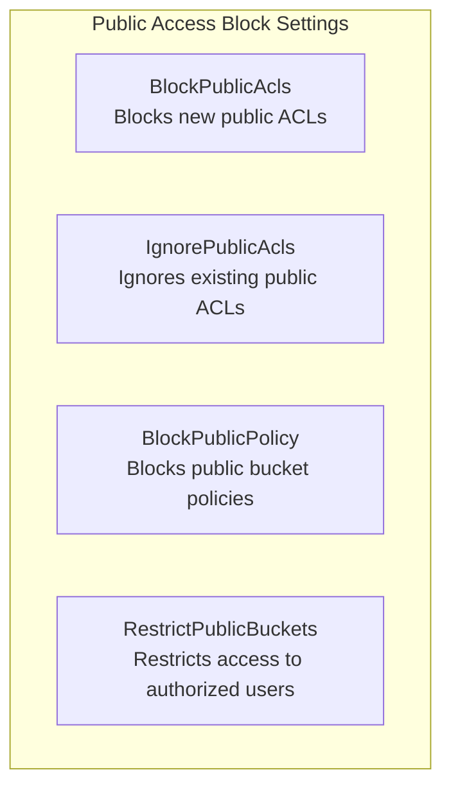

# Bucket Operations

## Creating Buckets

### Using AWS CLI

```bash
# Simple bucket creation (us-east-1)
aws s3 mb s3://pettracker-images-prod

# With specific region
aws s3 mb s3://pettracker-images-eu --region eu-west-1

# Using s3api for more control
aws s3api create-bucket \
    --bucket pettracker-images-prod \
    --region us-east-1

# For non-us-east-1 regions, must specify LocationConstraint
aws s3api create-bucket \
    --bucket pettracker-images-eu \
    --region eu-west-1 \
    --create-bucket-configuration LocationConstraint=eu-west-1
```

### Using Python SDK

```python
import boto3

s3 = boto3.client('s3', region_name='us-east-1')

# Create bucket
def create_bucket(bucket_name, region='us-east-1'):
    try:
        if region == 'us-east-1':
            s3.create_bucket(Bucket=bucket_name)
        else:
            s3.create_bucket(
                Bucket=bucket_name,
                CreateBucketConfiguration={
                    'LocationConstraint': region
                }
            )
        print(f"Created bucket: {bucket_name}")
    except s3.exceptions.BucketAlreadyExists:
        print(f"Bucket {bucket_name} already exists globally")
    except s3.exceptions.BucketAlreadyOwnedByYou:
        print(f"You already own bucket {bucket_name}")

create_bucket('pettracker-images-prod')
```

## Bucket Configuration

### Enable Versioning

```bash
# Enable versioning
aws s3api put-bucket-versioning \
    --bucket pettracker-images-prod \
    --versioning-configuration Status=Enabled

# Check versioning status
aws s3api get-bucket-versioning --bucket pettracker-images-prod
# {"Status": "Enabled"}
```

### Block Public Access (Important!)

```bash
# Block ALL public access (recommended default)
aws s3api put-public-access-block \
    --bucket pettracker-images-prod \
    --public-access-block-configuration \
        BlockPublicAcls=true,\
        IgnorePublicAcls=true,\
        BlockPublicPolicy=true,\
        RestrictPublicBuckets=true

# Verify settings
aws s3api get-public-access-block --bucket pettracker-images-prod
```



### Enable Encryption by Default

```bash
# Enable SSE-S3 encryption by default
aws s3api put-bucket-encryption \
    --bucket pettracker-images-prod \
    --server-side-encryption-configuration '{
        "Rules": [{
            "ApplyServerSideEncryptionByDefault": {
                "SSEAlgorithm": "AES256"
            },
            "BucketKeyEnabled": true
        }]
    }'

# Or use SSE-KMS
aws s3api put-bucket-encryption \
    --bucket pettracker-images-prod \
    --server-side-encryption-configuration '{
        "Rules": [{
            "ApplyServerSideEncryptionByDefault": {
                "SSEAlgorithm": "aws:kms",
                "KMSMasterKeyID": "alias/pettracker-key"
            },
            "BucketKeyEnabled": true
        }]
    }'
```

## Listing Buckets and Objects

### List Buckets

```bash
# List all buckets
aws s3 ls

# With s3api (more details)
aws s3api list-buckets \
    --query 'Buckets[*].[Name,CreationDate]' \
    --output table
```

### List Objects

```bash
# List objects in bucket
aws s3 ls s3://pettracker-images-prod/

# List recursively
aws s3 ls s3://pettracker-images-prod/ --recursive

# List with specific prefix
aws s3 ls s3://pettracker-images-prod/photos/2024/

# Using s3api for pagination
aws s3api list-objects-v2 \
    --bucket pettracker-images-prod \
    --prefix photos/ \
    --max-items 100
```

### Python SDK Listing

```python
import boto3

s3 = boto3.client('s3')

# List with pagination (recommended)
paginator = s3.get_paginator('list_objects_v2')
pages = paginator.paginate(
    Bucket='pettracker-images-prod',
    Prefix='photos/',
    PaginationConfig={'PageSize': 1000}
)

for page in pages:
    for obj in page.get('Contents', []):
        print(f"{obj['Key']} - {obj['Size']} bytes")
```

## Bucket Properties

### Enable Server Access Logging

```bash
# Create logging bucket first
aws s3 mb s3://pettracker-logs-prod

# Configure logging
aws s3api put-bucket-logging \
    --bucket pettracker-images-prod \
    --bucket-logging-status '{
        "LoggingEnabled": {
            "TargetBucket": "pettracker-logs-prod",
            "TargetPrefix": "s3-access-logs/"
        }
    }'
```

### Configure CORS (Cross-Origin Resource Sharing)

```bash
# Allow web browsers to access S3 directly
aws s3api put-bucket-cors \
    --bucket pettracker-images-prod \
    --cors-configuration '{
        "CORSRules": [{
            "AllowedOrigins": ["https://pettracker.com", "https://www.pettracker.com"],
            "AllowedMethods": ["GET", "PUT", "POST"],
            "AllowedHeaders": ["*"],
            "ExposeHeaders": ["ETag"],
            "MaxAgeSeconds": 3000
        }]
    }'
```

```python
# Python SDK CORS configuration
s3.put_bucket_cors(
    Bucket='pettracker-images-prod',
    CORSConfiguration={
        'CORSRules': [
            {
                'AllowedOrigins': ['https://pettracker.com'],
                'AllowedMethods': ['GET', 'PUT', 'POST', 'DELETE'],
                'AllowedHeaders': ['*'],
                'ExposeHeaders': ['ETag', 'x-amz-meta-*'],
                'MaxAgeSeconds': 3000
            }
        ]
    }
)
```

### Configure Tags

```bash
# Add tags for cost allocation and organization
aws s3api put-bucket-tagging \
    --bucket pettracker-images-prod \
    --tagging '{
        "TagSet": [
            {"Key": "Environment", "Value": "production"},
            {"Key": "Project", "Value": "PetTracker"},
            {"Key": "CostCenter", "Value": "engineering"}
        ]
    }'
```

## Deleting Buckets

```bash
# Delete empty bucket
aws s3 rb s3://pettracker-images-test

# Delete bucket and ALL contents (dangerous!)
aws s3 rb s3://pettracker-images-test --force

# Using s3api (bucket must be empty)
aws s3api delete-bucket --bucket pettracker-images-test
```

### Empty a Bucket First

```bash
# Remove all objects
aws s3 rm s3://pettracker-images-test --recursive

# If versioning enabled, also remove versions and delete markers
aws s3api list-object-versions \
    --bucket pettracker-images-test \
    --query '{Objects: Versions[].{Key:Key,VersionId:VersionId}}' \
    --output json | \
    aws s3api delete-objects \
        --bucket pettracker-images-test \
        --delete file:///dev/stdin
```

## Alex's Bucket Setup Script

```bash
#!/bin/bash
# setup-s3-buckets.sh

BUCKET_NAME="pettracker-images-prod"
LOG_BUCKET="pettracker-logs-prod"
REGION="us-east-1"

echo "Creating S3 buckets for PetTracker..."

# Create main bucket
aws s3 mb s3://$BUCKET_NAME --region $REGION

# Create logging bucket
aws s3 mb s3://$LOG_BUCKET --region $REGION

# Block public access on both
for bucket in $BUCKET_NAME $LOG_BUCKET; do
    aws s3api put-public-access-block \
        --bucket $bucket \
        --public-access-block-configuration \
            BlockPublicAcls=true,\
            IgnorePublicAcls=true,\
            BlockPublicPolicy=true,\
            RestrictPublicBuckets=true
done

# Enable versioning on main bucket
aws s3api put-bucket-versioning \
    --bucket $BUCKET_NAME \
    --versioning-configuration Status=Enabled

# Enable default encryption
aws s3api put-bucket-encryption \
    --bucket $BUCKET_NAME \
    --server-side-encryption-configuration '{
        "Rules": [{
            "ApplyServerSideEncryptionByDefault": {
                "SSEAlgorithm": "AES256"
            },
            "BucketKeyEnabled": true
        }]
    }'

# Enable logging
aws s3api put-bucket-logging \
    --bucket $BUCKET_NAME \
    --bucket-logging-status '{
        "LoggingEnabled": {
            "TargetBucket": "'$LOG_BUCKET'",
            "TargetPrefix": "s3-access-logs/"
        }
    }'

# Add tags
aws s3api put-bucket-tagging \
    --bucket $BUCKET_NAME \
    --tagging '{
        "TagSet": [
            {"Key": "Environment", "Value": "production"},
            {"Key": "Project", "Value": "PetTracker"}
        ]
    }'

# Configure CORS for web access
aws s3api put-bucket-cors \
    --bucket $BUCKET_NAME \
    --cors-configuration '{
        "CORSRules": [{
            "AllowedOrigins": ["https://pettracker.com"],
            "AllowedMethods": ["GET", "PUT"],
            "AllowedHeaders": ["*"],
            "MaxAgeSeconds": 3000
        }]
    }'

echo "S3 buckets configured successfully!"
aws s3 ls
```

## Exam Tips

**For DVA-C02:**

1. **Bucket names globally unique** across all AWS accounts
2. **Block Public Access** is recommended default
3. **Versioning** cannot be disabled, only suspended
4. **CORS** needed for direct browser access
5. **LocationConstraint** required for non-us-east-1 regions

**Common scenarios:**

> "Web app can't access S3 directly from browser..."
> → Configure CORS on the bucket

> "Accidentally deleted important object..."
> → Enable versioning to recover

> "Need to track S3 access..."
> → Enable server access logging

## Key Takeaways

1. **Block public access** by default
2. **Enable versioning** for important data
3. **Configure encryption** by default
4. **Set up CORS** for web applications
5. **Use tags** for cost tracking
6. **Enable logging** for audit trails

---

*Next: Alex learns object operations - uploading, downloading, and managing files.*

---
*v1.0*
