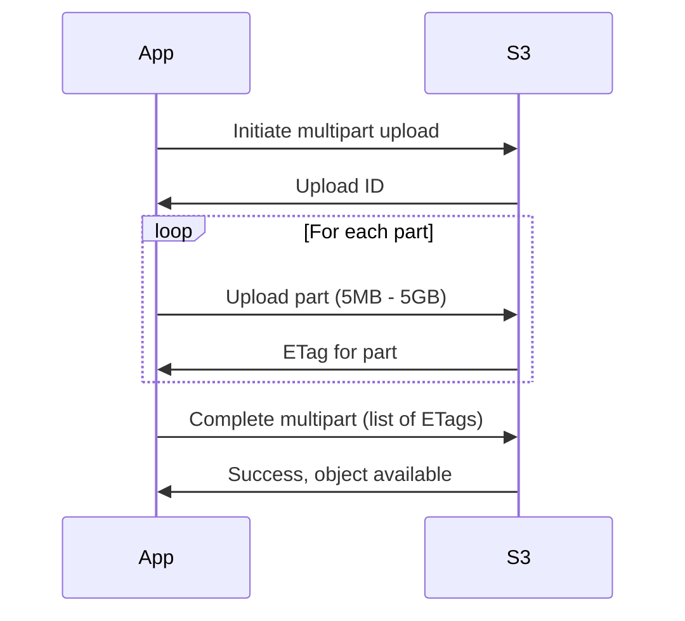

# Object Operations

## Uploading Objects

### Using AWS CLI

```bash
# Upload single file
aws s3 cp image.jpg s3://pettracker-images-prod/photos/

# Upload with specific key
aws s3 cp image.jpg s3://pettracker-images-prod/photos/pet-001.jpg

# Upload with metadata
aws s3 cp image.jpg s3://pettracker-images-prod/photos/pet-001.jpg \
    --metadata '{"breed":"golden-retriever","confidence":"0.94"}'

# Upload with content type
aws s3 cp image.jpg s3://pettracker-images-prod/photos/pet-001.jpg \
    --content-type "image/jpeg"

# Upload entire directory
aws s3 cp ./uploads/ s3://pettracker-images-prod/photos/ --recursive

# Sync directory (only uploads changed files)
aws s3 sync ./uploads/ s3://pettracker-images-prod/photos/
```

### Using Python SDK

```python
import boto3
from botocore.exceptions import ClientError

s3 = boto3.client('s3')

# Upload file
def upload_file(file_path, bucket, key, metadata=None):
    """Upload a file to S3"""
    extra_args = {}

    if metadata:
        extra_args['Metadata'] = metadata

    # Auto-detect content type
    import mimetypes
    content_type = mimetypes.guess_type(file_path)[0]
    if content_type:
        extra_args['ContentType'] = content_type

    try:
        s3.upload_file(
            file_path,
            bucket,
            key,
            ExtraArgs=extra_args
        )
        print(f"Uploaded {file_path} to s3://{bucket}/{key}")
        return True
    except ClientError as e:
        print(f"Error uploading: {e}")
        return False

# Usage
upload_file(
    'image.jpg',
    'pettracker-images-prod',
    'photos/pet-001.jpg',
    metadata={'breed': 'golden-retriever', 'confidence': '0.94'}
)
```

### Upload from Memory

```python
import io

# Upload bytes directly
def upload_bytes(data, bucket, key, content_type='application/octet-stream'):
    s3.put_object(
        Bucket=bucket,
        Key=key,
        Body=data,
        ContentType=content_type
    )

# Upload string as file
json_data = '{"breed": "golden-retriever", "confidence": 0.94}'
upload_bytes(
    json_data.encode('utf-8'),
    'pettracker-images-prod',
    'results/pet-001.json',
    'application/json'
)

# Upload file-like object
buffer = io.BytesIO()
buffer.write(b'Hello, World!')
buffer.seek(0)

s3.upload_fileobj(
    buffer,
    'pettracker-images-prod',
    'test/hello.txt'
)
```

## Downloading Objects

### Using AWS CLI

```bash
# Download single file
aws s3 cp s3://pettracker-images-prod/photos/pet-001.jpg ./downloaded.jpg

# Download to specific path
aws s3 cp s3://pettracker-images-prod/photos/pet-001.jpg ./images/pet-001.jpg

# Download entire prefix
aws s3 cp s3://pettracker-images-prod/photos/ ./downloads/ --recursive

# Sync from S3
aws s3 sync s3://pettracker-images-prod/photos/ ./local-photos/
```

### Using Python SDK

```python
# Download to file
s3.download_file(
    'pettracker-images-prod',
    'photos/pet-001.jpg',
    'local-image.jpg'
)

# Download to memory
response = s3.get_object(
    Bucket='pettracker-images-prod',
    Key='photos/pet-001.jpg'
)
image_data = response['Body'].read()

# Stream large files
def download_large_file(bucket, key, local_path):
    with open(local_path, 'wb') as f:
        s3.download_fileobj(bucket, key, f)

# Get object with specific byte range (partial download)
response = s3.get_object(
    Bucket='pettracker-images-prod',
    Key='large-file.zip',
    Range='bytes=0-1000000'  # First 1MB
)
```

## Multipart Upload

For files larger than 100 MB, use multipart upload:



### Python Multipart Upload

```python
import boto3
from boto3.s3.transfer import TransferConfig

s3 = boto3.client('s3')

# Configure multipart settings
config = TransferConfig(
    multipart_threshold=100 * 1024 * 1024,  # 100 MB
    multipart_chunksize=100 * 1024 * 1024,  # 100 MB per part
    max_concurrency=10,
    use_threads=True
)

# Upload large file with automatic multipart
s3.upload_file(
    'large-model.h5',
    'pettracker-images-prod',
    'models/breed-model-v3.h5',
    Config=config
)
```

### Manual Multipart Upload

```python
import hashlib

def multipart_upload(file_path, bucket, key, part_size=100*1024*1024):
    """Manual multipart upload for more control"""

    # Initiate upload
    response = s3.create_multipart_upload(
        Bucket=bucket,
        Key=key
    )
    upload_id = response['UploadId']

    parts = []
    part_number = 1

    try:
        with open(file_path, 'rb') as f:
            while True:
                data = f.read(part_size)
                if not data:
                    break

                # Upload part
                response = s3.upload_part(
                    Bucket=bucket,
                    Key=key,
                    PartNumber=part_number,
                    UploadId=upload_id,
                    Body=data
                )

                parts.append({
                    'PartNumber': part_number,
                    'ETag': response['ETag']
                })
                part_number += 1
                print(f"Uploaded part {part_number - 1}")

        # Complete upload
        s3.complete_multipart_upload(
            Bucket=bucket,
            Key=key,
            UploadId=upload_id,
            MultipartUpload={'Parts': parts}
        )
        print("Upload complete!")

    except Exception as e:
        # Abort on error
        s3.abort_multipart_upload(
            Bucket=bucket,
            Key=key,
            UploadId=upload_id
        )
        raise e
```

## Copying Objects

```bash
# Copy within same bucket
aws s3 cp s3://bucket/source.jpg s3://bucket/destination.jpg

# Copy between buckets
aws s3 cp s3://source-bucket/file.jpg s3://dest-bucket/file.jpg

# Copy with metadata change
aws s3 cp s3://bucket/file.jpg s3://bucket/file.jpg \
    --metadata-directive REPLACE \
    --metadata '{"new-key":"new-value"}'
```

```python
# Copy object
s3.copy_object(
    CopySource={'Bucket': 'source-bucket', 'Key': 'source-key'},
    Bucket='dest-bucket',
    Key='dest-key'
)

# Copy with new metadata
s3.copy_object(
    CopySource={'Bucket': 'bucket', 'Key': 'file.jpg'},
    Bucket='bucket',
    Key='file.jpg',
    Metadata={'updated': 'true'},
    MetadataDirective='REPLACE'
)
```

## Deleting Objects

```bash
# Delete single object
aws s3 rm s3://pettracker-images-prod/photos/pet-001.jpg

# Delete multiple objects (prefix)
aws s3 rm s3://pettracker-images-prod/photos/2023/ --recursive

# Delete with versioning (creates delete marker)
aws s3api delete-object \
    --bucket pettracker-images-prod \
    --key photos/pet-001.jpg

# Delete specific version permanently
aws s3api delete-object \
    --bucket pettracker-images-prod \
    --key photos/pet-001.jpg \
    --version-id "abc123xyz"
```

```python
# Delete single object
s3.delete_object(
    Bucket='pettracker-images-prod',
    Key='photos/pet-001.jpg'
)

# Bulk delete (up to 1000 objects)
s3.delete_objects(
    Bucket='pettracker-images-prod',
    Delete={
        'Objects': [
            {'Key': 'photos/pet-001.jpg'},
            {'Key': 'photos/pet-002.jpg'},
            {'Key': 'photos/pet-003.jpg'}
        ]
    }
)
```

## Object Metadata Operations

```python
# Get object metadata (HEAD request - no data transfer)
response = s3.head_object(
    Bucket='pettracker-images-prod',
    Key='photos/pet-001.jpg'
)

print(f"Size: {response['ContentLength']}")
print(f"Type: {response['ContentType']}")
print(f"Last Modified: {response['LastModified']}")
print(f"User Metadata: {response.get('Metadata', {})}")

# Check if object exists
def object_exists(bucket, key):
    try:
        s3.head_object(Bucket=bucket, Key=key)
        return True
    except ClientError as e:
        if e.response['Error']['Code'] == '404':
            return False
        raise
```

## Alex's Upload Service

```python
# upload_service.py
import boto3
import uuid
from datetime import datetime
import mimetypes

class S3UploadService:
    def __init__(self, bucket_name):
        self.s3 = boto3.client('s3')
        self.bucket = bucket_name

    def upload_pet_image(self, file_data, original_filename, user_id, breed=None, confidence=None):
        """Upload pet image with metadata"""

        # Generate unique key
        ext = original_filename.split('.')[-1].lower()
        date_path = datetime.now().strftime('%Y/%m/%d')
        unique_id = str(uuid.uuid4())[:8]
        key = f"photos/{date_path}/{user_id}/{unique_id}.{ext}"

        # Build metadata
        metadata = {
            'original-filename': original_filename,
            'user-id': user_id,
            'upload-timestamp': datetime.now().isoformat()
        }

        if breed:
            metadata['breed'] = breed
        if confidence:
            metadata['confidence'] = str(confidence)

        # Detect content type
        content_type = mimetypes.guess_type(original_filename)[0] or 'application/octet-stream'

        # Upload
        self.s3.put_object(
            Bucket=self.bucket,
            Key=key,
            Body=file_data,
            ContentType=content_type,
            Metadata=metadata
        )

        return {
            'bucket': self.bucket,
            'key': key,
            'url': f"s3://{self.bucket}/{key}"
        }

    def get_image_url(self, key, expires_in=3600):
        """Generate pre-signed URL for viewing"""
        return self.s3.generate_presigned_url(
            'get_object',
            Params={'Bucket': self.bucket, 'Key': key},
            ExpiresIn=expires_in
        )

# Usage
upload_service = S3UploadService('pettracker-images-prod')

with open('pet-photo.jpg', 'rb') as f:
    result = upload_service.upload_pet_image(
        file_data=f.read(),
        original_filename='pet-photo.jpg',
        user_id='user-123',
        breed='golden-retriever',
        confidence=0.94
    )

print(f"Uploaded to: {result['key']}")
```

## Exam Tips

**For DVA-C02:**

1. **Single PUT limit: 5 GB** - use multipart for larger
2. **Multipart** recommended for files > 100 MB
3. **head_object** returns metadata without downloading
4. **Metadata** can only be changed by copy with REPLACE
5. **Delete with versioning** creates delete marker

**Common scenarios:**

> "Upload 10 GB file..."
> → Must use multipart upload

> "Change object metadata..."
> → Copy object with MetadataDirective=REPLACE

> "Check if object exists..."
> → Use head_object (efficient, no data transfer)

## Key Takeaways

1. **Multiple upload methods** - file, bytes, stream
2. **Multipart for large files** - automatic with SDK
3. **Metadata is immutable** - copy to change
4. **head_object is efficient** - no data transfer
5. **Bulk delete** up to 1000 objects at once

---

*Next: Alex learns about S3 storage classes for cost optimization.*
