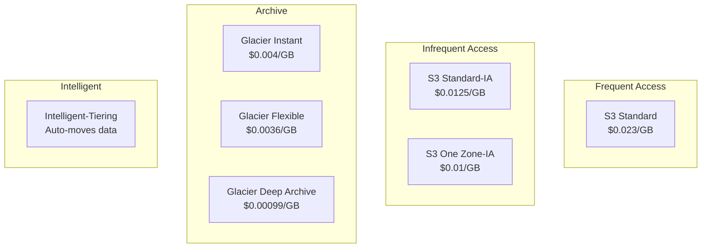
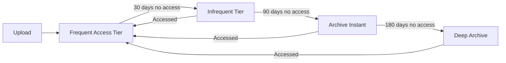
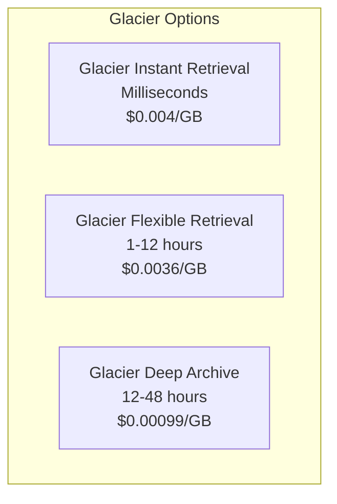

# Storage Classes

## The Cost Conversation

The finance team reviews Alex's S3 bill:

```markdown
## S3 Cost Analysis - January 2024

Storage: 2.5 TB @ $0.023/GB = $57.50
Requests: ~500K @ various rates = $12.00
Data Transfer: CloudFront (free)

Total: ~$70/month

Question: "Alex, are all 2.5 TB of images accessed frequently?"
```

Alex checks the access patterns:

```python
# Analyze access patterns (simplified)
# Last 30 days: 80% of requests access 20% of data
# Photos older than 90 days: < 1% access rate
# Photos older than 1 year: nearly 0% access

# Potential savings:
# - 500 GB frequently accessed → Standard
# - 1 TB occasionally accessed → Standard-IA
# - 1 TB rarely accessed → Glacier Instant Retrieval
```

## S3 Storage Classes



## Storage Class Comparison

| Class | Storage Cost | Retrieval | Min Duration | Use Case |
|-------|-------------|-----------|--------------|----------|
| **Standard** | $0.023/GB | Instant | None | Frequent access |
| **Standard-IA** | $0.0125/GB | Instant | 30 days | Infrequent access |
| **One Zone-IA** | $0.01/GB | Instant | 30 days | Reproducible data |
| **Intelligent-Tiering** | Varies | Instant | None | Unknown patterns |
| **Glacier Instant** | $0.004/GB | Milliseconds | 90 days | Archive, instant access |
| **Glacier Flexible** | $0.0036/GB | 1-12 hours | 90 days | Archive, flexible |
| **Glacier Deep** | $0.00099/GB | 12-48 hours | 180 days | Long-term archive |

## Standard Storage Class

Default, for frequently accessed data:

```python
# Upload with Standard (default)
s3.put_object(
    Bucket='pettracker-images-prod',
    Key='photos/recent/pet-001.jpg',
    Body=image_data
    # StorageClass defaults to 'STANDARD'
)
```

**Characteristics:**
- 99.99% availability
- 11 9's durability
- No retrieval fees
- No minimum storage duration

## Standard-IA (Infrequent Access)

For data accessed less than once a month:

```python
# Upload with Standard-IA
s3.put_object(
    Bucket='pettracker-images-prod',
    Key='photos/archive/pet-001.jpg',
    Body=image_data,
    StorageClass='STANDARD_IA'
)
```

**Characteristics:**
- Same durability as Standard
- Lower storage cost ($0.0125 vs $0.023)
- Retrieval fee ($0.01/GB)
- Minimum 30-day storage charge
- Minimum 128 KB object charge

## One Zone-IA

For reproducible data that doesn't need multi-AZ resilience:

```python
# Upload with One Zone-IA
s3.put_object(
    Bucket='pettracker-images-prod',
    Key='thumbnails/pet-001-thumb.jpg',
    Body=thumbnail_data,
    StorageClass='ONEZONE_IA'
)
```

**Characteristics:**
- Single AZ (less durable if AZ fails)
- 20% cheaper than Standard-IA
- Good for: thumbnails, data you can regenerate

## Intelligent-Tiering

Automatically moves data between tiers based on access:



```python
# Upload with Intelligent-Tiering
s3.put_object(
    Bucket='pettracker-images-prod',
    Key='photos/pet-001.jpg',
    Body=image_data,
    StorageClass='INTELLIGENT_TIERING'
)
```

**Characteristics:**
- No retrieval fees (access moves to frequent tier)
- Small monitoring fee ($0.0025/1000 objects)
- Perfect for unknown access patterns

### Configure Archive Access Tiers

```bash
# Enable archive tiers for Intelligent-Tiering
aws s3api put-bucket-intelligent-tiering-configuration \
    --bucket pettracker-images-prod \
    --id "enable-archive" \
    --intelligent-tiering-configuration '{
        "Id": "enable-archive",
        "Status": "Enabled",
        "Tierings": [
            {
                "Days": 90,
                "AccessTier": "ARCHIVE_ACCESS"
            },
            {
                "Days": 180,
                "AccessTier": "DEEP_ARCHIVE_ACCESS"
            }
        ]
    }'
```

## Glacier Storage Classes

For archival data:



### Glacier Flexible Retrieval Options

| Tier | Time | Cost |
|------|------|------|
| Expedited | 1-5 minutes | $0.03/GB + $10/request |
| Standard | 3-5 hours | $0.01/GB + $0.05/1000 requests |
| Bulk | 5-12 hours | $0.0025/GB + $0.025/1000 requests |

```python
# Restore from Glacier
s3.restore_object(
    Bucket='pettracker-images-prod',
    Key='archive/old-photo.jpg',
    RestoreRequest={
        'Days': 7,  # How long to keep restored copy
        'GlacierJobParameters': {
            'Tier': 'Standard'  # Expedited, Standard, or Bulk
        }
    }
)

# Check restore status
response = s3.head_object(
    Bucket='pettracker-images-prod',
    Key='archive/old-photo.jpg'
)
print(response.get('Restore'))
# 'ongoing-request="true"' or 'ongoing-request="false", expiry-date="..."'
```

## Changing Storage Class

```bash
# Copy with new storage class
aws s3 cp s3://bucket/file.jpg s3://bucket/file.jpg \
    --storage-class GLACIER_IR

# Using s3api
aws s3api copy-object \
    --bucket pettracker-images-prod \
    --key photos/pet-001.jpg \
    --copy-source pettracker-images-prod/photos/pet-001.jpg \
    --storage-class STANDARD_IA
```

```python
# Change storage class via copy
s3.copy_object(
    Bucket='pettracker-images-prod',
    Key='photos/pet-001.jpg',
    CopySource={'Bucket': 'pettracker-images-prod', 'Key': 'photos/pet-001.jpg'},
    StorageClass='STANDARD_IA',
    MetadataDirective='COPY'
)
```

## Alex's Storage Strategy

```markdown
## PetTracker Storage Class Strategy

### Photos (by age)
- 0-30 days: Standard ($0.023/GB)
  - High access for recent uploads
- 31-90 days: Standard-IA ($0.0125/GB)
  - Occasional views
- 91+ days: Glacier Instant ($0.004/GB)
  - Rare access, but users expect instant when needed

### Thumbnails
- One Zone-IA ($0.01/GB)
  - Can regenerate from original
  - Lower durability acceptable

### ML Models
- Standard ($0.023/GB)
  - Frequently accessed by servers

### Logs
- 0-30 days: Standard-IA ($0.0125/GB)
  - For debugging recent issues
- 31-90 days: Glacier Instant ($0.004/GB)
  - Compliance requirements
- 91+ days: Glacier Deep Archive ($0.00099/GB)
  - Legal retention

### Unknown/Variable
- Intelligent-Tiering
  - Automatically optimizes
```

### Cost Projection

```markdown
## Monthly Cost Comparison

Without optimization (all Standard):
2.5 TB × $0.023 = $57.50/month

With storage class optimization:
- 500 GB Standard @ $0.023 = $11.50
- 1 TB Standard-IA @ $0.0125 = $12.80
- 1 TB Glacier Instant @ $0.004 = $4.10
Total: $28.40/month

Savings: $29.10/month (51%)
Annual savings: $349.20
```

## Exam Tips

**For DVA-C02:**

1. **Standard-IA** has retrieval fees and 30-day minimum
2. **One Zone-IA** is 20% cheaper but single AZ
3. **Intelligent-Tiering** no retrieval fees, has monitoring fee
4. **Glacier Instant** millisecond retrieval
5. **Glacier Flexible** 1-12 hours retrieval
6. **Deep Archive** 12-48 hours, cheapest

**Common scenarios:**

> "Unknown access pattern..."
> → Intelligent-Tiering

> "Accessed once a month..."
> → Standard-IA

> "Can regenerate if lost..."
> → One Zone-IA

> "Archive but might need quick access..."
> → Glacier Instant Retrieval

> "Compliance archive, rarely accessed..."
> → Glacier Deep Archive

## Key Takeaways

1. **Standard** for frequently accessed data
2. **Standard-IA** for infrequent access (30-day minimum)
3. **Intelligent-Tiering** automates tier selection
4. **Glacier** family for archival needs
5. **Match storage class** to access patterns
6. **Use lifecycle rules** to automate transitions

---

*Next: Alex learns bucket policies and security for S3.*

---
*v1.0*
