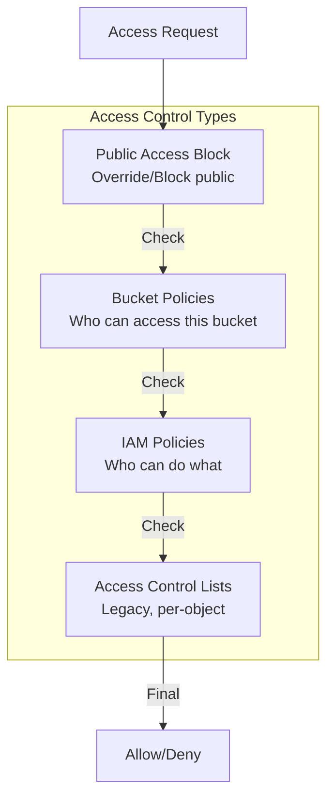
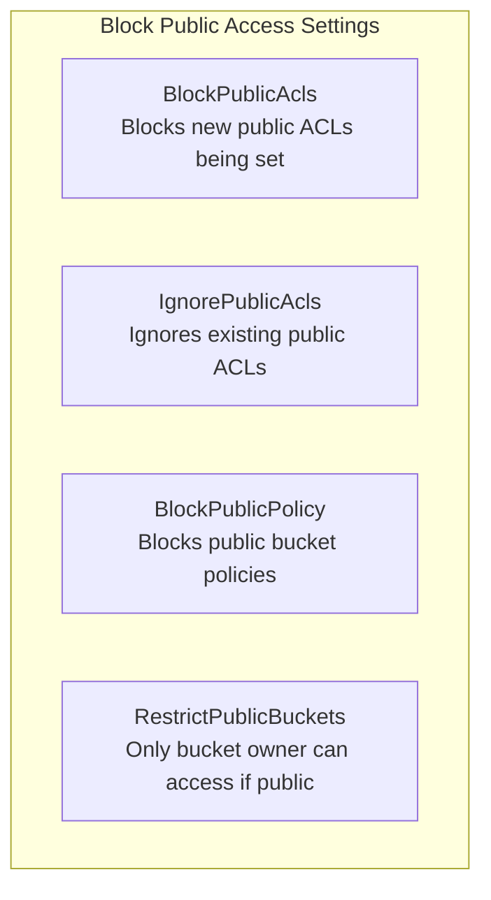
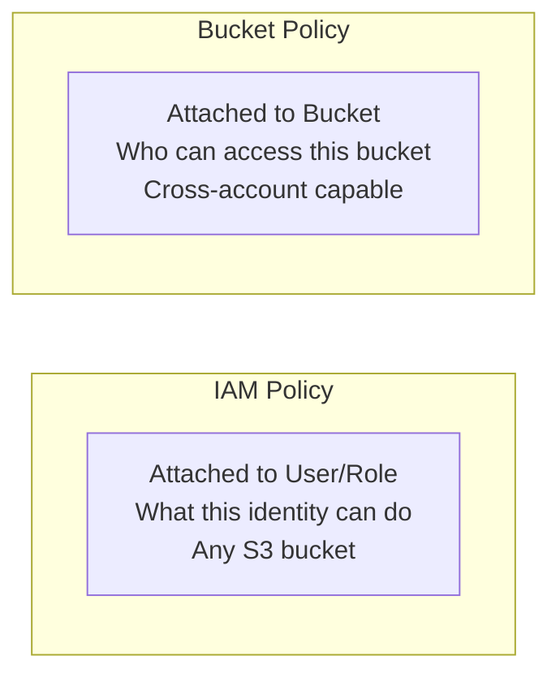

# Bucket Policies and Security

## The Security Incident

Alex gets a Slack message from Jordan (security consultant):

> "Alex, I found your S3 bucket `pettracker-images-dev` in a public bucket scanner. It's accessible to anyone on the internet. Please fix this immediately."

Alex is shocked. "But I didn't make it public!"

Jordan explains: "You probably had an overly permissive bucket policy. Let's review S3 security properly."

## S3 Access Control Mechanisms



## Bucket Policies

JSON documents attached to buckets that define access rules:

```json
{
    "Version": "2012-10-17",
    "Statement": [
        {
            "Sid": "AllowReadFromEC2",
            "Effect": "Allow",
            "Principal": {
                "AWS": "arn:aws:iam::123456789012:role/EC2-S3-Role"
            },
            "Action": [
                "s3:GetObject",
                "s3:ListBucket"
            ],
            "Resource": [
                "arn:aws:s3:::pettracker-images-prod",
                "arn:aws:s3:::pettracker-images-prod/*"
            ]
        }
    ]
}
```

### Policy Elements

| Element | Description | Example |
|---------|-------------|---------|
| **Version** | Policy version | "2012-10-17" |
| **Statement** | Array of permissions | [...] |
| **Sid** | Statement ID (optional) | "AllowReadFromEC2" |
| **Effect** | Allow or Deny | "Allow" |
| **Principal** | Who the policy applies to | "*" or ARN |
| **Action** | What actions | "s3:GetObject" |
| **Resource** | What resources | Bucket and object ARNs |
| **Condition** | When to apply (optional) | IP address, etc. |

## Common Bucket Policy Patterns

### Allow Specific IAM Role

```json
{
    "Version": "2012-10-17",
    "Statement": [
        {
            "Sid": "AllowAppServerAccess",
            "Effect": "Allow",
            "Principal": {
                "AWS": "arn:aws:iam::123456789012:role/pettracker-app-role"
            },
            "Action": [
                "s3:GetObject",
                "s3:PutObject",
                "s3:DeleteObject"
            ],
            "Resource": "arn:aws:s3:::pettracker-images-prod/*"
        }
    ]
}
```

### Allow Cross-Account Access

```json
{
    "Version": "2012-10-17",
    "Statement": [
        {
            "Sid": "AllowPartnerAccess",
            "Effect": "Allow",
            "Principal": {
                "AWS": "arn:aws:iam::999888777666:root"
            },
            "Action": "s3:GetObject",
            "Resource": "arn:aws:s3:::pettracker-images-prod/shared/*"
        }
    ]
}
```

### Deny Unencrypted Uploads

```json
{
    "Version": "2012-10-17",
    "Statement": [
        {
            "Sid": "DenyUnencryptedUploads",
            "Effect": "Deny",
            "Principal": "*",
            "Action": "s3:PutObject",
            "Resource": "arn:aws:s3:::pettracker-images-prod/*",
            "Condition": {
                "StringNotEquals": {
                    "s3:x-amz-server-side-encryption": "AES256"
                }
            }
        }
    ]
}
```

### Restrict to VPC Endpoint

```json
{
    "Version": "2012-10-17",
    "Statement": [
        {
            "Sid": "RestrictToVPCEndpoint",
            "Effect": "Deny",
            "Principal": "*",
            "Action": "s3:*",
            "Resource": [
                "arn:aws:s3:::pettracker-images-prod",
                "arn:aws:s3:::pettracker-images-prod/*"
            ],
            "Condition": {
                "StringNotEquals": {
                    "aws:sourceVpce": "vpce-1234567890abcdef0"
                }
            }
        }
    ]
}
```

### Require HTTPS

```json
{
    "Version": "2012-10-17",
    "Statement": [
        {
            "Sid": "RequireHTTPS",
            "Effect": "Deny",
            "Principal": "*",
            "Action": "s3:*",
            "Resource": [
                "arn:aws:s3:::pettracker-images-prod",
                "arn:aws:s3:::pettracker-images-prod/*"
            ],
            "Condition": {
                "Bool": {
                    "aws:SecureTransport": "false"
                }
            }
        }
    ]
}
```

## Block Public Access

The nuclear option - blocks public access regardless of bucket policies or ACLs:

```bash
# Block ALL public access (recommended)
aws s3api put-public-access-block \
    --bucket pettracker-images-prod \
    --public-access-block-configuration \
        BlockPublicAcls=true,\
        IgnorePublicAcls=true,\
        BlockPublicPolicy=true,\
        RestrictPublicBuckets=true
```



### Account-Level Block

```bash
# Block public access for ALL buckets in account
aws s3control put-public-access-block \
    --account-id 123456789012 \
    --public-access-block-configuration \
        BlockPublicAcls=true,\
        IgnorePublicAcls=true,\
        BlockPublicPolicy=true,\
        RestrictPublicBuckets=true
```

## IAM Policies vs Bucket Policies



| Aspect | IAM Policy | Bucket Policy |
|--------|-----------|---------------|
| Attached to | User, group, role | Bucket |
| Scope | What user can do | Who can access bucket |
| Cross-account | No | Yes |
| Anonymous access | No | Yes (with Principal: "*") |
| Size limit | 6KB | 20KB |

### When to Use Which

**Use IAM Policies when:**
- Controlling what your users can do
- Managing permissions centrally
- Same account access

**Use Bucket Policies when:**
- Cross-account access needed
- Complex conditions (IP, VPC, etc.)
- Denying specific patterns
- Public access (with extreme caution)

## Access Control Lists (ACLs)

Legacy mechanism - prefer bucket policies instead:

```bash
# Check current ACL
aws s3api get-bucket-acl --bucket pettracker-images-prod

# Set ACL (not recommended)
aws s3api put-bucket-acl --bucket pettracker-images-prod --acl private
```

### Disable ACLs (Recommended)

```bash
# Disable ACLs - bucket owner enforced
aws s3api put-bucket-ownership-controls \
    --bucket pettracker-images-prod \
    --ownership-controls '{
        "Rules": [{
            "ObjectOwnership": "BucketOwnerEnforced"
        }]
    }'
```

## Alex's Security Configuration

```python
# security_config.py
import boto3
import json

def configure_bucket_security(bucket_name, app_role_arn):
    s3 = boto3.client('s3')

    # 1. Block public access
    s3.put_public_access_block(
        Bucket=bucket_name,
        PublicAccessBlockConfiguration={
            'BlockPublicAcls': True,
            'IgnorePublicAcls': True,
            'BlockPublicPolicy': True,
            'RestrictPublicBuckets': True
        }
    )
    print("✓ Public access blocked")

    # 2. Disable ACLs
    s3.put_bucket_ownership_controls(
        Bucket=bucket_name,
        OwnershipControls={
            'Rules': [{'ObjectOwnership': 'BucketOwnerEnforced'}]
        }
    )
    print("✓ ACLs disabled")

    # 3. Apply bucket policy
    policy = {
        "Version": "2012-10-17",
        "Statement": [
            {
                "Sid": "AllowAppAccess",
                "Effect": "Allow",
                "Principal": {"AWS": app_role_arn},
                "Action": ["s3:GetObject", "s3:PutObject", "s3:DeleteObject"],
                "Resource": f"arn:aws:s3:::{bucket_name}/*"
            },
            {
                "Sid": "AllowAppListBucket",
                "Effect": "Allow",
                "Principal": {"AWS": app_role_arn},
                "Action": "s3:ListBucket",
                "Resource": f"arn:aws:s3:::{bucket_name}"
            },
            {
                "Sid": "RequireHTTPS",
                "Effect": "Deny",
                "Principal": "*",
                "Action": "s3:*",
                "Resource": [
                    f"arn:aws:s3:::{bucket_name}",
                    f"arn:aws:s3:::{bucket_name}/*"
                ],
                "Condition": {
                    "Bool": {"aws:SecureTransport": "false"}
                }
            }
        ]
    }

    s3.put_bucket_policy(
        Bucket=bucket_name,
        Policy=json.dumps(policy)
    )
    print("✓ Bucket policy applied")

# Run
configure_bucket_security(
    'pettracker-images-prod',
    'arn:aws:iam::123456789012:role/pettracker-app-role'
)
```

## Exam Tips

**For DVA-C02:**

1. **Block Public Access** overrides bucket policies and ACLs
2. **Bucket policies** for cross-account and conditions
3. **IAM policies** for same-account user permissions
4. **Principal: "*"** means anonymous access
5. **ACLs are legacy** - prefer bucket policies

**Common scenarios:**

> "Cross-account S3 access..."
> → Bucket policy with other account's ARN

> "Prevent accidental public access..."
> → Enable Block Public Access

> "Require encrypted uploads..."
> → Bucket policy with Deny + condition

> "Restrict to VPC only..."
> → Bucket policy with VPC endpoint condition

## Key Takeaways

1. **Block Public Access first** - prevent accidents
2. **Use bucket policies** for cross-account and conditions
3. **Use IAM policies** for same-account permissions
4. **Disable ACLs** - they're legacy
5. **Require HTTPS** via bucket policy
6. **Test policies** before applying in production

---

*Next: Alex learns about S3 encryption options.*

---
*v2.0*
