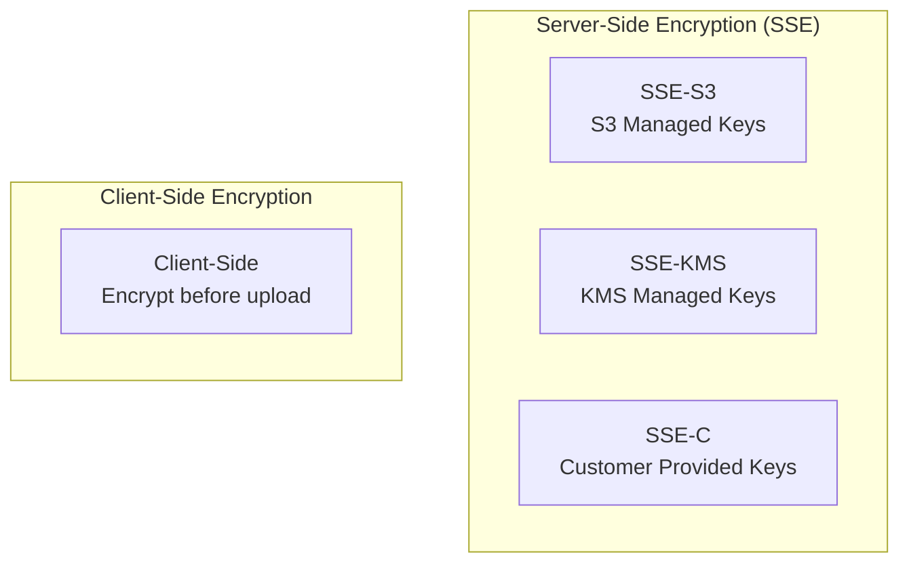
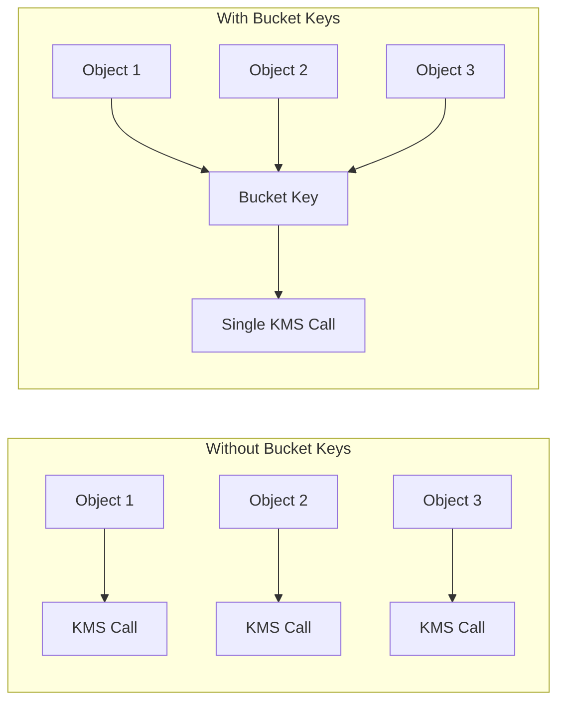

# S3 Encryption

## Encryption Overview

S3 offers multiple encryption options to protect data at rest:



## SSE-S3: S3 Managed Keys

AWS manages the encryption keys entirely:

```python
import boto3

s3 = boto3.client('s3')

# Upload with SSE-S3
s3.put_object(
    Bucket='pettracker-images-prod',
    Key='photos/pet-001.jpg',
    Body=image_data,
    ServerSideEncryption='AES256'
)
```

```bash
# CLI upload with SSE-S3
aws s3 cp image.jpg s3://pettracker-images-prod/photos/ \
    --sse AES256
```

**Characteristics:**
- AWS manages keys completely
- AES-256 encryption
- No additional cost
- Simplest option

## SSE-KMS: KMS Managed Keys

Use AWS Key Management Service for more control:

```python
# Upload with SSE-KMS (default KMS key)
s3.put_object(
    Bucket='pettracker-images-prod',
    Key='photos/pet-001.jpg',
    Body=image_data,
    ServerSideEncryption='aws:kms'
)

# Upload with specific KMS key
s3.put_object(
    Bucket='pettracker-images-prod',
    Key='photos/pet-001.jpg',
    Body=image_data,
    ServerSideEncryption='aws:kms',
    SSEKMSKeyId='arn:aws:kms:us-east-1:123456789012:key/abc123'
)
```

```bash
# CLI upload with SSE-KMS
aws s3 cp image.jpg s3://pettracker-images-prod/photos/ \
    --sse aws:kms \
    --sse-kms-key-id alias/pettracker-key
```

**Characteristics:**
- Audit trail via CloudTrail
- Key rotation capabilities
- Fine-grained access control
- Additional KMS costs
- API rate limits apply

### S3 Bucket Keys

Reduce KMS costs by using S3 Bucket Keys:

```bash
# Enable S3 Bucket Keys
aws s3api put-bucket-encryption \
    --bucket pettracker-images-prod \
    --server-side-encryption-configuration '{
        "Rules": [{
            "ApplyServerSideEncryptionByDefault": {
                "SSEAlgorithm": "aws:kms",
                "KMSMasterKeyID": "alias/pettracker-key"
            },
            "BucketKeyEnabled": true
        }]
    }'
```



## SSE-C: Customer Provided Keys

You manage the keys, S3 performs encryption:

```python
import base64
import os

# Generate 256-bit key
key = os.urandom(32)
key_b64 = base64.b64encode(key).decode('utf-8')

# Calculate MD5 of key
import hashlib
key_md5 = base64.b64encode(hashlib.md5(key).digest()).decode('utf-8')

# Upload with SSE-C
s3.put_object(
    Bucket='pettracker-images-prod',
    Key='photos/pet-001.jpg',
    Body=image_data,
    SSECustomerAlgorithm='AES256',
    SSECustomerKey=key_b64,
    SSECustomerKeyMD5=key_md5
)

# Download requires same key!
response = s3.get_object(
    Bucket='pettracker-images-prod',
    Key='photos/pet-001.jpg',
    SSECustomerAlgorithm='AES256',
    SSECustomerKey=key_b64,
    SSECustomerKeyMD5=key_md5
)
```

**Characteristics:**
- You manage keys completely
- Key required for every operation
- HTTPS required (always)
- S3 doesn't store your key

## Client-Side Encryption

Encrypt before sending to S3:

```python
from cryptography.fernet import Fernet

# Generate key (store securely!)
key = Fernet.generate_key()
cipher = Fernet(key)

# Encrypt data
with open('image.jpg', 'rb') as f:
    encrypted_data = cipher.encrypt(f.read())

# Upload encrypted data
s3.put_object(
    Bucket='pettracker-images-prod',
    Key='photos/pet-001.jpg.encrypted',
    Body=encrypted_data
)

# Download and decrypt
response = s3.get_object(
    Bucket='pettracker-images-prod',
    Key='photos/pet-001.jpg.encrypted'
)
decrypted_data = cipher.decrypt(response['Body'].read())
```

**Characteristics:**
- Complete control
- S3 never sees plaintext
- You manage everything
- Can combine with SSE

## Default Encryption

Force encryption on all uploads:

```bash
# Set default encryption to SSE-S3
aws s3api put-bucket-encryption \
    --bucket pettracker-images-prod \
    --server-side-encryption-configuration '{
        "Rules": [{
            "ApplyServerSideEncryptionByDefault": {
                "SSEAlgorithm": "AES256"
            }
        }]
    }'

# Set default encryption to SSE-KMS
aws s3api put-bucket-encryption \
    --bucket pettracker-images-prod \
    --server-side-encryption-configuration '{
        "Rules": [{
            "ApplyServerSideEncryptionByDefault": {
                "SSEAlgorithm": "aws:kms",
                "KMSMasterKeyID": "alias/pettracker-key"
            },
            "BucketKeyEnabled": true
        }]
    }'
```

### Enforce Encryption via Bucket Policy

```json
{
    "Version": "2012-10-17",
    "Statement": [
        {
            "Sid": "DenyUnencryptedUploads",
            "Effect": "Deny",
            "Principal": "*",
            "Action": "s3:PutObject",
            "Resource": "arn:aws:s3:::pettracker-images-prod/*",
            "Condition": {
                "Null": {
                    "s3:x-amz-server-side-encryption": "true"
                }
            }
        },
        {
            "Sid": "DenyNonKMSEncryption",
            "Effect": "Deny",
            "Principal": "*",
            "Action": "s3:PutObject",
            "Resource": "arn:aws:s3:::pettracker-images-prod/*",
            "Condition": {
                "StringNotEquals": {
                    "s3:x-amz-server-side-encryption": "aws:kms"
                }
            }
        }
    ]
}
```

## Encryption Comparison

| Type | Key Management | Audit Trail | Cost | Use Case |
|------|---------------|-------------|------|----------|
| **SSE-S3** | AWS | No | Free | Simple encryption |
| **SSE-KMS** | AWS KMS | CloudTrail | KMS costs | Compliance, audit |
| **SSE-C** | You | No | Free | Own key mgmt |
| **Client-side** | You | No | Free | Max control |

## Encryption in Transit

S3 supports HTTPS for encryption in transit:

```json
{
    "Version": "2012-10-17",
    "Statement": [
        {
            "Sid": "RequireHTTPS",
            "Effect": "Deny",
            "Principal": "*",
            "Action": "s3:*",
            "Resource": [
                "arn:aws:s3:::pettracker-images-prod",
                "arn:aws:s3:::pettracker-images-prod/*"
            ],
            "Condition": {
                "Bool": {
                    "aws:SecureTransport": "false"
                }
            }
        }
    ]
}
```

## Alex's Encryption Strategy

```python
# encryption_config.py
import boto3
import json

def configure_encryption(bucket_name, kms_key_alias):
    s3 = boto3.client('s3')

    # Enable default encryption with KMS
    s3.put_bucket_encryption(
        Bucket=bucket_name,
        ServerSideEncryptionConfiguration={
            'Rules': [{
                'ApplyServerSideEncryptionByDefault': {
                    'SSEAlgorithm': 'aws:kms',
                    'KMSMasterKeyID': kms_key_alias
                },
                'BucketKeyEnabled': True  # Reduce KMS costs
            }]
        }
    )
    print("✓ Default encryption configured")

    # Enforce encryption via bucket policy
    policy = {
        "Version": "2012-10-17",
        "Statement": [
            {
                "Sid": "RequireKMSEncryption",
                "Effect": "Deny",
                "Principal": "*",
                "Action": "s3:PutObject",
                "Resource": f"arn:aws:s3:::{bucket_name}/*",
                "Condition": {
                    "StringNotEquals": {
                        "s3:x-amz-server-side-encryption": "aws:kms"
                    }
                }
            },
            {
                "Sid": "RequireHTTPS",
                "Effect": "Deny",
                "Principal": "*",
                "Action": "s3:*",
                "Resource": [
                    f"arn:aws:s3:::{bucket_name}",
                    f"arn:aws:s3:::{bucket_name}/*"
                ],
                "Condition": {
                    "Bool": {"aws:SecureTransport": "false"}
                }
            }
        ]
    }

    s3.put_bucket_policy(
        Bucket=bucket_name,
        Policy=json.dumps(policy)
    )
    print("✓ Encryption policy enforced")

# Run
configure_encryption(
    'pettracker-images-prod',
    'alias/pettracker-key'
)
```

## Exam Tips

**For DVA-C02:**

1. **SSE-S3**: Simplest, AWS manages everything
2. **SSE-KMS**: Audit trail, key rotation, more control
3. **SSE-C**: You provide key with each request
4. **S3 Bucket Keys**: Reduce KMS API costs
5. **Default encryption**: Applies to new objects without explicit encryption

**Common scenarios:**

> "Need encryption audit trail..."
> → SSE-KMS (CloudTrail logs KMS usage)

> "Simplest encryption..."
> → SSE-S3

> "Must manage own keys..."
> → SSE-C or client-side encryption

> "Reduce KMS costs..."
> → Enable S3 Bucket Keys

## Key Takeaways

1. **SSE-S3** for simple encryption (default now)
2. **SSE-KMS** for compliance and audit needs
3. **S3 Bucket Keys** reduce KMS costs significantly
4. **Enforce encryption** via bucket policy
5. **Always use HTTPS** for transit encryption
6. **Default encryption** applies to new objects

---

*Next: Alex learns about pre-signed URLs for secure temporary access.*

---
*v1.0*
