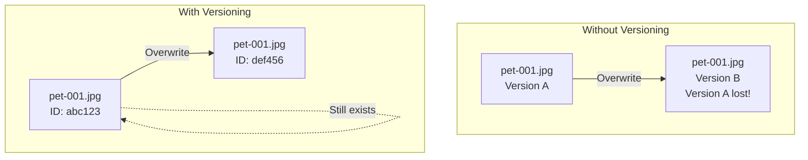
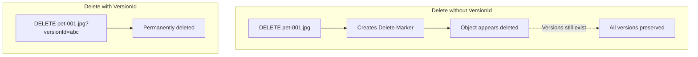
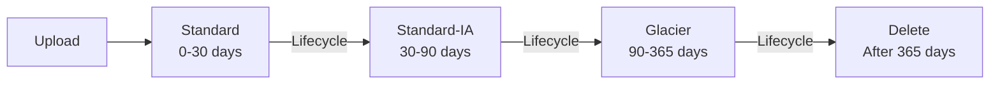

# Versioning and Lifecycle Rules

## Alex's Accidental Deletion

Alex runs a cleanup script that accidentally deletes recent pet photos:

```python
# cleanup_old_photos.py - THE BUG
import boto3

s3 = boto3.client('s3')

# Intended: Delete photos older than 1 year
# Bug: Missing date filter!
paginator = s3.get_paginator('list_objects_v2')
for page in paginator.paginate(Bucket='pettracker-images-prod', Prefix='photos/'):
    for obj in page.get('Contents', []):
        s3.delete_object(Bucket='pettracker-images-prod', Key=obj['Key'])
        # Deleted 50,000 photos including today's uploads! 😱
```

Luckily, Sam had enabled versioning. "Don't panic. We can recover everything."

## S3 Versioning

Versioning keeps multiple versions of every object:



### Enable Versioning

```bash
# Enable versioning
aws s3api put-bucket-versioning \
    --bucket pettracker-images-prod \
    --versioning-configuration Status=Enabled

# Check status
aws s3api get-bucket-versioning --bucket pettracker-images-prod
# {"Status": "Enabled"}
```

### Versioning States

| State | Description |
|-------|-------------|
| **Unversioned** | Default, no versions |
| **Enabled** | All objects get versions |
| **Suspended** | New objects get null version ID |

**Note**: Once enabled, versioning cannot be disabled - only suspended.

## Working with Versions

### List Versions

```bash
aws s3api list-object-versions \
    --bucket pettracker-images-prod \
    --prefix photos/pet-001.jpg
```

```python
# List all versions of an object
response = s3.list_object_versions(
    Bucket='pettracker-images-prod',
    Prefix='photos/pet-001.jpg'
)

for version in response.get('Versions', []):
    print(f"Version: {version['VersionId']}")
    print(f"  Size: {version['Size']}")
    print(f"  Last Modified: {version['LastModified']}")
    print(f"  Is Latest: {version['IsLatest']}")
```

### Get Specific Version

```python
# Get latest version (default)
response = s3.get_object(
    Bucket='pettracker-images-prod',
    Key='photos/pet-001.jpg'
)

# Get specific version
response = s3.get_object(
    Bucket='pettracker-images-prod',
    Key='photos/pet-001.jpg',
    VersionId='abc123xyz'
)
```

### Delete Behavior



```python
# "Soft delete" - creates delete marker
s3.delete_object(
    Bucket='pettracker-images-prod',
    Key='photos/pet-001.jpg'
)
# Object appears deleted but versions preserved

# Permanent delete - removes specific version
s3.delete_object(
    Bucket='pettracker-images-prod',
    Key='photos/pet-001.jpg',
    VersionId='abc123xyz'
)
```

### Recover Deleted Object

```python
# Method 1: Delete the delete marker
# List versions to find delete marker
response = s3.list_object_versions(
    Bucket='pettracker-images-prod',
    Prefix='photos/pet-001.jpg'
)

for marker in response.get('DeleteMarkers', []):
    if marker['IsLatest']:
        s3.delete_object(
            Bucket='pettracker-images-prod',
            Key='photos/pet-001.jpg',
            VersionId=marker['VersionId']
        )
        print("Delete marker removed - object restored!")

# Method 2: Copy old version to current
s3.copy_object(
    Bucket='pettracker-images-prod',
    Key='photos/pet-001.jpg',
    CopySource={
        'Bucket': 'pettracker-images-prod',
        'Key': 'photos/pet-001.jpg',
        'VersionId': 'abc123xyz'  # Old version ID
    }
)
```

## MFA Delete

Extra protection for permanent deletions:

```bash
# Enable MFA Delete (requires root account)
aws s3api put-bucket-versioning \
    --bucket pettracker-images-prod \
    --versioning-configuration Status=Enabled,MFADelete=Enabled \
    --mfa "arn:aws:iam::123456789012:mfa/root-device 123456"
```

## Lifecycle Rules

Automate transitions and deletions:



### Create Lifecycle Rule

```bash
aws s3api put-bucket-lifecycle-configuration \
    --bucket pettracker-images-prod \
    --lifecycle-configuration file://lifecycle.json
```

```json
{
    "Rules": [
        {
            "ID": "photos-lifecycle",
            "Status": "Enabled",
            "Filter": {
                "Prefix": "photos/"
            },
            "Transitions": [
                {
                    "Days": 30,
                    "StorageClass": "STANDARD_IA"
                },
                {
                    "Days": 90,
                    "StorageClass": "GLACIER_IR"
                }
            ],
            "Expiration": {
                "Days": 365
            }
        },
        {
            "ID": "cleanup-old-versions",
            "Status": "Enabled",
            "Filter": {
                "Prefix": ""
            },
            "NoncurrentVersionTransitions": [
                {
                    "NoncurrentDays": 30,
                    "StorageClass": "STANDARD_IA"
                }
            ],
            "NoncurrentVersionExpiration": {
                "NoncurrentDays": 90
            }
        },
        {
            "ID": "cleanup-incomplete-uploads",
            "Status": "Enabled",
            "Filter": {
                "Prefix": ""
            },
            "AbortIncompleteMultipartUpload": {
                "DaysAfterInitiation": 7
            }
        }
    ]
}
```

### Python SDK

```python
s3 = boto3.client('s3')

s3.put_bucket_lifecycle_configuration(
    Bucket='pettracker-images-prod',
    LifecycleConfiguration={
        'Rules': [
            {
                'ID': 'photos-lifecycle',
                'Status': 'Enabled',
                'Filter': {'Prefix': 'photos/'},
                'Transitions': [
                    {'Days': 30, 'StorageClass': 'STANDARD_IA'},
                    {'Days': 90, 'StorageClass': 'GLACIER_IR'}
                ],
                'Expiration': {'Days': 365}
            },
            {
                'ID': 'cleanup-versions',
                'Status': 'Enabled',
                'Filter': {'Prefix': ''},
                'NoncurrentVersionExpiration': {'NoncurrentDays': 90}
            },
            {
                'ID': 'cleanup-delete-markers',
                'Status': 'Enabled',
                'Filter': {'Prefix': ''},
                'Expiration': {'ExpiredObjectDeleteMarker': True}
            }
        ]
    }
)
```

## Alex's Lifecycle Strategy

```json
{
    "Rules": [
        {
            "ID": "photos-optimize",
            "Status": "Enabled",
            "Filter": {"Prefix": "photos/"},
            "Transitions": [
                {"Days": 30, "StorageClass": "STANDARD_IA"},
                {"Days": 90, "StorageClass": "GLACIER_IR"}
            ]
        },
        {
            "ID": "thumbnails-expire",
            "Status": "Enabled",
            "Filter": {"Prefix": "thumbnails/"},
            "Expiration": {"Days": 30}
        },
        {
            "ID": "logs-archive",
            "Status": "Enabled",
            "Filter": {"Prefix": "logs/"},
            "Transitions": [
                {"Days": 7, "StorageClass": "STANDARD_IA"},
                {"Days": 30, "StorageClass": "GLACIER"}
            ],
            "Expiration": {"Days": 365}
        },
        {
            "ID": "old-versions-cleanup",
            "Status": "Enabled",
            "Filter": {"Prefix": ""},
            "NoncurrentVersionExpiration": {"NoncurrentDays": 30}
        },
        {
            "ID": "abort-failed-uploads",
            "Status": "Enabled",
            "Filter": {"Prefix": ""},
            "AbortIncompleteMultipartUpload": {"DaysAfterInitiation": 1}
        }
    ]
}
```

## Cost Impact

```markdown
## Storage Cost Optimization

### Before Lifecycle Rules
2.5 TB all in Standard @ $0.023/GB = $57.50/month

### After Lifecycle Rules (6 months later)
- 500 GB Standard (recent) @ $0.023 = $11.50
- 500 GB Standard-IA @ $0.0125 = $6.25
- 1 TB Glacier IR @ $0.004 = $4.10
- 500 GB auto-deleted thumbnails = $0

Total: $21.85/month
Savings: 62%
```

## Exam Tips

**For DVA-C02:**

1. **Versioning cannot be disabled** - only suspended
2. **Delete without VersionId** creates delete marker
3. **Delete with VersionId** permanently removes
4. **MFA Delete** requires root account to enable
5. **Lifecycle rules** can transition and expire
6. **NoncurrentVersion** rules for old versions

**Common scenarios:**

> "Recover accidentally deleted object..."
> → Delete the delete marker (if versioning enabled)

> "Automatically move old data to cheaper storage..."
> → Create lifecycle transition rule

> "Prevent accidental permanent deletion..."
> → Enable MFA Delete

> "Reduce costs from old versions..."
> → NoncurrentVersionExpiration rule

## Key Takeaways

1. **Enable versioning** for critical buckets
2. **Delete markers** allow recovery
3. **Lifecycle rules** automate cost optimization
4. **Version lifecycle** manages old versions
5. **MFA Delete** for extra protection
6. **Abort incomplete** multipart uploads

---

*Next: Alex learns about S3 event notifications.*

---
*v2.0*
