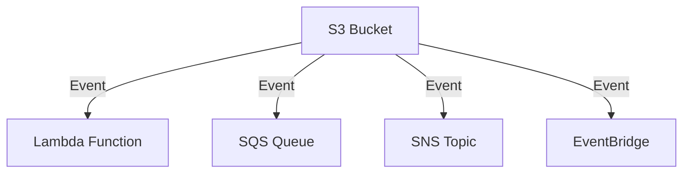
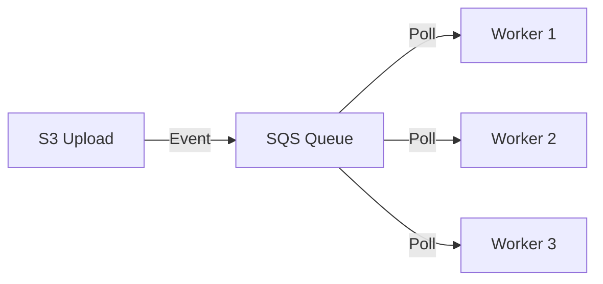
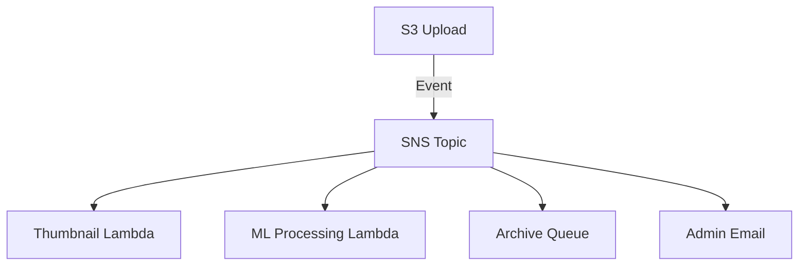
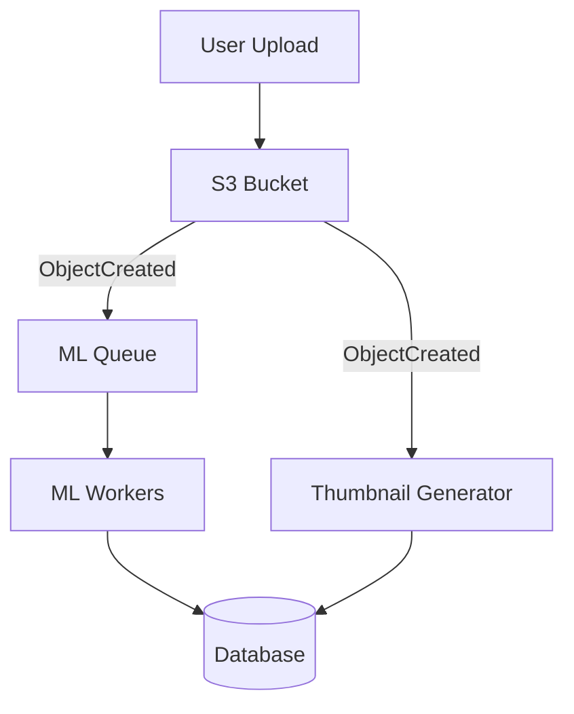

# Event Notifications

## The Processing Pipeline

Alex wants to automatically process pet photos when they're uploaded:
1. Generate thumbnails
2. Run breed identification
3. Update the database

"I could poll S3 for new files, but that's wasteful and slow," Alex thinks.

Sam suggests: "Use S3 event notifications. S3 will push events to Lambda when files are uploaded."

## S3 Event Notification Destinations



### Supported Events

| Event | Description |
|-------|-------------|
| `s3:ObjectCreated:*` | Any object creation |
| `s3:ObjectCreated:Put` | PUT upload |
| `s3:ObjectCreated:Post` | POST upload |
| `s3:ObjectCreated:Copy` | Copy operation |
| `s3:ObjectCreated:CompleteMultipartUpload` | Multipart complete |
| `s3:ObjectRemoved:*` | Any deletion |
| `s3:ObjectRemoved:Delete` | Delete |
| `s3:ObjectRemoved:DeleteMarkerCreated` | Delete marker |
| `s3:ObjectRestore:*` | Glacier restore events |

## Lambda Integration

### Configure via Console/CLI

```bash
# First, give S3 permission to invoke Lambda
aws lambda add-permission \
    --function-name process-pet-image \
    --principal s3.amazonaws.com \
    --statement-id s3-invoke \
    --action lambda:InvokeFunction \
    --source-arn arn:aws:s3:::pettracker-images-prod \
    --source-account 123456789012

# Then configure S3 notification
aws s3api put-bucket-notification-configuration \
    --bucket pettracker-images-prod \
    --notification-configuration file://notification.json
```

```json
{
    "LambdaFunctionConfigurations": [
        {
            "Id": "ProcessNewPhotos",
            "LambdaFunctionArn": "arn:aws:lambda:us-east-1:123456789012:function:process-pet-image",
            "Events": ["s3:ObjectCreated:*"],
            "Filter": {
                "Key": {
                    "FilterRules": [
                        {
                            "Name": "prefix",
                            "Value": "uploads/"
                        },
                        {
                            "Name": "suffix",
                            "Value": ".jpg"
                        }
                    ]
                }
            }
        }
    ]
}
```

### Lambda Function

```python
# lambda_function.py
import json
import boto3
import urllib.parse

s3 = boto3.client('s3')
rekognition = boto3.client('rekognition')

def lambda_handler(event, context):
    """Process S3 event notification"""

    for record in event['Records']:
        # Get bucket and key from event
        bucket = record['s3']['bucket']['name']
        key = urllib.parse.unquote_plus(record['s3']['object']['key'])
        event_name = record['eventName']

        print(f"Processing: s3://{bucket}/{key}")
        print(f"Event: {event_name}")

        if event_name.startswith('ObjectCreated'):
            process_new_image(bucket, key)
        elif event_name.startswith('ObjectRemoved'):
            handle_deletion(bucket, key)

    return {'statusCode': 200}


def process_new_image(bucket, key):
    """Process newly uploaded image"""

    # 1. Generate thumbnail
    generate_thumbnail(bucket, key)

    # 2. Run breed detection
    breed_result = detect_breed(bucket, key)

    # 3. Update metadata
    update_image_metadata(bucket, key, breed_result)


def generate_thumbnail(bucket, key):
    """Create thumbnail version"""
    from PIL import Image
    import io

    # Download original
    response = s3.get_object(Bucket=bucket, Key=key)
    image = Image.open(io.BytesIO(response['Body'].read()))

    # Create thumbnail
    image.thumbnail((200, 200))

    # Upload thumbnail
    buffer = io.BytesIO()
    image.save(buffer, 'JPEG')
    buffer.seek(0)

    thumb_key = key.replace('uploads/', 'thumbnails/')
    s3.put_object(
        Bucket=bucket,
        Key=thumb_key,
        Body=buffer,
        ContentType='image/jpeg'
    )
    print(f"Created thumbnail: {thumb_key}")


def detect_breed(bucket, key):
    """Use Rekognition for breed detection"""
    response = rekognition.detect_labels(
        Image={'S3Object': {'Bucket': bucket, 'Name': key}},
        MaxLabels=10
    )

    for label in response['Labels']:
        if label['Name'] in ['Dog', 'Cat']:
            # Get more specific breed
            for instance in label.get('Instances', []):
                return {'breed': label['Name'], 'confidence': label['Confidence']}

    return None
```

## SQS Integration

For decoupled, reliable processing:



```bash
# Create SQS queue
aws sqs create-queue --queue-name pettracker-image-queue

# Create queue policy
aws sqs set-queue-attributes \
    --queue-url https://sqs.us-east-1.amazonaws.com/123456789012/pettracker-image-queue \
    --attributes '{
        "Policy": "{\"Version\":\"2012-10-17\",\"Statement\":[{\"Effect\":\"Allow\",\"Principal\":{\"Service\":\"s3.amazonaws.com\"},\"Action\":\"SQS:SendMessage\",\"Resource\":\"arn:aws:sqs:us-east-1:123456789012:pettracker-image-queue\",\"Condition\":{\"ArnEquals\":{\"aws:SourceArn\":\"arn:aws:s3:::pettracker-images-prod\"}}}]}"
    }'
```

```json
{
    "QueueConfigurations": [
        {
            "Id": "ImageProcessingQueue",
            "QueueArn": "arn:aws:sqs:us-east-1:123456789012:pettracker-image-queue",
            "Events": ["s3:ObjectCreated:*"],
            "Filter": {
                "Key": {
                    "FilterRules": [
                        {"Name": "prefix", "Value": "uploads/"}
                    ]
                }
            }
        }
    ]
}
```

## SNS Integration

For fan-out to multiple subscribers:



```json
{
    "TopicConfigurations": [
        {
            "Id": "NewImageNotification",
            "TopicArn": "arn:aws:sns:us-east-1:123456789012:pettracker-images",
            "Events": ["s3:ObjectCreated:*"],
            "Filter": {
                "Key": {
                    "FilterRules": [
                        {"Name": "prefix", "Value": "uploads/"}
                    ]
                }
            }
        }
    ]
}
```

## EventBridge Integration

Most flexible option:

```bash
# Enable EventBridge notifications
aws s3api put-bucket-notification-configuration \
    --bucket pettracker-images-prod \
    --notification-configuration '{
        "EventBridgeConfiguration": {}
    }'
```

```python
# EventBridge rule
import boto3

events = boto3.client('events')

# Create rule for specific events
events.put_rule(
    Name='pettracker-image-uploads',
    EventPattern=json.dumps({
        "source": ["aws.s3"],
        "detail-type": ["Object Created"],
        "detail": {
            "bucket": {
                "name": ["pettracker-images-prod"]
            },
            "object": {
                "key": [{"prefix": "uploads/"}]
            }
        }
    }),
    State='ENABLED'
)

# Add Lambda target
events.put_targets(
    Rule='pettracker-image-uploads',
    Targets=[{
        'Id': 'process-image',
        'Arn': 'arn:aws:lambda:us-east-1:123456789012:function:process-pet-image'
    }]
)
```

## Event Message Format

```json
{
    "Records": [
        {
            "eventVersion": "2.1",
            "eventSource": "aws:s3",
            "awsRegion": "us-east-1",
            "eventTime": "2024-01-15T10:30:00.000Z",
            "eventName": "ObjectCreated:Put",
            "userIdentity": {
                "principalId": "EXAMPLE"
            },
            "requestParameters": {
                "sourceIPAddress": "203.0.113.50"
            },
            "responseElements": {
                "x-amz-request-id": "EXAMPLE123",
                "x-amz-id-2": "EXAMPLE456"
            },
            "s3": {
                "s3SchemaVersion": "1.0",
                "configurationId": "ProcessNewPhotos",
                "bucket": {
                    "name": "pettracker-images-prod",
                    "ownerIdentity": {"principalId": "EXAMPLE"},
                    "arn": "arn:aws:s3:::pettracker-images-prod"
                },
                "object": {
                    "key": "uploads/user-123/pet-001.jpg",
                    "size": 2456789,
                    "eTag": "abc123def456",
                    "versionId": "xyz789",
                    "sequencer": "0A1B2C3D4E"
                }
            }
        }
    ]
}
```

## Alex's Event Architecture



### Configuration

```python
def configure_notifications(bucket_name):
    s3 = boto3.client('s3')

    config = {
        'LambdaFunctionConfigurations': [
            {
                'Id': 'ThumbnailGenerator',
                'LambdaFunctionArn': 'arn:aws:lambda:us-east-1:123456789012:function:generate-thumbnail',
                'Events': ['s3:ObjectCreated:*'],
                'Filter': {
                    'Key': {
                        'FilterRules': [
                            {'Name': 'prefix', 'Value': 'uploads/'},
                            {'Name': 'suffix', 'Value': '.jpg'}
                        ]
                    }
                }
            }
        ],
        'QueueConfigurations': [
            {
                'Id': 'MLProcessingQueue',
                'QueueArn': 'arn:aws:sqs:us-east-1:123456789012:pettracker-ml-queue',
                'Events': ['s3:ObjectCreated:*'],
                'Filter': {
                    'Key': {
                        'FilterRules': [
                            {'Name': 'prefix', 'Value': 'uploads/'}
                        ]
                    }
                }
            }
        ]
    }

    s3.put_bucket_notification_configuration(
        Bucket=bucket_name,
        NotificationConfiguration=config
    )
```

## Exam Tips

**For DVA-C02:**

1. **Destinations**: Lambda, SQS, SNS, EventBridge
2. **Filter** by prefix and suffix only
3. **Lambda** needs resource-based policy
4. **SQS** needs queue policy allowing S3
5. **EventBridge** is most flexible but newest

**Common scenarios:**

> "Process images on upload..."
> → Lambda function triggered by S3

> "Reliable processing with retries..."
> → SQS with Dead Letter Queue

> "Fan-out to multiple processors..."
> → SNS topic with multiple subscribers

> "Complex filtering rules..."
> → EventBridge with advanced patterns

## Key Takeaways

1. **S3 events** enable reactive architectures
2. **Lambda** for simple processing
3. **SQS** for reliable, decoupled processing
4. **SNS** for fan-out
5. **EventBridge** for complex routing
6. **Filter** by prefix and suffix

---

*Next: Alex learns about static website hosting.*
