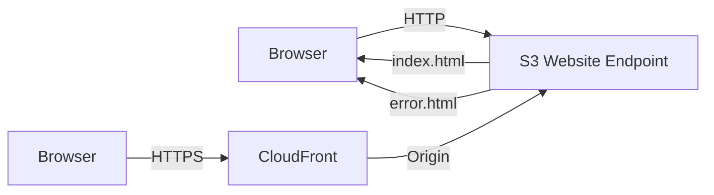
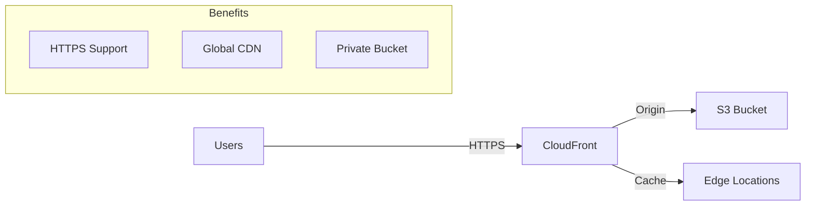

# Static Website Hosting

## Maya's Request

Maya (frontend developer) asks Alex: "Can you host our React app on S3? The marketing landing page too? No need for a server for static content."

Alex realizes this is perfect for S3 static website hosting.

## S3 Static Website Hosting



### Enable Website Hosting

```bash
# Enable static website hosting
aws s3 website s3://pettracker-landing \
    --index-document index.html \
    --error-document error.html

# Or using s3api
aws s3api put-bucket-website \
    --bucket pettracker-landing \
    --website-configuration '{
        "IndexDocument": {"Suffix": "index.html"},
        "ErrorDocument": {"Key": "error.html"}
    }'
```

### Website Endpoints

S3 provides two types of endpoints:

| Type | Format | HTTPS | Website Features |
|------|--------|-------|------------------|
| REST | `bucket.s3.region.amazonaws.com` | Yes | No |
| Website | `bucket.s3-website-region.amazonaws.com` | No | Yes |

```bash
# REST API endpoint (not website)
https://pettracker-landing.s3.us-east-1.amazonaws.com/

# Website endpoint
http://pettracker-landing.s3-website-us-east-1.amazonaws.com/

# Note: Website endpoints are HTTP only!
# Use CloudFront for HTTPS
```

## Configure Public Access

For website hosting, the bucket must be publicly accessible:

```bash
# 1. Disable Block Public Access
aws s3api put-public-access-block \
    --bucket pettracker-landing \
    --public-access-block-configuration \
        BlockPublicAcls=false,\
        IgnorePublicAcls=false,\
        BlockPublicPolicy=false,\
        RestrictPublicBuckets=false

# 2. Add bucket policy for public read
aws s3api put-bucket-policy \
    --bucket pettracker-landing \
    --policy '{
        "Version": "2012-10-17",
        "Statement": [{
            "Sid": "PublicReadGetObject",
            "Effect": "Allow",
            "Principal": "*",
            "Action": "s3:GetObject",
            "Resource": "arn:aws:s3:::pettracker-landing/*"
        }]
    }'
```

## Upload Website Files

```bash
# Upload single file
aws s3 cp index.html s3://pettracker-landing/

# Upload entire website
aws s3 sync ./build/ s3://pettracker-landing/

# With content types (important for web)
aws s3 sync ./build/ s3://pettracker-landing/ \
    --content-type "text/html" \
    --exclude "*" \
    --include "*.html"

# Better: use --content-type inference
aws s3 sync ./build/ s3://pettracker-landing/ \
    --delete  # Remove files not in source
```

## SPA Routing (React, Vue, Angular)

Single Page Applications need special handling:

```mermaid
graph TD
    Request[/users/123] --> S3[S3 Bucket]
    S3 -->|File not found| Error[404]
    Error -->|Error document| Index[index.html]
    Index -->|Client-side routing| App[React handles /users/123]
```

### Configure Error Document

```bash
# S3 website returns index.html for all 404s
aws s3api put-bucket-website \
    --bucket pettracker-app \
    --website-configuration '{
        "IndexDocument": {"Suffix": "index.html"},
        "ErrorDocument": {"Key": "index.html"}
    }'
```

### Better: CloudFront Custom Error Response

```bash
# CloudFront handles 403/404 → index.html
aws cloudfront update-distribution \
    --id EXAMPLE123 \
    --distribution-config '{
        ...
        "CustomErrorResponses": {
            "Quantity": 2,
            "Items": [
                {
                    "ErrorCode": 403,
                    "ResponsePagePath": "/index.html",
                    "ResponseCode": "200",
                    "ErrorCachingMinTTL": 10
                },
                {
                    "ErrorCode": 404,
                    "ResponsePagePath": "/index.html",
                    "ResponseCode": "200",
                    "ErrorCachingMinTTL": 10
                }
            ]
        }
    }'
```

## Redirect Rules

```json
{
    "IndexDocument": {"Suffix": "index.html"},
    "ErrorDocument": {"Key": "error.html"},
    "RoutingRules": [
        {
            "Condition": {
                "KeyPrefixEquals": "old-page/"
            },
            "Redirect": {
                "ReplaceKeyPrefixWith": "new-page/",
                "HttpRedirectCode": "301"
            }
        },
        {
            "Condition": {
                "HttpErrorCodeReturnedEquals": "404"
            },
            "Redirect": {
                "HostName": "pettracker.com",
                "Protocol": "https",
                "ReplaceKeyWith": "not-found"
            }
        }
    ]
}
```

## CloudFront + S3 (Best Practice)

For production websites:



### CloudFront Distribution

```bash
# Create CloudFront distribution for S3 website
aws cloudfront create-distribution \
    --distribution-config '{
        "CallerReference": "pettracker-landing-2024",
        "Origins": {
            "Quantity": 1,
            "Items": [{
                "Id": "S3-pettracker-landing",
                "DomainName": "pettracker-landing.s3.us-east-1.amazonaws.com",
                "S3OriginConfig": {
                    "OriginAccessIdentity": "origin-access-identity/cloudfront/EXAMPLE"
                }
            }]
        },
        "DefaultCacheBehavior": {
            "TargetOriginId": "S3-pettracker-landing",
            "ViewerProtocolPolicy": "redirect-to-https",
            "AllowedMethods": {
                "Quantity": 2,
                "Items": ["GET", "HEAD"]
            },
            "ForwardedValues": {
                "QueryString": false,
                "Cookies": {"Forward": "none"}
            },
            "MinTTL": 0,
            "DefaultTTL": 86400,
            "MaxTTL": 31536000
        },
        "DefaultRootObject": "index.html",
        "Enabled": true
    }'
```

### Origin Access Identity (OAI)

Keep S3 bucket private, only CloudFront can access:

```bash
# Create OAI
aws cloudfront create-cloud-front-origin-access-identity \
    --cloud-front-origin-access-identity-config '{
        "CallerReference": "pettracker-oai",
        "Comment": "OAI for pettracker landing page"
    }'

# Update bucket policy
{
    "Version": "2012-10-17",
    "Statement": [{
        "Sid": "AllowCloudFrontAccess",
        "Effect": "Allow",
        "Principal": {
            "AWS": "arn:aws:iam::cloudfront:user/CloudFront Origin Access Identity EXAMPLE"
        },
        "Action": "s3:GetObject",
        "Resource": "arn:aws:s3:::pettracker-landing/*"
    }]
}
```

## Alex's Deployment Script

```bash
#!/bin/bash
# deploy-website.sh

BUCKET="pettracker-landing"
BUILD_DIR="./build"
CF_DISTRIBUTION="EXAMPLE123"

echo "Building React app..."
npm run build

echo "Syncing to S3..."
aws s3 sync $BUILD_DIR s3://$BUCKET/ \
    --delete \
    --cache-control "max-age=31536000" \
    --exclude "index.html" \
    --exclude "*.json"

# Don't cache index.html
aws s3 cp $BUILD_DIR/index.html s3://$BUCKET/index.html \
    --cache-control "no-cache, no-store, must-revalidate"

echo "Invalidating CloudFront cache..."
aws cloudfront create-invalidation \
    --distribution-id $CF_DISTRIBUTION \
    --paths "/*"

echo "Deployment complete!"
echo "URL: https://d123456789.cloudfront.net"
```

## CORS for API Calls

If your static site calls APIs on different domains:

```bash
aws s3api put-bucket-cors \
    --bucket pettracker-landing \
    --cors-configuration '{
        "CORSRules": [{
            "AllowedOrigins": ["https://api.pettracker.com"],
            "AllowedMethods": ["GET", "PUT", "POST", "DELETE"],
            "AllowedHeaders": ["*"],
            "ExposeHeaders": ["ETag"],
            "MaxAgeSeconds": 3000
        }]
    }'
```

## Exam Tips

**For DVA-C02:**

1. **Website endpoint** is HTTP only, different URL format
2. **Public read policy** required for static hosting
3. **CloudFront** adds HTTPS and caching
4. **OAI** keeps bucket private while serving via CloudFront
5. **index.html** as error document for SPAs

**Common scenarios:**

> "Host React app on S3..."
> → Enable static hosting, set error document to index.html

> "HTTPS for S3 website..."
> → Use CloudFront in front of S3

> "Keep bucket private but serve website..."
> → CloudFront with Origin Access Identity

## Key Takeaways

1. **S3 can host static websites** directly
2. **Website endpoint** is HTTP only
3. **CloudFront** for HTTPS and global distribution
4. **SPA routing** needs error document configuration
5. **OAI** keeps bucket private
6. **Cache control** headers for performance

---

*Next: Alex brings it all together with a complete S3 implementation.*

---
*v2.0*
