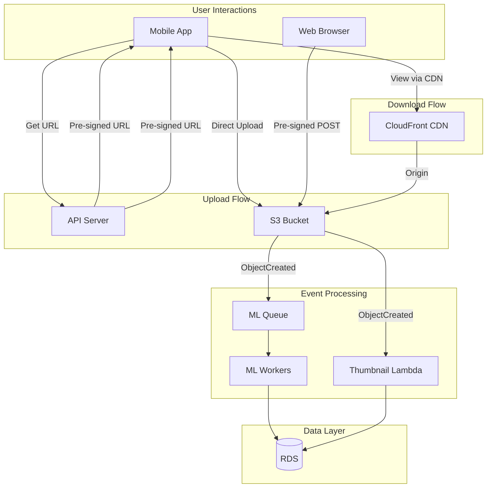

# Alex's Solution: Scalable Image Storage

## The Complete Implementation

After weeks of learning, Alex has built a comprehensive S3 solution for PetTracker's image storage needs.



## Final S3 Architecture

### Bucket Structure

```
pettracker-images-prod/
├── uploads/                    # Original uploads
│   └── {user_id}/
│       └── {date}/
│           └── {uuid}.jpg
├── thumbnails/                 # Generated thumbnails
│   └── {user_id}/
│       └── {date}/
│           └── {uuid}-thumb.jpg
├── models/                     # ML models
│   └── breed-model-v2.h5
└── logs/                       # Application logs
    └── {date}/
        └── access.log

pettracker-static/
├── index.html                  # Web app
├── static/
│   ├── css/
│   └── js/
└── assets/
    └── images/
```

### Complete Configuration Script

```python
# s3_setup.py
import boto3
import json

class S3Setup:
    def __init__(self):
        self.s3 = boto3.client('s3')
        self.buckets = {
            'images': 'pettracker-images-prod',
            'static': 'pettracker-static-prod',
            'logs': 'pettracker-logs-prod'
        }

    def setup_all(self):
        """Complete S3 setup for PetTracker"""
        self.create_buckets()
        self.configure_security()
        self.configure_encryption()
        self.configure_versioning()
        self.configure_lifecycle()
        self.configure_notifications()
        self.configure_cors()
        print("✅ S3 setup complete!")

    def create_buckets(self):
        """Create all required buckets"""
        for name, bucket in self.buckets.items():
            try:
                self.s3.create_bucket(Bucket=bucket)
                print(f"Created bucket: {bucket}")
            except self.s3.exceptions.BucketAlreadyOwnedByYou:
                print(f"Bucket exists: {bucket}")

    def configure_security(self):
        """Block public access on all buckets"""
        for bucket in self.buckets.values():
            self.s3.put_public_access_block(
                Bucket=bucket,
                PublicAccessBlockConfiguration={
                    'BlockPublicAcls': True,
                    'IgnorePublicAcls': True,
                    'BlockPublicPolicy': True,
                    'RestrictPublicBuckets': True
                }
            )
        print("Configured security on all buckets")

    def configure_encryption(self):
        """Enable default encryption"""
        for bucket in self.buckets.values():
            self.s3.put_bucket_encryption(
                Bucket=bucket,
                ServerSideEncryptionConfiguration={
                    'Rules': [{
                        'ApplyServerSideEncryptionByDefault': {
                            'SSEAlgorithm': 'AES256'
                        },
                        'BucketKeyEnabled': True
                    }]
                }
            )
        print("Configured encryption on all buckets")

    def configure_versioning(self):
        """Enable versioning on images bucket"""
        self.s3.put_bucket_versioning(
            Bucket=self.buckets['images'],
            VersioningConfiguration={'Status': 'Enabled'}
        )
        print("Enabled versioning on images bucket")

    def configure_lifecycle(self):
        """Configure lifecycle rules"""
        rules = [
            {
                'ID': 'uploads-to-ia',
                'Status': 'Enabled',
                'Filter': {'Prefix': 'uploads/'},
                'Transitions': [
                    {'Days': 30, 'StorageClass': 'STANDARD_IA'},
                    {'Days': 90, 'StorageClass': 'GLACIER_IR'}
                ]
            },
            {
                'ID': 'thumbnails-expire',
                'Status': 'Enabled',
                'Filter': {'Prefix': 'thumbnails/'},
                'Expiration': {'Days': 90}
            },
            {
                'ID': 'old-versions',
                'Status': 'Enabled',
                'Filter': {'Prefix': ''},
                'NoncurrentVersionExpiration': {'NoncurrentDays': 30}
            },
            {
                'ID': 'cleanup-multipart',
                'Status': 'Enabled',
                'Filter': {'Prefix': ''},
                'AbortIncompleteMultipartUpload': {'DaysAfterInitiation': 1}
            }
        ]

        self.s3.put_bucket_lifecycle_configuration(
            Bucket=self.buckets['images'],
            LifecycleConfiguration={'Rules': rules}
        )
        print("Configured lifecycle rules")

    def configure_notifications(self):
        """Configure event notifications"""
        config = {
            'LambdaFunctionConfigurations': [
                {
                    'Id': 'ThumbnailGenerator',
                    'LambdaFunctionArn': 'arn:aws:lambda:us-east-1:123456789012:function:generate-thumbnail',
                    'Events': ['s3:ObjectCreated:*'],
                    'Filter': {
                        'Key': {
                            'FilterRules': [
                                {'Name': 'prefix', 'Value': 'uploads/'},
                                {'Name': 'suffix', 'Value': '.jpg'}
                            ]
                        }
                    }
                }
            ],
            'QueueConfigurations': [
                {
                    'Id': 'MLProcessing',
                    'QueueArn': 'arn:aws:sqs:us-east-1:123456789012:pettracker-ml-queue',
                    'Events': ['s3:ObjectCreated:*'],
                    'Filter': {
                        'Key': {
                            'FilterRules': [
                                {'Name': 'prefix', 'Value': 'uploads/'}
                            ]
                        }
                    }
                }
            ]
        }

        self.s3.put_bucket_notification_configuration(
            Bucket=self.buckets['images'],
            NotificationConfiguration=config
        )
        print("Configured event notifications")

    def configure_cors(self):
        """Configure CORS for web access"""
        cors_config = {
            'CORSRules': [{
                'AllowedOrigins': [
                    'https://pettracker.com',
                    'https://www.pettracker.com',
                    'http://localhost:3000'
                ],
                'AllowedMethods': ['GET', 'PUT', 'POST'],
                'AllowedHeaders': ['*'],
                'ExposeHeaders': ['ETag'],
                'MaxAgeSeconds': 3000
            }]
        }

        self.s3.put_bucket_cors(
            Bucket=self.buckets['images'],
            CORSConfiguration=cors_config
        )
        print("Configured CORS")


if __name__ == '__main__':
    setup = S3Setup()
    setup.setup_all()
```

## Image Service

```python
# image_service.py
import boto3
import uuid
from datetime import datetime
from typing import Optional, Dict

class ImageService:
    def __init__(self, bucket_name: str, cloudfront_domain: str):
        self.s3 = boto3.client('s3')
        self.bucket = bucket_name
        self.cloudfront = cloudfront_domain

    def get_upload_url(self, user_id: str, filename: str,
                       content_type: str) -> Dict:
        """Generate pre-signed URL for upload"""
        key = self._generate_key(user_id, filename)

        url = self.s3.generate_presigned_url(
            'put_object',
            Params={
                'Bucket': self.bucket,
                'Key': key,
                'ContentType': content_type
            },
            ExpiresIn=300
        )

        return {
            'upload_url': url,
            'key': key,
            'expires_in': 300
        }

    def get_view_url(self, key: str, use_cloudfront: bool = True) -> str:
        """Get URL for viewing image"""
        if use_cloudfront:
            return f"https://{self.cloudfront}/{key}"
        else:
            return self.s3.generate_presigned_url(
                'get_object',
                Params={'Bucket': self.bucket, 'Key': key},
                ExpiresIn=3600
            )

    def get_thumbnail_url(self, key: str) -> str:
        """Get thumbnail URL"""
        thumb_key = key.replace('uploads/', 'thumbnails/').replace(
            '.jpg', '-thumb.jpg'
        )
        return f"https://{self.cloudfront}/{thumb_key}"

    def delete_image(self, key: str) -> bool:
        """Delete image and thumbnail"""
        try:
            # Delete original
            self.s3.delete_object(Bucket=self.bucket, Key=key)

            # Delete thumbnail
            thumb_key = key.replace('uploads/', 'thumbnails/').replace(
                '.jpg', '-thumb.jpg'
            )
            self.s3.delete_object(Bucket=self.bucket, Key=thumb_key)

            return True
        except Exception as e:
            print(f"Error deleting: {e}")
            return False

    def get_metadata(self, key: str) -> Optional[Dict]:
        """Get image metadata"""
        try:
            response = self.s3.head_object(Bucket=self.bucket, Key=key)
            return {
                'size': response['ContentLength'],
                'content_type': response['ContentType'],
                'last_modified': response['LastModified'],
                'metadata': response.get('Metadata', {})
            }
        except self.s3.exceptions.NoSuchKey:
            return None

    def _generate_key(self, user_id: str, filename: str) -> str:
        """Generate unique S3 key"""
        date_path = datetime.now().strftime('%Y/%m/%d')
        unique_id = str(uuid.uuid4())[:8]
        ext = filename.split('.')[-1].lower()
        return f"uploads/{user_id}/{date_path}/{unique_id}.{ext}"


# Usage
service = ImageService(
    bucket_name='pettracker-images-prod',
    cloudfront_domain='d123456789.cloudfront.net'
)

# Generate upload URL
result = service.get_upload_url(
    user_id='user-123',
    filename='my-pet.jpg',
    content_type='image/jpeg'
)
print(f"Upload to: {result['upload_url']}")

# Get view URL
view_url = service.get_view_url('uploads/user-123/2024/01/15/abc123.jpg')
print(f"View at: {view_url}")
```

## Cost Summary

```markdown
## S3 Cost Optimization Results

### Before (EBS + Manual)
- 2.5 TB EBS storage: $200/month
- Replication across servers: $400/month
- Manual backup solution: $50/month
- Total: ~$650/month

### After (S3 + Lifecycle)
- S3 Storage (tiered):
  - 500 GB Standard: $11.50
  - 1 TB Standard-IA: $12.80
  - 1 TB Glacier IR: $4.10
- CloudFront (5M requests): $4.25
- Lambda (500K invocations): $0.10
- Data transfer: $10.00
- Total: ~$43/month

### Savings: $607/month (93%)
### Annual Savings: $7,284
```

## Lessons Learned

```markdown
## What Went Right
1. Pre-signed URLs for direct uploads → reduced server load
2. CloudFront CDN → fast global access
3. Lifecycle rules → automatic cost optimization
4. Event notifications → real-time processing
5. Versioning → easy recovery from mistakes

## What Went Wrong
1. Forgot CORS initially → uploads failed from browser
2. Wrong content-type in pre-signed URL → images not displayed
3. Missing permissions for Lambda → notifications failed
4. Thumbnail Lambda timeout → switched to SQS for ML
5. Forgot to handle URL encoding in keys → special characters broke

## Key Learnings
1. Always test with real browsers, not just CLI
2. S3 keys need URL encoding/decoding
3. Use CloudFront for production (HTTPS, caching)
4. Monitor costs - easy to overspend
5. Lifecycle rules take 24-48 hours to fully apply
```

## Chapter Summary

### Key Concepts Mastered

1. **S3 Fundamentals**
   - Buckets, objects, keys
   - Unlimited storage, 11 9's durability

2. **Security**
   - Bucket policies vs IAM policies
   - Block public access
   - Encryption (SSE-S3, SSE-KMS)

3. **Storage Classes**
   - Standard, Standard-IA, One Zone-IA
   - Intelligent-Tiering
   - Glacier family

4. **Access Patterns**
   - Pre-signed URLs for temporary access
   - CORS for browser access

5. **Automation**
   - Lifecycle rules for transitions/expiration
   - Event notifications to Lambda/SQS/SNS

6. **Versioning**
   - Recovery from accidental deletion
   - Version management

### Exam Preparation

Key topics for DVA-C02:
- Bucket policies vs ACLs vs IAM policies
- Storage class selection and transitions
- Encryption options (SSE-S3, SSE-KMS, SSE-C)
- Pre-signed URLs
- Event notification destinations
- Versioning behavior
- Lifecycle rules

---

*Next Chapter: CloudFront CDN - Alex learns to distribute content globally.*
