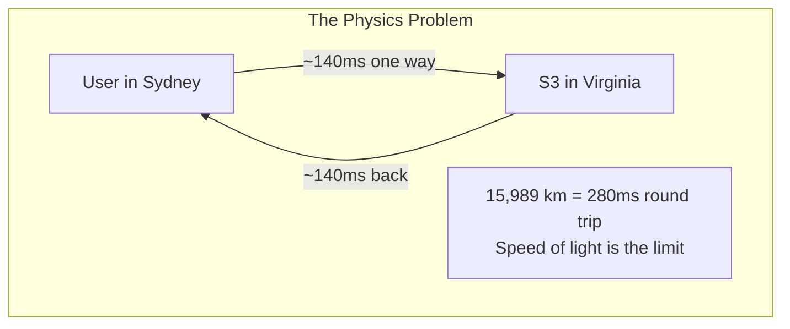
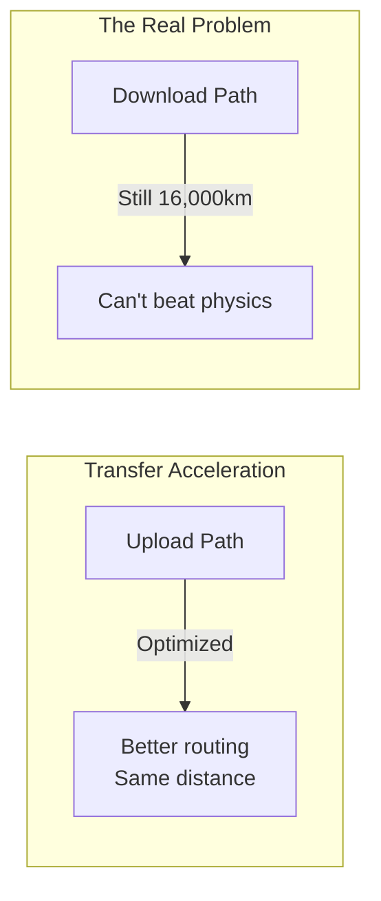
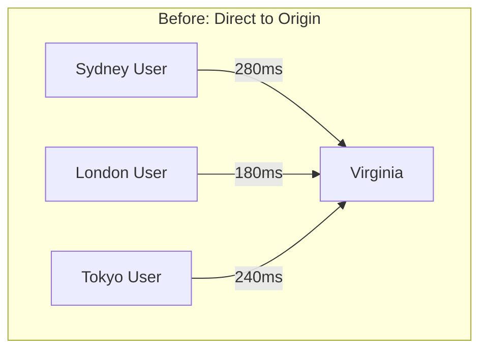
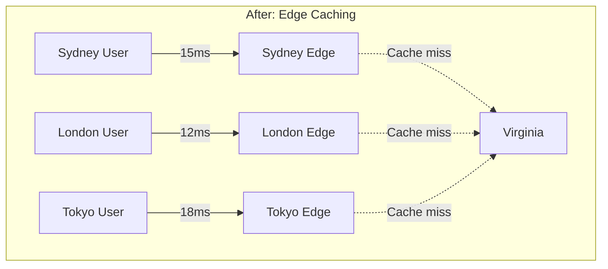
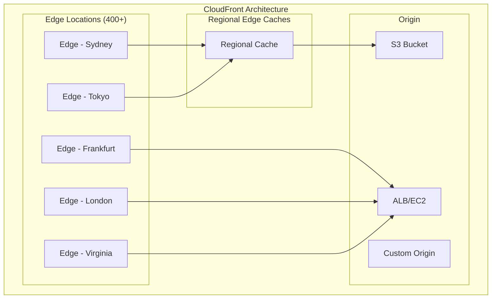
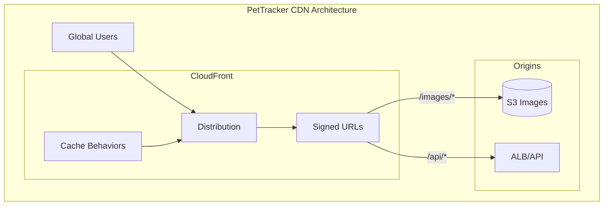
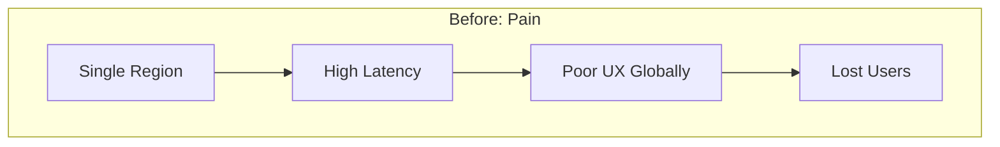
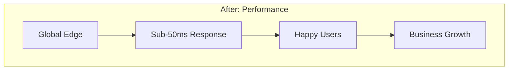

# CloudFront CDN: Making the World Feel Local

## The Complaint That Changed Everything

Alex was having a great Monday. PetTracker had just been featured on Australia's biggest pet blog. Traffic was up 400%. Then came the emails.

```
Subject: Your app is UNUSABLE in Sydney
From: frustrated_pet_owner@email.com

I signed up because of the great reviews, but every page takes
8+ seconds to load. Pet photos? Forget it - I gave up waiting.
My internet is 100Mbps. The problem is YOUR server.
```

Twenty-seven similar emails arrived that morning. All from Australia. All complaining about the same thing: **unacceptable latency**.

---

## "But Why Is It Slow? We're Using AWS!"

Alex pulled up the browser dev tools and simulated the Australian user experience. The numbers were damning:

- **DNS lookup:** 45ms
- **TCP connection:** 280ms (round trip to Virginia)
- **SSL handshake:** 560ms (two round trips)
- **Time to first byte:** 890ms
- **2MB image download:** 3,400ms
- **Total:** 8.2 seconds

"I don't understand," Alex said to Marcus, the SRE. "Our servers are fast. Our code is optimized. Why is Australia so slow?"

Marcus smiled. "Because you can't break the speed of light."

:::floating:right:1/2


"Light travels through fiber at about 200,000 km/s," Marcus explained. "Sydney to Virginia is roughly 16,000 km. That's 80ms one way *in a perfect straight line*. Real network paths add latency. You're looking at 280ms round trip minimum - and that's before your server does any work."
:::

"Every single request makes that trip?"

"Every. Single. One. TCP handshake? Round trip. TLS handshake? Two round trips. HTTP request? Round trip. You're spending almost a second just on network overhead before any data transfers."

## "But Why Not Just Use S3 Transfer Acceleration?"

This is the question every developer asks when they first encounter latency issues. Transfer Acceleration sounds like it should help. Let's examine why it doesn't solve this problem.

**What Transfer Acceleration Actually Does:**

Transfer Acceleration optimizes the *path* data takes from your users to your S3 bucket. It routes traffic through AWS's backbone network rather than the public internet. This helps with **uploads** because:
- Users' ISPs often have congested routes
- AWS's backbone is optimized and uncongested
- The "acceleration" is really about better routing

**Why It Doesn't Help Downloads:**

:::floating:left:1/2


The fundamental problem remains: the data has to travel from Virginia to Sydney. You can optimize the path, but you can't eliminate the distance. What you actually need is data that's **already in Sydney**.
:::

That's the insight that leads to CDNs.

## How CDNs Solve the Distance Problem

A Content Delivery Network (CDN) caches your content at locations around the world. When a user requests content, they get it from the nearest location - not from your origin server thousands of kilometers away.





**The math changes dramatically:**

| User Location | Without CDN | With CDN | Improvement |
|---------------|-------------|----------|-------------|
| Virginia (local) | 20ms | 20ms | - |
| London | 180ms | 12ms | 15x faster |
| Sydney | 280ms | 15ms | 19x faster |
| Tokyo | 240ms | 18ms | 13x faster |

---

## What is CloudFront?

**CloudFront is AWS's global content delivery network with 400+ Points of Presence (PoPs) in 90+ cities across 47 countries.**

:::floating:right:2/3


When a user requests content, CloudFront:
1. Routes to the nearest edge location
2. Checks if content is cached
3. If cached (hit): Return immediately
4. If not cached (miss): Fetch from origin, cache, return
:::

**Key CloudFront Concepts:**

| Concept | What It Is | Why It Matters |
|---------|-----------|----------------|
| **Distribution** | Your CDN configuration | One distribution = one set of cached content |
| **Edge Location** | Server close to users | Where content gets cached |
| **Origin** | Source of your content | S3, ALB, EC2, or any HTTP server |
| **Behavior** | Rules for handling requests | Different paths can have different settings |
| **TTL** | How long content stays cached | Balance freshness vs. performance |

---

## Alex's First CloudFront Distribution

After Marcus's explanation, Alex was eager to try CloudFront:

```bash
# Create a simple distribution
aws cloudfront create-distribution \
    --origin-domain-name pettracker-images.s3.amazonaws.com \
    --default-root-object index.html
```

Fifteen minutes later (CloudFront distributions take time to propagate globally), Alex tested again:

```bash
# Before CloudFront - direct S3 from Sydney
curl -w "Time: %{time_total}s\n" \
    https://pettracker-images.s3.amazonaws.com/photo.jpg -o /dev/null
# Time: 0.847s

# After CloudFront - from Sydney edge (after initial cache)
curl -w "Time: %{time_total}s\n" \
    https://d123456.cloudfront.net/photo.jpg -o /dev/null
# Time: 0.043s
```

**From 847ms to 43ms. A 95% improvement.**

"That's amazing," Alex said. "But wait - there's more to this than just 'make it fast', right?"

"Much more," Marcus replied. "Let me show you what else CloudFront can do..."

---

## What You'll Learn in This Chapter

This chapter follows Alex's journey from latency crisis to global performance optimization:

- **Understanding edge caching** - How CloudFront distributes content
- **Configuring distributions** - Origins, behaviors, and settings
- **Securing content** - HTTPS, signed URLs, and Origin Access Control
- **Cache optimization** - TTLs, invalidation, and cache policies
- **Edge computing** - Lambda@Edge and CloudFront Functions

| Concept | What It Solves |
|---------|---------------|
| **Edge Caching** | Content close to users |
| **Origin Access Control** | Secure S3 access through CloudFront only |
| **Signed URLs** | Time-limited access to private content |
| **Cache Behaviors** | Different rules for different paths |
| **Invalidation** | Force cache refresh when content changes |
| **Lambda@Edge** | Custom logic at the edge |

## The Architecture We're Building

:::floating:right:2/3


Alex's target architecture includes:
- Static assets (images, CSS, JS) cached at edge
- Private pet photos protected by signed URLs
- API responses with short cache TTLs
- Custom domain with HTTPS
:::

## Why This Matters for the Exam

The DVA-C02 exam includes several CloudFront questions. Expect:

- **3-5 direct questions** about CloudFront configuration
- **Architecture questions** about content delivery strategies
- **Security questions** about signed URLs and OAC
- **Integration questions** with S3 and Lambda@Edge

| Topic | What the Exam Asks |
|-------|-------------------|
| **Origins** | S3 vs custom origins, OAC vs OAI |
| **Cache Behaviors** | Path patterns, TTL settings |
| **Signed URLs** | When to use, how they work |
| **HTTPS** | Certificate requirements, SNI |
| **Invalidation** | Cost implications, wildcards |
| **Lambda@Edge** | Use cases, limitations |

## Meet the Team

Throughout this chapter:

- **Alex** - Learning to deliver content globally
- **Marcus** - SRE who understands network performance
- **Sam** - DevOps mentor implementing infrastructure
- **Jordan** - Security consultant ensuring content protection
- **The Australian Users** - Now much happier

## Chapter Roadmap

1. **Alex's Challenge** - The global performance crisis
2. **CloudFront Fundamentals** - Distributions, edges, and origins
3. **S3 Origins** - Connecting S3 with Origin Access Control
4. **Cache Behaviors** - Path patterns and TTL configuration
5. **HTTPS and Certificates** - Securing content delivery
6. **Signed URLs and Cookies** - Protecting private content
7. **Cache Invalidation** - Refreshing content on demand
8. **CloudFront Functions** - Lightweight edge compute
9. **Lambda@Edge** - Full-featured edge computing
10. **Monitoring and Optimization** - CloudWatch metrics and logs
11. **Cost Optimization** - Pricing tiers and strategies
12. **Alex's Solution** - The complete global CDN

---

## The Before and After





---

*Ready to learn how to deliver content at the speed of light (or as close as physics allows)? Let's start with CloudFront fundamentals and understand how edge caching really works.*

---
*v2.0*
