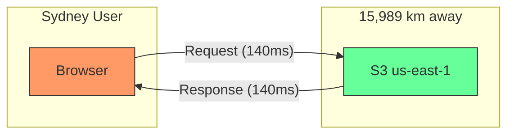
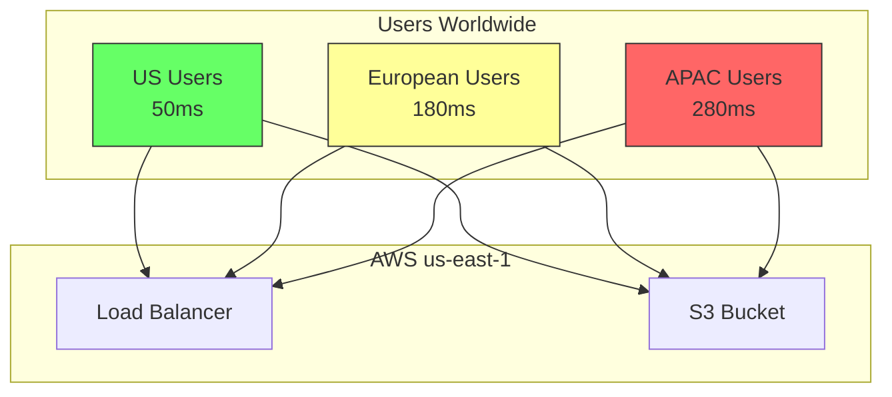
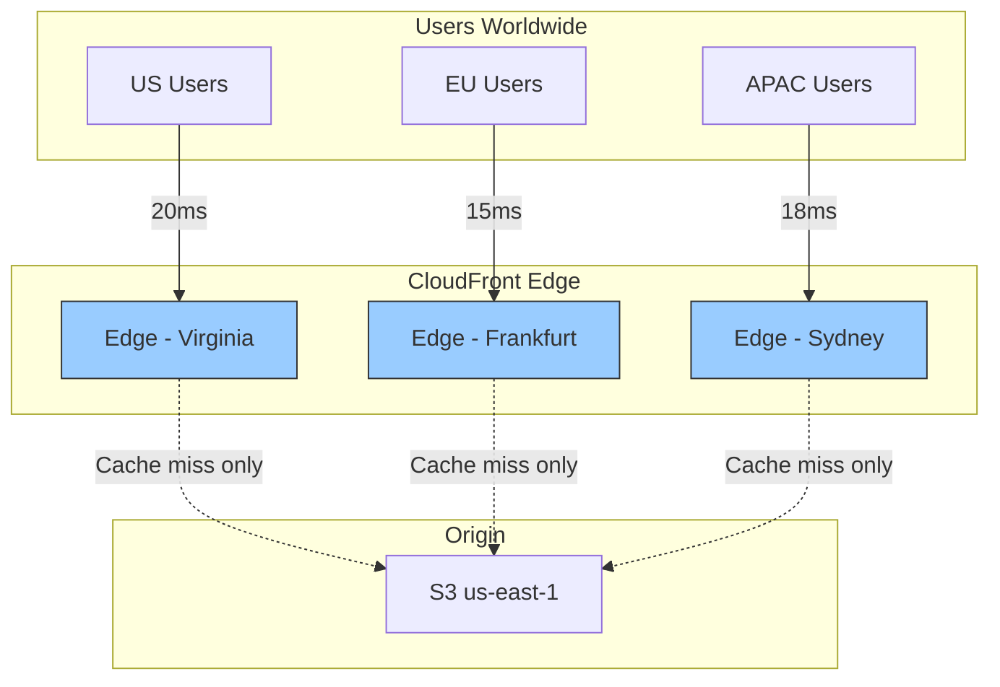

# Alex's Challenge: Global Performance Crisis

## The International Expansion

PetTracker has been featured on a popular pet blog in Australia. Suddenly, 30% of traffic comes from the Asia-Pacific region. Alex is excited about the growth until the support tickets start rolling in.

```
Subject: App is SLOW in Sydney
From: angry_pet_parent@email.com

I love PetTracker but the images take forever to load!
My internet is fine - other apps work great.
Pet photos take 5-8 seconds to appear!
```

## The Performance Problem

Alex opens the browser dev tools and simulates the Australian user experience:

```javascript
// Performance metrics from Sydney user
const metrics = {
  server_location: 'us-east-1',
  user_location: 'Sydney, Australia',
  distance: '15,989 km',

  performance: {
    dns_lookup: '45ms',
    tcp_connection: '280ms',  // Round trip!
    ssl_handshake: '560ms',   // 2 round trips
    time_to_first_byte: '890ms',
    image_download: '3400ms', // 2MB image
    total_page_load: '8200ms'
  }
};
```



## Marcus Explains the Physics

Alex calls Marcus (SRE) for help.

"Alex, you can't beat the speed of light," Marcus explains. "A round trip from Sydney to Virginia is about 280ms minimum - that's physics. Every request has to make that trip."

"But we're using S3 Transfer Acceleration!"

"That helps for uploads, but for downloads, you need edge caching. Have you looked at CloudFront?"

## The Current Architecture (Broken)



## Alex's Investigation

Alex runs some tests:

```bash
# Latency from different regions
# US East - Great!
curl -w "Time: %{time_total}s\n" https://pettracker-images.s3.amazonaws.com/pets/photo.jpg -o /dev/null
# Time: 0.089s

# Simulated from Sydney (using VPN)
# Time: 0.847s

# Simulated from London
# Time: 0.423s
```

The S3 bucket is in us-east-1. Every user, everywhere, has to fetch content from Virginia.

## The Real Costs

Alex calculates the impact:

```markdown
## Performance Impact Analysis

### User Experience
- US users: 89ms average (acceptable)
- EU users: 423ms average (noticeable delay)
- APAC users: 847ms average (frustrating)

### Business Impact
- Page abandonment rate: +34% for APAC users
- Conversion rate: -28% for EU users
- Support tickets: 47 complaints about speed this week

### Data Transfer Costs
- Current: All data from us-east-1
- S3 Data Transfer: $0.09/GB to internet
- Monthly image transfer: 5TB
- Monthly cost: $450 (all from one region)
```

## What Alex Needs

After researching, Alex creates a requirements list:

```markdown
## CloudFront Requirements for PetTracker

### Performance Goals
- [ ] Sub-200ms response time globally
- [ ] Cache static assets at edge
- [ ] Reduce origin load by 80%

### Security Requirements
- [ ] HTTPS everywhere
- [ ] Protect private pet photos
- [ ] Block hotlinking from other sites

### Cost Goals
- [ ] Reduce data transfer costs
- [ ] Only pay for what we use
- [ ] Monitor and optimize spending

### Features Needed
- [ ] Serve S3 images via CDN
- [ ] Custom domain (images.pettracker.com)
- [ ] Signed URLs for private content
- [ ] Real-time analytics
```

## Sam's Guidance

Sam draws the target architecture:



"CloudFront has 400+ Points of Presence globally," Sam explains. "Once content is cached at an edge location, users get it from nearby - no more round trips to Virginia."

## The Learning Journey Ahead

Alex needs to learn:

1. **CloudFront Distributions** - How to set up and configure
2. **Cache Behaviors** - What to cache, for how long
3. **Origins** - Connecting to S3 and other backends
4. **Security** - HTTPS, signed URLs, access control
5. **Invalidation** - Clearing cached content when it changes
6. **Lambda@Edge** - Running code at the edge

## First Experiment

Alex tries a quick test with CloudFront:

```bash
# Create a simple distribution (we'll learn the details next)
aws cloudfront create-distribution \
    --origin-domain-name pettracker-images.s3.amazonaws.com \
    --default-root-object index.html

# Result:
# Distribution Domain: d123456abcdef.cloudfront.net
# Status: InProgress (takes ~15 minutes to deploy)
```

After deployment, Alex tests again:

```bash
# Before CloudFront (direct S3)
# Sydney: 847ms

# After CloudFront (edge cached)
# Sydney: 43ms (after first request caches content)

# 95% faster!
```

"Now that's what I'm talking about!" Alex exclaims.

## Chapter Objectives

By the end of this chapter, Alex (and you) will be able to:

1. Create CloudFront distributions with proper cache configuration
2. Configure S3 as an origin with Origin Access Control
3. Implement signed URLs for private content
4. Set up HTTPS with custom domains
5. Use Lambda@Edge for dynamic edge processing
6. Monitor and optimize CloudFront performance

---

*Next: Understanding CloudFront fundamentals and how edge caching works.*
