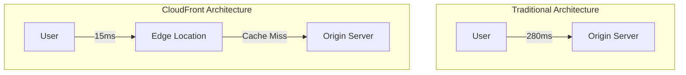
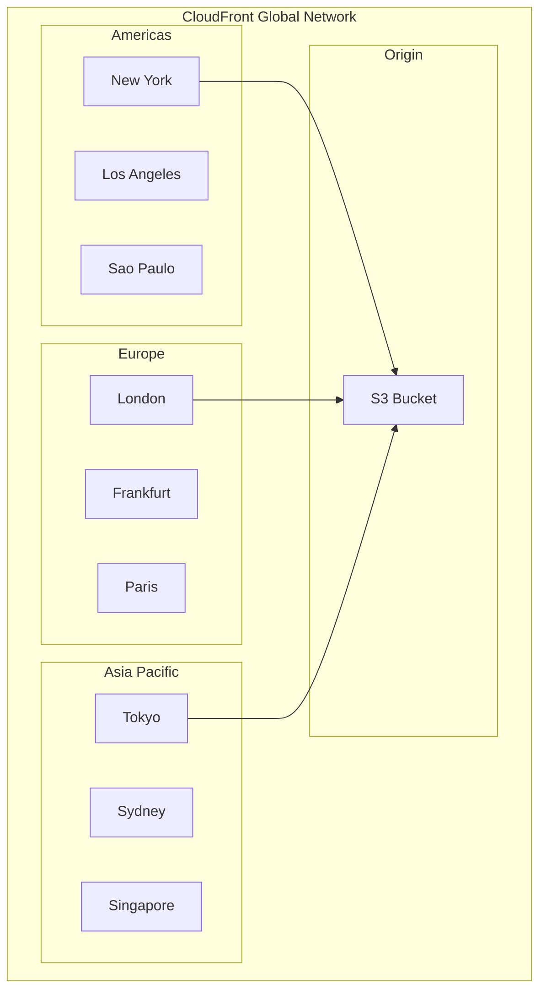
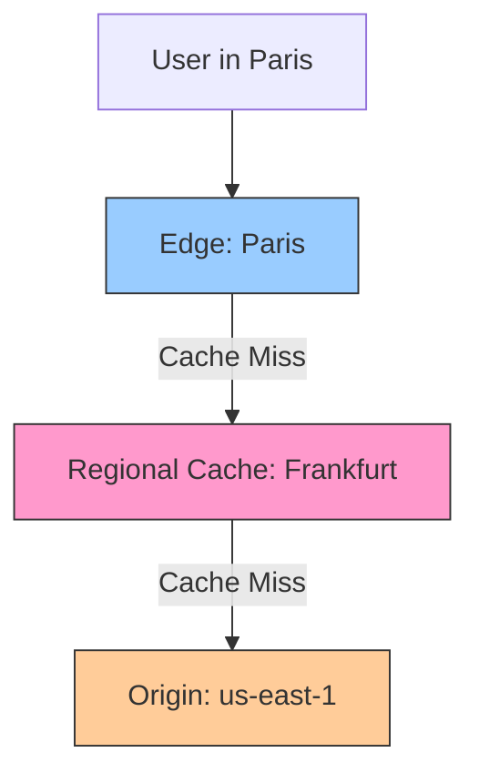
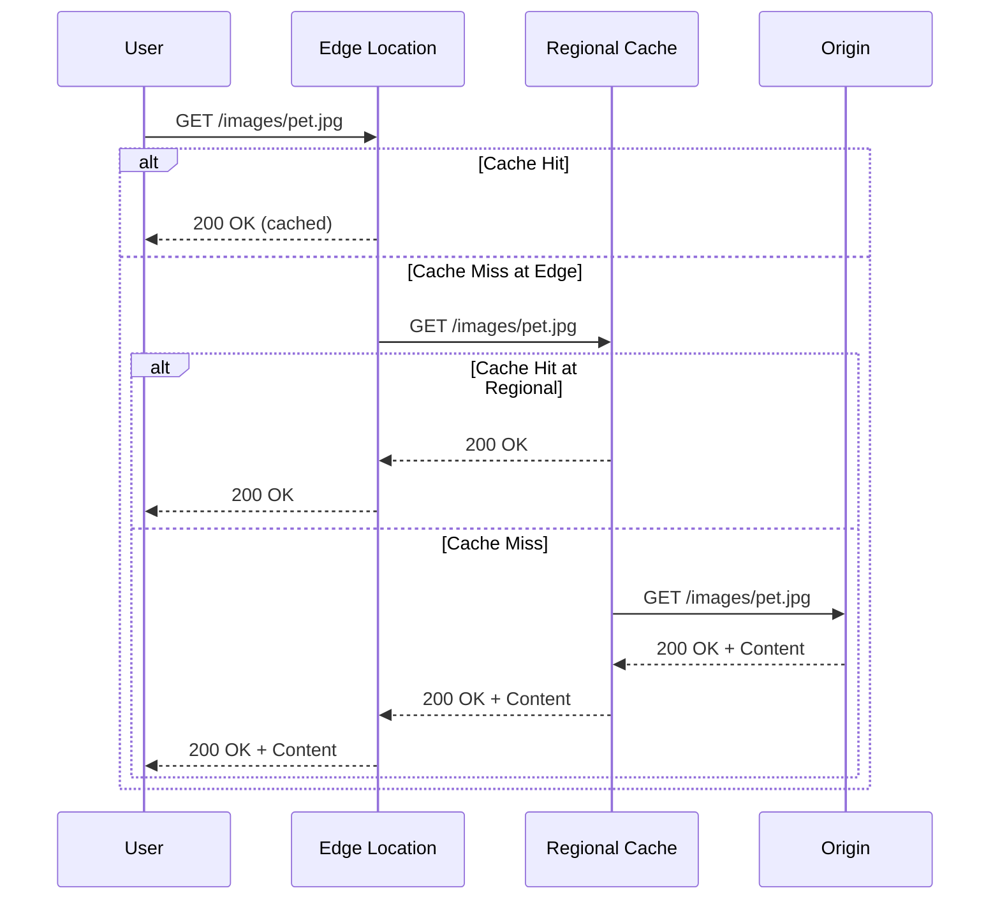
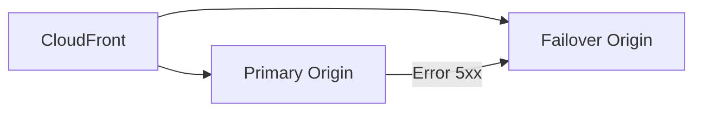

# CloudFront Fundamentals

## What is CloudFront?

Amazon CloudFront is a Content Delivery Network (CDN) that delivers content through a worldwide network of edge locations. When users request content, CloudFront serves it from the nearest edge location, dramatically reducing latency.



## Key Concepts

### Edge Locations

Physical data centers around the world that cache content:



**CloudFront has 400+ Points of Presence in 90+ cities across 47 countries.**

### Regional Edge Caches

Mid-tier caching layer between edge locations and origins:



Regional edge caches:
- Larger cache capacity than edge locations
- Retain content longer
- Reduce load on origin
- 13 locations globally

### Distributions

A distribution is your CloudFront configuration - it defines:
- **Origins** - Where content comes from
- **Cache Behaviors** - How content is cached
- **Settings** - Security, logging, etc.

```python
# Distribution configuration concept
distribution = {
    "id": "E1234567890ABC",
    "domain": "d111111abcdef8.cloudfront.net",
    "origins": [
        {"id": "S3-images", "domain": "my-bucket.s3.amazonaws.com"},
        {"id": "API-backend", "domain": "api.example.com"}
    ],
    "cache_behaviors": [
        {"path": "/images/*", "origin": "S3-images", "ttl": 86400},
        {"path": "/api/*", "origin": "API-backend", "ttl": 0}
    ]
}
```

## Distribution Types

### Web Distributions

For websites and HTTP/HTTPS content:

| Feature | Support |
|---------|---------|
| HTTP/HTTPS | Yes |
| Static files | Yes |
| Dynamic content | Yes |
| Streaming | Yes |
| WebSocket | Yes |

### RTMP Distributions (Deprecated)

Previously used for Adobe Flash media streaming - now deprecated.

## How CloudFront Works

### Request Flow



### Cache Key

CloudFront determines if content is cached using a cache key:

```python
# Default cache key components
cache_key = {
    "domain": "d111111abcdef8.cloudfront.net",
    "path": "/images/pet.jpg",
    # By default, query strings are NOT in cache key
}

# These are the SAME cache entry (default):
# /images/pet.jpg
# /images/pet.jpg?size=large

# With query string forwarding:
cache_key_with_qs = {
    "domain": "d111111abcdef8.cloudfront.net",
    "path": "/images/pet.jpg",
    "query_string": "size=large"  # Now different cache entry
}
```

## CloudFront vs Direct Origin

### Performance Comparison

```markdown
## Sydney User - Direct S3 vs CloudFront

### Direct S3 (us-east-1)
- DNS Lookup: 45ms
- TCP Connect: 280ms (physics!)
- SSL Handshake: 560ms
- Time to First Byte: 890ms
- Download (2MB): 3400ms
- **Total: 5175ms**

### CloudFront (Sydney Edge)
- DNS Lookup: 5ms
- TCP Connect: 12ms
- SSL Handshake: 24ms
- Time to First Byte: 35ms (cached!)
- Download (2MB): 180ms
- **Total: 256ms**

### Improvement: 95% faster!
```

### Cost Comparison

```python
# Data transfer costs example
monthly_data = 5  # TB

# Direct from S3
s3_cost = monthly_data * 1024 * 0.09  # $0.09/GB to internet
# $460.80/month

# Through CloudFront (edge pricing varies by region)
cf_cost = (
    monthly_data * 0.3 * 1024 * 0.085 +  # 30% US: $0.085/GB
    monthly_data * 0.3 * 1024 * 0.085 +  # 30% EU: $0.085/GB
    monthly_data * 0.4 * 1024 * 0.140    # 40% APAC: $0.140/GB
)
# $544.77/month (slightly more, BUT...)

# S3 to CloudFront transfer: FREE!
# Plus: reduced origin requests = less compute
```

## Origins

Origins are where CloudFront fetches content:

### S3 Origins

```python
# S3 bucket as origin
s3_origin = {
    "DomainName": "my-bucket.s3.us-east-1.amazonaws.com",
    "Id": "S3-my-bucket",
    "S3OriginConfig": {
        "OriginAccessIdentity": ""  # Or use OAC
    }
}
```

### Custom Origins

Any HTTP server:

```python
# API Gateway, EC2, ALB, etc.
custom_origin = {
    "DomainName": "api.pettracker.com",
    "Id": "API-backend",
    "CustomOriginConfig": {
        "HTTPPort": 80,
        "HTTPSPort": 443,
        "OriginProtocolPolicy": "https-only",
        "OriginSSLProtocols": ["TLSv1.2"]
    }
}
```

### Origin Groups (Failover)



```python
origin_group = {
    "Id": "HA-Origin-Group",
    "Members": {
        "Quantity": 2,
        "Items": [
            {"OriginId": "Primary-S3"},
            {"OriginId": "Failover-S3"}
        ]
    },
    "FailoverCriteria": {
        "StatusCodes": [500, 502, 503, 504]
    }
}
```

## Alex's First Distribution

Alex creates a basic distribution for PetTracker:

```bash
# Create distribution with AWS CLI
aws cloudfront create-distribution \
    --distribution-config '{
        "CallerReference": "pettracker-images-2024",
        "Origins": {
            "Quantity": 1,
            "Items": [{
                "Id": "S3-pettracker-images",
                "DomainName": "pettracker-images.s3.us-east-1.amazonaws.com",
                "S3OriginConfig": {
                    "OriginAccessIdentity": ""
                }
            }]
        },
        "DefaultCacheBehavior": {
            "TargetOriginId": "S3-pettracker-images",
            "ViewerProtocolPolicy": "redirect-to-https",
            "AllowedMethods": {
                "Quantity": 2,
                "Items": ["GET", "HEAD"]
            },
            "CachePolicyId": "658327ea-f89d-4fab-a63d-7e88639e58f6",
            "Compress": true
        },
        "Enabled": true,
        "Comment": "PetTracker image CDN"
    }'
```

Response:

```json
{
    "Distribution": {
        "Id": "E1234EXAMPLE",
        "DomainName": "d1234example.cloudfront.net",
        "Status": "InProgress"
    }
}
```

## Exam Tips

**For DVA-C02:**

1. **Edge locations** cache content close to users
2. **Regional edge caches** are mid-tier caches
3. **Distributions** define origins and behaviors
4. **Origins** can be S3 or custom HTTP servers
5. **Origin groups** enable failover
6. CloudFront is global (not regional)

**Common scenarios:**

> "Improve global performance for static content..."
> → CloudFront distribution with S3 origin

> "High availability for origin..."
> → Origin groups with failover

> "Serve content from nearest location..."
> → CloudFront edge caching

## Key Takeaways

1. **CloudFront** is a global CDN with 400+ edge locations
2. **Edge locations** cache content near users
3. **Regional edge caches** reduce origin load
4. **Distributions** configure CloudFront behavior
5. **Origins** can be S3 buckets or HTTP servers
6. **Origin groups** provide failover capability

---

*Next: Creating and configuring CloudFront distributions.*

---
*v1.0*
