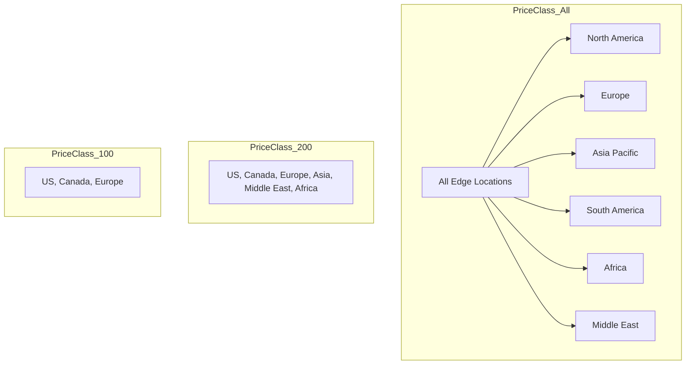
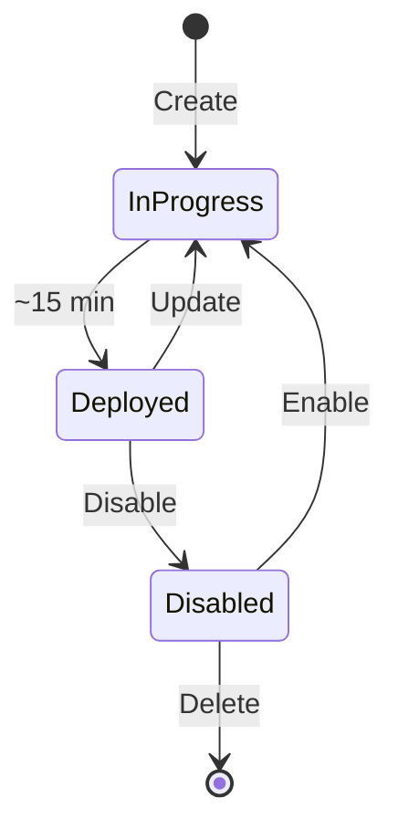

# Creating Distributions

## Distribution Basics

A CloudFront distribution is the core resource you create to deliver content. It defines where content comes from, how it's cached, and who can access it.

```mermaid
graph TB
    subgraph "Distribution Configuration"
        D[Distribution]
        D --> Origins[Origins]
        D --> Behaviors[Cache Behaviors]
        D --> Settings[Settings]
    end

    Origins --> S3[S3 Bucket]
    Origins --> ALB[Load Balancer]
    Origins --> API[API Gateway]

    Behaviors --> B1[/images/*]
    Behaviors --> B2[/api/*]
    Behaviors --> B3[Default *]
```

## Creating via Console

Alex starts with the AWS Console for his first distribution:

### Step 1: Origin Settings

```yaml
Origin Configuration:
  Origin domain: pettracker-images.s3.us-east-1.amazonaws.com
  Origin path: /uploads  # Optional prefix
  Name: S3-pettracker-images

  # For S3 origins
  Origin access: Origin access control settings (recommended)

  # For custom origins
  Protocol: HTTPS only
  HTTP port: 80
  HTTPS port: 443
```

### Step 2: Default Cache Behavior

```yaml
Cache Behavior:
  Path pattern: Default (*)
  Origin: S3-pettracker-images

  Viewer protocol policy: Redirect HTTP to HTTPS
  Allowed HTTP methods: GET, HEAD

  Cache key and origin requests:
    Cache policy: CachingOptimized
    Origin request policy: CORS-S3Origin
```

### Step 3: Distribution Settings

```yaml
Distribution Settings:
  Price class: Use all edge locations
  AWS WAF: None
  Alternate domain (CNAME): images.pettracker.com
  SSL certificate: Custom SSL (ACM)
  Default root object: index.html
  Logging: On
  Enable IPv6: Yes
```

## Creating via CLI

Alex automates with the CLI:

```bash
# Create a complete distribution
aws cloudfront create-distribution \
    --distribution-config file://distribution-config.json
```

```json
{
    "CallerReference": "pettracker-images-v1",
    "Comment": "PetTracker Image CDN",
    "Enabled": true,
    "Origins": {
        "Quantity": 1,
        "Items": [
            {
                "Id": "S3-pettracker-images",
                "DomainName": "pettracker-images.s3.us-east-1.amazonaws.com",
                "OriginPath": "/uploads",
                "S3OriginConfig": {
                    "OriginAccessIdentity": ""
                },
                "OriginAccessControlId": "E12345EXAMPLE"
            }
        ]
    },
    "DefaultCacheBehavior": {
        "TargetOriginId": "S3-pettracker-images",
        "ViewerProtocolPolicy": "redirect-to-https",
        "AllowedMethods": {
            "Quantity": 2,
            "Items": ["GET", "HEAD"],
            "CachedMethods": {
                "Quantity": 2,
                "Items": ["GET", "HEAD"]
            }
        },
        "CachePolicyId": "658327ea-f89d-4fab-a63d-7e88639e58f6",
        "OriginRequestPolicyId": "88a5eaf4-2fd4-4709-b370-b4c650ea3fcf",
        "Compress": true
    },
    "PriceClass": "PriceClass_All",
    "ViewerCertificate": {
        "CloudFrontDefaultCertificate": true
    },
    "HttpVersion": "http2and3"
}
```

## Creating via CloudFormation

For infrastructure as code:

```yaml
# cloudfront-distribution.yaml
AWSTemplateFormatVersion: '2010-09-09'
Description: PetTracker CloudFront Distribution

Resources:
  ImageDistribution:
    Type: AWS::CloudFront::Distribution
    Properties:
      DistributionConfig:
        Enabled: true
        Comment: PetTracker Image CDN
        DefaultRootObject: index.html
        HttpVersion: http2and3

        Origins:
          - Id: S3Origin
            DomainName: !Sub ${ImageBucket}.s3.${AWS::Region}.amazonaws.com
            S3OriginConfig:
              OriginAccessIdentity: ''
            OriginAccessControlId: !Ref OriginAccessControl

        DefaultCacheBehavior:
          TargetOriginId: S3Origin
          ViewerProtocolPolicy: redirect-to-https
          CachePolicyId: 658327ea-f89d-4fab-a63d-7e88639e58f6
          AllowedMethods:
            - GET
            - HEAD
          CachedMethods:
            - GET
            - HEAD
          Compress: true

        PriceClass: PriceClass_100

        ViewerCertificate:
          CloudFrontDefaultCertificate: true

  OriginAccessControl:
    Type: AWS::CloudFront::OriginAccessControl
    Properties:
      OriginAccessControlConfig:
        Name: PetTrackerOAC
        OriginAccessControlOriginType: s3
        SigningBehavior: always
        SigningProtocol: sigv4

Outputs:
  DistributionDomain:
    Value: !GetAtt ImageDistribution.DomainName
  DistributionId:
    Value: !Ref ImageDistribution
```

## Creating via SDK

Python boto3 example:

```python
import boto3
import json

cloudfront = boto3.client('cloudfront')

def create_distribution():
    """Create a CloudFront distribution for PetTracker"""

    config = {
        'CallerReference': f'pettracker-{int(time.time())}',
        'Comment': 'PetTracker Image CDN',
        'Enabled': True,
        'Origins': {
            'Quantity': 1,
            'Items': [{
                'Id': 'S3-origin',
                'DomainName': 'pettracker-images.s3.us-east-1.amazonaws.com',
                'S3OriginConfig': {
                    'OriginAccessIdentity': ''
                }
            }]
        },
        'DefaultCacheBehavior': {
            'TargetOriginId': 'S3-origin',
            'ViewerProtocolPolicy': 'redirect-to-https',
            'AllowedMethods': {
                'Quantity': 2,
                'Items': ['GET', 'HEAD'],
                'CachedMethods': {
                    'Quantity': 2,
                    'Items': ['GET', 'HEAD']
                }
            },
            'CachePolicyId': '658327ea-f89d-4fab-a63d-7e88639e58f6',
            'Compress': True
        },
        'PriceClass': 'PriceClass_100',
        'ViewerCertificate': {
            'CloudFrontDefaultCertificate': True
        }
    }

    response = cloudfront.create_distribution(
        DistributionConfig=config
    )

    return response['Distribution']


# Create and wait for deployment
distribution = create_distribution()
print(f"Distribution ID: {distribution['Id']}")
print(f"Domain: {distribution['DomainName']}")
print(f"Status: {distribution['Status']}")

# Wait for deployment (can take 15-20 minutes)
waiter = cloudfront.get_waiter('distribution_deployed')
waiter.wait(Id=distribution['Id'])
print("Distribution deployed!")
```

## Price Classes

Control which edge locations to use:



```python
# Price class options
price_classes = {
    'PriceClass_100': {
        'regions': ['US', 'Canada', 'Europe'],
        'cost': 'Lowest',
        'coverage': 'Limited'
    },
    'PriceClass_200': {
        'regions': ['US', 'Canada', 'Europe', 'Asia', 'Middle East', 'Africa'],
        'cost': 'Medium',
        'coverage': 'Good'
    },
    'PriceClass_All': {
        'regions': ['All edge locations'],
        'cost': 'Highest',
        'coverage': 'Complete'
    }
}
```

## Distribution States



```bash
# Check distribution status
aws cloudfront get-distribution --id E1234EXAMPLE \
    --query 'Distribution.Status'

# Disable before deletion
aws cloudfront update-distribution \
    --id E1234EXAMPLE \
    --if-match ETAG123 \
    --distribution-config file://disabled-config.json

# Delete (must be disabled first)
aws cloudfront delete-distribution \
    --id E1234EXAMPLE \
    --if-match ETAG456
```

## Multiple Origins

Alex adds an API origin:

```json
{
    "Origins": {
        "Quantity": 2,
        "Items": [
            {
                "Id": "S3-images",
                "DomainName": "pettracker-images.s3.amazonaws.com",
                "S3OriginConfig": {
                    "OriginAccessIdentity": ""
                }
            },
            {
                "Id": "API-backend",
                "DomainName": "api.pettracker.com",
                "CustomOriginConfig": {
                    "HTTPPort": 80,
                    "HTTPSPort": 443,
                    "OriginProtocolPolicy": "https-only",
                    "OriginSSLProtocols": {
                        "Quantity": 1,
                        "Items": ["TLSv1.2"]
                    },
                    "OriginKeepaliveTimeout": 60,
                    "OriginReadTimeout": 30
                }
            }
        ]
    }
}
```

## Alex's Distribution Summary

```python
# Alex's final distribution configuration
pettracker_distribution = {
    "id": "E1EXAMPLE123",
    "domain": "d1234example.cloudfront.net",
    "aliases": ["images.pettracker.com"],

    "origins": [
        {
            "name": "S3-images",
            "type": "S3",
            "bucket": "pettracker-images-prod"
        },
        {
            "name": "API-backend",
            "type": "Custom",
            "domain": "api.pettracker.com"
        }
    ],

    "behaviors": [
        {"path": "/images/*", "origin": "S3-images", "cache": True},
        {"path": "/api/*", "origin": "API-backend", "cache": False},
        {"path": "Default (*)", "origin": "S3-images", "cache": True}
    ],

    "price_class": "PriceClass_All",  # Global users
    "http_version": "http2and3",
    "ipv6": True,

    "status": "Deployed"
}
```

## Exam Tips

**For DVA-C02:**

1. **CallerReference** must be unique for each distribution
2. **Deployment takes 15-20 minutes**
3. **Must disable before delete**
4. **Price classes** control edge location coverage
5. **Multiple origins** supported with different cache behaviors

**Common scenarios:**

> "Reduce costs while serving US and Europe..."
> → Use PriceClass_100

> "Need fastest performance globally..."
> → Use PriceClass_All

> "Serve static and dynamic content..."
> → Multiple origins with different behaviors

## Key Takeaways

1. **Distributions** are the main CloudFront resource
2. **Create via** Console, CLI, CloudFormation, or SDK
3. **Price classes** balance cost vs coverage
4. **Multiple origins** serve different content types
5. **Deployment** takes 15-20 minutes
6. **Must disable** before deleting

---

*Next: Configuring origins and cache behaviors.*

---
*v2.0*
