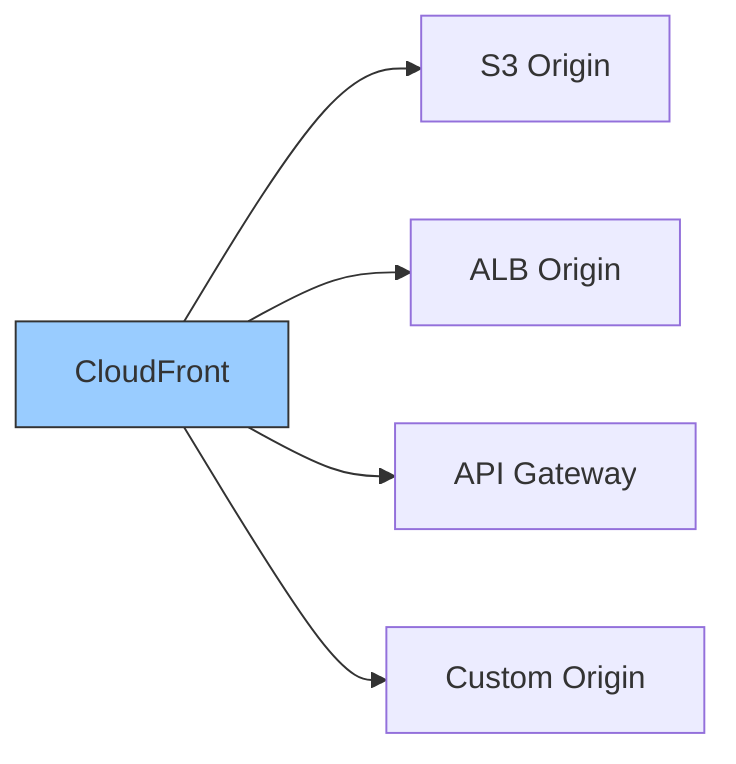
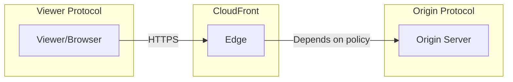
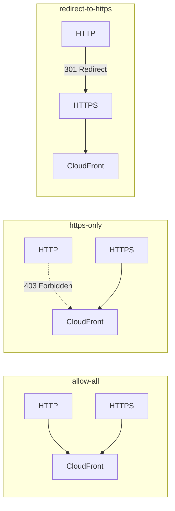
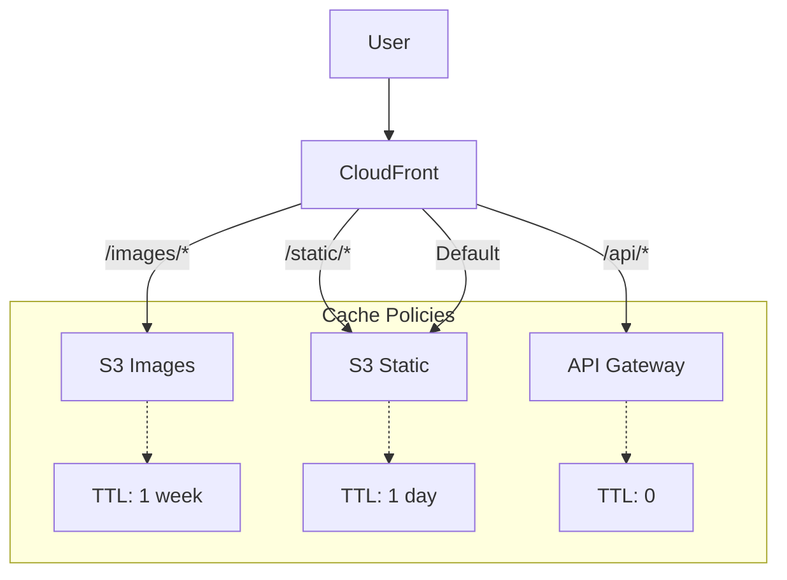
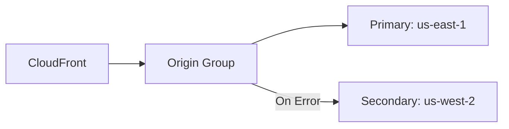

# Origins and Cache Behaviors

## Understanding Origins

Origins are the source of content for CloudFront. When a cache miss occurs, CloudFront fetches content from the origin.



## S3 Origins

### Basic S3 Origin

```json
{
    "Id": "S3-pettracker-images",
    "DomainName": "pettracker-images.s3.us-east-1.amazonaws.com",
    "S3OriginConfig": {
        "OriginAccessIdentity": ""
    }
}
```

### S3 Website Endpoint

For S3 static website hosting:

```json
{
    "Id": "S3-website",
    "DomainName": "pettracker-landing.s3-website-us-east-1.amazonaws.com",
    "CustomOriginConfig": {
        "HTTPPort": 80,
        "HTTPSPort": 443,
        "OriginProtocolPolicy": "http-only"
    }
}
```

**Important difference:**

| S3 REST Endpoint | S3 Website Endpoint |
|------------------|---------------------|
| `bucket.s3.region.amazonaws.com` | `bucket.s3-website-region.amazonaws.com` |
| Supports OAC | No OAC support |
| HTTPS supported | HTTP only |
| No redirects | Redirect rules work |

### Origin Path

Serve from a subfolder:

```json
{
    "Id": "S3-images",
    "DomainName": "pettracker-images.s3.amazonaws.com",
    "OriginPath": "/production",
    "S3OriginConfig": {}
}
```

Request flow:
```
User requests: /images/pet.jpg
CloudFront fetches: s3://pettracker-images/production/images/pet.jpg
```

## Custom Origins

### ALB/EC2 Origin

```json
{
    "Id": "ALB-backend",
    "DomainName": "backend-alb-1234567890.us-east-1.elb.amazonaws.com",
    "CustomOriginConfig": {
        "HTTPPort": 80,
        "HTTPSPort": 443,
        "OriginProtocolPolicy": "https-only",
        "OriginSSLProtocols": {
            "Quantity": 1,
            "Items": ["TLSv1.2"]
        },
        "OriginKeepaliveTimeout": 60,
        "OriginReadTimeout": 30
    }
}
```

### API Gateway Origin

```json
{
    "Id": "API-Gateway",
    "DomainName": "abc123.execute-api.us-east-1.amazonaws.com",
    "OriginPath": "/prod",
    "CustomOriginConfig": {
        "HTTPSPort": 443,
        "OriginProtocolPolicy": "https-only",
        "OriginSSLProtocols": {
            "Quantity": 1,
            "Items": ["TLSv1.2"]
        }
    }
}
```

## Origin Protocol Policy



| Policy | Description |
|--------|-------------|
| `http-only` | Always use HTTP to origin |
| `https-only` | Always use HTTPS to origin |
| `match-viewer` | Match viewer's protocol |

```python
# Best practice: HTTPS to origin
origin_config = {
    "OriginProtocolPolicy": "https-only",
    "OriginSSLProtocols": {
        "Quantity": 1,
        "Items": ["TLSv1.2"]  # Minimum TLS version
    }
}
```

## Origin Timeouts

```python
custom_origin_config = {
    "OriginKeepaliveTimeout": 60,  # Keep connection open (1-180 seconds)
    "OriginReadTimeout": 30         # Wait for response (1-180 seconds)
}
```

## Cache Behaviors

Cache behaviors define how CloudFront handles requests for different URL patterns.

```mermaid
graph TB
    Request[/images/pet.jpg] --> B1{Match /images/*?}
    B1 -->|Yes| Images[Images Behavior]
    B1 -->|No| B2{Match /api/*?}
    B2 -->|Yes| API[API Behavior]
    B2 -->|No| Default[Default Behavior]

    Images --> S3[S3 Origin]
    API --> ALB[ALB Origin]
    Default --> S3
```

### Path Patterns

```python
cache_behaviors = [
    {"path": "/images/*", "origin": "S3", "cache": "aggressive"},
    {"path": "/images/*.jpg", "origin": "S3", "cache": "aggressive"},
    {"path": "/api/*", "origin": "ALB", "cache": "none"},
    {"path": "/static/*", "origin": "S3", "cache": "aggressive"},
    {"path": "Default (*)", "origin": "S3", "cache": "moderate"}
]

# Pattern matching rules:
# 1. Most specific match wins
# 2. Case sensitive
# 3. * matches any sequence of characters
# 4. Default (*) catches everything else
```

### Cache Behavior Settings

```json
{
    "PathPattern": "/images/*",
    "TargetOriginId": "S3-images",
    "ViewerProtocolPolicy": "redirect-to-https",
    "AllowedMethods": {
        "Quantity": 2,
        "Items": ["GET", "HEAD"],
        "CachedMethods": {
            "Quantity": 2,
            "Items": ["GET", "HEAD"]
        }
    },
    "CachePolicyId": "658327ea-f89d-4fab-a63d-7e88639e58f6",
    "Compress": true,
    "SmoothStreaming": false
}
```

## Viewer Protocol Policy



| Policy | HTTP Behavior | HTTPS Behavior |
|--------|---------------|----------------|
| `allow-all` | Allowed | Allowed |
| `https-only` | 403 Forbidden | Allowed |
| `redirect-to-https` | 301 to HTTPS | Allowed |

## Allowed Methods

```python
# Read-only content (default)
allowed_methods_readonly = {
    "Quantity": 2,
    "Items": ["GET", "HEAD"]
}

# Read + OPTIONS (for CORS preflight)
allowed_methods_cors = {
    "Quantity": 3,
    "Items": ["GET", "HEAD", "OPTIONS"]
}

# All methods (for APIs)
allowed_methods_all = {
    "Quantity": 7,
    "Items": ["GET", "HEAD", "OPTIONS", "PUT", "POST", "PATCH", "DELETE"]
}
```

**Important**: Only GET and HEAD are cached. Other methods always go to origin.

## Alex's Multi-Origin Setup



### Complete Configuration

```json
{
    "Origins": {
        "Quantity": 3,
        "Items": [
            {
                "Id": "S3-images",
                "DomainName": "pettracker-images.s3.amazonaws.com",
                "S3OriginConfig": {}
            },
            {
                "Id": "S3-static",
                "DomainName": "pettracker-static.s3.amazonaws.com",
                "S3OriginConfig": {}
            },
            {
                "Id": "API-backend",
                "DomainName": "api.pettracker.com",
                "CustomOriginConfig": {
                    "HTTPSPort": 443,
                    "OriginProtocolPolicy": "https-only"
                }
            }
        ]
    },
    "DefaultCacheBehavior": {
        "TargetOriginId": "S3-static",
        "ViewerProtocolPolicy": "redirect-to-https",
        "CachePolicyId": "658327ea-f89d-4fab-a63d-7e88639e58f6",
        "Compress": true
    },
    "CacheBehaviors": {
        "Quantity": 2,
        "Items": [
            {
                "PathPattern": "/images/*",
                "TargetOriginId": "S3-images",
                "ViewerProtocolPolicy": "redirect-to-https",
                "CachePolicyId": "658327ea-f89d-4fab-a63d-7e88639e58f6",
                "Compress": true
            },
            {
                "PathPattern": "/api/*",
                "TargetOriginId": "API-backend",
                "ViewerProtocolPolicy": "https-only",
                "AllowedMethods": {
                    "Quantity": 7,
                    "Items": ["GET", "HEAD", "OPTIONS", "PUT", "POST", "PATCH", "DELETE"]
                },
                "CachePolicyId": "4135ea2d-6df8-44a3-9df3-4b5a84be39ad"
            }
        ]
    }
}
```

## Origin Groups (Failover)

High availability with automatic failover:



```json
{
    "OriginGroups": {
        "Quantity": 1,
        "Items": [{
            "Id": "HA-images",
            "FailoverCriteria": {
                "StatusCodes": {
                    "Quantity": 4,
                    "Items": [500, 502, 503, 504]
                }
            },
            "Members": {
                "Quantity": 2,
                "Items": [
                    {"OriginId": "S3-primary"},
                    {"OriginId": "S3-secondary"}
                ]
            }
        }]
    }
}
```

## Exam Tips

**For DVA-C02:**

1. **S3 REST vs Website endpoints** have different features
2. **OriginPath** appends to all requests
3. **Path patterns** are case-sensitive
4. **Only GET/HEAD are cached** - other methods pass through
5. **Origin groups** enable automatic failover

**Common scenarios:**

> "Serve static files from S3, API from ALB..."
> → Multiple origins with different cache behaviors

> "Handle origin failures gracefully..."
> → Origin groups with failover

> "Cache images for long time, API not at all..."
> → Different cache behaviors per path pattern

## Key Takeaways

1. **S3 origins** use REST or website endpoints
2. **Custom origins** for ALB, API Gateway, EC2
3. **Origin path** adds prefix to all requests
4. **Cache behaviors** match by path pattern
5. **Origin groups** provide failover
6. **Different behaviors** for different content types

---

*Next: Implementing effective caching strategies.*

---
*v2.0*
