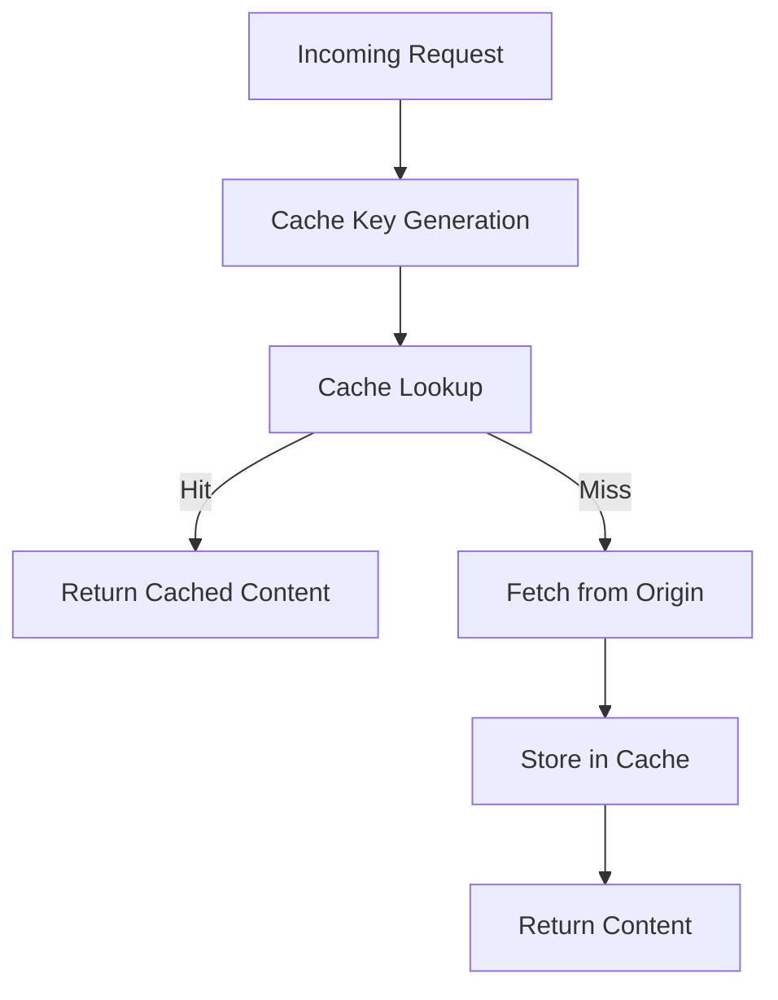
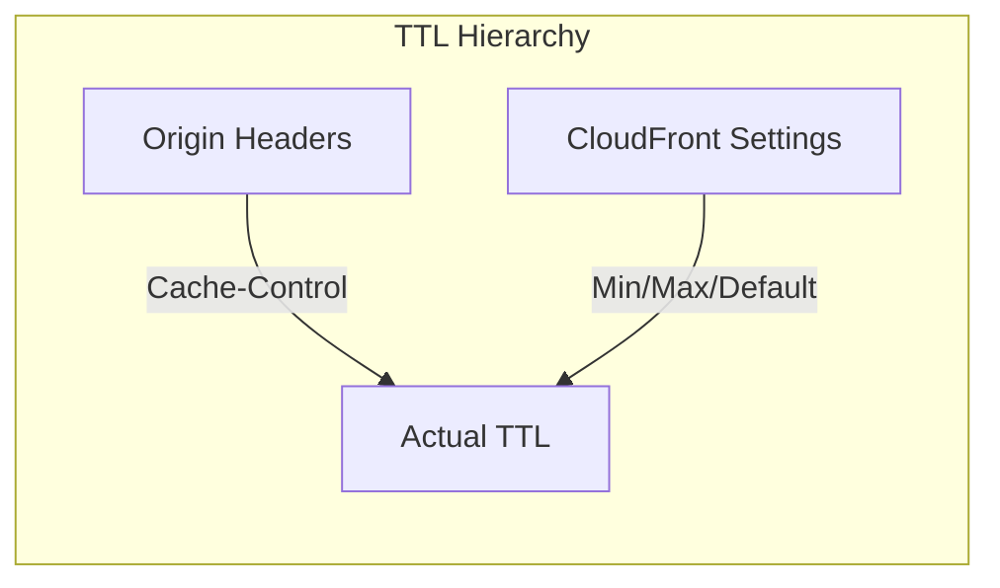
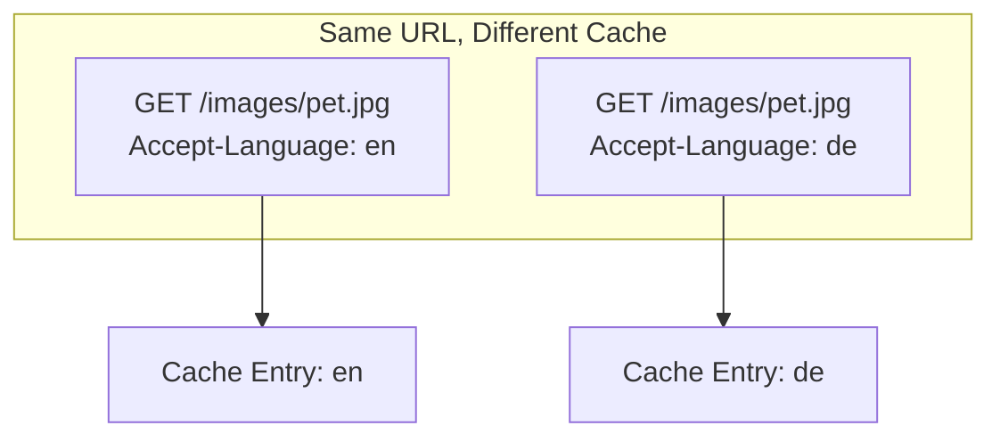
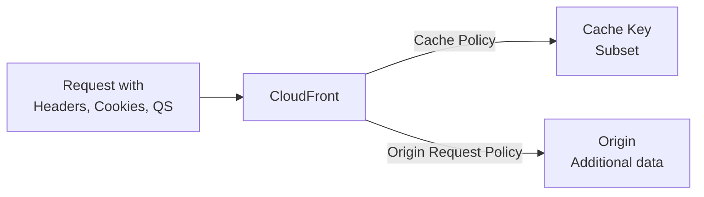
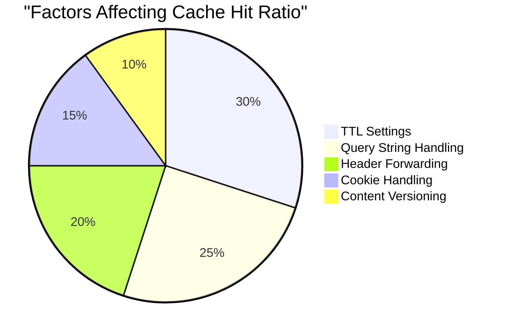

# Caching Strategies

## Understanding the Cache Key

The cache key determines whether CloudFront serves cached content or fetches from origin.



### Default Cache Key Components

```python
# Default cache key includes:
cache_key = {
    "host": "d1234example.cloudfront.net",
    "path": "/images/pet-001.jpg"
    # Query strings, headers, cookies NOT included by default
}

# These URLs share the same cache entry:
# /images/pet-001.jpg
# /images/pet-001.jpg?tracking=abc
# /images/pet-001.jpg?version=1
```

## Cache Policies

AWS provides managed cache policies and you can create custom ones.

### Managed Cache Policies

```python
# Common managed policies
managed_policies = {
    # Best for S3 origins with static content
    "CachingOptimized": "658327ea-f89d-4fab-a63d-7e88639e58f6",

    # For content that shouldn't be cached
    "CachingDisabled": "4135ea2d-6df8-44a3-9df3-4b5a84be39ad",

    # Includes query strings in cache key
    "CachingOptimizedForUncompressedObjects": "b2884449-e4de-46a7-ac36-70bc7f1ddd6d",

    # For Elemental MediaPackage
    "Elemental-MediaPackage": "08627262-05a9-4f76-9ded-b50ca2e3a84f"
}
```

### Custom Cache Policy

Alex creates a custom policy for different content types:

```json
{
    "Name": "PetTracker-ImageCache",
    "Comment": "Cache policy for pet images",
    "DefaultTTL": 86400,
    "MaxTTL": 31536000,
    "MinTTL": 1,
    "ParametersInCacheKeyAndForwardedToOrigin": {
        "EnableAcceptEncodingGzip": true,
        "EnableAcceptEncodingBrotli": true,
        "HeadersConfig": {
            "HeaderBehavior": "none"
        },
        "CookiesConfig": {
            "CookieBehavior": "none"
        },
        "QueryStringsConfig": {
            "QueryStringBehavior": "whitelist",
            "QueryStrings": {
                "Quantity": 2,
                "Items": ["size", "format"]
            }
        }
    }
}
```

### Create Custom Policy

```bash
# Create cache policy
aws cloudfront create-cache-policy \
    --cache-policy-config file://cache-policy.json

# Use in distribution
aws cloudfront update-distribution \
    --id E1234EXAMPLE \
    --distribution-config '{
        "DefaultCacheBehavior": {
            "CachePolicyId": "YOUR-POLICY-ID"
        }
    }'
```

## TTL Settings



### TTL Logic

```python
def calculate_ttl(origin_max_age, cf_min, cf_max, cf_default):
    """
    CloudFront TTL calculation logic
    """
    if origin_max_age is None:
        # No origin header - use CloudFront default
        return cf_default

    # Respect origin, but within CloudFront limits
    return max(cf_min, min(origin_max_age, cf_max))


# Example scenarios
scenarios = [
    # S3 without Cache-Control header
    {"origin": None, "cf_default": 86400, "result": 86400},

    # Origin says 1 year, CloudFront max is 1 week
    {"origin": 31536000, "cf_max": 604800, "result": 604800},

    # Origin says no-cache
    {"origin": 0, "cf_min": 0, "result": 0},

    # Origin says 1 hour
    {"origin": 3600, "cf_min": 0, "cf_max": 86400, "result": 3600}
]
```

### Origin Headers

S3 objects with Cache-Control:

```bash
# Upload with cache headers
aws s3 cp pet.jpg s3://bucket/images/pet.jpg \
    --cache-control "max-age=31536000, public"

# Different TTLs for different content
aws s3 cp index.html s3://bucket/index.html \
    --cache-control "max-age=0, no-cache, no-store, must-revalidate"
```

## Query String Caching

```python
# Scenario: Image resizing
# /images/pet.jpg?size=small
# /images/pet.jpg?size=large
# Should these be cached separately?

query_string_behaviors = {
    "none": {
        "description": "Query strings ignored",
        "example": "All sizes serve same cache",
        "use_case": "Static files with tracking params"
    },
    "whitelist": {
        "description": "Only specified query strings in cache key",
        "example": "size in key, tracking ignored",
        "use_case": "Image transformations"
    },
    "allExcept": {
        "description": "All except specified in cache key",
        "example": "Exclude tracking, keep others",
        "use_case": "Dynamic content with analytics"
    },
    "all": {
        "description": "All query strings in cache key",
        "example": "Every unique query = new cache",
        "use_case": "Truly dynamic content"
    }
}
```

```json
{
    "QueryStringsConfig": {
        "QueryStringBehavior": "whitelist",
        "QueryStrings": {
            "Quantity": 3,
            "Items": ["size", "format", "quality"]
        }
    }
}
```

## Header Caching

Include headers in cache key:



```json
{
    "HeadersConfig": {
        "HeaderBehavior": "whitelist",
        "Headers": {
            "Quantity": 2,
            "Items": ["Accept-Language", "CloudFront-Viewer-Country"]
        }
    }
}
```

**Warning**: More headers = lower cache hit ratio!

## Cookie Caching

```python
cookie_behaviors = {
    "none": "Cookies ignored - best for static content",
    "whitelist": "Only specific cookies in cache key",
    "allExcept": "All except blacklisted cookies",
    "all": "All cookies (lowest cache hit ratio)"
}
```

```json
{
    "CookiesConfig": {
        "CookieBehavior": "whitelist",
        "Cookies": {
            "Quantity": 1,
            "Items": ["session_id"]
        }
    }
}
```

## Origin Request Policies

Control what's forwarded to origin (separate from cache key):



```json
{
    "Name": "PetTracker-OriginRequest",
    "Comment": "Forward headers to origin for logging",
    "HeadersConfig": {
        "HeaderBehavior": "whitelist",
        "Headers": {
            "Quantity": 3,
            "Items": [
                "CloudFront-Viewer-Country",
                "CloudFront-Is-Mobile-Viewer",
                "X-Forwarded-For"
            ]
        }
    },
    "CookiesConfig": {
        "CookieBehavior": "none"
    },
    "QueryStringsConfig": {
        "QueryStringBehavior": "all"
    }
}
```

## Compression

CloudFront can compress content automatically:

```python
compression_settings = {
    "Gzip": {
        "supported_types": ["text/html", "application/json", "text/css", "application/javascript"],
        "min_size": 1000,  # bytes
        "compression_ratio": "60-80% smaller"
    },
    "Brotli": {
        "supported_types": ["same as Gzip"],
        "min_size": 1000,
        "compression_ratio": "15-25% better than Gzip"
    }
}
```

```json
{
    "DefaultCacheBehavior": {
        "Compress": true,
        "CachePolicyId": "658327ea-f89d-4fab-a63d-7e88639e58f6"
    }
}
```

**Important**: Enable both in cache policy:

```json
{
    "ParametersInCacheKeyAndForwardedToOrigin": {
        "EnableAcceptEncodingGzip": true,
        "EnableAcceptEncodingBrotli": true
    }
}
```

## Alex's Caching Strategy

```python
# Different policies for different content
pettracker_caching = {
    "/images/*": {
        "policy": "Long-term cache",
        "default_ttl": 604800,  # 1 week
        "max_ttl": 31536000,    # 1 year
        "query_strings": ["size", "format"],
        "compress": True
    },
    "/static/*": {
        "policy": "Versioned assets",
        "default_ttl": 31536000,  # 1 year (versioned filenames)
        "max_ttl": 31536000,
        "query_strings": None,
        "compress": True
    },
    "/api/*": {
        "policy": "No cache",
        "default_ttl": 0,
        "max_ttl": 0,
        "query_strings": "all",
        "compress": True
    },
    "Default": {
        "policy": "Short cache",
        "default_ttl": 86400,  # 1 day
        "max_ttl": 604800,
        "query_strings": None,
        "compress": True
    }
}
```

## Cache Hit Ratio Optimization



### Best Practices

```python
optimization_tips = [
    "Use long TTLs for static content",
    "Whitelist only necessary query strings",
    "Avoid forwarding headers unless required",
    "Don't include cookies for static content",
    "Use versioned filenames (/app.v123.js)",
    "Enable compression",
    "Monitor cache statistics"
]
```

## Exam Tips

**For DVA-C02:**

1. **Cache key** = what determines cache hits
2. **TTL hierarchy**: CloudFront min/max vs origin headers
3. **Query strings** can be included, excluded, or whitelisted
4. **Origin request policy** is separate from cache policy
5. **Compression** must be enabled in cache policy

**Common scenarios:**

> "Different image sizes served incorrectly..."
> → Add size query string to cache key

> "API responses being cached..."
> → Use CachingDisabled policy for /api/*

> "Low cache hit ratio..."
> → Reduce headers/cookies in cache key

## Key Takeaways

1. **Cache key** determines what gets cached separately
2. **TTL** controlled by origin headers and CloudFront settings
3. **Query strings** - whitelist only what matters
4. **Headers/Cookies** - minimize for better cache ratio
5. **Compression** - enable both Gzip and Brotli
6. **Monitor** cache statistics to optimize

---

*Next: Invalidating cached content when it changes.*

---
*v1.0*
