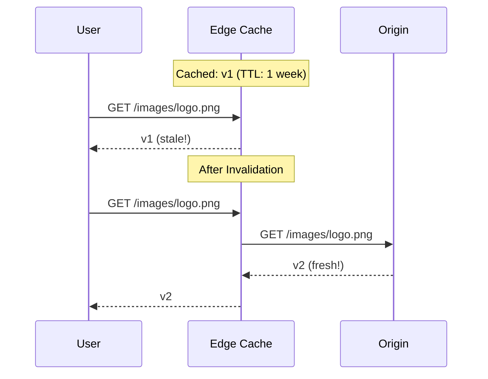
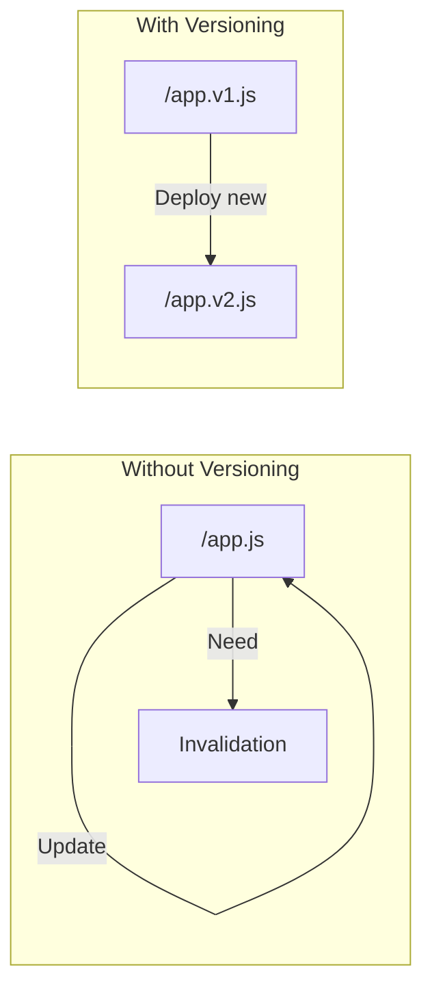

# Cache Invalidation

## Why Invalidate?

When you update content at your origin, CloudFront continues serving the cached version until TTL expires. Invalidation forces CloudFront to fetch fresh content.



## Alex's Problem

Alex updates the PetTracker logo but users still see the old one:

```python
# The problem
timeline = [
    "Monday 9am: Upload new logo to S3",
    "Monday 9:05am: Customer sees old logo",
    "Monday 9:30am: Still old logo!",
    "Tuesday: Logo finally updates (TTL expired)"
]

# The solution
solution = "Invalidate /images/logo.png immediately"
```

## Creating Invalidations

### AWS CLI

```bash
# Invalidate single file
aws cloudfront create-invalidation \
    --distribution-id E1234EXAMPLE \
    --paths "/images/logo.png"

# Invalidate multiple files
aws cloudfront create-invalidation \
    --distribution-id E1234EXAMPLE \
    --paths "/images/logo.png" "/images/banner.jpg"

# Invalidate all images
aws cloudfront create-invalidation \
    --distribution-id E1234EXAMPLE \
    --paths "/images/*"

# Invalidate everything (expensive!)
aws cloudfront create-invalidation \
    --distribution-id E1234EXAMPLE \
    --paths "/*"
```

### AWS SDK (Python)

```python
import boto3
import time

cloudfront = boto3.client('cloudfront')

def invalidate_paths(distribution_id, paths):
    """
    Invalidate CloudFront cache for specified paths
    """
    response = cloudfront.create_invalidation(
        DistributionId=distribution_id,
        InvalidationBatch={
            'Paths': {
                'Quantity': len(paths),
                'Items': paths
            },
            'CallerReference': f'invalidation-{int(time.time())}'
        }
    )

    invalidation_id = response['Invalidation']['Id']
    print(f"Invalidation created: {invalidation_id}")

    return invalidation_id


def wait_for_invalidation(distribution_id, invalidation_id):
    """
    Wait for invalidation to complete
    """
    waiter = cloudfront.get_waiter('invalidation_completed')
    waiter.wait(
        DistributionId=distribution_id,
        Id=invalidation_id
    )
    print("Invalidation completed!")


# Usage
invalidation_id = invalidate_paths(
    'E1234EXAMPLE',
    ['/images/logo.png', '/static/app.js']
)

wait_for_invalidation('E1234EXAMPLE', invalidation_id)
```

## Invalidation Patterns

### Wildcard Patterns

```python
patterns = {
    "/images/*": "All files in images folder",
    "/images/pets/*": "All files in images/pets",
    "/*.jpg": "All JPG files at root",
    "/images/*.jpg": "All JPG files in images",
    "/*": "Everything (expensive!)"
}

# Note: Only * at the end is supported
# These are INVALID:
# "/*/logo.png"  - wildcard in middle
# "/images/*.png"  - extension wildcard OK
```

### Multiple Files

```bash
# Batch invalidation (more efficient)
aws cloudfront create-invalidation \
    --distribution-id E1234EXAMPLE \
    --paths \
        "/images/logo.png" \
        "/images/hero.jpg" \
        "/css/styles.css" \
        "/js/app.js"
```

## Invalidation Costs

```python
# Pricing structure
pricing = {
    "free_per_month": 1000,  # First 1000 paths free
    "cost_after_free": 0.005,  # $0.005 per path

    "examples": [
        {"paths": 500, "cost": "$0.00"},
        {"paths": 1500, "cost": "$2.50"},  # 500 * $0.005
        {"paths": 10000, "cost": "$45.00"}  # 9000 * $0.005
    ],

    "wildcard_counts_as": 1,  # /* counts as 1 path
}

# Cost-effective pattern
# Instead of invalidating 1000 individual files:
# /images/photo1.jpg, /images/photo2.jpg, ...
#
# Use wildcard:
# /images/* (counts as 1 path!)
```

## Invalidation Status

```bash
# List invalidations
aws cloudfront list-invalidations \
    --distribution-id E1234EXAMPLE

# Get invalidation status
aws cloudfront get-invalidation \
    --distribution-id E1234EXAMPLE \
    --id I1234EXAMPLE
```

```json
{
    "Invalidation": {
        "Id": "I1234EXAMPLE",
        "Status": "Completed",
        "CreateTime": "2024-01-15T10:30:00Z",
        "InvalidationBatch": {
            "Paths": {
                "Quantity": 2,
                "Items": ["/images/logo.png", "/images/banner.jpg"]
            },
            "CallerReference": "invalidation-1705312200"
        }
    }
}
```

Status values:
- `InProgress` - Invalidation is running
- `Completed` - All edge locations cleared

## Better Alternative: Versioned URLs

Instead of invalidating, use versioned filenames:



### Implementation

```python
# Versioning strategies
versioning = {
    "content_hash": {
        "example": "/app.a1b2c3d4.js",
        "how": "Hash of file content",
        "benefit": "Changes only when content changes"
    },
    "build_number": {
        "example": "/app.v123.js",
        "how": "Increment on each build",
        "benefit": "Simple to implement"
    },
    "timestamp": {
        "example": "/app.1705312200.js",
        "how": "Unix timestamp",
        "benefit": "Easy to track"
    }
}
```

### Webpack Example

```javascript
// webpack.config.js
module.exports = {
    output: {
        filename: '[name].[contenthash].js',
        // Output: main.a1b2c3d4e5f6.js
    }
};
```

### HTML Reference

```html
<!-- index.html (short TTL or no-cache) -->
<!DOCTYPE html>
<html>
<head>
    <!-- Versioned assets (long TTL) -->
    <link rel="stylesheet" href="/css/app.a1b2c3d4.css">
    <script src="/js/app.e5f6g7h8.js"></script>
</head>
<body>
    
</body>
</html>
```

## Alex's Deployment Script

```bash
#!/bin/bash
# deploy.sh - Smart invalidation

DISTRIBUTION_ID="E1234EXAMPLE"
BUCKET="pettracker-static"

# 1. Build with content hashing
npm run build

# 2. Sync static assets (long TTL, versioned)
aws s3 sync build/static/ s3://$BUCKET/static/ \
    --cache-control "max-age=31536000, immutable" \
    --exclude "*.html"

# 3. Sync HTML (short TTL)
aws s3 sync build/ s3://$BUCKET/ \
    --cache-control "no-cache" \
    --include "*.html"

# 4. Invalidate only HTML files
aws cloudfront create-invalidation \
    --distribution-id $DISTRIBUTION_ID \
    --paths "/index.html" "/error.html"

# Static assets don't need invalidation - new version = new URL!
echo "Deployment complete!"
```

## Programmatic Invalidation

```python
import boto3
import hashlib
from pathlib import Path

class SmartInvalidator:
    def __init__(self, distribution_id):
        self.cf = boto3.client('cloudfront')
        self.distribution_id = distribution_id

    def invalidate_changed_files(self, old_manifest, new_manifest):
        """
        Only invalidate files that actually changed
        """
        changed_paths = []

        for path, new_hash in new_manifest.items():
            old_hash = old_manifest.get(path)
            if old_hash != new_hash:
                changed_paths.append(path)

        if changed_paths:
            self.invalidate_paths(changed_paths)
            print(f"Invalidated {len(changed_paths)} changed files")
        else:
            print("No changes detected")

    def invalidate_paths(self, paths):
        # Use wildcards for efficiency
        if len(paths) > 100:
            # Too many files - use wildcard
            paths = [self._find_common_prefix(paths)]

        self.cf.create_invalidation(
            DistributionId=self.distribution_id,
            InvalidationBatch={
                'Paths': {'Quantity': len(paths), 'Items': paths},
                'CallerReference': f'inv-{hash(tuple(paths))}'
            }
        )

    def _find_common_prefix(self, paths):
        """Find common prefix for wildcard invalidation"""
        prefix = os.path.commonprefix(paths)
        return prefix + '*'


# Usage
invalidator = SmartInvalidator('E1234EXAMPLE')
invalidator.invalidate_changed_files(
    old_manifest={'a.js': 'hash1', 'b.js': 'hash2'},
    new_manifest={'a.js': 'hash1', 'b.js': 'hash3'}  # b.js changed
)
```

## Invalidation vs Object Versioning

```python
comparison = {
    "invalidation": {
        "pros": ["Immediate", "Works with any URL structure"],
        "cons": ["Costs money", "Takes time", "Not instant"],
        "use_when": "Urgent fixes, can't change URLs"
    },
    "versioned_urls": {
        "pros": ["Free", "Instant", "More reliable"],
        "cons": ["Requires URL changes", "Build process needed"],
        "use_when": "Regular deployments, static assets"
    }
}
```

## Exam Tips

**For DVA-C02:**

1. **First 1000 paths/month free**
2. **Wildcard (*) counts as 1 path**
3. **Invalidations take time** (not instant)
4. **Versioned URLs are better** than invalidation
5. **CallerReference must be unique** per invalidation

**Common scenarios:**

> "Update deployed immediately..."
> → Create invalidation for changed paths

> "Reduce invalidation costs..."
> → Use versioned filenames instead

> "Clear all cache..."
> → Invalidate /* (but expensive if over free tier)

## Key Takeaways

1. **Invalidation** clears cached content before TTL
2. **Wildcards** are cost-effective for many files
3. **First 1000 paths free** per month
4. **Versioned URLs** are better than invalidation
5. **CallerReference** must be unique
6. **Invalidations take time** - not instant

---

*Next: Implementing security with HTTPS.*

---
*v2.0*
