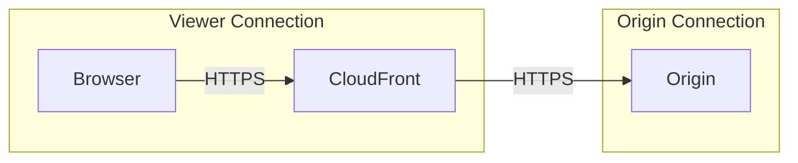
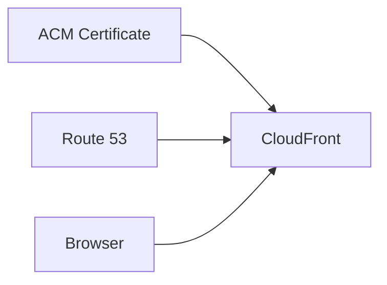
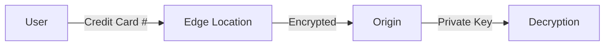
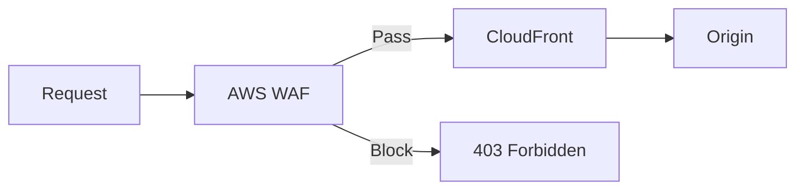

# Security and HTTPS

## HTTPS in CloudFront

CloudFront supports HTTPS at both the viewer (client) side and origin side:



## Viewer Protocol Policy

Control how clients connect to CloudFront:

```python
viewer_protocols = {
    "HTTP and HTTPS": {
        "description": "Allow both",
        "use_case": "Transitioning to HTTPS",
        "security": "Low"
    },
    "Redirect HTTP to HTTPS": {
        "description": "301 redirect HTTP requests",
        "use_case": "Enforce HTTPS, maintain bookmarks",
        "security": "High"
    },
    "HTTPS Only": {
        "description": "HTTP returns 403",
        "use_case": "Strict HTTPS requirement",
        "security": "Highest"
    }
}
```

```json
{
    "DefaultCacheBehavior": {
        "ViewerProtocolPolicy": "redirect-to-https"
    }
}
```

## SSL/TLS Certificates

### Default CloudFront Certificate

```python
default_certificate = {
    "domain": "*.cloudfront.net",
    "cost": "Free",
    "limitations": [
        "Can't use custom domain",
        "Shows CloudFront domain in browser"
    ]
}
```

```json
{
    "ViewerCertificate": {
        "CloudFrontDefaultCertificate": true
    }
}
```

### Custom SSL Certificate (ACM)

For custom domains like `images.pettracker.com`:



**Important**: ACM certificate must be in **us-east-1** for CloudFront!

```bash
# 1. Request certificate in us-east-1
aws acm request-certificate \
    --domain-name images.pettracker.com \
    --validation-method DNS \
    --region us-east-1

# 2. Validate domain (add DNS record)
# ACM provides the validation records

# 3. Use in CloudFront
aws cloudfront update-distribution \
    --id E1234EXAMPLE \
    --distribution-config '{
        "ViewerCertificate": {
            "ACMCertificateArn": "arn:aws:acm:us-east-1:123456789012:certificate/abc-123",
            "SSLSupportMethod": "sni-only",
            "MinimumProtocolVersion": "TLSv1.2_2021"
        },
        "Aliases": {
            "Quantity": 1,
            "Items": ["images.pettracker.com"]
        }
    }'
```

### SSL Support Methods

```python
ssl_methods = {
    "sni-only": {
        "description": "Server Name Indication",
        "cost": "Free",
        "compatibility": "Modern browsers (99%+)",
        "recommended": True
    },
    "vip": {
        "description": "Dedicated IP addresses",
        "cost": "$600/month per distribution",
        "compatibility": "All browsers including legacy",
        "recommended": False  # Only for legacy browser support
    }
}
```

## Minimum Protocol Version

```python
protocol_versions = {
    "TLSv1.2_2021": {
        "protocols": ["TLSv1.2"],
        "ciphers": "Strong modern ciphers",
        "recommended": True
    },
    "TLSv1.2_2019": {
        "protocols": ["TLSv1.2"],
        "ciphers": "Modern ciphers"
    },
    "TLSv1.2_2018": {
        "protocols": ["TLSv1.2"],
        "ciphers": "Broader compatibility"
    },
    "TLSv1.1_2016": {
        "protocols": ["TLSv1.1", "TLSv1.2"],
        "ciphers": "Legacy support"
    },
    "TLSv1_2016": {
        "protocols": ["TLSv1", "TLSv1.1", "TLSv1.2"],
        "ciphers": "Maximum compatibility (not recommended)"
    }
}
```

## Origin Protocol Policy

Control connection to origin:

```python
origin_protocol = {
    "HTTP Only": {
        "use_case": "S3 website endpoint",
        "security": "Low (origin not encrypted)"
    },
    "HTTPS Only": {
        "use_case": "API Gateway, ALB with cert",
        "security": "High",
        "recommended": True
    },
    "Match Viewer": {
        "use_case": "Mirror viewer protocol",
        "security": "Depends on viewer"
    }
}
```

```json
{
    "Origins": {
        "Items": [{
            "Id": "API-backend",
            "DomainName": "api.pettracker.com",
            "CustomOriginConfig": {
                "OriginProtocolPolicy": "https-only",
                "OriginSSLProtocols": {
                    "Quantity": 1,
                    "Items": ["TLSv1.2"]
                }
            }
        }]
    }
}
```

## Field-Level Encryption

Encrypt sensitive data at edge, decrypt only at origin:



```python
# Field-level encryption use case
field_encryption = {
    "purpose": "Protect sensitive POST data",
    "how": "Encrypt specific fields with public key",
    "who_decrypts": "Only origin with private key",
    "use_cases": [
        "Credit card numbers",
        "Social security numbers",
        "Personal health information"
    ]
}
```

## Geo Restrictions

Block or allow by country:

```json
{
    "Restrictions": {
        "GeoRestriction": {
            "RestrictionType": "blacklist",
            "Quantity": 2,
            "Items": ["RU", "CN"]
        }
    }
}
```

```python
geo_restriction_types = {
    "whitelist": "Only allow listed countries",
    "blacklist": "Block listed countries",
    "none": "No geographic restrictions"
}
```

## AWS WAF Integration

Web Application Firewall protection:



```python
# Common WAF rules for CloudFront
waf_rules = {
    "AWS-AWSManagedRulesCommonRuleSet": "Common web exploits",
    "AWS-AWSManagedRulesSQLiRuleSet": "SQL injection",
    "AWS-AWSManagedRulesKnownBadInputsRuleSet": "Known bad inputs",
    "RateLimit": "Block excessive requests from IP"
}
```

```bash
# Associate WAF with CloudFront
aws cloudfront update-distribution \
    --id E1234EXAMPLE \
    --distribution-config '{
        "WebACLId": "arn:aws:wafv2:us-east-1:123456789012:global/webacl/pettracker-waf/abc123"
    }'
```

## Alex's Security Configuration

```python
# PetTracker CloudFront security
security_config = {
    "viewer": {
        "protocol": "redirect-to-https",
        "certificate": "ACM (images.pettracker.com)",
        "ssl_method": "sni-only",
        "min_tls": "TLSv1.2_2021"
    },
    "origin": {
        "protocol": "https-only",
        "ssl_protocols": ["TLSv1.2"]
    },
    "waf": {
        "enabled": True,
        "rules": [
            "AWSManagedRulesCommonRuleSet",
            "RateLimit-1000-per-5min"
        ]
    },
    "geo": {
        "type": "none"  # Global pet tracking!
    }
}
```

### Complete Distribution Config

```json
{
    "Aliases": {
        "Quantity": 1,
        "Items": ["images.pettracker.com"]
    },
    "ViewerCertificate": {
        "ACMCertificateArn": "arn:aws:acm:us-east-1:123456789012:certificate/abc-123",
        "SSLSupportMethod": "sni-only",
        "MinimumProtocolVersion": "TLSv1.2_2021"
    },
    "DefaultCacheBehavior": {
        "ViewerProtocolPolicy": "redirect-to-https"
    },
    "Origins": {
        "Items": [{
            "CustomOriginConfig": {
                "OriginProtocolPolicy": "https-only",
                "OriginSSLProtocols": {
                    "Items": ["TLSv1.2"]
                }
            }
        }]
    },
    "Restrictions": {
        "GeoRestriction": {
            "RestrictionType": "none"
        }
    },
    "WebACLId": "arn:aws:wafv2:us-east-1:123456789012:global/webacl/pettracker-waf/abc123"
}
```

## Security Headers

Add security headers with response headers policy:

```json
{
    "Name": "PetTracker-Security-Headers",
    "SecurityHeadersConfig": {
        "StrictTransportSecurity": {
            "AccessControlMaxAgeSec": 31536000,
            "IncludeSubdomains": true,
            "Preload": true,
            "Override": true
        },
        "ContentTypeOptions": {
            "Override": true
        },
        "FrameOptions": {
            "FrameOption": "DENY",
            "Override": true
        },
        "XSSProtection": {
            "ModeBlock": true,
            "Protection": true,
            "Override": true
        },
        "ContentSecurityPolicy": {
            "ContentSecurityPolicy": "default-src 'self'",
            "Override": true
        }
    }
}
```

## Exam Tips

**For DVA-C02:**

1. **ACM certificate must be in us-east-1** for CloudFront
2. **SNI-only is free**, dedicated IP costs $600/month
3. **ViewerProtocolPolicy**: redirect-to-https recommended
4. **OriginProtocolPolicy**: https-only when possible
5. **Geo restrictions** by country code

**Common scenarios:**

> "HTTPS with custom domain..."
> → ACM certificate in us-east-1, SNI-only

> "Block traffic from specific countries..."
> → Geo restriction blacklist

> "Protect against web attacks..."
> → AWS WAF integration

## Key Takeaways

1. **HTTPS everywhere** - viewer and origin
2. **ACM certificate** must be in us-east-1
3. **SNI-only** is free and compatible with modern browsers
4. **TLSv1.2_2021** is recommended minimum
5. **WAF** adds application layer protection
6. **Geo restrictions** control access by country

---

*Next: Implementing signed URLs and signed cookies for private content.*
