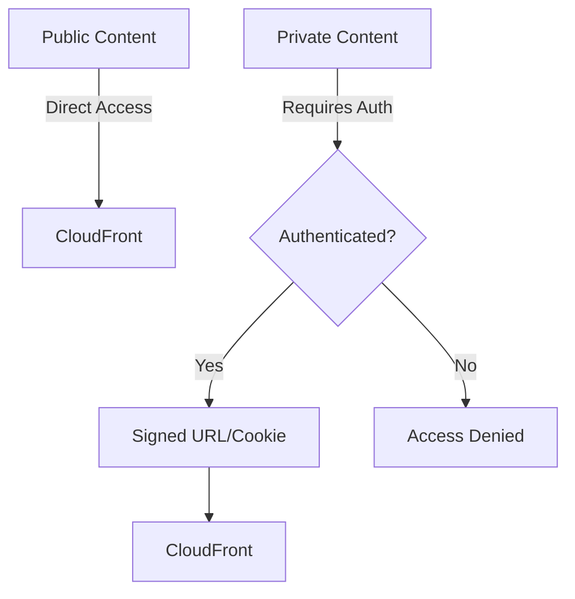
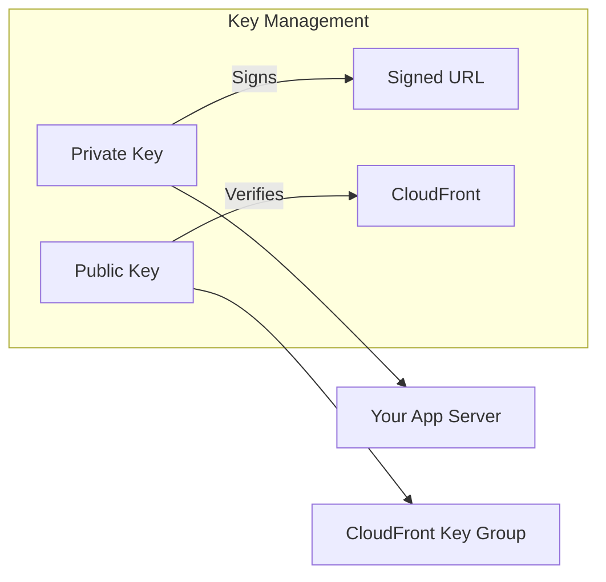

# Signed URLs and Signed Cookies

## Private Content Problem

Alex needs to serve private pet photos only to authenticated users:



## Signed URLs vs Signed Cookies

```python
comparison = {
    "signed_urls": {
        "scope": "Single file access",
        "use_cases": [
            "Individual file downloads",
            "RTMP streaming",
            "When cookies not supported"
        ],
        "delivery": "Include in URL"
    },
    "signed_cookies": {
        "scope": "Multiple files access",
        "use_cases": [
            "HLS streaming (multiple segments)",
            "All images on a page",
            "Subscription content"
        ],
        "delivery": "Browser cookies"
    }
}
```

## Signed URL Components

```python
signed_url_parts = {
    "base_url": "https://d1234.cloudfront.net/private/pet-photo.jpg",
    "policy": {
        "Resource": "https://d1234.cloudfront.net/private/*",
        "DateLessThan": "2024-01-15T12:00:00Z",
        "DateGreaterThan": "2024-01-15T10:00:00Z",  # Optional
        "IpAddress": "203.0.113.0/24"  # Optional
    },
    "signature": "Encrypted policy using private key",
    "key_pair_id": "K1234EXAMPLE"
}
```

## Key Pairs

CloudFront uses RSA key pairs for signing:



### Create Key Pair

```bash
# 1. Generate RSA key pair
openssl genrsa -out private_key.pem 2048
openssl rsa -pubout -in private_key.pem -out public_key.pem

# 2. Upload public key to CloudFront
aws cloudfront create-public-key \
    --public-key-config '{
        "CallerReference": "pettracker-key-2024",
        "Name": "PetTrackerSigningKey",
        "EncodedKey": "-----BEGIN PUBLIC KEY-----\n...\n-----END PUBLIC KEY-----"
    }'

# 3. Create key group
aws cloudfront create-key-group \
    --key-group-config '{
        "Name": "PetTrackerKeyGroup",
        "Items": ["K1234EXAMPLE"]
    }'
```

### Configure Distribution

```json
{
    "DefaultCacheBehavior": {
        "TrustedKeyGroups": {
            "Enabled": true,
            "Quantity": 1,
            "Items": ["kg-1234EXAMPLE"]
        }
    }
}
```

## Creating Signed URLs

### Python (boto3)

```python
from datetime import datetime, timedelta
from botocore.signers import CloudFrontSigner
import rsa

def create_signed_url(url, key_id, private_key_path, expires_in_seconds=3600):
    """
    Create a CloudFront signed URL
    """
    # Load private key
    with open(private_key_path, 'rb') as key_file:
        private_key = key_file.read()

    # RSA signer function
    def rsa_signer(message):
        return rsa.sign(
            message,
            rsa.PrivateKey.load_pkcs1(private_key),
            'SHA-1'
        )

    # Create CloudFront signer
    signer = CloudFrontSigner(key_id, rsa_signer)

    # Calculate expiry
    expire_date = datetime.utcnow() + timedelta(seconds=expires_in_seconds)

    # Generate signed URL
    signed_url = signer.generate_presigned_url(
        url,
        date_less_than=expire_date
    )

    return signed_url


# Usage
url = create_signed_url(
    url='https://d1234.cloudfront.net/private/pet-photo.jpg',
    key_id='K1234EXAMPLE',
    private_key_path='/path/to/private_key.pem',
    expires_in_seconds=3600  # 1 hour
)
print(url)
# https://d1234.cloudfront.net/private/pet-photo.jpg?Expires=1705320000&Signature=...&Key-Pair-Id=K1234EXAMPLE
```

### Node.js

```javascript
const AWS = require('aws-sdk');
const cloudFront = new AWS.CloudFront.Signer(
    'K1234EXAMPLE',
    privateKey
);

function createSignedUrl(url, expiresInSeconds = 3600) {
    const expires = Math.floor(Date.now() / 1000) + expiresInSeconds;

    return cloudFront.getSignedUrl({
        url: url,
        expires: expires
    });
}

// Usage
const signedUrl = createSignedUrl(
    'https://d1234.cloudfront.net/private/pet-photo.jpg'
);
```

## Custom Policies

For more control, use custom policies:

```python
import json
import base64

def create_custom_policy_url(resource, expires, ip_range=None, start_time=None):
    """
    Create signed URL with custom policy
    """
    policy = {
        "Statement": [{
            "Resource": resource,  # Can use wildcards
            "Condition": {
                "DateLessThan": {"AWS:EpochTime": int(expires.timestamp())}
            }
        }]
    }

    # Optional: IP restriction
    if ip_range:
        policy["Statement"][0]["Condition"]["IpAddress"] = {
            "AWS:SourceIp": ip_range
        }

    # Optional: Start time
    if start_time:
        policy["Statement"][0]["Condition"]["DateGreaterThan"] = {
            "AWS:EpochTime": int(start_time.timestamp())
        }

    # Encode policy
    policy_json = json.dumps(policy, separators=(',', ':'))
    policy_b64 = base64.b64encode(policy_json.encode()).decode()

    return policy_b64


# Example: Access to all private images for 1 hour, from specific IP
policy = {
    "Statement": [{
        "Resource": "https://d1234.cloudfront.net/private/*",
        "Condition": {
            "DateLessThan": {"AWS:EpochTime": 1705320000},
            "IpAddress": {"AWS:SourceIp": "203.0.113.0/24"}
        }
    }]
}
```

## Signed Cookies

For accessing multiple files:

```python
def create_signed_cookies(resource, expires, key_id, private_key):
    """
    Create CloudFront signed cookies
    """
    signer = CloudFrontSigner(key_id, rsa_signer)

    policy = {
        "Statement": [{
            "Resource": resource,
            "Condition": {
                "DateLessThan": {"AWS:EpochTime": int(expires.timestamp())}
            }
        }]
    }

    # Generate signature
    policy_json = json.dumps(policy)
    signature = signer.sign(policy_json.encode())

    cookies = {
        "CloudFront-Policy": base64_encode(policy_json),
        "CloudFront-Signature": base64_encode(signature),
        "CloudFront-Key-Pair-Id": key_id
    }

    return cookies


# Set cookies in response
cookies = create_signed_cookies(
    resource="https://d1234.cloudfront.net/private/*",
    expires=datetime.utcnow() + timedelta(hours=24),
    key_id="K1234EXAMPLE",
    private_key=private_key
)

# Flask example
response = make_response(redirect('/photos'))
for name, value in cookies.items():
    response.set_cookie(name, value, domain='.pettracker.com', secure=True)
```

## Alex's Implementation

```python
# pet_photo_service.py
import boto3
from datetime import datetime, timedelta
from botocore.signers import CloudFrontSigner

class PetPhotoService:
    def __init__(self, distribution_domain, key_id, private_key_path):
        self.distribution_domain = distribution_domain
        self.key_id = key_id

        with open(private_key_path, 'rb') as f:
            self.private_key = f.read()

    def get_photo_url(self, user_id, photo_key, expires_in=3600):
        """
        Generate signed URL for a private pet photo
        """
        # Verify user owns this photo
        if not self._user_owns_photo(user_id, photo_key):
            raise PermissionError("User doesn't own this photo")

        url = f"https://{self.distribution_domain}/private/{photo_key}"

        signer = CloudFrontSigner(self.key_id, self._rsa_signer)

        signed_url = signer.generate_presigned_url(
            url,
            date_less_than=datetime.utcnow() + timedelta(seconds=expires_in)
        )

        return signed_url

    def get_all_photos_cookies(self, user_id, expires_in=86400):
        """
        Generate signed cookies for all user's photos
        """
        resource = f"https://{self.distribution_domain}/private/{user_id}/*"

        # Create policy for all user's photos
        policy = {
            "Statement": [{
                "Resource": resource,
                "Condition": {
                    "DateLessThan": {
                        "AWS:EpochTime": int((datetime.utcnow() + timedelta(seconds=expires_in)).timestamp())
                    }
                }
            }]
        }

        return self._generate_cookies(policy)

    def _user_owns_photo(self, user_id, photo_key):
        # Check ownership in database
        return photo_key.startswith(f"{user_id}/")

    def _rsa_signer(self, message):
        import rsa
        return rsa.sign(message, rsa.PrivateKey.load_pkcs1(self.private_key), 'SHA-1')


# Usage in API
service = PetPhotoService(
    distribution_domain='images.pettracker.com',
    key_id='K1234EXAMPLE',
    private_key_path='/secrets/cloudfront-private-key.pem'
)

# Single photo
photo_url = service.get_photo_url(user_id='user-123', photo_key='user-123/pet-001.jpg')

# All user photos (via cookies)
cookies = service.get_all_photos_cookies(user_id='user-123')
```

## Security Best Practices

```python
best_practices = [
    "Store private key securely (AWS Secrets Manager)",
    "Use short expiration times",
    "Rotate keys periodically",
    "Validate user permissions before signing",
    "Log access for auditing",
    "Use HTTPS for signed URL delivery"
]
```

## Exam Tips

**For DVA-C02:**

1. **Signed URLs** for individual files
2. **Signed Cookies** for multiple files (streaming)
3. **Key pairs** - public key in CloudFront, private key signs
4. **TrustedKeyGroups** replaces deprecated TrustedSigners
5. **Custom policies** allow wildcards and IP restrictions

**Common scenarios:**

> "Premium content for subscribers..."
> → Signed cookies for all premium content

> "Downloadable files for purchase..."
> → Signed URLs with short expiry

> "Restrict by IP address..."
> → Custom policy with IpAddress condition

## Key Takeaways

1. **Signed URLs** for single file access
2. **Signed Cookies** for multiple files
3. **Key pairs** managed via CloudFront Key Groups
4. **Custom policies** enable wildcards and restrictions
5. **Always validate** user permissions before signing
6. **Short expiry** times for security

---

*Next: Origin Access Control for securing S3 origins.*
