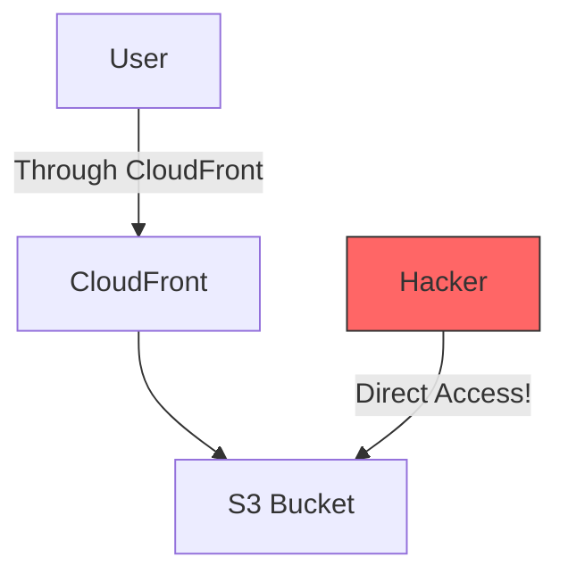
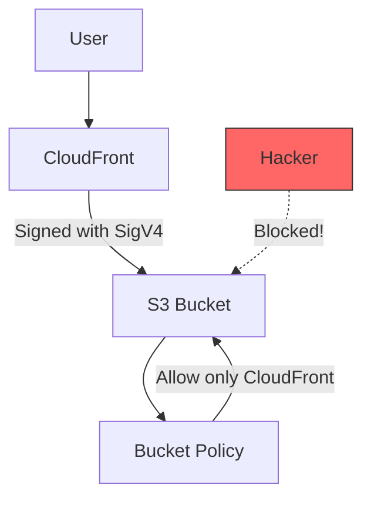
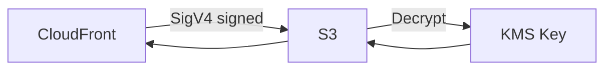

# Origin Access Control

## The Security Problem

Without proper access control, users can bypass CloudFront and access S3 directly:



This bypasses:
- Signed URL/Cookie requirements
- Caching (costs money!)
- WAF rules
- Logging/analytics

## Origin Access Control (OAC)

OAC is the modern way to restrict S3 access to CloudFront only:



## OAC vs OAI (Legacy)

```python
comparison = {
    "OAC (Recommended)": {
        "signing": "AWS Signature Version 4 (SigV4)",
        "features": [
            "SSE-KMS encryption support",
            "All AWS Regions including new ones",
            "Dynamic content support"
        ],
        "status": "Current"
    },
    "OAI (Legacy)": {
        "signing": "Custom CloudFront signing",
        "features": [
            "No SSE-KMS support",
            "Limited regions",
            "Basic S3 access"
        ],
        "status": "Deprecated for new distributions"
    }
}
```

## Creating OAC

### Step 1: Create Origin Access Control

```bash
aws cloudfront create-origin-access-control \
    --origin-access-control-config '{
        "Name": "PetTracker-OAC",
        "Description": "OAC for PetTracker S3 buckets",
        "SigningProtocol": "sigv4",
        "SigningBehavior": "always",
        "OriginAccessControlOriginType": "s3"
    }'
```

Response:
```json
{
    "OriginAccessControl": {
        "Id": "E1234OACEXAMPLE",
        "Name": "PetTracker-OAC"
    }
}
```

### Step 2: Update Distribution

```bash
aws cloudfront update-distribution \
    --id E1234DISTEXAMPLE \
    --distribution-config '{
        "Origins": {
            "Items": [{
                "Id": "S3-pettracker-images",
                "DomainName": "pettracker-images.s3.us-east-1.amazonaws.com",
                "OriginAccessControlId": "E1234OACEXAMPLE",
                "S3OriginConfig": {
                    "OriginAccessIdentity": ""
                }
            }]
        }
    }'
```

### Step 3: Update S3 Bucket Policy

```json
{
    "Version": "2012-10-17",
    "Statement": [
        {
            "Sid": "AllowCloudFrontServicePrincipal",
            "Effect": "Allow",
            "Principal": {
                "Service": "cloudfront.amazonaws.com"
            },
            "Action": "s3:GetObject",
            "Resource": "arn:aws:s3:::pettracker-images/*",
            "Condition": {
                "StringEquals": {
                    "AWS:SourceArn": "arn:aws:cloudfront::123456789012:distribution/E1234DISTEXAMPLE"
                }
            }
        }
    ]
}
```

```bash
aws s3api put-bucket-policy \
    --bucket pettracker-images \
    --policy file://bucket-policy.json
```

## Signing Behaviors

```python
signing_behaviors = {
    "always": {
        "description": "Always sign requests to origin",
        "use_case": "Private buckets (recommended)",
        "security": "Highest"
    },
    "never": {
        "description": "Never sign requests",
        "use_case": "Public buckets",
        "security": "Low"
    },
    "no-override": {
        "description": "Sign unless viewer provides auth",
        "use_case": "Mixed public/private content",
        "security": "Medium"
    }
}
```

## SSE-KMS Support with OAC

OAC supports S3 objects encrypted with KMS:



### KMS Key Policy

```json
{
    "Version": "2012-10-17",
    "Statement": [
        {
            "Sid": "AllowCloudFrontToDecrypt",
            "Effect": "Allow",
            "Principal": {
                "Service": "cloudfront.amazonaws.com"
            },
            "Action": [
                "kms:Decrypt",
                "kms:GenerateDataKey*"
            ],
            "Resource": "*",
            "Condition": {
                "StringEquals": {
                    "AWS:SourceArn": "arn:aws:cloudfront::123456789012:distribution/E1234EXAMPLE"
                }
            }
        }
    ]
}
```

## Complete OAC Setup with CloudFormation

```yaml
AWSTemplateFormatVersion: '2010-09-09'
Description: CloudFront with OAC

Resources:
  # S3 Bucket
  ImageBucket:
    Type: AWS::S3::Bucket
    Properties:
      BucketName: pettracker-images-prod
      PublicAccessBlockConfiguration:
        BlockPublicAcls: true
        BlockPublicPolicy: true
        IgnorePublicAcls: true
        RestrictPublicBuckets: true

  # Bucket Policy allowing only CloudFront
  ImageBucketPolicy:
    Type: AWS::S3::BucketPolicy
    Properties:
      Bucket: !Ref ImageBucket
      PolicyDocument:
        Statement:
          - Sid: AllowCloudFrontOAC
            Effect: Allow
            Principal:
              Service: cloudfront.amazonaws.com
            Action: s3:GetObject
            Resource: !Sub ${ImageBucket.Arn}/*
            Condition:
              StringEquals:
                AWS:SourceArn: !Sub arn:aws:cloudfront::${AWS::AccountId}:distribution/${ImageDistribution}

  # Origin Access Control
  CloudFrontOAC:
    Type: AWS::CloudFront::OriginAccessControl
    Properties:
      OriginAccessControlConfig:
        Name: PetTrackerOAC
        OriginAccessControlOriginType: s3
        SigningBehavior: always
        SigningProtocol: sigv4

  # CloudFront Distribution
  ImageDistribution:
    Type: AWS::CloudFront::Distribution
    Properties:
      DistributionConfig:
        Enabled: true
        Origins:
          - Id: S3Origin
            DomainName: !GetAtt ImageBucket.RegionalDomainName
            OriginAccessControlId: !GetAtt CloudFrontOAC.Id
            S3OriginConfig:
              OriginAccessIdentity: ''
        DefaultCacheBehavior:
          TargetOriginId: S3Origin
          ViewerProtocolPolicy: redirect-to-https
          CachePolicyId: 658327ea-f89d-4fab-a63d-7e88639e58f6
          AllowedMethods:
            - GET
            - HEAD
          Compress: true

Outputs:
  DistributionDomain:
    Value: !GetAtt ImageDistribution.DomainName
  BucketName:
    Value: !Ref ImageBucket
```

## Migrating from OAI to OAC

```python
migration_steps = [
    "1. Create OAC (doesn't affect existing distribution)",
    "2. Update distribution to use OAC",
    "3. Update bucket policy for CloudFront service principal",
    "4. Test thoroughly",
    "5. Remove old OAI from distribution",
    "6. Delete OAI (optional cleanup)"
]
```

```bash
# Step 1: Create OAC
aws cloudfront create-origin-access-control --origin-access-control-config '{
    "Name": "Migration-OAC",
    "SigningProtocol": "sigv4",
    "SigningBehavior": "always",
    "OriginAccessControlOriginType": "s3"
}'

# Step 2: Update distribution (get current config first)
aws cloudfront get-distribution-config --id E1234EXAMPLE > config.json
# Edit config.json to add OAC and remove OAI
aws cloudfront update-distribution --id E1234EXAMPLE --distribution-config file://config.json

# Step 3: Update bucket policy (keep both OAI and OAC during migration)
# After testing, remove OAI permissions
```

## Alex's OAC Implementation

```python
# infrastructure/cloudfront_oac.py
import boto3

class CloudFrontOACSetup:
    def __init__(self):
        self.cf = boto3.client('cloudfront')
        self.s3 = boto3.client('s3')

    def setup_oac(self, bucket_name, distribution_id, account_id):
        """
        Complete OAC setup for S3 bucket with CloudFront
        """
        # Create OAC
        oac_response = self.cf.create_origin_access_control(
            OriginAccessControlConfig={
                'Name': f'{bucket_name}-oac',
                'SigningProtocol': 'sigv4',
                'SigningBehavior': 'always',
                'OriginAccessControlOriginType': 's3'
            }
        )
        oac_id = oac_response['OriginAccessControl']['Id']

        # Update bucket policy
        bucket_policy = {
            "Version": "2012-10-17",
            "Statement": [{
                "Sid": "AllowCloudFrontOAC",
                "Effect": "Allow",
                "Principal": {"Service": "cloudfront.amazonaws.com"},
                "Action": "s3:GetObject",
                "Resource": f"arn:aws:s3:::{bucket_name}/*",
                "Condition": {
                    "StringEquals": {
                        "AWS:SourceArn": f"arn:aws:cloudfront::{account_id}:distribution/{distribution_id}"
                    }
                }
            }]
        }

        self.s3.put_bucket_policy(
            Bucket=bucket_name,
            Policy=json.dumps(bucket_policy)
        )

        # Block public access
        self.s3.put_public_access_block(
            Bucket=bucket_name,
            PublicAccessBlockConfiguration={
                'BlockPublicAcls': True,
                'IgnorePublicAcls': True,
                'BlockPublicPolicy': True,
                'RestrictPublicBuckets': True
            }
        )

        return oac_id


# Usage
setup = CloudFrontOACSetup()
oac_id = setup.setup_oac(
    bucket_name='pettracker-images-prod',
    distribution_id='E1234EXAMPLE',
    account_id='123456789012'
)
print(f"OAC created: {oac_id}")
```

## Testing OAC

```bash
# Test 1: Direct S3 access should fail
curl https://pettracker-images.s3.amazonaws.com/images/test.jpg
# Expected: 403 Forbidden

# Test 2: CloudFront access should work
curl https://d1234example.cloudfront.net/images/test.jpg
# Expected: 200 OK + content
```

## Exam Tips

**For DVA-C02:**

1. **OAC is recommended** over OAI for new distributions
2. **OAC uses SigV4** signing
3. **OAC supports SSE-KMS** (OAI does not)
4. **Bucket policy** must allow CloudFront service principal
5. **Block public access** on S3 bucket

**Common scenarios:**

> "S3 bucket accessible only via CloudFront..."
> → OAC with bucket policy

> "KMS-encrypted S3 objects via CloudFront..."
> → OAC (OAI doesn't support KMS)

> "Prevent hotlinking and direct S3 access..."
> → OAC + block public access

## Key Takeaways

1. **OAC is the modern replacement** for OAI
2. **SigV4 signing** provides better security
3. **SSE-KMS support** with OAC
4. **Bucket policy** restricts to CloudFront only
5. **Block public access** on S3 bucket
6. **Test both paths** - CloudFront and direct

---

*Next: Lambda@Edge and CloudFront Functions for edge computing.*

---
*v2.0*
