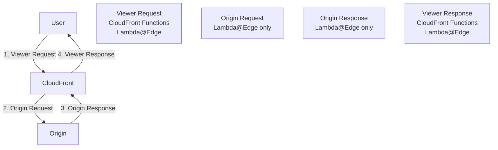

# Lambda@Edge and CloudFront Functions

## Edge Computing Overview

Run code at CloudFront edge locations to customize content delivery:

```mermaid
graph LR
    User[User] --> Edge[Edge Location]
    Edge --> Lambda[Lambda@Edge]
    Lambda --> Decision{Route?}
    Decision -->|"Modified Request"| Origin[Origin]
    Decision -->|"Generate Response"| User
```

## Lambda@Edge vs CloudFront Functions

```python
comparison = {
    "CloudFront Functions": {
        "runtime": "JavaScript (ECMAScript 5.1)",
        "execution_time": "< 1ms",
        "memory": "2 MB",
        "package_size": "10 KB",
        "triggers": ["Viewer Request", "Viewer Response"],
        "network_access": False,
        "cost": "$0.10 per million invocations",
        "use_cases": [
            "Header manipulation",
            "URL rewrites/redirects",
            "Cache key normalization",
            "Request validation"
        ]
    },
    "Lambda@Edge": {
        "runtime": "Node.js, Python",
        "execution_time": "5-30 seconds",
        "memory": "128-3008 MB",
        "package_size": "50 MB",
        "triggers": ["All 4 event types"],
        "network_access": True,
        "cost": "$0.60 per million + duration",
        "use_cases": [
            "A/B testing",
            "Authentication",
            "Dynamic content generation",
            "Image transformation"
        ]
    }
}
```

## Event Types



| Event | When | Use Cases |
|-------|------|-----------|
| Viewer Request | Before cache check | Auth, URL rewrite, cache key |
| Origin Request | Before origin fetch (cache miss) | Add headers, route to origin |
| Origin Response | After origin response | Add headers, transform response |
| Viewer Response | Before sending to viewer | Add security headers |

## CloudFront Functions

### Creating a Function

```bash
# Create function
aws cloudfront create-function \
    --name add-security-headers \
    --function-config '{
        "Comment": "Add security headers",
        "Runtime": "cloudfront-js-1.0"
    }' \
    --function-code fileb://function.js
```

### Security Headers Function

```javascript
// add-security-headers.js
function handler(event) {
    var response = event.response;
    var headers = response.headers;

    // Security headers
    headers['strict-transport-security'] = {
        value: 'max-age=31536000; includeSubdomains; preload'
    };
    headers['x-content-type-options'] = {
        value: 'nosniff'
    };
    headers['x-frame-options'] = {
        value: 'DENY'
    };
    headers['x-xss-protection'] = {
        value: '1; mode=block'
    };
    headers['content-security-policy'] = {
        value: "default-src 'self'; img-src 'self' https://images.pettracker.com"
    };

    return response;
}
```

### URL Rewrite Function

```javascript
// url-rewrite.js
function handler(event) {
    var request = event.request;
    var uri = request.uri;

    // SPA routing: serve index.html for client-side routes
    if (uri.endsWith('/') || !uri.includes('.')) {
        request.uri = '/index.html';
    }

    // Normalize image paths
    if (uri.startsWith('/images/')) {
        // /images/pet.jpg -> /images/pet.jpg
        // /images/pet.JPG -> /images/pet.jpg (lowercase)
        request.uri = uri.toLowerCase();
    }

    return request;
}
```

### Cache Key Normalization

```javascript
// normalize-cache-key.js
function handler(event) {
    var request = event.request;
    var qs = request.querystring;

    // Remove tracking parameters from cache key
    delete qs.utm_source;
    delete qs.utm_medium;
    delete qs.utm_campaign;
    delete qs.fbclid;
    delete qs.gclid;

    // Normalize size parameter
    if (qs.size) {
        qs.size.value = qs.size.value.toLowerCase();
    }

    return request;
}
```

### Deploy and Associate

```bash
# Test function
aws cloudfront test-function \
    --name add-security-headers \
    --if-match ETVPDKIKX0DER \
    --event-object fileb://test-event.json

# Publish
aws cloudfront publish-function \
    --name add-security-headers \
    --if-match ETVPDKIKX0DER

# Associate with distribution
aws cloudfront update-distribution \
    --id E1234EXAMPLE \
    --distribution-config '{
        "DefaultCacheBehavior": {
            "FunctionAssociations": {
                "Quantity": 1,
                "Items": [{
                    "EventType": "viewer-response",
                    "FunctionARN": "arn:aws:cloudfront::123456789012:function/add-security-headers"
                }]
            }
        }
    }'
```

## Lambda@Edge

### Creating Lambda@Edge Function

Lambda@Edge must be in **us-east-1**:

```bash
# Create function in us-east-1
aws lambda create-function \
    --function-name image-resize \
    --runtime python3.9 \
    --handler index.handler \
    --role arn:aws:iam::123456789012:role/lambda-edge-role \
    --zip-file fileb://function.zip \
    --region us-east-1

# Publish version (required for Lambda@Edge)
aws lambda publish-version \
    --function-name image-resize \
    --region us-east-1
```

### A/B Testing Function

```python
# ab_test.py
import random

def handler(event, context):
    request = event['Records'][0]['cf']['request']

    # A/B test: 30% get new homepage
    if request['uri'] == '/':
        if random.random() < 0.3:
            request['uri'] = '/index-v2.html'

    return request
```

### Authentication Function

```python
# auth.py
import base64
import json

def handler(event, context):
    request = event['Records'][0]['cf']['request']
    headers = request['headers']

    # Check for auth token
    auth_header = headers.get('authorization', [{}])[0].get('value', '')

    if not auth_header.startswith('Bearer '):
        return {
            'status': '401',
            'statusDescription': 'Unauthorized',
            'body': 'Missing or invalid authorization token'
        }

    token = auth_header[7:]  # Remove 'Bearer '

    try:
        # Validate token (simplified - use proper JWT validation)
        payload = json.loads(base64.b64decode(token.split('.')[1] + '=='))

        # Check expiration
        import time
        if payload.get('exp', 0) < time.time():
            return {
                'status': '401',
                'statusDescription': 'Unauthorized',
                'body': 'Token expired'
            }

        # Add user ID to request headers for origin
        request['headers']['x-user-id'] = [{'value': payload.get('sub', '')}]

    except Exception as e:
        return {
            'status': '401',
            'statusDescription': 'Unauthorized',
            'body': f'Invalid token: {str(e)}'
        }

    return request
```

### Image Resize Function

```python
# resize.py
import boto3
from PIL import Image
import io
import base64

def handler(event, context):
    request = event['Records'][0]['cf']['request']
    uri = request['uri']
    params = request.get('querystring', '')

    # Parse size parameter
    size = None
    for param in params.split('&'):
        if param.startswith('size='):
            size = param.split('=')[1]

    if not size or not uri.startswith('/images/'):
        return request

    # Check for cached resized version
    resized_uri = f"/resized/{size}{uri}"
    request['uri'] = resized_uri

    # Origin will return 404 if not cached, which triggers another Lambda
    # Or use origin response to generate on-the-fly

    return request


def origin_response_handler(event, context):
    response = event['Records'][0]['cf']['response']
    request = event['Records'][0]['cf']['request']

    # If resized image not found, generate it
    if response['status'] == '404' and '/resized/' in request['uri']:
        # Fetch original, resize, return
        # (Simplified - full implementation would be more complex)
        pass

    return response
```

### Associate Lambda@Edge

```json
{
    "DefaultCacheBehavior": {
        "LambdaFunctionAssociations": {
            "Quantity": 2,
            "Items": [
                {
                    "EventType": "viewer-request",
                    "LambdaFunctionARN": "arn:aws:lambda:us-east-1:123456789012:function:auth:1",
                    "IncludeBody": false
                },
                {
                    "EventType": "origin-request",
                    "LambdaFunctionARN": "arn:aws:lambda:us-east-1:123456789012:function:image-resize:1",
                    "IncludeBody": false
                }
            ]
        }
    }
}
```

## Alex's Edge Functions

```python
# Alex implements CloudFront Functions for PetTracker

# 1. Security headers (viewer-response)
security_headers_cf_function = """
function handler(event) {
    var response = event.response;
    response.headers['strict-transport-security'] = {value: 'max-age=31536000'};
    response.headers['x-content-type-options'] = {value: 'nosniff'};
    return response;
}
"""

# 2. SPA routing (viewer-request)
spa_routing_cf_function = """
function handler(event) {
    var request = event.request;
    var uri = request.uri;

    // Client-side routes
    if (!uri.includes('.') && !uri.startsWith('/api/')) {
        request.uri = '/index.html';
    }

    return request;
}
"""

# 3. Authentication (Lambda@Edge - viewer-request)
# For private pet photos, validate JWT token
# Returns 401 if invalid, passes request if valid
```

## Debugging Edge Functions

```bash
# CloudFront Functions - test before deploy
aws cloudfront test-function \
    --name my-function \
    --if-match E2QWRUHEXAMPLE \
    --event-object '{
        "version": "1.0",
        "context": {"eventType": "viewer-request"},
        "viewer": {"ip": "1.2.3.4"},
        "request": {
            "method": "GET",
            "uri": "/test",
            "querystring": {"size": {"value": "large"}},
            "headers": {}
        }
    }'

# Lambda@Edge - use CloudWatch Logs
# Logs appear in the region closest to the edge location
# Check multiple regions!
```

## Exam Tips

**For DVA-C02:**

1. **CloudFront Functions**: Fast, cheap, viewer-only events
2. **Lambda@Edge**: More powerful, all 4 events, network access
3. **Lambda@Edge must be in us-east-1**
4. **Must publish Lambda version** for Lambda@Edge
5. **CloudFront Functions**: No network access, <1ms

**Common scenarios:**

> "Add security headers to all responses..."
> → CloudFront Functions (viewer-response)

> "A/B testing at edge..."
> → Lambda@Edge (viewer-request)

> "Authenticate requests before origin..."
> → Lambda@Edge (viewer-request)

## Key Takeaways

1. **CloudFront Functions** for simple, fast operations
2. **Lambda@Edge** for complex processing
3. **Lambda@Edge in us-east-1** only
4. **Four event types** at different stages
5. **Test thoroughly** - edge errors affect all users
6. **Monitor** in multiple regions

---

*Next: Monitoring and optimizing CloudFront performance.*
