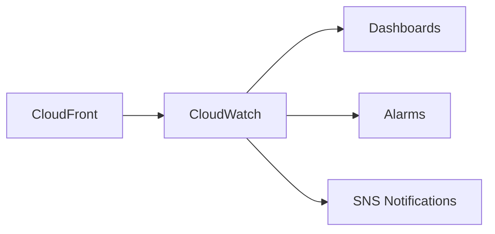
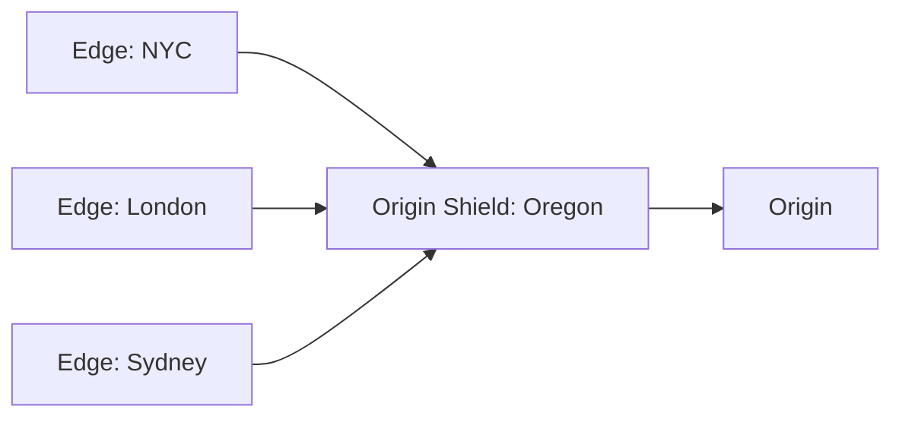

# Monitoring and Optimization

## CloudFront Metrics

CloudFront publishes metrics to CloudWatch:



### Key Metrics

```python
cloudfront_metrics = {
    "Requests": {
        "description": "Total number of requests",
        "unit": "Count",
        "use": "Traffic volume"
    },
    "BytesDownloaded": {
        "description": "Data transferred to viewers",
        "unit": "Bytes",
        "use": "Bandwidth usage"
    },
    "BytesUploaded": {
        "description": "Data transferred from viewers",
        "unit": "Bytes",
        "use": "Upload tracking"
    },
    "TotalErrorRate": {
        "description": "Percentage of all errors (4xx + 5xx)",
        "unit": "Percent",
        "use": "Overall health"
    },
    "4xxErrorRate": {
        "description": "Percentage of 4xx errors",
        "unit": "Percent",
        "use": "Client error tracking"
    },
    "5xxErrorRate": {
        "description": "Percentage of 5xx errors",
        "unit": "Percent",
        "use": "Origin health"
    },
    "CacheHitRate": {
        "description": "Percentage served from cache",
        "unit": "Percent",
        "use": "Cache effectiveness"
    }
}
```

### Viewing Metrics

```bash
# Get cache hit rate
aws cloudwatch get-metric-statistics \
    --namespace AWS/CloudFront \
    --metric-name CacheHitRate \
    --dimensions Name=DistributionId,Value=E1234EXAMPLE Name=Region,Value=Global \
    --start-time 2024-01-14T00:00:00Z \
    --end-time 2024-01-15T00:00:00Z \
    --period 3600 \
    --statistics Average

# Get total requests
aws cloudwatch get-metric-statistics \
    --namespace AWS/CloudFront \
    --metric-name Requests \
    --dimensions Name=DistributionId,Value=E1234EXAMPLE Name=Region,Value=Global \
    --start-time 2024-01-14T00:00:00Z \
    --end-time 2024-01-15T00:00:00Z \
    --period 3600 \
    --statistics Sum
```

## CloudWatch Alarms

```python
# Create alarm for high error rate
import boto3

cloudwatch = boto3.client('cloudwatch')

cloudwatch.put_metric_alarm(
    AlarmName='CloudFront-HighErrorRate',
    MetricName='5xxErrorRate',
    Namespace='AWS/CloudFront',
    Dimensions=[
        {'Name': 'DistributionId', 'Value': 'E1234EXAMPLE'},
        {'Name': 'Region', 'Value': 'Global'}
    ],
    Statistic='Average',
    Period=300,
    EvaluationPeriods=2,
    Threshold=5.0,  # 5% error rate
    ComparisonOperator='GreaterThanThreshold',
    AlarmActions=['arn:aws:sns:us-east-1:123456789012:alerts']
)

# Alarm for low cache hit rate
cloudwatch.put_metric_alarm(
    AlarmName='CloudFront-LowCacheHitRate',
    MetricName='CacheHitRate',
    Namespace='AWS/CloudFront',
    Dimensions=[
        {'Name': 'DistributionId', 'Value': 'E1234EXAMPLE'},
        {'Name': 'Region', 'Value': 'Global'}
    ],
    Statistic='Average',
    Period=3600,
    EvaluationPeriods=1,
    Threshold=70.0,  # Below 70%
    ComparisonOperator='LessThanThreshold',
    AlarmActions=['arn:aws:sns:us-east-1:123456789012:alerts']
)
```

## Access Logs

Enable detailed logging for analysis:

```json
{
    "DistributionConfig": {
        "Logging": {
            "Enabled": true,
            "IncludeCookies": false,
            "Bucket": "pettracker-logs.s3.amazonaws.com",
            "Prefix": "cloudfront/"
        }
    }
}
```

### Log Format

```
# Sample log entry
2024-01-15 10:30:00 SFO5 1234 73.34.42.xxx GET d1234.cloudfront.net /images/pet.jpg 200 - Mozilla/5.0 - - Hit - E1234EXAMPLE https 234 0.001 - TLSv1.2 ECDHE-RSA-AES128-GCM-SHA256 Hit text/html 1234 - -
```

```python
log_fields = [
    "date",                 # 2024-01-15
    "time",                 # 10:30:00
    "x-edge-location",      # SFO5
    "sc-bytes",             # 1234
    "c-ip",                 # 73.34.42.xxx
    "cs-method",            # GET
    "cs-host",              # d1234.cloudfront.net
    "cs-uri-stem",          # /images/pet.jpg
    "sc-status",            # 200
    "cs-referer",           # -
    "cs-user-agent",        # Mozilla/5.0
    "cs-uri-query",         # -
    "cs-cookie",            # -
    "x-edge-result-type",   # Hit
    "x-edge-request-id",    # E1234EXAMPLE
    "x-host-header",        # images.pettracker.com
    "cs-protocol",          # https
    "cs-bytes",             # 234
    "time-taken",           # 0.001
    "x-forwarded-for",      # -
    "ssl-protocol",         # TLSv1.2
    "ssl-cipher",           # ECDHE-RSA-AES128-GCM-SHA256
    "x-edge-response-result-type",  # Hit
    "cs-protocol-version",  # HTTP/2.0
]
```

### Analyze with Athena

```sql
-- Create table for CloudFront logs
CREATE EXTERNAL TABLE cloudfront_logs (
    `date` DATE,
    time STRING,
    location STRING,
    bytes BIGINT,
    request_ip STRING,
    method STRING,
    host STRING,
    uri STRING,
    status INT,
    referrer STRING,
    user_agent STRING,
    query_string STRING,
    cookie STRING,
    result_type STRING,
    request_id STRING,
    host_header STRING,
    protocol STRING,
    request_bytes BIGINT,
    time_taken FLOAT,
    forwarded_for STRING,
    ssl_protocol STRING,
    ssl_cipher STRING,
    response_result STRING,
    http_version STRING
)
ROW FORMAT DELIMITED
FIELDS TERMINATED BY '\t'
LOCATION 's3://pettracker-logs/cloudfront/';

-- Query cache hit rate by path
SELECT
    uri,
    COUNT(*) as requests,
    SUM(CASE WHEN result_type = 'Hit' THEN 1 ELSE 0 END) * 100.0 / COUNT(*) as hit_rate
FROM cloudfront_logs
WHERE date = DATE '2024-01-15'
GROUP BY uri
ORDER BY requests DESC
LIMIT 20;

-- Find slow requests
SELECT uri, time_taken, status, location
FROM cloudfront_logs
WHERE time_taken > 1.0
ORDER BY time_taken DESC
LIMIT 100;
```

## Real-Time Logs

For immediate analysis:

```json
{
    "Name": "PetTrackerRealtimeLogs",
    "SamplingRate": 100,
    "Fields": [
        "timestamp",
        "c-ip",
        "cs-uri-stem",
        "sc-status",
        "x-edge-result-type",
        "time-taken"
    ],
    "EndPoints": [{
        "StreamType": "Kinesis",
        "KinesisStreamConfig": {
            "RoleARN": "arn:aws:iam::123456789012:role/cloudfront-kinesis",
            "StreamARN": "arn:aws:kinesis:us-east-1:123456789012:stream/cloudfront-realtime"
        }
    }]
}
```

## Performance Optimization

### 1. Cache Hit Ratio

```python
# Target: > 80% cache hit ratio

optimization_strategies = {
    "increase_ttl": {
        "description": "Longer cache time",
        "impact": "Higher hit ratio",
        "tradeoff": "Stale content"
    },
    "reduce_cache_key": {
        "description": "Remove unnecessary query strings/headers",
        "impact": "More cache hits",
        "tradeoff": "May return wrong content"
    },
    "versioned_urls": {
        "description": "Version in filename, not query string",
        "impact": "Better caching",
        "tradeoff": "Build complexity"
    }
}
```

### 2. Compression

```json
{
    "DefaultCacheBehavior": {
        "Compress": true,
        "CachePolicyId": "658327ea-f89d-4fab-a63d-7e88639e58f6"
    }
}
```

Compression reduces transfer:
- HTML: 60-80% smaller
- JavaScript: 60-70% smaller
- CSS: 60-70% smaller

### 3. HTTP/2 and HTTP/3

```json
{
    "DistributionConfig": {
        "HttpVersion": "http2and3"
    }
}
```

Benefits:
- Multiplexing (parallel requests)
- Header compression
- Server push (HTTP/2)
- Faster connection (HTTP/3 QUIC)

### 4. Origin Shield

Add an extra caching layer:



```json
{
    "Origins": {
        "Items": [{
            "OriginShield": {
                "Enabled": true,
                "OriginShieldRegion": "us-west-2"
            }
        }]
    }
}
```

Benefits:
- Reduces origin load
- Better cache hit ratio
- Lower origin costs

## Alex's Monitoring Dashboard

```python
# CloudFormation for monitoring dashboard
monitoring_dashboard = {
    "DashboardName": "PetTracker-CloudFront",
    "DashboardBody": {
        "widgets": [
            {
                "type": "metric",
                "properties": {
                    "title": "Cache Hit Rate",
                    "metrics": [
                        ["AWS/CloudFront", "CacheHitRate", "DistributionId", "E1234EXAMPLE"]
                    ],
                    "period": 300
                }
            },
            {
                "type": "metric",
                "properties": {
                    "title": "Requests & Errors",
                    "metrics": [
                        ["AWS/CloudFront", "Requests", "DistributionId", "E1234EXAMPLE"],
                        [".", "4xxErrorRate", ".", "."],
                        [".", "5xxErrorRate", ".", "."]
                    ],
                    "period": 300
                }
            },
            {
                "type": "metric",
                "properties": {
                    "title": "Data Transfer",
                    "metrics": [
                        ["AWS/CloudFront", "BytesDownloaded", "DistributionId", "E1234EXAMPLE"]
                    ],
                    "period": 3600
                }
            }
        ]
    }
}
```

## Cost Optimization

```python
cost_optimization = {
    "price_class": {
        "action": "Use PriceClass_100 for US/EU only",
        "savings": "20-30%"
    },
    "caching": {
        "action": "Increase cache hit ratio",
        "savings": "Reduce origin requests"
    },
    "compression": {
        "action": "Enable compression",
        "savings": "60-80% on transfer"
    },
    "invalidation": {
        "action": "Use versioned URLs instead",
        "savings": "Avoid invalidation costs"
    },
    "reserved_capacity": {
        "action": "CloudFront Security Savings Bundle",
        "savings": "Up to 30%"
    }
}
```

## Exam Tips

**For DVA-C02:**

1. **CloudWatch metrics** for monitoring
2. **Access logs** to S3 for detailed analysis
3. **Real-time logs** to Kinesis for immediate processing
4. **CacheHitRate** is key performance metric
5. **Origin Shield** reduces origin load

**Common scenarios:**

> "Monitor cache efficiency..."
> → Check CacheHitRate metric

> "Analyze request patterns..."
> → Enable access logs, query with Athena

> "Reduce origin requests..."
> → Enable Origin Shield

## Key Takeaways

1. **Monitor cache hit rate** - target >80%
2. **Enable compression** for text content
3. **Use HTTP/2 and HTTP/3**
4. **Origin Shield** for high-traffic distributions
5. **Analyze logs** to optimize caching
6. **Set alarms** for error rates

---

*Next: Alex's complete CloudFront solution for global pet photo delivery.*

---
*v1.0*
