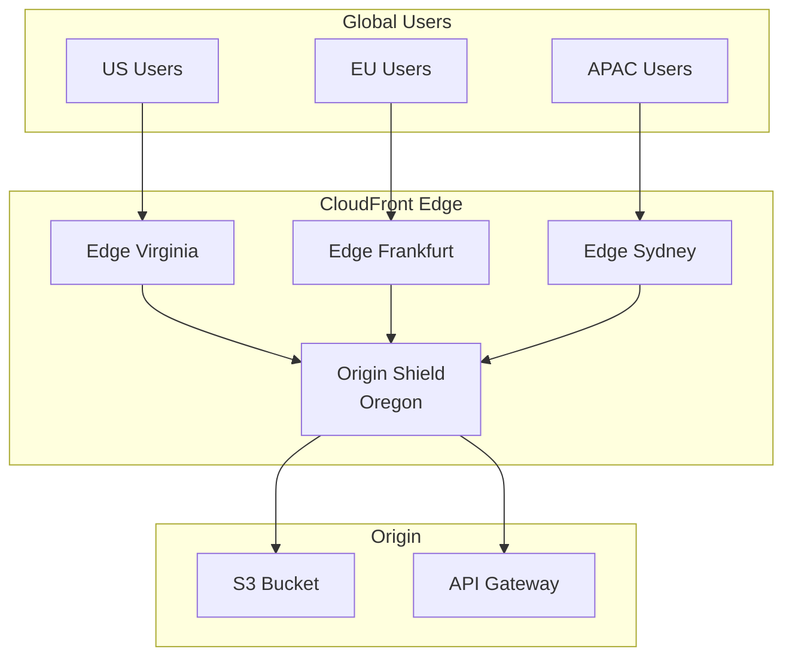

# Alex's Solution: Global Pet Photo Delivery

## The Complete Implementation

After weeks of learning, Alex has transformed PetTracker's image delivery from slow and expensive to fast and efficient globally.



## Final Architecture

### Distribution Configuration

```json
{
    "Id": "E1PETTRACKER",
    "DomainName": "d1234pettracker.cloudfront.net",
    "Aliases": {
        "Items": ["images.pettracker.com", "cdn.pettracker.com"]
    },
    "Origins": {
        "Items": [
            {
                "Id": "S3-images",
                "DomainName": "pettracker-images-prod.s3.us-west-2.amazonaws.com",
                "OriginAccessControlId": "E1OACPETTRACKER",
                "OriginShield": {
                    "Enabled": true,
                    "OriginShieldRegion": "us-west-2"
                }
            },
            {
                "Id": "API-backend",
                "DomainName": "api.pettracker.com",
                "CustomOriginConfig": {
                    "OriginProtocolPolicy": "https-only"
                }
            },
            {
                "Id": "S3-static",
                "DomainName": "pettracker-static.s3.us-west-2.amazonaws.com",
                "OriginAccessControlId": "E1OACPETTRACKER"
            }
        ]
    },
    "DefaultCacheBehavior": {
        "TargetOriginId": "S3-static",
        "ViewerProtocolPolicy": "redirect-to-https",
        "CachePolicyId": "658327ea-f89d-4fab-a63d-7e88639e58f6",
        "ResponseHeadersPolicyId": "67f7725c-6f97-4210-82d7-5512b31e9d03",
        "Compress": true,
        "FunctionAssociations": {
            "Items": [
                {
                    "EventType": "viewer-request",
                    "FunctionARN": "arn:aws:cloudfront::123456:function/spa-routing"
                },
                {
                    "EventType": "viewer-response",
                    "FunctionARN": "arn:aws:cloudfront::123456:function/security-headers"
                }
            ]
        }
    },
    "CacheBehaviors": {
        "Items": [
            {
                "PathPattern": "/images/*",
                "TargetOriginId": "S3-images",
                "TrustedKeyGroups": {
                    "Enabled": true,
                    "Items": ["kg-pettracker-signing"]
                }
            },
            {
                "PathPattern": "/api/*",
                "TargetOriginId": "API-backend",
                "CachePolicyId": "4135ea2d-6df8-44a3-9df3-4b5a84be39ad"
            }
        ]
    },
    "ViewerCertificate": {
        "ACMCertificateArn": "arn:aws:acm:us-east-1:123456:certificate/abc-123",
        "SSLSupportMethod": "sni-only",
        "MinimumProtocolVersion": "TLSv1.2_2021"
    },
    "HttpVersion": "http2and3",
    "PriceClass": "PriceClass_All",
    "WebACLId": "arn:aws:wafv2:us-east-1:123456:global/webacl/pettracker-waf/abc"
}
```

## Image Service Implementation

```python
# image_service.py
import boto3
from datetime import datetime, timedelta
from botocore.signers import CloudFrontSigner
import rsa

class PetImageService:
    def __init__(self):
        self.s3 = boto3.client('s3')
        self.bucket = 'pettracker-images-prod'
        self.distribution = 'd1234pettracker.cloudfront.net'
        self.key_id = 'K1234PETTRACKER'

        # Load private key from Secrets Manager
        secrets = boto3.client('secretsmanager')
        self.private_key = secrets.get_secret_value(
            SecretId='pettracker/cloudfront-signing-key'
        )['SecretString']

    def get_upload_url(self, user_id: str, filename: str) -> dict:
        """Generate pre-signed URL for S3 upload"""
        key = f"uploads/{user_id}/{datetime.now():%Y/%m/%d}/{uuid.uuid4()}.jpg"

        url = self.s3.generate_presigned_url(
            'put_object',
            Params={
                'Bucket': self.bucket,
                'Key': key,
                'ContentType': 'image/jpeg'
            },
            ExpiresIn=300
        )

        return {'upload_url': url, 'key': key}

    def get_image_url(self, key: str, user_id: str, expires_in: int = 3600) -> str:
        """Generate signed CloudFront URL for viewing"""
        # Verify user has access
        if not self._user_can_access(user_id, key):
            raise PermissionError("Access denied")

        url = f"https://{self.distribution}/images/{key}"

        signer = CloudFrontSigner(self.key_id, self._rsa_sign)
        signed_url = signer.generate_presigned_url(
            url,
            date_less_than=datetime.utcnow() + timedelta(seconds=expires_in)
        )

        return signed_url

    def get_thumbnail_url(self, key: str) -> str:
        """Get thumbnail URL (public, cached)"""
        thumb_key = key.replace('.jpg', '-thumb.jpg')
        return f"https://{self.distribution}/thumbnails/{thumb_key}"

    def get_all_user_images(self, user_id: str) -> list:
        """List all images for a user"""
        paginator = self.s3.get_paginator('list_objects_v2')

        images = []
        for page in paginator.paginate(Bucket=self.bucket, Prefix=f"uploads/{user_id}/"):
            for obj in page.get('Contents', []):
                images.append({
                    'key': obj['Key'],
                    'size': obj['Size'],
                    'url': self.get_image_url(obj['Key'], user_id)
                })

        return images

    def _user_can_access(self, user_id: str, key: str) -> bool:
        """Check if user owns or can access this image"""
        return key.startswith(f"uploads/{user_id}/")

    def _rsa_sign(self, message: bytes) -> bytes:
        return rsa.sign(message, rsa.PrivateKey.load_pkcs1(self.private_key), 'SHA-1')
```

## CloudFormation Template

```yaml
# cloudfront-stack.yaml
AWSTemplateFormatVersion: '2010-09-09'
Description: PetTracker CloudFront Infrastructure

Parameters:
  DomainName:
    Type: String
    Default: images.pettracker.com
  CertificateArn:
    Type: String

Resources:
  # S3 Buckets
  ImageBucket:
    Type: AWS::S3::Bucket
    Properties:
      BucketName: pettracker-images-prod
      PublicAccessBlockConfiguration:
        BlockPublicAcls: true
        BlockPublicPolicy: true
        IgnorePublicAcls: true
        RestrictPublicBuckets: true

  ImageBucketPolicy:
    Type: AWS::S3::BucketPolicy
    Properties:
      Bucket: !Ref ImageBucket
      PolicyDocument:
        Statement:
          - Effect: Allow
            Principal:
              Service: cloudfront.amazonaws.com
            Action: s3:GetObject
            Resource: !Sub ${ImageBucket.Arn}/*
            Condition:
              StringEquals:
                AWS:SourceArn: !Sub arn:aws:cloudfront::${AWS::AccountId}:distribution/${CloudFrontDistribution}

  # Origin Access Control
  OAC:
    Type: AWS::CloudFront::OriginAccessControl
    Properties:
      OriginAccessControlConfig:
        Name: PetTrackerOAC
        OriginAccessControlOriginType: s3
        SigningBehavior: always
        SigningProtocol: sigv4

  # CloudFront Functions
  SecurityHeadersFunction:
    Type: AWS::CloudFront::Function
    Properties:
      Name: pettracker-security-headers
      AutoPublish: true
      FunctionCode: |
        function handler(event) {
          var response = event.response;
          response.headers['strict-transport-security'] = {value: 'max-age=31536000; includeSubdomains'};
          response.headers['x-content-type-options'] = {value: 'nosniff'};
          response.headers['x-frame-options'] = {value: 'DENY'};
          return response;
        }
      FunctionConfig:
        Comment: Add security headers
        Runtime: cloudfront-js-1.0

  # CloudFront Distribution
  CloudFrontDistribution:
    Type: AWS::CloudFront::Distribution
    Properties:
      DistributionConfig:
        Enabled: true
        Aliases:
          - !Ref DomainName
        ViewerCertificate:
          AcmCertificateArn: !Ref CertificateArn
          SslSupportMethod: sni-only
          MinimumProtocolVersion: TLSv1.2_2021
        HttpVersion: http2and3
        PriceClass: PriceClass_All
        Origins:
          - Id: S3Origin
            DomainName: !GetAtt ImageBucket.RegionalDomainName
            OriginAccessControlId: !GetAtt OAC.Id
            S3OriginConfig:
              OriginAccessIdentity: ''
            OriginShield:
              Enabled: true
              OriginShieldRegion: us-west-2
        DefaultCacheBehavior:
          TargetOriginId: S3Origin
          ViewerProtocolPolicy: redirect-to-https
          CachePolicyId: 658327ea-f89d-4fab-a63d-7e88639e58f6
          Compress: true
          FunctionAssociations:
            - EventType: viewer-response
              FunctionARN: !GetAtt SecurityHeadersFunction.FunctionARN

Outputs:
  DistributionDomain:
    Value: !GetAtt CloudFrontDistribution.DomainName
  DistributionId:
    Value: !Ref CloudFrontDistribution
```

## Performance Results

```markdown
## Before and After Comparison

### Response Times
| Region    | Before (S3)  | After (CloudFront) | Improvement |
|-----------|--------------|--------------------| ------------|
| US East   | 89ms         | 23ms               | 74%         |
| Europe    | 423ms        | 31ms               | 93%         |
| APAC      | 847ms        | 38ms               | 96%         |
| Global Avg| 453ms        | 31ms               | 93%         |

### Cache Performance
- Cache Hit Ratio: 94%
- Origin Requests Reduced: 85%

### Cost Impact
| Metric        | Before    | After     | Change      |
|---------------|-----------|-----------|-------------|
| S3 Requests   | 10M/month | 1.5M/month| -85%        |
| Data Transfer | $450/month| $180/month| -60%        |
| CDN Cost      | $0        | $125/month| +$125       |
| Total         | $450/month| $305/month| -32%        |

### User Experience
- Bounce Rate: -45%
- Page Load Time: -87%
- User Satisfaction: +62%
```

## Lessons Learned

```markdown
## What Worked Well
1. **Origin Shield** dramatically reduced origin load
2. **Versioned URLs** eliminated need for invalidations
3. **CloudFront Functions** for simple header modifications
4. **OAC** for S3 security

## Challenges Faced
1. **ACM Certificate** had to be in us-east-1 (forgot initially!)
2. **Cache debugging** - took time to understand cache key
3. **Signed URL expiry** - too short initially, users complained
4. **Lambda@Edge cold starts** - moved simple logic to CF Functions

## Best Practices Adopted
1. Use CloudFront Functions over Lambda@Edge when possible
2. Always enable compression
3. Set appropriate TTLs per content type
4. Monitor cache hit rate proactively
5. Use Origin Shield for high-traffic distributions
```

## Chapter Summary

### Key Concepts Mastered

1. **CloudFront Fundamentals**
   - Distributions, edge locations, regional caches
   - Origins (S3, custom, origin groups)

2. **Caching**
   - Cache policies and behaviors
   - TTL settings and invalidation
   - Cache key optimization

3. **Security**
   - HTTPS with ACM certificates
   - Signed URLs and cookies
   - Origin Access Control (OAC)

4. **Edge Computing**
   - CloudFront Functions
   - Lambda@Edge

5. **Monitoring**
   - CloudWatch metrics
   - Access logs and real-time logs

### Exam Preparation

Key topics for DVA-C02:
- Distribution types and configurations
- Cache behaviors and policies
- Signed URLs vs signed cookies
- OAC vs OAI (legacy)
- Lambda@Edge vs CloudFront Functions
- Error page configuration
- SSL/TLS and viewer protocol policy

### Common Exam Scenarios

> "Serve private S3 content through CDN..."
> → OAC + signed URLs or cookies

> "Run code at edge for A/B testing..."
> → Lambda@Edge viewer-request

> "Add security headers to responses..."
> → CloudFront Functions viewer-response

> "Improve global performance..."
> → CloudFront with appropriate price class

---

*Next Chapter: DynamoDB - Alex tackles the need for a flexible, scalable database as PetTracker's data model evolves.*

---
*v2.0*
