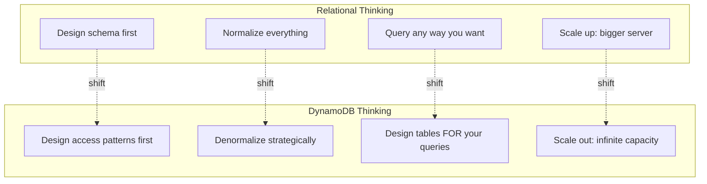
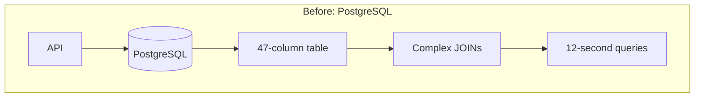
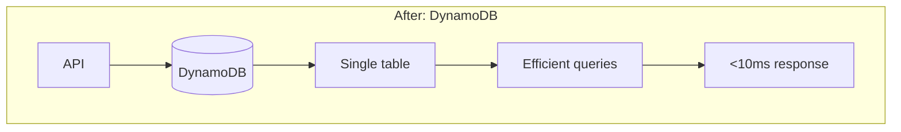

# DynamoDB: The Database That Thinks Differently

## The Day the Database Said "No More"

It was 3 AM when Alex got the page. PostgreSQL was choking.

"CPU at 98%," Alex muttered, watching the metrics. "Query time... 12 seconds. That can't be right."

It was right. PetTracker had grown from dogs and cats to *everything* - fish, birds, reptiles, exotic pets. Each pet type needed different attributes. The database schema had become a monster.

```sql
-- What started as a simple table...
CREATE TABLE pets (
    id UUID PRIMARY KEY,
    user_id UUID NOT NULL,
    name VARCHAR(100),
    species VARCHAR(50)
);

-- ...became this nightmare
ALTER TABLE pets ADD COLUMN breed VARCHAR(100);
ALTER TABLE pets ADD COLUMN tank_size_gallons INTEGER;
ALTER TABLE pets ADD COLUMN can_talk BOOLEAN;
ALTER TABLE pets ADD COLUMN permit_number VARCHAR(50);
ALTER TABLE pets ADD COLUMN water_type VARCHAR(50);
ALTER TABLE pets ADD COLUMN enclosure_type VARCHAR(50);
-- 47 columns later, 95% of them NULL for any given pet
```

The next morning, Alex showed Elena the situation.

"Every time we add a new pet type, it's a schema migration," Alex explained. "Fish need tank size. Birds need cage dimensions. Exotic pets need permit numbers. The table has 47 columns now, and most are NULL."

"And the performance?" Elena asked.

"JOINs across multiple tables. Complex queries. The more data we add, the slower it gets. We're throwing bigger servers at it, but it's not sustainable."

Elena smiled. "Alex, you're trying to fit a square peg into a round hole. Relational databases are built for structured, predictable data. Pet attributes aren't predictable."

"So what's the alternative?"

"DynamoDB. A database that doesn't care if a fish has a tank size and a dog doesn't."

## What You'll Learn in This Chapter

This chapter follows Alex's journey from relational thinking to NoSQL mastery:

- **Understanding the paradigm shift** - Why NoSQL thinks differently
- **Designing for access patterns** - The key insight that changes everything
- **Primary keys and partitions** - How DynamoDB organizes data
- **Queries and indexes** - Getting your data back efficiently
- **Advanced features** - Streams, transactions, and caching

Along the way, you'll learn:

| Concept | What It Solves |
|---------|---------------|
| **Schemaless Design** | Different items can have different attributes |
| **Partition Keys** | Data distribution and query performance |
| **Sort Keys** | Hierarchical data and range queries |
| **Global Secondary Indexes** | Query patterns beyond the primary key |
| **DynamoDB Streams** | Real-time reactions to data changes |
| **Transactions** | Multi-item atomic operations |
| **DAX** | Microsecond latency with caching |

## The Mental Shift

Sam joined the whiteboard session.

"The hardest part isn't the technology," Sam said. "It's unlearning relational thinking."



"Wait," Alex interrupted. "Design access patterns *first*? Before the schema?"

"Exactly. In SQL, you design the schema, then figure out queries. In DynamoDB, you figure out your queries first, then design the table to support them."

"That seems... backward."

Sam smiled. "It seems backward until you realize: DynamoDB gives you predictable performance at any scale. But only if you design for it."

## Why This Matters for the Exam

The DVA-C02 exam **loves** DynamoDB questions. Expect:

- **6-10 direct questions** about DynamoDB concepts
- **Architecture questions** where DynamoDB is the right choice
- **Troubleshooting questions** about performance and throttling
- **Design questions** about keys, indexes, and access patterns

Key topics tested:

| Topic | What the Exam Asks |
|-------|-------------------|
| **Primary Keys** | When to use partition-only vs composite |
| **GSI vs LSI** | Which index type for which scenario |
| **Query vs Scan** | Why scans are expensive, when they're unavoidable |
| **Capacity Modes** | On-demand vs provisioned, when to use each |
| **Streams** | Event-driven processing, Lambda triggers |
| **Transactions** | ACID guarantees, when to use them |
| **DAX** | When caching helps, when it doesn't |

## Meet the Team

Throughout this chapter, you'll learn alongside:

- **Alex** - The protagonist. A SQL expert learning to think NoSQL.
- **Sam** - DevOps mentor. Patient guide through the paradigm shift.
- **Maya** - Frontend developer. Asks the questions everyone's thinking.
- **Elena** - CTO. Sees the business case for the right database.
- **Jordan** - Security consultant. Ensures data is protected.

## Chapter Roadmap

1. **Alex's Challenge** - The schema flexibility crisis
2. **DynamoDB Fundamentals** - Tables, items, attributes
3. **Primary Keys** - Partition keys and sort keys explained
4. **Query vs Scan** - The operations that define performance
5. **Secondary Indexes** - GSI and LSI for flexible queries
6. **Single-Table Design** - The advanced pattern
7. **Capacity Planning** - On-demand vs provisioned
8. **DynamoDB Streams** - Event-driven data processing
9. **Transactions** - When you need ACID guarantees
10. **DAX Caching** - Microsecond latency
11. **Security** - Encryption and access control
12. **Alex's Solution** - The complete PetTracker migration

## The Before and After





---

*Ready to learn how to design databases that scale infinitely? Let's start with Alex's challenge - understanding exactly why relational databases struggle with flexible schemas.*


---
*v1.0*
