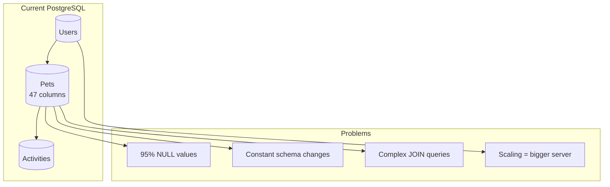
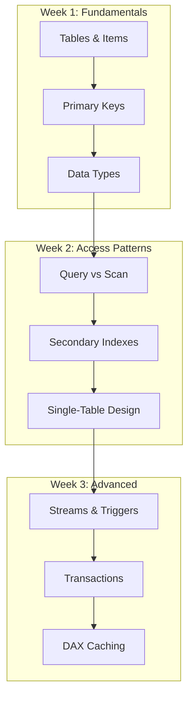

# Alex's Challenge: The Schema Flexibility Crisis

## The Growing Pain

PetTracker has grown beyond dogs and cats. Users now track fish, birds, reptiles, and exotic pets. Alex's PostgreSQL database is groaning under the strain.

```sql
-- The original pets table
CREATE TABLE pets (
    id UUID PRIMARY KEY,
    user_id UUID NOT NULL,
    name VARCHAR(100) NOT NULL,
    species VARCHAR(50) NOT NULL,
    breed VARCHAR(100),
    birth_date DATE,
    weight_kg DECIMAL(5,2),
    created_at TIMESTAMP DEFAULT NOW()
);

-- But now we need:
-- Dogs: vaccination_records, training_level, walks_per_day
-- Cats: indoor_outdoor, litter_brand, scratching_post_type
-- Fish: tank_size_gallons, water_type, temperature_celsius
-- Birds: cage_size, can_talk, favorite_phrases
-- Reptiles: enclosure_type, heating_lamp, humidity_level
-- Exotic: permit_number, special_diet, vet_specialist
```

## The Schema Migration Nightmare

Alex tries to accommodate all pet types:

```sql
-- Option 1: One table with ALL possible columns
ALTER TABLE pets ADD COLUMN tank_size_gallons INTEGER;
ALTER TABLE pets ADD COLUMN can_talk BOOLEAN;
ALTER TABLE pets ADD COLUMN permit_number VARCHAR(50);
-- 47 columns later... most are NULL for any given pet

-- Option 2: Separate tables per pet type
CREATE TABLE dogs (...)
CREATE TABLE cats (...)
CREATE TABLE fish (...)
-- 6 tables, complex joins, duplicated logic

-- Option 3: JSON column (feels like a hack)
ALTER TABLE pets ADD COLUMN attributes JSONB;
-- Now we lose type safety and indexing
```

## The Performance Issues

```python
# Alex's weekly report query
query = """
SELECT p.*, COUNT(a.id) as activities
FROM pets p
LEFT JOIN activities a ON p.id = a.pet_id
WHERE p.user_id = %s
  AND p.species IN %s
  AND (p.breed = %s OR p.tank_size_gallons > %s OR p.can_talk = %s)
GROUP BY p.id
ORDER BY p.created_at DESC
LIMIT 20
"""
# This query takes 3+ seconds with proper indexing!
# And it's getting worse as data grows
```



## Elena's Suggestion

Alex presents the issues to Elena (CTO).

"Alex, it sounds like you're fighting against relational constraints for data that doesn't fit a fixed schema," Elena observes. "Have you considered DynamoDB?"

"NoSQL? But what about joins? ACID transactions? I've heard NoSQL is just for simple use cases."

Elena smiles. "DynamoDB has grown up a lot. Let me tell you what it offers..."

```python
# Elena's whiteboard
dynamodb_benefits = {
    "flexible_schema": {
        "description": "Each item can have different attributes",
        "example": "Dogs have 'breed', fish have 'tank_size'"
    },
    "infinite_scale": {
        "description": "Automatically scales to handle any traffic",
        "example": "From 10 to 10 million requests/second"
    },
    "single_digit_latency": {
        "description": "Consistent <10ms response times",
        "example": "Even at massive scale"
    },
    "fully_managed": {
        "description": "No servers to manage",
        "example": "No patching, no backups to configure"
    },
    "event_driven": {
        "description": "DynamoDB Streams for real-time triggers",
        "example": "Lambda function on every pet update"
    }
}
```

## Alex's Concerns

```markdown
## Alex's DynamoDB Questions

1. **No JOINs?**
   - How do I get a user with all their pets?
   - How do I get a pet with all activities?

2. **No flexible queries?**
   - SQL: SELECT * FROM pets WHERE species = 'dog' AND age > 5
   - DynamoDB: ???

3. **Transactions?**
   - What if I need to update multiple items atomically?

4. **Cost?**
   - PostgreSQL RDS: $200/month predictable
   - DynamoDB: Pay per request... could it explode?

5. **Migration?**
   - How do I move 500,000 pets without downtime?
```

## The Data Model Challenge

Alex sketches what the data might look like:

```python
# PostgreSQL (rigid schema)
pet_row = {
    "id": "pet-123",
    "user_id": "user-456",
    "name": "Buddy",
    "species": "dog",
    "breed": "Golden Retriever",
    "birth_date": "2020-03-15",
    "weight_kg": 32.5,
    # NULL, NULL, NULL... for fish/bird columns
}

# DynamoDB (flexible attributes)
pet_item = {
    "PK": "USER#user-456",
    "SK": "PET#pet-123",
    "name": "Buddy",
    "species": "dog",
    "breed": "Golden Retriever",
    "birthDate": "2020-03-15",
    "weightKg": 32.5,
    "vaccinationRecords": [...],  # Dog-specific
    "trainingLevel": "intermediate"  # Dog-specific
}

fish_item = {
    "PK": "USER#user-789",
    "SK": "PET#pet-456",
    "name": "Nemo",
    "species": "fish",
    "tankSizeGallons": 50,  # Fish-specific
    "waterType": "saltwater",  # Fish-specific
    "temperatureCelsius": 26  # Fish-specific
}
```

## The Learning Journey

Sam lays out what Alex needs to learn:



## Initial Experiment

Alex creates a test table:

```bash
# Create first DynamoDB table
aws dynamodb create-table \
    --table-name PetTracker-Test \
    --attribute-definitions \
        AttributeName=PK,AttributeType=S \
        AttributeName=SK,AttributeType=S \
    --key-schema \
        AttributeName=PK,KeyType=HASH \
        AttributeName=SK,KeyType=RANGE \
    --billing-mode PAY_PER_REQUEST

# Insert a dog
aws dynamodb put-item \
    --table-name PetTracker-Test \
    --item '{
        "PK": {"S": "USER#user-123"},
        "SK": {"S": "PET#pet-001"},
        "name": {"S": "Buddy"},
        "species": {"S": "dog"},
        "breed": {"S": "Golden Retriever"}
    }'

# Insert a fish (different attributes!)
aws dynamodb put-item \
    --table-name PetTracker-Test \
    --item '{
        "PK": {"S": "USER#user-123"},
        "SK": {"S": "PET#pet-002"},
        "name": {"S": "Nemo"},
        "species": {"S": "fish"},
        "tankSizeGallons": {"N": "50"},
        "waterType": {"S": "saltwater"}
    }'
```

"It just... accepted both items?" Alex is amazed. "No schema migration needed?"

## Chapter Objectives

By the end of this chapter, Alex (and you) will be able to:

1. Design DynamoDB tables with proper partition and sort keys
2. Implement access patterns using indexes
3. Write efficient queries and avoid expensive scans
4. Configure capacity modes and understand costs
5. Use DynamoDB Streams for event-driven processing
6. Implement transactions for complex operations

---

*Next: Understanding DynamoDB fundamentals and how NoSQL differs from relational databases.*

---
*v1.0*
