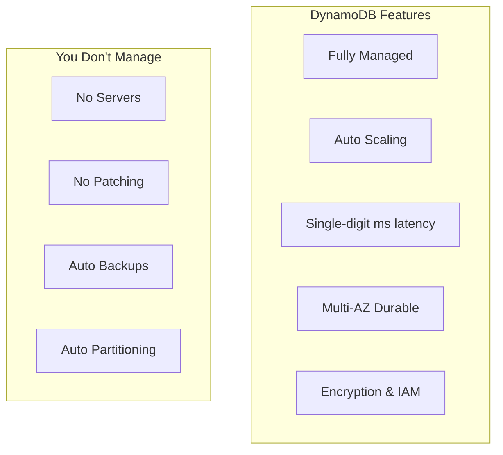
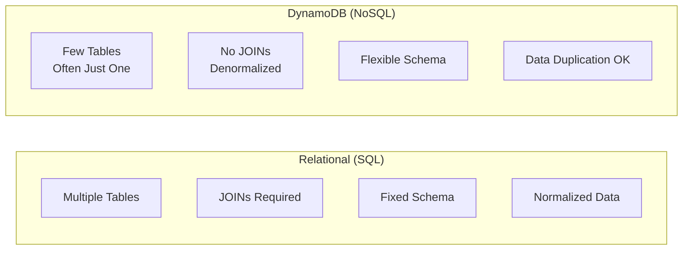

# DynamoDB Fundamentals

## What is DynamoDB?

Amazon DynamoDB is a fully managed NoSQL database service providing fast, predictable performance with seamless scalability.



## Core Concepts

### Tables

A table is a collection of data, similar to a table in relational databases:

```python
# Table structure
table = {
    "TableName": "PetTracker-Pets",
    "KeySchema": [
        {"AttributeName": "PK", "KeyType": "HASH"},   # Partition key
        {"AttributeName": "SK", "KeyType": "RANGE"}    # Sort key
    ],
    "AttributeDefinitions": [
        {"AttributeName": "PK", "AttributeType": "S"},
        {"AttributeName": "SK", "AttributeType": "S"}
    ]
}
```

### Items

An item is a single data record, similar to a row:

```python
# Each item is a collection of attributes
pet_item = {
    "PK": "USER#user-123",      # Required (partition key)
    "SK": "PET#pet-001",        # Required (sort key)
    "name": "Buddy",            # Optional attribute
    "species": "dog",           # Optional attribute
    "breed": "Golden Retriever" # Optional attribute
}

# Items in same table can have different attributes!
fish_item = {
    "PK": "USER#user-123",
    "SK": "PET#pet-002",
    "name": "Nemo",
    "species": "fish",
    "tankSizeGallons": 50,      # Different attribute!
    "waterType": "saltwater"    # Different attribute!
}
```

### Attributes

Attributes are the data elements, similar to columns but flexible:

```python
# Attribute types
attribute_types = {
    "S": "String",
    "N": "Number (stored as string, compared as number)",
    "B": "Binary",
    "BOOL": "Boolean",
    "NULL": "Null",
    "M": "Map (nested JSON object)",
    "L": "List (array)",
    "SS": "String Set",
    "NS": "Number Set",
    "BS": "Binary Set"
}
```

## Data Types in Detail

### Scalar Types

```python
scalar_examples = {
    "String": {"S": "Hello World"},
    "Number": {"N": "123.45"},  # Note: stored as string
    "Binary": {"B": "SGVsbG8gV29ybGQ="},  # Base64 encoded
    "Boolean": {"BOOL": True},
    "Null": {"NULL": True}
}
```

### Document Types

```python
# Map (nested object)
map_example = {
    "M": {
        "name": {"S": "Buddy"},
        "age": {"N": "5"},
        "vaccinations": {
            "M": {
                "rabies": {"S": "2024-01-15"},
                "parvo": {"S": "2023-06-20"}
            }
        }
    }
}

# List (array)
list_example = {
    "L": [
        {"S": "walk"},
        {"S": "fetch"},
        {"S": "nap"}
    ]
}
```

### Set Types

```python
# String Set (unique strings, unordered)
string_set = {"SS": ["red", "green", "blue"]}

# Number Set (unique numbers, unordered)
number_set = {"NS": ["1", "2", "3"]}

# Note: Sets cannot contain duplicates or be empty
```

## DynamoDB vs Relational Databases



| Feature | Relational | DynamoDB |
|---------|------------|----------|
| Schema | Fixed, enforced | Flexible per item |
| Queries | Any column, JOINs | Primary key, indexes |
| Scaling | Vertical (bigger server) | Horizontal (automatic) |
| Transactions | Full ACID | Limited ACID |
| Relationships | Foreign keys | Denormalization |

## Creating Tables

### AWS CLI

```bash
aws dynamodb create-table \
    --table-name PetTracker-Pets \
    --attribute-definitions \
        AttributeName=PK,AttributeType=S \
        AttributeName=SK,AttributeType=S \
    --key-schema \
        AttributeName=PK,KeyType=HASH \
        AttributeName=SK,KeyType=RANGE \
    --billing-mode PAY_PER_REQUEST
```

### Python SDK

```python
import boto3

dynamodb = boto3.client('dynamodb')

response = dynamodb.create_table(
    TableName='PetTracker-Pets',
    AttributeDefinitions=[
        {'AttributeName': 'PK', 'AttributeType': 'S'},
        {'AttributeName': 'SK', 'AttributeType': 'S'}
    ],
    KeySchema=[
        {'AttributeName': 'PK', 'KeyType': 'HASH'},
        {'AttributeName': 'SK', 'KeyType': 'RANGE'}
    ],
    BillingMode='PAY_PER_REQUEST'
)

# Wait for table to be active
waiter = dynamodb.get_waiter('table_exists')
waiter.wait(TableName='PetTracker-Pets')
print("Table created!")
```

### CloudFormation

```yaml
Resources:
  PetsTable:
    Type: AWS::DynamoDB::Table
    Properties:
      TableName: PetTracker-Pets
      BillingMode: PAY_PER_REQUEST
      AttributeDefinitions:
        - AttributeName: PK
          AttributeType: S
        - AttributeName: SK
          AttributeType: S
      KeySchema:
        - AttributeName: PK
          KeyType: HASH
        - AttributeName: SK
          KeyType: RANGE
```

## Basic Operations

### PutItem

```python
import boto3

dynamodb = boto3.resource('dynamodb')
table = dynamodb.Table('PetTracker-Pets')

# Using resource (high-level)
table.put_item(
    Item={
        'PK': 'USER#user-123',
        'SK': 'PET#pet-001',
        'name': 'Buddy',
        'species': 'dog',
        'breed': 'Golden Retriever',
        'age': 5
    }
)

# Using client (low-level) - explicit types
dynamodb_client = boto3.client('dynamodb')
dynamodb_client.put_item(
    TableName='PetTracker-Pets',
    Item={
        'PK': {'S': 'USER#user-123'},
        'SK': {'S': 'PET#pet-001'},
        'name': {'S': 'Buddy'},
        'species': {'S': 'dog'},
        'breed': {'S': 'Golden Retriever'},
        'age': {'N': '5'}
    }
)
```

### GetItem

```python
# Get a single item by primary key
response = table.get_item(
    Key={
        'PK': 'USER#user-123',
        'SK': 'PET#pet-001'
    }
)

pet = response.get('Item')
print(f"Pet name: {pet['name']}")
```

### DeleteItem

```python
# Delete by primary key
table.delete_item(
    Key={
        'PK': 'USER#user-123',
        'SK': 'PET#pet-001'
    }
)
```

## Item Size Limits

```python
limits = {
    "max_item_size": "400 KB",
    "max_attribute_name": "64 KB",
    "max_partition_key": "2 KB",
    "max_sort_key": "1 KB",
    "max_local_secondary_indexes": 5,
    "max_global_secondary_indexes": 20
}
```

## Alex's First Table

```python
# Alex creates the PetTracker table
import boto3

def create_pettracker_table():
    dynamodb = boto3.client('dynamodb')

    try:
        response = dynamodb.create_table(
            TableName='PetTracker',
            AttributeDefinitions=[
                {'AttributeName': 'PK', 'AttributeType': 'S'},
                {'AttributeName': 'SK', 'AttributeType': 'S'},
                {'AttributeName': 'GSI1PK', 'AttributeType': 'S'},
                {'AttributeName': 'GSI1SK', 'AttributeType': 'S'}
            ],
            KeySchema=[
                {'AttributeName': 'PK', 'KeyType': 'HASH'},
                {'AttributeName': 'SK', 'KeyType': 'RANGE'}
            ],
            GlobalSecondaryIndexes=[
                {
                    'IndexName': 'GSI1',
                    'KeySchema': [
                        {'AttributeName': 'GSI1PK', 'KeyType': 'HASH'},
                        {'AttributeName': 'GSI1SK', 'KeyType': 'RANGE'}
                    ],
                    'Projection': {'ProjectionType': 'ALL'}
                }
            ],
            BillingMode='PAY_PER_REQUEST',
            Tags=[
                {'Key': 'Project', 'Value': 'PetTracker'},
                {'Key': 'Environment', 'Value': 'Development'}
            ]
        )
        print(f"Table created: {response['TableDescription']['TableName']}")
    except dynamodb.exceptions.ResourceInUseException:
        print("Table already exists")


create_pettracker_table()
```

## Exam Tips

**For DVA-C02:**

1. **Items are schemaless** - different items can have different attributes
2. **400 KB max item size** - design around this limit
3. **Partition key is required** - sort key is optional
4. **Data types** - S, N, B, BOOL, NULL, M, L, SS, NS, BS
5. **Numbers stored as strings** - but compared as numbers

**Common scenarios:**

> "Store flexible product attributes..."
> → DynamoDB's schemaless nature

> "Item larger than 400 KB..."
> → Store in S3, reference in DynamoDB

> "Need SQL-like queries..."
> → May not be good fit, consider RDS

## Key Takeaways

1. **DynamoDB is schemaless** - items can have different attributes
2. **Primary key required** - partition key + optional sort key
3. **Fully managed** - no servers to maintain
4. **Single-digit millisecond latency** at any scale
5. **400 KB item limit** - plan for large data
6. **Data types** include scalars, documents, and sets

---

*Next: Understanding primary keys and effective data modeling.*
