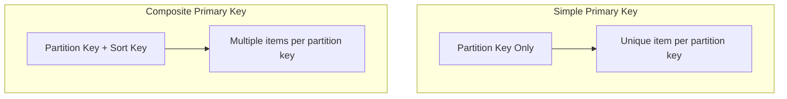
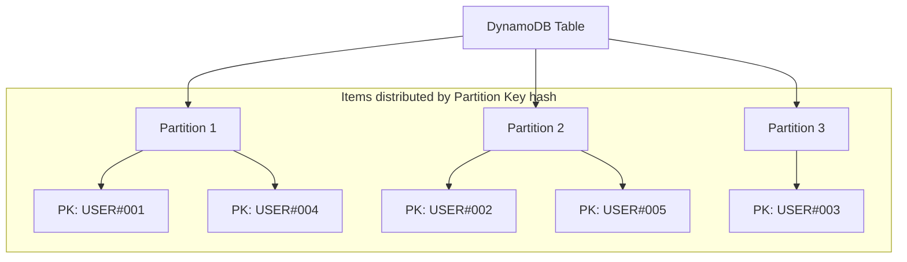
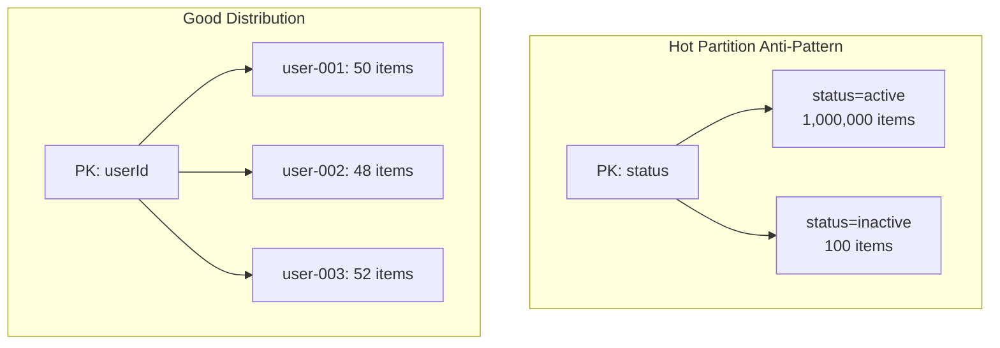
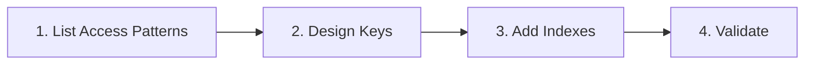

# Primary Keys and Data Modeling

## Primary Key Types

DynamoDB supports two types of primary keys:



### Simple Primary Key (Partition Key Only)

```python
# Each partition key must be unique
simple_key_table = {
    "KeySchema": [
        {"AttributeName": "userId", "KeyType": "HASH"}
    ]
}

# Valid items:
{"userId": "user-001", "name": "Alice"}
{"userId": "user-002", "name": "Bob"}

# Invalid (duplicate partition key):
{"userId": "user-001", "name": "Charlie"}  # ERROR!
```

### Composite Primary Key (Partition Key + Sort Key)

```python
# Partition key + sort key combination must be unique
composite_key_table = {
    "KeySchema": [
        {"AttributeName": "PK", "KeyType": "HASH"},
        {"AttributeName": "SK", "KeyType": "RANGE"}
    ]
}

# Valid items (same partition key, different sort keys):
{"PK": "USER#user-001", "SK": "PROFILE", "name": "Alice"}
{"PK": "USER#user-001", "SK": "PET#pet-001", "name": "Buddy"}
{"PK": "USER#user-001", "SK": "PET#pet-002", "name": "Max"}
```

## Partitions and Distribution



### Partition Key Selection

```python
# Good partition keys - high cardinality
good_keys = [
    "userId",       # Many unique users
    "orderId",      # Many unique orders
    "deviceId",     # Many unique devices
]

# Bad partition keys - low cardinality (hot partitions!)
bad_keys = [
    "status",       # Only a few values: active, inactive
    "date",         # Many items on same date
    "country",      # Many items per country
]
```

### Hot Partition Problem



## Single-Table Design

Modern DynamoDB best practice - store multiple entity types in one table:

```python
# Single-table design for PetTracker
single_table_items = [
    # User profile
    {
        "PK": "USER#user-123",
        "SK": "PROFILE",
        "name": "Alice",
        "email": "alice@email.com",
        "GSI1PK": "EMAIL#alice@email.com",
        "GSI1SK": "USER#user-123"
    },
    # User's pets
    {
        "PK": "USER#user-123",
        "SK": "PET#pet-001",
        "name": "Buddy",
        "species": "dog"
    },
    {
        "PK": "USER#user-123",
        "SK": "PET#pet-002",
        "name": "Nemo",
        "species": "fish"
    },
    # Pet's activities
    {
        "PK": "PET#pet-001",
        "SK": "ACTIVITY#2024-01-15#act-001",
        "type": "walk",
        "duration": 30
    }
]
```

### Access Patterns

```python
# Get user profile
table.get_item(Key={"PK": "USER#user-123", "SK": "PROFILE"})

# Get all user's pets
table.query(
    KeyConditionExpression="PK = :pk AND begins_with(SK, :prefix)",
    ExpressionAttributeValues={
        ":pk": "USER#user-123",
        ":prefix": "PET#"
    }
)

# Get pet's activities for a date range
table.query(
    KeyConditionExpression="PK = :pk AND SK BETWEEN :start AND :end",
    ExpressionAttributeValues={
        ":pk": "PET#pet-001",
        ":start": "ACTIVITY#2024-01-01",
        ":end": "ACTIVITY#2024-01-31"
    }
)
```

## Key Naming Conventions

```python
# Common prefixes for entity types
prefixes = {
    "USER#": "User entities",
    "PET#": "Pet entities",
    "ORDER#": "Order entities",
    "ACTIVITY#": "Activity entities"
}

# Sort key patterns
sort_key_patterns = {
    "PROFILE": "Single item (user profile)",
    "PET#<pet-id>": "One-to-many (user's pets)",
    "ACTIVITY#<date>#<id>": "Time-series data",
    "METADATA": "Entity metadata"
}
```

## Data Modeling Process



### Step 1: List Access Patterns

```python
# PetTracker access patterns
access_patterns = [
    "Get user by ID",
    "Get user by email",
    "Get all pets for a user",
    "Get pet by ID",
    "Get activities for a pet (date range)",
    "Get all pets of a species",
    "Get user's recent activities"
]
```

### Step 2: Design Keys

```python
# Map access patterns to key designs
key_design = {
    "Get user by ID": {
        "PK": "USER#<userId>",
        "SK": "PROFILE",
        "operation": "GetItem"
    },
    "Get all pets for user": {
        "PK": "USER#<userId>",
        "SK": "begins_with(PET#)",
        "operation": "Query"
    },
    "Get pet activities by date": {
        "PK": "PET#<petId>",
        "SK": "between ACTIVITY#<start> and ACTIVITY#<end>",
        "operation": "Query"
    }
}
```

### Step 3: Add Indexes for Remaining Patterns

```python
# Patterns requiring GSI
gsi_patterns = {
    "Get user by email": {
        "GSI1PK": "EMAIL#<email>",
        "GSI1SK": "USER#<userId>"
    },
    "Get all pets of species": {
        "GSI1PK": "SPECIES#<species>",
        "GSI1SK": "PET#<petId>"
    }
}
```

## Alex's Data Model

```python
# Complete PetTracker data model
class PetTrackerDataModel:
    """
    Single-table design for PetTracker

    Entity Types:
    - USER: User profiles
    - PET: Pet records
    - ACTIVITY: Pet activities
    """

    @staticmethod
    def user_item(user_id, name, email):
        return {
            "PK": f"USER#{user_id}",
            "SK": "PROFILE",
            "entityType": "USER",
            "userId": user_id,
            "name": name,
            "email": email,
            "GSI1PK": f"EMAIL#{email}",
            "GSI1SK": f"USER#{user_id}",
            "createdAt": datetime.utcnow().isoformat()
        }

    @staticmethod
    def pet_item(user_id, pet_id, name, species, **attributes):
        item = {
            "PK": f"USER#{user_id}",
            "SK": f"PET#{pet_id}",
            "entityType": "PET",
            "petId": pet_id,
            "userId": user_id,
            "name": name,
            "species": species,
            "GSI1PK": f"SPECIES#{species}",
            "GSI1SK": f"PET#{pet_id}",
            "createdAt": datetime.utcnow().isoformat()
        }
        # Add species-specific attributes
        item.update(attributes)
        return item

    @staticmethod
    def activity_item(pet_id, activity_id, activity_type, timestamp, **data):
        date_str = timestamp.strftime("%Y-%m-%d")
        return {
            "PK": f"PET#{pet_id}",
            "SK": f"ACTIVITY#{date_str}#{activity_id}",
            "entityType": "ACTIVITY",
            "activityId": activity_id,
            "petId": pet_id,
            "type": activity_type,
            "timestamp": timestamp.isoformat(),
            **data
        }
```

### Usage Example

```python
# Create items
user = PetTrackerDataModel.user_item(
    user_id="user-123",
    name="Alice",
    email="alice@email.com"
)

dog = PetTrackerDataModel.pet_item(
    user_id="user-123",
    pet_id="pet-001",
    name="Buddy",
    species="dog",
    breed="Golden Retriever",
    vaccinationRecords=["rabies", "parvo"]
)

fish = PetTrackerDataModel.pet_item(
    user_id="user-123",
    pet_id="pet-002",
    name="Nemo",
    species="fish",
    tankSizeGallons=50,
    waterType="saltwater"
)

walk = PetTrackerDataModel.activity_item(
    pet_id="pet-001",
    activity_id="act-001",
    activity_type="walk",
    timestamp=datetime.now(),
    durationMinutes=30,
    distanceKm=2.5
)

# Store all items
for item in [user, dog, fish, walk]:
    table.put_item(Item=item)
```

## Exam Tips

**For DVA-C02:**

1. **Partition key determines distribution** - choose high-cardinality
2. **Sort key enables range queries** - design for access patterns
3. **Composite key = partition + sort** - combination must be unique
4. **Hot partitions** - avoid low-cardinality partition keys
5. **Single-table design** - modern best practice

**Common scenarios:**

> "Query items by date range..."
> → Use sort key with date prefix

> "Store multiple entity types..."
> → Single-table design with prefixes

> "High traffic to one partition key value..."
> → Hot partition - redesign key

## Key Takeaways

1. **Partition key** determines data distribution
2. **Sort key** enables range queries within partition
3. **High cardinality** partition keys prevent hot partitions
4. **Single-table design** stores multiple entity types
5. **Design keys for access patterns** first
6. **Prefixes** help organize entity types

---

*Next: Implementing Secondary Indexes for additional access patterns.*

---
*v2.0*
