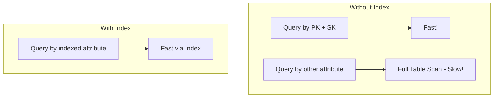
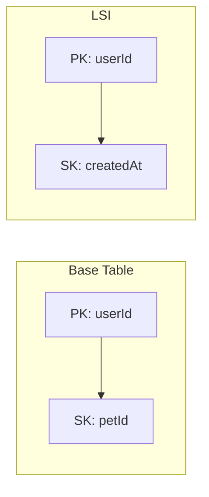
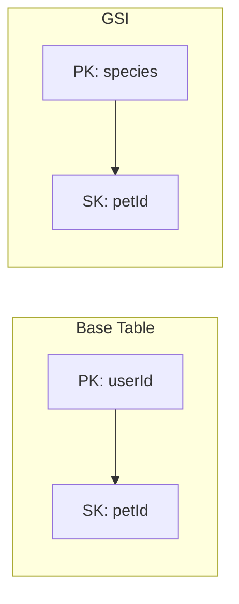

# Secondary Indexes (GSI and LSI)

## Why Secondary Indexes?

Primary keys support limited access patterns. Secondary indexes enable additional query patterns without scanning the entire table.



## Index Types

### Local Secondary Index (LSI)

- Same partition key as base table
- Different sort key
- Must be created with table
- Shares capacity with base table



### Global Secondary Index (GSI)

- Different partition key (and optionally sort key)
- Can be created anytime
- Has its own capacity



## LSI vs GSI Comparison

| Feature | LSI | GSI |
|---------|-----|-----|
| Partition Key | Same as table | Different allowed |
| Sort Key | Different | Different |
| Creation | Table creation only | Anytime |
| Capacity | Shares with table | Separate |
| Consistency | Strong or eventual | Eventual only |
| Max per table | 5 | 20 |
| Size limit | 10 GB per partition | None |

## Creating Indexes

### LSI (At Table Creation)

```python
import boto3

dynamodb = boto3.client('dynamodb')

# LSI must be created with the table
response = dynamodb.create_table(
    TableName='PetTracker-WithLSI',
    AttributeDefinitions=[
        {'AttributeName': 'PK', 'AttributeType': 'S'},
        {'AttributeName': 'SK', 'AttributeType': 'S'},
        {'AttributeName': 'createdAt', 'AttributeType': 'S'}
    ],
    KeySchema=[
        {'AttributeName': 'PK', 'KeyType': 'HASH'},
        {'AttributeName': 'SK', 'KeyType': 'RANGE'}
    ],
    LocalSecondaryIndexes=[
        {
            'IndexName': 'createdAt-index',
            'KeySchema': [
                {'AttributeName': 'PK', 'KeyType': 'HASH'},
                {'AttributeName': 'createdAt', 'KeyType': 'RANGE'}
            ],
            'Projection': {'ProjectionType': 'ALL'}
        }
    ],
    BillingMode='PAY_PER_REQUEST'
)
```

### GSI (Anytime)

```python
# Add GSI to existing table
response = dynamodb.update_table(
    TableName='PetTracker',
    AttributeDefinitions=[
        {'AttributeName': 'GSI1PK', 'AttributeType': 'S'},
        {'AttributeName': 'GSI1SK', 'AttributeType': 'S'}
    ],
    GlobalSecondaryIndexUpdates=[
        {
            'Create': {
                'IndexName': 'GSI1',
                'KeySchema': [
                    {'AttributeName': 'GSI1PK', 'KeyType': 'HASH'},
                    {'AttributeName': 'GSI1SK', 'KeyType': 'RANGE'}
                ],
                'Projection': {'ProjectionType': 'ALL'},
                'ProvisionedThroughput': {  # Required for provisioned
                    'ReadCapacityUnits': 5,
                    'WriteCapacityUnits': 5
                }
            }
        }
    ]
)

# Wait for GSI to become active
waiter = dynamodb.get_waiter('table_exists')
waiter.wait(TableName='PetTracker')
```

## Projection Types

Control which attributes are copied to the index:

```python
projection_types = {
    "ALL": {
        "description": "All attributes from base table",
        "storage": "Highest",
        "use_case": "Need all data from index queries"
    },
    "KEYS_ONLY": {
        "description": "Only primary key attributes",
        "storage": "Lowest",
        "use_case": "Just need to check existence or get keys"
    },
    "INCLUDE": {
        "description": "Specified attributes plus keys",
        "storage": "Medium",
        "use_case": "Need specific attributes only"
    }
}
```

```python
# INCLUDE projection example
{
    'IndexName': 'species-index',
    'KeySchema': [
        {'AttributeName': 'species', 'KeyType': 'HASH'},
        {'AttributeName': 'name', 'KeyType': 'RANGE'}
    ],
    'Projection': {
        'ProjectionType': 'INCLUDE',
        'NonKeyAttributes': ['userId', 'breed', 'age']
    }
}
```

## Querying Indexes

### Query GSI

```python
# Find all dogs
response = table.query(
    IndexName='GSI1',
    KeyConditionExpression='GSI1PK = :pk',
    ExpressionAttributeValues={
        ':pk': 'SPECIES#dog'
    }
)

for item in response['Items']:
    print(f"Dog: {item['name']}")
```

### Query LSI

```python
# Get user's pets ordered by creation date
response = table.query(
    IndexName='createdAt-index',
    KeyConditionExpression='PK = :pk',
    ExpressionAttributeValues={
        ':pk': 'USER#user-123'
    },
    ScanIndexForward=False  # Descending order (newest first)
)
```

## Sparse Indexes

Only items with the indexed attribute appear in the index:

```python
# GSI on 'featuredPet' attribute
# Only featured pets appear in the index

# This item WILL appear in the GSI
featured_pet = {
    "PK": "USER#user-123",
    "SK": "PET#pet-001",
    "name": "Buddy",
    "featuredPet": "2024-01-15"  # Has the attribute
}

# This item will NOT appear in the GSI
regular_pet = {
    "PK": "USER#user-123",
    "SK": "PET#pet-002",
    "name": "Max"
    # No 'featuredPet' attribute
}
```

Use case: Efficiently query subset of items!

## Overloaded GSI Pattern

Reuse the same GSI for multiple access patterns:

```python
# Items using GSI1 for different purposes
items = [
    # Access pattern 1: Get user by email
    {
        "PK": "USER#user-123",
        "SK": "PROFILE",
        "GSI1PK": "EMAIL#alice@email.com",
        "GSI1SK": "USER#user-123"
    },
    # Access pattern 2: Get pets by species
    {
        "PK": "USER#user-123",
        "SK": "PET#pet-001",
        "GSI1PK": "SPECIES#dog",
        "GSI1SK": "PET#pet-001"
    },
    # Access pattern 3: Get activities by date
    {
        "PK": "PET#pet-001",
        "SK": "ACTIVITY#2024-01-15#act-001",
        "GSI1PK": "DATE#2024-01-15",
        "GSI1SK": "ACTIVITY#act-001"
    }
]

# Query user by email
table.query(
    IndexName='GSI1',
    KeyConditionExpression='GSI1PK = :pk',
    ExpressionAttributeValues={':pk': 'EMAIL#alice@email.com'}
)

# Query pets by species
table.query(
    IndexName='GSI1',
    KeyConditionExpression='GSI1PK = :pk',
    ExpressionAttributeValues={':pk': 'SPECIES#dog'}
)

# Query activities by date
table.query(
    IndexName='GSI1',
    KeyConditionExpression='GSI1PK = :pk',
    ExpressionAttributeValues={':pk': 'DATE#2024-01-15'}
)
```

## Alex's Index Design

```python
# PetTracker Index Design

class PetTrackerIndexes:
    """
    Base Table: PK (partition), SK (sort)
    GSI1: GSI1PK (partition), GSI1SK (sort)
    GSI2: GSI2PK (partition), GSI2SK (sort)
    """

    # Access pattern → Index mapping
    access_patterns = {
        # Base table patterns
        "Get user profile": "PK=USER#id, SK=PROFILE",
        "Get user's pets": "PK=USER#id, SK begins_with PET#",
        "Get pet activities": "PK=PET#id, SK begins_with ACTIVITY#",

        # GSI1 patterns
        "Get user by email": "GSI1PK=EMAIL#email",
        "Get pets by species": "GSI1PK=SPECIES#species",

        # GSI2 patterns
        "Get recent activities": "GSI2PK=ACTIVITY, GSI2SK=timestamp"
    }

    @staticmethod
    def create_table():
        dynamodb = boto3.client('dynamodb')

        return dynamodb.create_table(
            TableName='PetTracker',
            AttributeDefinitions=[
                {'AttributeName': 'PK', 'AttributeType': 'S'},
                {'AttributeName': 'SK', 'AttributeType': 'S'},
                {'AttributeName': 'GSI1PK', 'AttributeType': 'S'},
                {'AttributeName': 'GSI1SK', 'AttributeType': 'S'},
                {'AttributeName': 'GSI2PK', 'AttributeType': 'S'},
                {'AttributeName': 'GSI2SK', 'AttributeType': 'S'}
            ],
            KeySchema=[
                {'AttributeName': 'PK', 'KeyType': 'HASH'},
                {'AttributeName': 'SK', 'KeyType': 'RANGE'}
            ],
            GlobalSecondaryIndexes=[
                {
                    'IndexName': 'GSI1',
                    'KeySchema': [
                        {'AttributeName': 'GSI1PK', 'KeyType': 'HASH'},
                        {'AttributeName': 'GSI1SK', 'KeyType': 'RANGE'}
                    ],
                    'Projection': {'ProjectionType': 'ALL'}
                },
                {
                    'IndexName': 'GSI2',
                    'KeySchema': [
                        {'AttributeName': 'GSI2PK', 'KeyType': 'HASH'},
                        {'AttributeName': 'GSI2SK', 'KeyType': 'RANGE'}
                    ],
                    'Projection': {'ProjectionType': 'ALL'}
                }
            ],
            BillingMode='PAY_PER_REQUEST'
        )
```

## Index Costs

```python
# GSI writes consume capacity
# For every base table write, GSI also updated

write_costs = {
    "base_table_write": "1 WCU per 1KB",
    "gsi_write": "1 WCU per 1KB (per GSI)",

    "example": {
        "2KB item": "2 WCU base + 2 WCU per GSI",
        "with_3_gsis": "2 + 2 + 2 + 2 = 8 WCU total"
    }
}

# Consider index necessity carefully!
```

## Exam Tips

**For DVA-C02:**

1. **LSI created at table creation** - cannot add later
2. **GSI can be added anytime**
3. **LSI shares capacity** with base table
4. **GSI has separate capacity**
5. **LSI supports strong consistency** - GSI does not
6. **Max 5 LSI, 20 GSI** per table
7. **Sparse indexes** only include items with the attribute

**Common scenarios:**

> "Query by non-key attribute with strong consistency..."
> → LSI (if same partition key)

> "Query by completely different key..."
> → GSI

> "Query subset of items efficiently..."
> → Sparse index

## Key Takeaways

1. **LSI** - same partition key, different sort key
2. **GSI** - different partition key entirely
3. **LSI at table creation only** - plan ahead
4. **GSI has its own capacity** - monitor separately
5. **Sparse indexes** for subset queries
6. **Overloaded GSI** pattern for multiple access patterns

---

*Next: Implementing efficient read operations with Query and Scan.*
