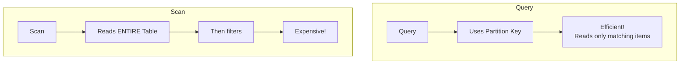
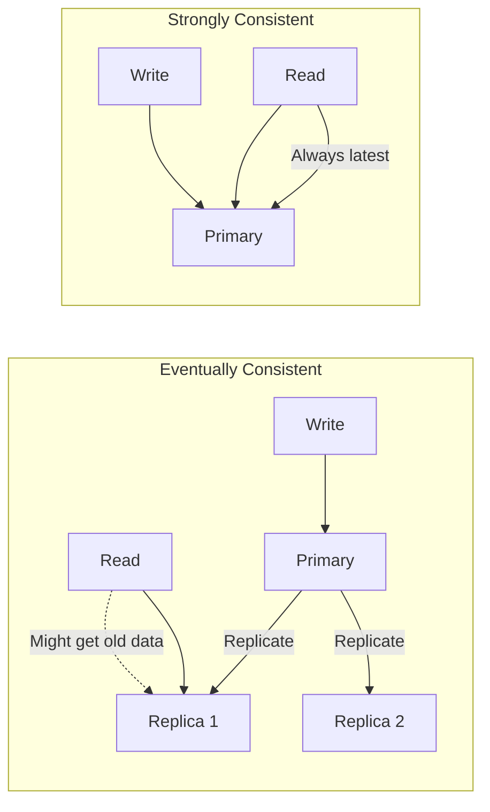

# Read Operations: Query and Scan

## Query vs Scan



| Operation | Use Case | Performance | Cost |
|-----------|----------|-------------|------|
| Query | Known partition key | Fast | Low |
| Scan | Need all data or no key | Slow | High |
| GetItem | Single item by full key | Fastest | Lowest |

## Query Operation

Query finds items using the partition key:

### Basic Query

```python
import boto3

dynamodb = boto3.resource('dynamodb')
table = dynamodb.Table('PetTracker')

# Get all pets for a user
response = table.query(
    KeyConditionExpression='PK = :pk AND begins_with(SK, :prefix)',
    ExpressionAttributeValues={
        ':pk': 'USER#user-123',
        ':prefix': 'PET#'
    }
)

for item in response['Items']:
    print(f"Pet: {item['name']}")
```

### Key Condition Expressions

```python
# Partition key is required
# Sort key supports various conditions

key_conditions = {
    "equals": "SK = :value",
    "less_than": "SK < :value",
    "less_than_or_equal": "SK <= :value",
    "greater_than": "SK > :value",
    "greater_than_or_equal": "SK >= :value",
    "between": "SK BETWEEN :start AND :end",
    "begins_with": "begins_with(SK, :prefix)"
}

# Example: Activities in date range
response = table.query(
    KeyConditionExpression='PK = :pk AND SK BETWEEN :start AND :end',
    ExpressionAttributeValues={
        ':pk': 'PET#pet-001',
        ':start': 'ACTIVITY#2024-01-01',
        ':end': 'ACTIVITY#2024-01-31'
    }
)
```

### Query with Filter

```python
# Filter reduces returned items (but still reads all matching)
response = table.query(
    KeyConditionExpression='PK = :pk AND begins_with(SK, :prefix)',
    FilterExpression='species = :species',
    ExpressionAttributeValues={
        ':pk': 'USER#user-123',
        ':prefix': 'PET#',
        ':species': 'dog'
    }
)

# Note: Filter is applied AFTER query - still consumes capacity for all items!
```

### Query Parameters

```python
response = table.query(
    KeyConditionExpression='PK = :pk',
    ExpressionAttributeValues={':pk': 'USER#user-123'},

    # Limit results
    Limit=10,

    # Sort order (True=ascending, False=descending)
    ScanIndexForward=False,

    # Return only specific attributes
    ProjectionExpression='name, species, #age',
    ExpressionAttributeNames={'#age': 'age'},  # Reserved word

    # Consistency
    ConsistentRead=True,  # Strong consistency (not available on GSI)

    # Pagination
    ExclusiveStartKey=last_evaluated_key  # From previous response
)
```

## Scan Operation

Scan reads every item in the table:

```python
# Full table scan - USE SPARINGLY!
response = table.scan()

# Scan with filter (still reads everything!)
response = table.scan(
    FilterExpression='species = :species',
    ExpressionAttributeValues={':species': 'dog'}
)

# This reads ALL items, then filters - expensive!
```

### When to Use Scan

```python
scan_use_cases = [
    "Export entire table",
    "Data analysis (infrequent)",
    "One-time migrations",
    "Small tables (<1000 items)"
]

avoid_scan_when = [
    "Regular application queries",
    "Large tables",
    "High traffic",
    "Cost is a concern"
]
```

### Parallel Scan

```python
import concurrent.futures

def parallel_scan(table_name, total_segments=4):
    """
    Scan table in parallel for faster processing
    """
    dynamodb = boto3.resource('dynamodb')
    table = dynamodb.Table(table_name)

    def scan_segment(segment):
        items = []
        response = table.scan(
            Segment=segment,
            TotalSegments=total_segments
        )
        items.extend(response['Items'])

        while 'LastEvaluatedKey' in response:
            response = table.scan(
                Segment=segment,
                TotalSegments=total_segments,
                ExclusiveStartKey=response['LastEvaluatedKey']
            )
            items.extend(response['Items'])

        return items

    all_items = []
    with concurrent.futures.ThreadPoolExecutor(max_workers=total_segments) as executor:
        futures = [executor.submit(scan_segment, i) for i in range(total_segments)]
        for future in concurrent.futures.as_completed(futures):
            all_items.extend(future.result())

    return all_items
```

## Pagination

DynamoDB returns up to 1 MB per request:

```python
def query_all_items(table, pk):
    """
    Handle pagination to get all items
    """
    items = []
    last_key = None

    while True:
        kwargs = {
            'KeyConditionExpression': 'PK = :pk',
            'ExpressionAttributeValues': {':pk': pk}
        }

        if last_key:
            kwargs['ExclusiveStartKey'] = last_key

        response = table.query(**kwargs)
        items.extend(response['Items'])

        last_key = response.get('LastEvaluatedKey')
        if not last_key:
            break

    return items


# Or use paginator
paginator = dynamodb_client.get_paginator('query')
for page in paginator.paginate(
    TableName='PetTracker',
    KeyConditionExpression='PK = :pk',
    ExpressionAttributeValues={':pk': {'S': 'USER#user-123'}}
):
    for item in page['Items']:
        process(item)
```

## Projection Expressions

Return only needed attributes:

```python
# Only return specific attributes
response = table.query(
    KeyConditionExpression='PK = :pk',
    ExpressionAttributeValues={':pk': 'USER#user-123'},
    ProjectionExpression='name, species, createdAt'
)

# With nested attributes
response = table.query(
    KeyConditionExpression='PK = :pk',
    ExpressionAttributeValues={':pk': 'USER#user-123'},
    ProjectionExpression='name, address.city, tags[0]'
)

# With reserved words
response = table.query(
    KeyConditionExpression='PK = :pk',
    ExpressionAttributeValues={':pk': 'USER#user-123'},
    ProjectionExpression='#name, #status',
    ExpressionAttributeNames={
        '#name': 'name',     # 'name' is reserved
        '#status': 'status'  # 'status' is reserved
    }
)
```

## Consistency Modes



```python
# Eventually consistent (default) - 0.5 RCU per 4KB
response = table.query(
    KeyConditionExpression='PK = :pk',
    ExpressionAttributeValues={':pk': 'USER#user-123'}
)

# Strongly consistent - 1 RCU per 4KB
response = table.query(
    KeyConditionExpression='PK = :pk',
    ExpressionAttributeValues={':pk': 'USER#user-123'},
    ConsistentRead=True  # Not available on GSI!
)
```

## Alex's Query Patterns

```python
class PetTrackerQueries:
    def __init__(self, table_name='PetTracker'):
        self.table = boto3.resource('dynamodb').Table(table_name)

    def get_user(self, user_id):
        """Get user profile"""
        response = self.table.get_item(
            Key={'PK': f'USER#{user_id}', 'SK': 'PROFILE'}
        )
        return response.get('Item')

    def get_user_pets(self, user_id, species=None, limit=20):
        """Get all pets for a user, optionally filtered by species"""
        kwargs = {
            'KeyConditionExpression': 'PK = :pk AND begins_with(SK, :prefix)',
            'ExpressionAttributeValues': {
                ':pk': f'USER#{user_id}',
                ':prefix': 'PET#'
            },
            'Limit': limit
        }

        if species:
            kwargs['FilterExpression'] = 'species = :species'
            kwargs['ExpressionAttributeValues'][':species'] = species

        response = self.table.query(**kwargs)
        return response['Items']

    def get_pet_activities(self, pet_id, start_date, end_date):
        """Get activities for a pet in date range"""
        response = self.table.query(
            KeyConditionExpression='PK = :pk AND SK BETWEEN :start AND :end',
            ExpressionAttributeValues={
                ':pk': f'PET#{pet_id}',
                ':start': f'ACTIVITY#{start_date}',
                ':end': f'ACTIVITY#{end_date}z'  # 'z' > any time
            },
            ScanIndexForward=False  # Most recent first
        )
        return response['Items']

    def get_pets_by_species(self, species, limit=50):
        """Get all pets of a species (uses GSI)"""
        response = self.table.query(
            IndexName='GSI1',
            KeyConditionExpression='GSI1PK = :pk',
            ExpressionAttributeValues={':pk': f'SPECIES#{species}'},
            Limit=limit
        )
        return response['Items']

    def get_user_by_email(self, email):
        """Find user by email (uses GSI)"""
        response = self.table.query(
            IndexName='GSI1',
            KeyConditionExpression='GSI1PK = :pk',
            ExpressionAttributeValues={':pk': f'EMAIL#{email}'}
        )
        items = response.get('Items', [])
        return items[0] if items else None


# Usage
queries = PetTrackerQueries()
user = queries.get_user('user-123')
pets = queries.get_user_pets('user-123', species='dog')
activities = queries.get_pet_activities('pet-001', '2024-01-01', '2024-01-31')
```

## Exam Tips

**For DVA-C02:**

1. **Query requires partition key** - sort key optional
2. **Scan reads entire table** - expensive!
3. **FilterExpression** applies AFTER read - still consumes capacity
4. **1 MB limit per request** - use pagination
5. **ConsistentRead** not available on GSI
6. **Eventually consistent = 0.5 RCU**, strongly consistent = 1 RCU

**Common scenarios:**

> "Get items by non-partition-key attribute..."
> → Need a GSI, or will require Scan

> "Query returns too many items..."
> → Use Limit and pagination

> "Need latest data immediately after write..."
> → ConsistentRead=True (base table only)

## Key Takeaways

1. **Query uses partition key** - efficient
2. **Scan reads everything** - avoid in production
3. **Filter doesn't reduce capacity** - items still read
4. **Pagination for large results** - 1 MB limit
5. **Projection reduces data transfer** - saves bandwidth
6. **Consistency choice** - eventually vs strongly

---

*Next: Write operations and conditional updates.*

---
*v2.0*
