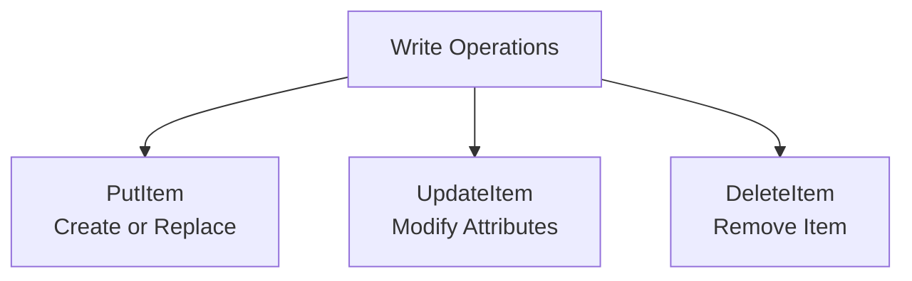

# Write Operations and Conditional Updates

## Write Operations Overview



## PutItem

Creates a new item or replaces an existing one:

```python
import boto3
from datetime import datetime

dynamodb = boto3.resource('dynamodb')
table = dynamodb.Table('PetTracker')

# Basic PutItem
table.put_item(
    Item={
        'PK': 'USER#user-123',
        'SK': 'PET#pet-001',
        'name': 'Buddy',
        'species': 'dog',
        'breed': 'Golden Retriever',
        'createdAt': datetime.utcnow().isoformat()
    }
)

# PutItem replaces entire item if key exists!
# Previous attributes are LOST
```

### Conditional PutItem

```python
from boto3.dynamodb.conditions import Attr

# Only create if doesn't exist
table.put_item(
    Item={
        'PK': 'USER#user-123',
        'SK': 'PET#pet-001',
        'name': 'Buddy',
        'species': 'dog'
    },
    ConditionExpression='attribute_not_exists(PK)'
)

# Using expression string
table.put_item(
    Item={'PK': 'USER#user-123', 'SK': 'PET#pet-001', 'name': 'Buddy'},
    ConditionExpression='attribute_not_exists(PK) AND attribute_not_exists(SK)'
)
```

## UpdateItem

Modifies specific attributes without replacing the entire item:

```python
# Basic update
table.update_item(
    Key={
        'PK': 'USER#user-123',
        'SK': 'PET#pet-001'
    },
    UpdateExpression='SET #name = :name, age = :age',
    ExpressionAttributeNames={'#name': 'name'},
    ExpressionAttributeValues={
        ':name': 'Buddy Jr.',
        ':age': 6
    }
)
```

### Update Expression Actions

```python
# SET - Add or modify attributes
update_expressions = {
    "SET": {
        "set_value": "SET age = :age",
        "set_if_not_exists": "SET age = if_not_exists(age, :default)",
        "increment": "SET viewCount = viewCount + :inc",
        "add_to_list": "SET tags = list_append(tags, :newTags)",
        "set_nested": "SET address.city = :city"
    },
    "REMOVE": {
        "remove_attribute": "REMOVE temporaryField",
        "remove_from_list": "REMOVE tags[0]"
    },
    "ADD": {
        "add_to_number": "ADD viewCount :inc",
        "add_to_set": "ADD tags :newTags"
    },
    "DELETE": {
        "remove_from_set": "DELETE tags :tagsToRemove"
    }
}
```

### Atomic Counters

```python
# Increment counter atomically
table.update_item(
    Key={'PK': 'USER#user-123', 'SK': 'PROFILE'},
    UpdateExpression='SET loginCount = if_not_exists(loginCount, :zero) + :inc',
    ExpressionAttributeValues={
        ':zero': 0,
        ':inc': 1
    }
)

# Decrement
table.update_item(
    Key={'PK': 'USER#user-123', 'SK': 'PROFILE'},
    UpdateExpression='SET credits = credits - :dec',
    ExpressionAttributeValues={':dec': 10}
)
```

### Return Values

```python
from boto3.dynamodb.conditions import Key

# Get old values before update
response = table.update_item(
    Key={'PK': 'USER#user-123', 'SK': 'PET#pet-001'},
    UpdateExpression='SET age = :age',
    ExpressionAttributeValues={':age': 6},
    ReturnValues='ALL_OLD'  # Returns item before update
)
old_item = response.get('Attributes')

# Return values options
return_values = {
    "NONE": "Nothing returned (default)",
    "ALL_OLD": "All attributes before update",
    "UPDATED_OLD": "Only updated attributes before",
    "ALL_NEW": "All attributes after update",
    "UPDATED_NEW": "Only updated attributes after"
}
```

## DeleteItem

```python
# Basic delete
table.delete_item(
    Key={
        'PK': 'USER#user-123',
        'SK': 'PET#pet-001'
    }
)

# Conditional delete
table.delete_item(
    Key={'PK': 'USER#user-123', 'SK': 'PET#pet-001'},
    ConditionExpression='species = :species',
    ExpressionAttributeValues={':species': 'dog'}
)

# Get deleted item
response = table.delete_item(
    Key={'PK': 'USER#user-123', 'SK': 'PET#pet-001'},
    ReturnValues='ALL_OLD'
)
deleted_item = response.get('Attributes')
```

## Conditional Expressions

### Condition Functions

```python
conditions = {
    "attribute_exists": "attribute_exists(email)",
    "attribute_not_exists": "attribute_not_exists(deletedAt)",
    "attribute_type": "attribute_type(age, :type)",  # S, N, B, etc.
    "begins_with": "begins_with(name, :prefix)",
    "contains": "contains(tags, :tag)",
    "size": "size(name) < :maxLen"
}
```

### Comparison Operators

```python
comparisons = {
    "equals": "age = :age",
    "not_equals": "age <> :age",
    "less_than": "age < :age",
    "less_equal": "age <= :age",
    "greater_than": "age > :age",
    "greater_equal": "age >= :age",
    "between": "age BETWEEN :min AND :max",
    "in": "species IN (:dog, :cat, :bird)"
}
```

### Logical Operators

```python
# AND
condition = "age >= :minAge AND species = :species"

# OR
condition = "species = :dog OR species = :cat"

# NOT
condition = "NOT contains(tags, :banned)"

# Parentheses for grouping
condition = "(age >= :minAge AND age <= :maxAge) OR species = :species"
```

## Optimistic Locking

Use version numbers to prevent concurrent update conflicts:

```python
class OptimisticLockingExample:
    def __init__(self, table):
        self.table = table

    def update_with_version(self, key, updates, current_version):
        """
        Update item only if version matches
        """
        try:
            response = self.table.update_item(
                Key=key,
                UpdateExpression='SET ' + ', '.join(
                    f'#{k} = :{k}' for k in updates.keys()
                ) + ', version = :newVersion',
                ConditionExpression='version = :currentVersion',
                ExpressionAttributeNames={
                    f'#{k}': k for k in updates.keys()
                },
                ExpressionAttributeValues={
                    **{f':{k}': v for k, v in updates.items()},
                    ':currentVersion': current_version,
                    ':newVersion': current_version + 1
                },
                ReturnValues='ALL_NEW'
            )
            return response['Attributes']

        except self.table.meta.client.exceptions.ConditionalCheckFailedException:
            # Someone else updated the item
            raise ConcurrentModificationError("Item was modified by another process")


# Usage
locker = OptimisticLockingExample(table)

# Read item
item = table.get_item(Key={'PK': 'USER#123', 'SK': 'PROFILE'})['Item']
current_version = item['version']

# Update with version check
try:
    updated = locker.update_with_version(
        key={'PK': 'USER#123', 'SK': 'PROFILE'},
        updates={'name': 'New Name'},
        current_version=current_version
    )
except ConcurrentModificationError:
    # Retry with fresh data
    pass
```

## Alex's Write Patterns

```python
class PetTrackerWrites:
    def __init__(self, table_name='PetTracker'):
        self.table = boto3.resource('dynamodb').Table(table_name)

    def create_user(self, user_id, name, email):
        """Create user (fail if exists)"""
        try:
            self.table.put_item(
                Item={
                    'PK': f'USER#{user_id}',
                    'SK': 'PROFILE',
                    'userId': user_id,
                    'name': name,
                    'email': email,
                    'GSI1PK': f'EMAIL#{email}',
                    'GSI1SK': f'USER#{user_id}',
                    'createdAt': datetime.utcnow().isoformat(),
                    'version': 1
                },
                ConditionExpression='attribute_not_exists(PK)'
            )
            return True
        except self.table.meta.client.exceptions.ConditionalCheckFailedException:
            raise UserExistsError(f"User {user_id} already exists")

    def add_pet(self, user_id, pet_id, name, species, **attributes):
        """Add pet to user"""
        item = {
            'PK': f'USER#{user_id}',
            'SK': f'PET#{pet_id}',
            'petId': pet_id,
            'userId': user_id,
            'name': name,
            'species': species,
            'GSI1PK': f'SPECIES#{species}',
            'GSI1SK': f'PET#{pet_id}',
            'createdAt': datetime.utcnow().isoformat()
        }
        item.update(attributes)
        self.table.put_item(Item=item)
        return item

    def update_pet(self, user_id, pet_id, **updates):
        """Update pet attributes"""
        update_expr = 'SET ' + ', '.join(
            f'#{k} = :{k}' for k in updates.keys()
        ) + ', updatedAt = :updatedAt'

        self.table.update_item(
            Key={
                'PK': f'USER#{user_id}',
                'SK': f'PET#{pet_id}'
            },
            UpdateExpression=update_expr,
            ExpressionAttributeNames={f'#{k}': k for k in updates.keys()},
            ExpressionAttributeValues={
                **{f':{k}': v for k, v in updates.items()},
                ':updatedAt': datetime.utcnow().isoformat()
            }
        )

    def log_activity(self, pet_id, activity_type, **data):
        """Log pet activity"""
        timestamp = datetime.utcnow()
        activity_id = f"act-{timestamp.strftime('%Y%m%d%H%M%S')}"

        self.table.put_item(
            Item={
                'PK': f'PET#{pet_id}',
                'SK': f'ACTIVITY#{timestamp.strftime("%Y-%m-%d")}#{activity_id}',
                'activityId': activity_id,
                'petId': pet_id,
                'type': activity_type,
                'timestamp': timestamp.isoformat(),
                **data
            }
        )

    def delete_pet(self, user_id, pet_id):
        """Delete pet (soft delete)"""
        self.table.update_item(
            Key={
                'PK': f'USER#{user_id}',
                'SK': f'PET#{pet_id}'
            },
            UpdateExpression='SET deletedAt = :deletedAt, GSI1PK = :removed',
            ExpressionAttributeValues={
                ':deletedAt': datetime.utcnow().isoformat(),
                ':removed': 'DELETED'  # Remove from species GSI
            }
        )
```

## Exam Tips

**For DVA-C02:**

1. **PutItem replaces entire item** - use UpdateItem for partial updates
2. **Conditional expressions** prevent race conditions
3. **Atomic counters** with UpdateItem ADD or SET + increment
4. **ReturnValues** options for getting old/new values
5. **ConditionalCheckFailedException** when condition fails

**Common scenarios:**

> "Prevent overwriting existing item..."
> → ConditionExpression='attribute_not_exists(PK)'

> "Increment counter atomically..."
> → UpdateItem with SET counter = counter + :inc

> "Handle concurrent updates..."
> → Optimistic locking with version attribute

## Key Takeaways

1. **PutItem** creates or replaces entirely
2. **UpdateItem** modifies specific attributes
3. **Conditional expressions** for safe updates
4. **Atomic counters** for concurrent increments
5. **Optimistic locking** with version numbers
6. **ReturnValues** to get before/after state

---

*Next: Understanding capacity modes and pricing.*

---
*v2.0*
