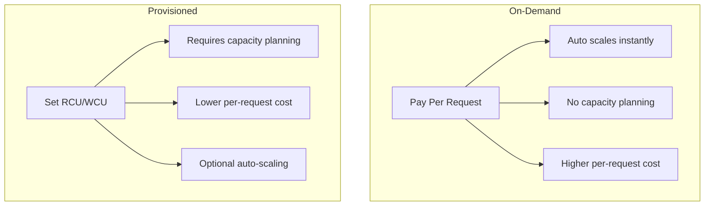

# Capacity Modes and Pricing

## Capacity Modes

DynamoDB offers two capacity modes:



## Read and Write Capacity Units

### Read Capacity Units (RCU)

```python
rcu_calculation = {
    "strongly_consistent": "1 RCU = 1 read of up to 4 KB",
    "eventually_consistent": "1 RCU = 2 reads of up to 4 KB",
    "transactional": "2 RCU = 1 read of up to 4 KB"
}

# Examples
examples = {
    "4 KB item, strongly consistent": "1 RCU",
    "4 KB item, eventually consistent": "0.5 RCU",
    "8 KB item, strongly consistent": "2 RCU",
    "8 KB item, eventually consistent": "1 RCU",
    "1 KB item, strongly consistent": "1 RCU (minimum)",
}

def calculate_rcu(item_size_kb, reads_per_second, consistent=False):
    """Calculate required RCU"""
    # Round up to nearest 4 KB
    units_per_read = -(-item_size_kb // 4)  # Ceiling division
    if not consistent:
        units_per_read = units_per_read / 2
    return int(units_per_read * reads_per_second)
```

### Write Capacity Units (WCU)

```python
wcu_calculation = {
    "standard": "1 WCU = 1 write of up to 1 KB",
    "transactional": "2 WCU = 1 write of up to 1 KB"
}

# Examples
examples = {
    "1 KB item": "1 WCU",
    "2.5 KB item": "3 WCU (rounded up)",
    "0.5 KB item": "1 WCU (minimum)"
}

def calculate_wcu(item_size_kb, writes_per_second):
    """Calculate required WCU"""
    units_per_write = -(-item_size_kb // 1)  # Round up
    return int(units_per_write * writes_per_second)
```

## On-Demand Mode

```python
# Create table with on-demand capacity
import boto3

dynamodb = boto3.client('dynamodb')

dynamodb.create_table(
    TableName='PetTracker-OnDemand',
    KeySchema=[
        {'AttributeName': 'PK', 'KeyType': 'HASH'},
        {'AttributeName': 'SK', 'KeyType': 'RANGE'}
    ],
    AttributeDefinitions=[
        {'AttributeName': 'PK', 'AttributeType': 'S'},
        {'AttributeName': 'SK', 'AttributeType': 'S'}
    ],
    BillingMode='PAY_PER_REQUEST'
)
```

### On-Demand Pricing

```python
on_demand_pricing = {
    "read_request": "$0.25 per million",
    "write_request": "$1.25 per million",

    "example_monthly": {
        "reads": 100_000_000,  # 100M reads
        "writes": 10_000_000,   # 10M writes
        "read_cost": 100 * 0.25,  # $25
        "write_cost": 10 * 1.25,   # $12.50
        "total": "$37.50"
    }
}
```

### When to Use On-Demand

```python
on_demand_best_for = [
    "Unpredictable workloads",
    "New applications (unknown traffic)",
    "Spiky traffic patterns",
    "Development/testing",
    "Serverless applications"
]
```

## Provisioned Mode

```python
# Create table with provisioned capacity
dynamodb.create_table(
    TableName='PetTracker-Provisioned',
    KeySchema=[
        {'AttributeName': 'PK', 'KeyType': 'HASH'},
        {'AttributeName': 'SK', 'KeyType': 'RANGE'}
    ],
    AttributeDefinitions=[
        {'AttributeName': 'PK', 'AttributeType': 'S'},
        {'AttributeName': 'SK', 'AttributeType': 'S'}
    ],
    BillingMode='PROVISIONED',
    ProvisionedThroughput={
        'ReadCapacityUnits': 100,
        'WriteCapacityUnits': 50
    }
)
```

### Provisioned Pricing

```python
provisioned_pricing = {
    "rcu": "$0.00013 per RCU per hour",
    "wcu": "$0.00065 per WCU per hour",

    "example_monthly": {
        "rcu": 100,
        "wcu": 50,
        "rcu_cost": 100 * 0.00013 * 730,  # $9.49
        "wcu_cost": 50 * 0.00065 * 730,    # $23.73
        "total": "$33.22"
    }
}
```

## Auto Scaling

```python
# Configure auto-scaling for provisioned table
import boto3

application_autoscaling = boto3.client('application-autoscaling')

# Register scalable target
application_autoscaling.register_scalable_target(
    ServiceNamespace='dynamodb',
    ResourceId='table/PetTracker',
    ScalableDimension='dynamodb:table:ReadCapacityUnits',
    MinCapacity=5,
    MaxCapacity=1000
)

# Create scaling policy
application_autoscaling.put_scaling_policy(
    PolicyName='PetTracker-ReadScaling',
    ServiceNamespace='dynamodb',
    ResourceId='table/PetTracker',
    ScalableDimension='dynamodb:table:ReadCapacityUnits',
    PolicyType='TargetTrackingScaling',
    TargetTrackingScalingPolicyConfiguration={
        'TargetValue': 70.0,  # Target 70% utilization
        'PredefinedMetricSpecification': {
            'PredefinedMetricType': 'DynamoDBReadCapacityUtilization'
        },
        'ScaleInCooldown': 60,
        'ScaleOutCooldown': 60
    }
)
```

## Burst Capacity

```python
burst_capacity = {
    "description": "DynamoDB reserves unused capacity",
    "duration": "Up to 5 minutes of unused capacity",
    "behavior": "Can handle short spikes above provisioned",
    "warning": "Don't rely on it for sustained traffic"
}

# Example
# Table provisioned for 100 RCU
# Burst can handle short spikes to 300+ RCU
# But sustained 300 RCU will cause throttling
```

## Reserved Capacity

```python
# Reserved capacity for predictable workloads
reserved_capacity = {
    "commitment": "1 or 3 year term",
    "discount": "Up to 77% off on-demand prices",
    "requirement": "Minimum 100 RCU/WCU",
    "best_for": "Stable, predictable production workloads"
}
```

## Throttling

```python
# Handling throttling
from botocore.config import Config
from botocore.exceptions import ClientError

# Configure retry behavior
config = Config(
    retries={
        'max_attempts': 10,
        'mode': 'adaptive'  # Adapts based on throttling
    }
)

dynamodb = boto3.client('dynamodb', config=config)

# Or handle manually
def write_with_backoff(table, item, max_retries=5):
    for attempt in range(max_retries):
        try:
            table.put_item(Item=item)
            return
        except ClientError as e:
            if e.response['Error']['Code'] == 'ProvisionedThroughputExceededException':
                wait_time = 2 ** attempt  # Exponential backoff
                time.sleep(wait_time)
            else:
                raise
    raise Exception("Max retries exceeded")
```

## Alex's Cost Optimization

```python
class PetTrackerCostOptimization:
    """
    Alex's cost optimization strategy
    """

    def __init__(self):
        self.cloudwatch = boto3.client('cloudwatch')
        self.dynamodb = boto3.client('dynamodb')

    def analyze_usage(self, table_name, days=7):
        """Analyze table usage patterns"""
        end_time = datetime.utcnow()
        start_time = end_time - timedelta(days=days)

        # Get consumed capacity metrics
        metrics = {}
        for metric in ['ConsumedReadCapacityUnits', 'ConsumedWriteCapacityUnits']:
            response = self.cloudwatch.get_metric_statistics(
                Namespace='AWS/DynamoDB',
                MetricName=metric,
                Dimensions=[
                    {'Name': 'TableName', 'Value': table_name}
                ],
                StartTime=start_time,
                EndTime=end_time,
                Period=3600,
                Statistics=['Sum', 'Maximum']
            )
            metrics[metric] = response['Datapoints']

        return metrics

    def recommend_capacity_mode(self, table_name):
        """Recommend on-demand vs provisioned"""
        usage = self.analyze_usage(table_name)

        # Calculate averages and peaks
        read_avg = sum(d['Sum'] for d in usage['ConsumedReadCapacityUnits']) / len(usage['ConsumedReadCapacityUnits'])
        read_max = max(d['Maximum'] for d in usage['ConsumedReadCapacityUnits'])
        write_avg = sum(d['Sum'] for d in usage['ConsumedWriteCapacityUnits']) / len(usage['ConsumedWriteCapacityUnits'])
        write_max = max(d['Maximum'] for d in usage['ConsumedWriteCapacityUnits'])

        # If peak is > 4x average, traffic is spiky
        read_spike_ratio = read_max / read_avg if read_avg > 0 else 0
        write_spike_ratio = write_max / write_avg if write_avg > 0 else 0

        if read_spike_ratio > 4 or write_spike_ratio > 4:
            return {
                "recommendation": "ON_DEMAND",
                "reason": "Spiky traffic pattern",
                "read_spike_ratio": read_spike_ratio,
                "write_spike_ratio": write_spike_ratio
            }
        else:
            return {
                "recommendation": "PROVISIONED_WITH_AUTO_SCALING",
                "reason": "Predictable traffic",
                "suggested_rcu": int(read_max * 1.2),  # 20% buffer
                "suggested_wcu": int(write_max * 1.2)
            }


# Usage
optimizer = PetTrackerCostOptimization()
recommendation = optimizer.recommend_capacity_mode('PetTracker')
print(f"Recommendation: {recommendation}")
```

## Cost Comparison

```python
# Monthly cost comparison for PetTracker
comparison = {
    "scenario": {
        "average_reads": 50_000_000,
        "average_writes": 5_000_000,
        "peak_multiplier": 3,  # 3x peak vs average
    },

    "on_demand": {
        "read_cost": 50 * 0.25,   # $12.50
        "write_cost": 5 * 1.25,    # $6.25
        "total": "$18.75"
    },

    "provisioned": {
        "rcu_needed": 100,  # To handle peak
        "wcu_needed": 30,
        "rcu_cost": 100 * 0.00013 * 730,  # $9.49
        "wcu_cost": 30 * 0.00065 * 730,    # $14.24
        "total": "$23.73"
    },

    "recommendation": "ON_DEMAND (lower cost, simpler)"
}
```

## Exam Tips

**For DVA-C02:**

1. **1 RCU = 4 KB strongly consistent** or 8 KB eventually consistent
2. **1 WCU = 1 KB**
3. **On-demand scales instantly** but costs more per request
4. **Provisioned requires planning** but cheaper at scale
5. **Burst capacity** handles short spikes
6. **Auto-scaling** adjusts provisioned capacity

**Common scenarios:**

> "Unpredictable traffic pattern..."
> → On-demand mode

> "Cost optimization for steady traffic..."
> → Provisioned with auto-scaling

> "Handle traffic spikes..."
> → On-demand or higher provisioned with auto-scaling

## Key Takeaways

1. **On-demand** for unpredictable workloads
2. **Provisioned** for predictable, cost-sensitive
3. **Auto-scaling** combines benefits
4. **RCU/WCU calculations** important for exam
5. **Burst capacity** helps with short spikes
6. **Monitor usage** to optimize costs

---

*Next: DynamoDB Streams for event-driven architectures.*

---
*v1.0*
