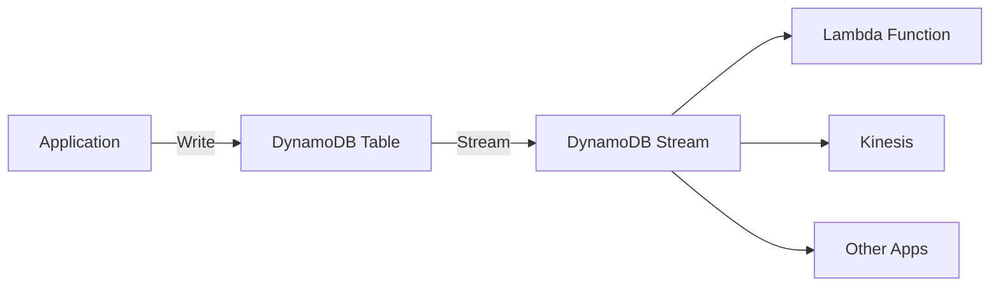
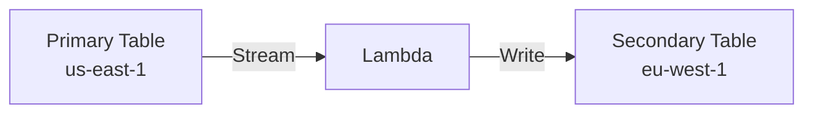

# DynamoDB Streams

## What are DynamoDB Streams?

DynamoDB Streams captures a time-ordered sequence of item-level changes in a table:



## Stream Events

```python
stream_events = {
    "INSERT": "New item added",
    "MODIFY": "Existing item updated",
    "REMOVE": "Item deleted"
}

# Stream record example
stream_record = {
    "eventID": "1234567890",
    "eventName": "INSERT",
    "eventVersion": "1.1",
    "eventSource": "aws:dynamodb",
    "awsRegion": "us-east-1",
    "dynamodb": {
        "Keys": {
            "PK": {"S": "USER#user-123"},
            "SK": {"S": "PET#pet-001"}
        },
        "NewImage": {
            "PK": {"S": "USER#user-123"},
            "SK": {"S": "PET#pet-001"},
            "name": {"S": "Buddy"},
            "species": {"S": "dog"}
        },
        "OldImage": None,  # For INSERT, no old image
        "SequenceNumber": "111111111111",
        "SizeBytes": 123,
        "StreamViewType": "NEW_AND_OLD_IMAGES"
    }
}
```

## Enabling Streams

```python
import boto3

dynamodb = boto3.client('dynamodb')

# Enable streams on existing table
dynamodb.update_table(
    TableName='PetTracker',
    StreamSpecification={
        'StreamEnabled': True,
        'StreamViewType': 'NEW_AND_OLD_IMAGES'
    }
)

# Or at table creation
dynamodb.create_table(
    TableName='PetTracker-WithStreams',
    KeySchema=[...],
    AttributeDefinitions=[...],
    BillingMode='PAY_PER_REQUEST',
    StreamSpecification={
        'StreamEnabled': True,
        'StreamViewType': 'NEW_AND_OLD_IMAGES'
    }
)
```

## Stream View Types

```python
stream_view_types = {
    "KEYS_ONLY": {
        "description": "Only primary key attributes",
        "use_case": "When you just need to know what changed",
        "size": "Smallest"
    },
    "NEW_IMAGE": {
        "description": "Entire item after modification",
        "use_case": "Replicating data to other systems",
        "size": "Medium"
    },
    "OLD_IMAGE": {
        "description": "Entire item before modification",
        "use_case": "Audit trails, rollback capability",
        "size": "Medium"
    },
    "NEW_AND_OLD_IMAGES": {
        "description": "Both before and after",
        "use_case": "Calculating differences, full audit",
        "size": "Largest"
    }
}
```

## Lambda Integration

### Event Source Mapping

```python
import boto3

lambda_client = boto3.client('lambda')

# Create event source mapping
response = lambda_client.create_event_source_mapping(
    EventSourceArn='arn:aws:dynamodb:us-east-1:123456789012:table/PetTracker/stream/2024-01-15',
    FunctionName='process-pet-changes',
    StartingPosition='LATEST',  # or 'TRIM_HORIZON' for all records
    BatchSize=100,
    MaximumBatchingWindowInSeconds=5,
    ParallelizationFactor=10,  # Up to 10 concurrent Lambda invocations per shard
    FilterCriteria={
        'Filters': [
            {
                'Pattern': '{"eventName": ["INSERT", "MODIFY"]}'
            }
        ]
    }
)
```

### Lambda Function

```python
# lambda_function.py
import json

def handler(event, context):
    """Process DynamoDB stream records"""

    for record in event['Records']:
        event_name = record['eventName']
        keys = record['dynamodb']['Keys']

        pk = keys['PK']['S']
        sk = keys['SK']['S']

        print(f"Event: {event_name} on {pk}/{sk}")

        if event_name == 'INSERT':
            new_image = record['dynamodb'].get('NewImage', {})
            process_new_item(new_image)

        elif event_name == 'MODIFY':
            old_image = record['dynamodb'].get('OldImage', {})
            new_image = record['dynamodb'].get('NewImage', {})
            process_update(old_image, new_image)

        elif event_name == 'REMOVE':
            old_image = record['dynamodb'].get('OldImage', {})
            process_deletion(old_image)

    return {'statusCode': 200}


def process_new_item(item):
    """Handle new item creation"""
    # Example: Send welcome notification for new pets
    if item.get('SK', {}).get('S', '').startswith('PET#'):
        pet_name = item.get('name', {}).get('S', 'Unknown')
        print(f"New pet added: {pet_name}")


def process_update(old_item, new_item):
    """Handle item updates"""
    # Example: Track weight changes
    old_weight = float(old_item.get('weightKg', {}).get('N', 0))
    new_weight = float(new_item.get('weightKg', {}).get('N', 0))

    if abs(new_weight - old_weight) > 2:
        print(f"Significant weight change: {old_weight} -> {new_weight}")


def process_deletion(item):
    """Handle item deletion"""
    print(f"Item deleted: {item}")
```

## Event Filtering

```python
# Filter to only process specific events
filter_patterns = {
    "only_inserts": {
        "Pattern": '{"eventName": ["INSERT"]}'
    },
    "pet_events_only": {
        "Pattern": '{"dynamodb": {"Keys": {"SK": {"S": [{"prefix": "PET#"}]}}}}'
    },
    "species_dog": {
        "Pattern": '{"dynamodb": {"NewImage": {"species": {"S": ["dog"]}}}}'
    },
    "large_items": {
        "Pattern": '{"dynamodb": {"SizeBytes": [{"numeric": [">=", 1000]}]}}'
    }
}
```

## Common Use Cases

### 1. Cross-Region Replication



```python
def replicate_handler(event, context):
    """Replicate to another region"""
    target_table = boto3.resource('dynamodb', region_name='eu-west-1').Table('PetTracker-Replica')

    for record in event['Records']:
        if record['eventName'] in ['INSERT', 'MODIFY']:
            new_image = deserialize(record['dynamodb']['NewImage'])
            target_table.put_item(Item=new_image)
        elif record['eventName'] == 'REMOVE':
            keys = deserialize(record['dynamodb']['Keys'])
            target_table.delete_item(Key=keys)
```

### 2. Materialized Views

```python
def update_leaderboard(event, context):
    """Update leaderboard view from activity events"""
    for record in event['Records']:
        if record['eventName'] == 'INSERT':
            new_image = deserialize(record['dynamodb']['NewImage'])

            if new_image['entityType'] == 'ACTIVITY':
                pet_id = new_image['petId']
                activity_type = new_image['type']

                # Update activity count in leaderboard
                table.update_item(
                    Key={'PK': 'LEADERBOARD', 'SK': f'PET#{pet_id}'},
                    UpdateExpression='ADD activityCount :inc',
                    ExpressionAttributeValues={':inc': 1}
                )
```

### 3. Elasticsearch Sync

```python
from elasticsearch import Elasticsearch

es = Elasticsearch(['https://search-domain.es.amazonaws.com'])

def sync_to_elasticsearch(event, context):
    """Sync DynamoDB changes to Elasticsearch"""
    for record in event['Records']:
        pk = record['dynamodb']['Keys']['PK']['S']
        sk = record['dynamodb']['Keys']['SK']['S']
        doc_id = f"{pk}#{sk}"

        if record['eventName'] in ['INSERT', 'MODIFY']:
            document = deserialize(record['dynamodb']['NewImage'])
            es.index(index='pets', id=doc_id, body=document)

        elif record['eventName'] == 'REMOVE':
            es.delete(index='pets', id=doc_id)
```

## Alex's Stream Architecture

```python
class PetTrackerStreamProcessor:
    """
    Process PetTracker DynamoDB stream events
    """

    def __init__(self):
        self.sns = boto3.client('sns')
        self.table = boto3.resource('dynamodb').Table('PetTracker')

    def handler(self, event, context):
        for record in event['Records']:
            try:
                self.process_record(record)
            except Exception as e:
                print(f"Error processing record: {e}")
                # Don't raise - continue processing other records

    def process_record(self, record):
        event_name = record['eventName']
        new_image = deserialize(record['dynamodb'].get('NewImage', {}))

        entity_type = new_image.get('entityType')

        if entity_type == 'PET':
            self.process_pet_event(event_name, new_image, record)
        elif entity_type == 'ACTIVITY':
            self.process_activity_event(event_name, new_image, record)

    def process_pet_event(self, event_name, item, record):
        if event_name == 'INSERT':
            # Welcome notification
            self.sns.publish(
                TopicArn='arn:aws:sns:us-east-1:123456:pet-notifications',
                Message=f"Welcome {item['name']} to PetTracker!",
                MessageAttributes={
                    'userId': {'DataType': 'String', 'StringValue': item['userId']},
                    'eventType': {'DataType': 'String', 'StringValue': 'NEW_PET'}
                }
            )

    def process_activity_event(self, event_name, item, record):
        if event_name == 'INSERT':
            # Update daily activity summary
            date = item['timestamp'][:10]  # YYYY-MM-DD
            self.table.update_item(
                Key={'PK': f"PET#{item['petId']}", 'SK': f"SUMMARY#{date}"},
                UpdateExpression='ADD activityCount :inc SET lastActivity = :type',
                ExpressionAttributeValues={
                    ':inc': 1,
                    ':type': item['type']
                }
            )
```

## Exam Tips

**For DVA-C02:**

1. **Stream records stored 24 hours**
2. **4 view types** - KEYS_ONLY to NEW_AND_OLD_IMAGES
3. **Lambda is primary consumer** via event source mapping
4. **Records are sharded** - parallel processing possible
5. **Exactly-once semantics** not guaranteed - design idempotent handlers

**Common scenarios:**

> "Replicate data to another region..."
> → DynamoDB Streams + Lambda

> "Trigger action on data change..."
> → Stream with Lambda

> "Sync to Elasticsearch..."
> → Stream processing to ES

## Key Takeaways

1. **Streams capture changes** in time order
2. **24-hour retention** for stream records
3. **Lambda integration** via event source mapping
4. **Filter events** to reduce Lambda invocations
5. **Design idempotent** handlers
6. **Common patterns**: replication, sync, notifications

---

*Next: Transactions and batch operations.*
