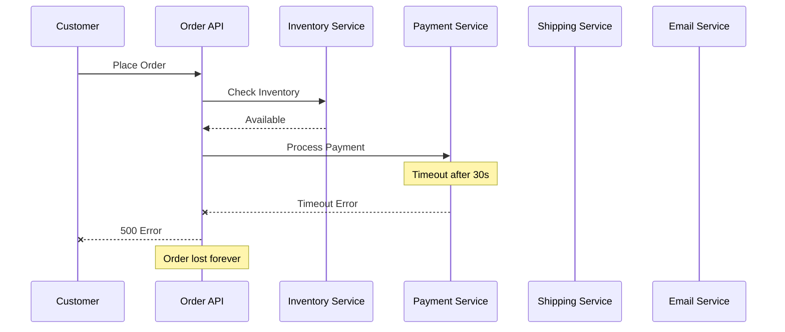
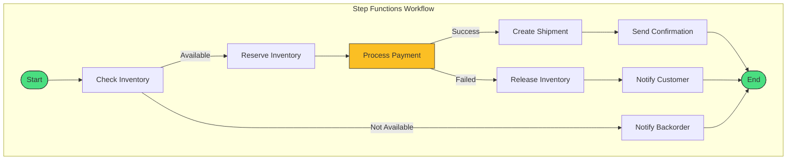

# Alex's Challenge: The Order Processing Nightmare

## The Day Chaos Struck

It's Black Friday, and PetTracker has launched a new feature: **PetSupply Express** - same-day delivery for pet supplies. Orders are flooding in, and the backend is struggling.

"We've got a problem," Maya announces, staring at her screen. "The order processing is falling apart."

Alex pulls up the monitoring dashboard and sees the carnage:

```terminal
$ aws cloudwatch get-metric-statistics --namespace PetTracker/Orders --metric-name FailedOrders
{
    "Label": "FailedOrders",
    "Datapoints": [
        {"Timestamp": "2024-11-29T10:00:00Z", "Sum": 47.0},
        {"Timestamp": "2024-11-29T11:00:00Z", "Sum": 156.0},
        {"Timestamp": "2024-11-29T12:00:00Z", "Sum": 892.0}
    ]
}
```

:::floating:right:1/2
```email
@critical
From: cfo@pettracker.com
To: engineering@pettracker.com
Subject: BLACK FRIDAY DISASTER - Lost Revenue
Date: November 29, 2024 1:15 PM
---
We've lost over $50,000 in orders this morning.
Customers are furious - social media is on fire.

I need answers NOW. Why are orders failing?
What's your plan to fix this?
```

The pressure was mounting. Every failed order meant lost revenue and angry customers. Alex needed to understand why the system was breaking down before proposing a solution.
:::

## The Root Cause

Alex examines the current order processing architecture:



"The problem is clear," Alex explains to the team. "Our order processing is a chain of synchronous calls. If any step fails or times out, the entire order fails."

**The Issues:**

```mistakes
Payment service timeouts cause entire orders to fail
No way to retry failed steps without reprocessing everything
Inventory reserved but payment failed - now we have ghost reservations
Shipping service was never called - customer charged but no delivery scheduled
No visibility into where orders fail in the pipeline
```

## The Business Impact

| Metric | Expected | Actual |
|--------|----------|--------|
| Order success rate | 99.5% | 67.3% |
| Average processing time | 2 seconds | 45 seconds |
| Failed orders (Black Friday) | ~50 | 1,095 |
| Revenue lost | $0 | $54,750 |
| Support tickets | 10 | 487 |

## Sam's Solution: Step Functions

:::floating:right:1/2


Sam pulls up the AWS Console to show Alex what a properly orchestrated workflow looks like. The visual editor makes it easy to see each step and its connections.
:::

Sam, the DevOps mentor, reviews the architecture and smiles.

"This is a classic orchestration problem," Sam explains. "What you need is **AWS Step Functions** - a serverless workflow service that coordinates distributed applications."



"See the difference?" Sam asks. "With Step Functions:

```checklist
Each step is independent and can be retried individually
The workflow state is persisted - if something fails, you know exactly where
Built-in error handling with catch and retry logic
Visual monitoring shows exactly where each order is in the pipeline
Automatic compensation - if payment fails, inventory is released
```

## What Alex Needs to Learn

To rebuild PetTracker's order processing, Alex needs to understand:

1. **Step Functions Basics**
   - State machines and workflows
   - Amazon States Language (ASL)
   - Standard vs Express workflows

2. **State Types**
   - Task states for work execution
   - Choice states for branching
   - Parallel states for concurrent execution
   - Wait states for delays
   - Map states for iteration

3. **Error Handling**
   - Retry policies
   - Catch blocks
   - Fallback states

4. **Integration Patterns**
   - Lambda integration
   - Service integrations (DynamoDB, SQS, SNS)
   - Callback patterns for human approval

## The Challenge

Help Alex rebuild the order processing system to be:

- **Resilient**: Individual step failures don't crash the whole order
- **Observable**: Visual tracking of every order through the pipeline
- **Recoverable**: Failed steps can be retried or compensated
- **Scalable**: Handle Black Friday traffic without breaking

## Key Terms to Know

| Term | Definition |
|------|------------|
| **State Machine** | A workflow defined as a series of states and transitions |
| **Amazon States Language (ASL)** | JSON-based language for defining Step Functions workflows |
| **Task State** | A state that performs work (invokes Lambda, API, etc.) |
| **Choice State** | A state that branches based on conditions |
| **Parallel State** | A state that executes multiple branches simultaneously |
| **Standard Workflow** | Long-running, durable workflows (up to 1 year) |
| **Express Workflow** | High-volume, short-duration workflows (up to 5 minutes) |

---

*Next: Let's dive into Step Functions basics and learn how to build our first workflow.*

---
*v2.0*
