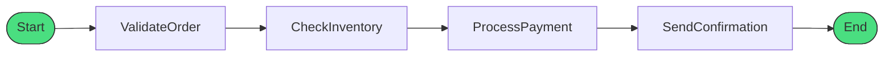

# Step Functions Fundamentals

## What is AWS Step Functions?

AWS Step Functions is a serverless orchestration service that lets you coordinate multiple AWS services into serverless workflows. Think of it as a visual workflow designer that manages the state, checkpoints, and restarts of your application.

:::sidebyside:right:1/2


Instead of writing complex error handling, retry logic, and state management code in your Lambda functions, Step Functions handles all of this declaratively.
:::

## Your First State Machine

Let's create Alex's first Step Functions workflow - a simple order validation flow:

```terminal
$ aws stepfunctions create-state-machine \
    --name "OrderValidation" \
    --definition file://order-validation.json \
    --role-arn arn:aws:iam::123456789012:role/StepFunctionsRole
{
    "stateMachineArn": "arn:aws:states:us-east-1:123456789012:stateMachine:OrderValidation",
    "creationDate": "2024-11-29T14:30:00Z"
}
```

## Amazon States Language (ASL)

Step Functions workflows are defined using **Amazon States Language (ASL)** - a JSON-based language. Here's the basic structure:

```json
{
  "Comment": "Order Validation Workflow",
  "StartAt": "ValidateOrder",
  "States": {
    "ValidateOrder": {
      "Type": "Task",
      "Resource": "arn:aws:lambda:us-east-1:123456789012:function:ValidateOrder",
      "Next": "CheckInventory"
    },
    "CheckInventory": {
      "Type": "Task",
      "Resource": "arn:aws:lambda:us-east-1:123456789012:function:CheckInventory",
      "End": true
    }
  }
}
```

```info
Every state machine needs three things:
1. **StartAt** - The name of the first state to execute
2. **States** - An object containing all state definitions
3. Each state needs either **Next** (go to another state) or **End: true** (finish)
```

## State Machine Components

### The Anatomy of a State

Every state in ASL has common fields:

| Field | Required | Description |
|-------|----------|-------------|
| `Type` | Yes | The type of state (Task, Choice, Wait, etc.) |
| `Next` | Conditional | The next state to transition to |
| `End` | Conditional | Set to `true` if this is a terminal state |
| `Comment` | No | Human-readable description |
| `InputPath` | No | Filter the input before processing |
| `OutputPath` | No | Filter the output before passing to next state |
| `ResultPath` | No | Where to place the result in the state |

### Input and Output Processing

Step Functions passes data between states as JSON. You can control how data flows:


**Example - Filtering Input:**

```json
{
  "Type": "Task",
  "Resource": "arn:aws:lambda:...",
  "InputPath": "$.order",
  "ResultPath": "$.validationResult",
  "OutputPath": "$",
  "Next": "NextState"
}
```

Given this input:
```json
{
  "order": {
    "id": "ORD-123",
    "items": ["item1", "item2"]
  },
  "customer": {
    "id": "CUST-456"
  }
}
```

- **InputPath** `$.order` → Lambda receives only `{"id": "ORD-123", "items": [...]}`
- **ResultPath** `$.validationResult` → Lambda result placed at this path
- **OutputPath** `$` → Pass entire state to next step

## Running a State Machine

### Starting an Execution

```terminal
$ aws stepfunctions start-execution \
    --state-machine-arn arn:aws:states:us-east-1:123456789012:stateMachine:OrderValidation \
    --input '{"orderId": "ORD-789", "items": [{"sku": "PET-001", "qty": 2}]}'
{
    "executionArn": "arn:aws:states:us-east-1:123456789012:execution:OrderValidation:exec-abc123",
    "startDate": "2024-11-29T14:35:00Z"
}
```

### Checking Execution Status

```terminal
$ aws stepfunctions describe-execution \
    --execution-arn arn:aws:states:us-east-1:123456789012:execution:OrderValidation:exec-abc123
{
    "executionArn": "arn:aws:states:...:exec-abc123",
    "stateMachineArn": "arn:aws:states:...:OrderValidation",
    "status": "SUCCEEDED",
    "startDate": "2024-11-29T14:35:00Z",
    "stopDate": "2024-11-29T14:35:02Z",
    "input": "{\"orderId\": \"ORD-789\", ...}",
    "output": "{\"orderId\": \"ORD-789\", \"validated\": true, ...}"
}
```

## PetTracker Example: Simple Order Flow

Alex creates the first version of the order processing workflow:

```json
{
  "Comment": "PetTracker Order Processing - v1",
  "StartAt": "ValidateOrder",
  "States": {
    "ValidateOrder": {
      "Type": "Task",
      "Resource": "arn:aws:lambda:us-east-1:123456789012:function:ValidateOrder",
      "Comment": "Validate order details and customer info",
      "Next": "CheckInventory"
    },
    "CheckInventory": {
      "Type": "Task",
      "Resource": "arn:aws:lambda:us-east-1:123456789012:function:CheckInventory",
      "Comment": "Verify items are in stock",
      "Next": "ProcessPayment"
    },
    "ProcessPayment": {
      "Type": "Task",
      "Resource": "arn:aws:lambda:us-east-1:123456789012:function:ProcessPayment",
      "Comment": "Charge customer payment method",
      "Next": "SendConfirmation"
    },
    "SendConfirmation": {
      "Type": "Task",
      "Resource": "arn:aws:lambda:us-east-1:123456789012:function:SendConfirmation",
      "Comment": "Send order confirmation email",
      "End": true
    }
  }
}
```



```warning
This simple flow has no error handling yet! If any step fails, the entire execution fails. We'll add error handling in lesson 04.
```

## Visual Workflow in Console

One of Step Functions' best features is the visual representation in the AWS Console:

```checklist
See exactly which state is currently executing
View the input and output of each state
Trace the path taken through the workflow
Identify failed states at a glance
Inspect error messages and stack traces
```

## Hands-On: Create Your First Workflow

Try creating a simple workflow in the AWS Console:

```terminal
# 1. Create the IAM role for Step Functions
$ aws iam create-role \
    --role-name StepFunctionsBasicRole \
    --assume-role-policy-document '{
      "Version": "2012-10-17",
      "Statement": [{
        "Effect": "Allow",
        "Principal": {"Service": "states.amazonaws.com"},
        "Action": "sts:AssumeRole"
      }]
    }'

# 2. Create a simple Pass state workflow (no Lambda needed)
$ aws stepfunctions create-state-machine \
    --name "HelloStepFunctions" \
    --definition '{
      "StartAt": "Hello",
      "States": {
        "Hello": {
          "Type": "Pass",
          "Result": {"message": "Hello from Step Functions!"},
          "End": true
        }
      }
    }' \
    --role-arn arn:aws:iam::123456789012:role/StepFunctionsBasicRole
```

```tip
The **Pass** state is perfect for testing and prototyping. It simply passes its input to its output, optionally adding or transforming data. No Lambda required!
```

## Key Takeaways

```checklist
Step Functions coordinates microservices into visual workflows
Amazon States Language (ASL) defines workflows in JSON
Every state needs Type and either Next or End
InputPath, ResultPath, OutputPath control data flow between states
The visual console makes debugging workflows intuitive
```

## Common Mistakes

```mistakes
Forgetting to set either Next or End on a state
Using End: false instead of just removing the End field
Not creating an IAM role with proper permissions for Step Functions
Putting business logic in the state machine instead of Lambda functions
```

---

*Next: Deep dive into all the different state types available in Step Functions.*

---
*v2.0*
