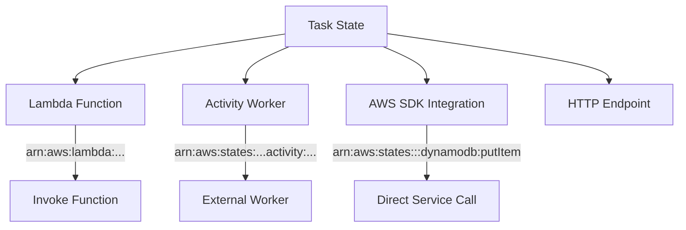
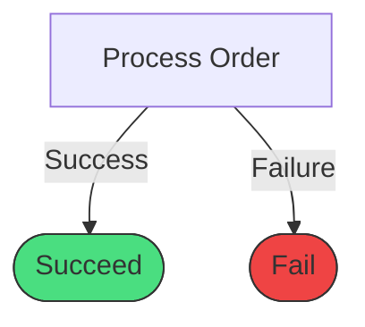
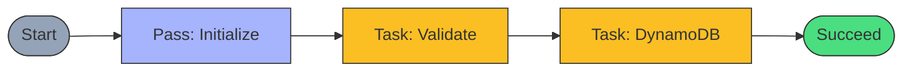

# State Types Deep Dive

## The Eight State Types

Step Functions provides eight different state types, each serving a specific purpose:

| State Type | Purpose | Use Case |
|------------|---------|----------|
| **Task** | Execute work | Call Lambda, API, service |
| **Pass** | Pass data through | Transform data, placeholder |
| **Choice** | Branch logic | If/else decisions |
| **Wait** | Delay execution | Time-based pauses |
| **Succeed** | End successfully | Terminal success state |
| **Fail** | End with failure | Terminal error state |
| **Parallel** | Concurrent execution | Run branches simultaneously |
| **Map** | Iterate over arrays | Process collections |

## Task State

The **Task** state performs work by calling a resource - most commonly a Lambda function.

```json
{
  "ProcessOrder": {
    "Type": "Task",
    "Resource": "arn:aws:lambda:us-east-1:123456789012:function:ProcessOrder",
    "TimeoutSeconds": 300,
    "HeartbeatSeconds": 60,
    "Next": "NotifyCustomer"
  }
}
```

### Task Resource Types

:::sidebyside:left:1/2


Step Functions can invoke various resource types:
- **Lambda** - Most common, serverless compute
- **AWS SDK Integrations** - Direct service calls (200+ services)
- **Activities** - Long-running external workers
- **HTTP Tasks** - Call HTTP endpoints
:::

### SDK Integration Patterns

Two ways to call AWS services:

```json
// Request-Response (synchronous)
{
  "Type": "Task",
  "Resource": "arn:aws:states:::dynamodb:putItem",
  "Parameters": {
    "TableName": "Orders",
    "Item": {
      "orderId": {"S.$": "$.orderId"}
    }
  }
}

// Wait for Callback (.waitForTaskToken)
{
  "Type": "Task",
  "Resource": "arn:aws:states:::sqs:sendMessage.waitForTaskToken",
  "Parameters": {
    "QueueUrl": "https://sqs.us-east-1.amazonaws.com/...",
    "MessageBody": {
      "taskToken.$": "$$.Task.Token"
    }
  }
}
```

```info
The `.waitForTaskToken` suffix tells Step Functions to pause and wait for an external process to call `SendTaskSuccess` or `SendTaskFailure` with the token.
```

## Pass State

The **Pass** state passes input to output, optionally transforming data. Great for prototyping and data transformation.

```json
{
  "SetDefaults": {
    "Type": "Pass",
    "Result": {
      "status": "pending",
      "priority": "normal"
    },
    "ResultPath": "$.defaults",
    "Next": "ProcessOrder"
  }
}
```

**Use cases:**

```checklist
Add default values to the state
Transform or restructure data
Create placeholder states during development
Inject fixed values into the workflow
```

### Data Transformation with Pass

```json
{
  "TransformData": {
    "Type": "Pass",
    "Parameters": {
      "orderId.$": "$.order.id",
      "customerEmail.$": "$.customer.email",
      "itemCount.$": "States.ArrayLength($.items)",
      "timestamp.$": "$$.State.EnteredTime"
    },
    "Next": "SendNotification"
  }
}
```

## Succeed and Fail States

Terminal states that end execution:

### Succeed State

```json
{
  "OrderComplete": {
    "Type": "Succeed"
  }
}
```

### Fail State

```json
{
  "OrderFailed": {
    "Type": "Fail",
    "Error": "OrderProcessingError",
    "Cause": "Payment was declined"
  }
}
```

:::floating:right:1/3


Use these to explicitly end your workflow with a clear status.
:::

```warning
A Fail state always ends the execution as failed. Use it for unrecoverable errors, not for handled business logic failures.
```

## PetTracker Example: State Types in Action

Alex combines multiple state types for order processing:

```json
{
  "Comment": "PetTracker Order Processing with Multiple State Types",
  "StartAt": "InitializeOrder",
  "States": {
    "InitializeOrder": {
      "Type": "Pass",
      "Result": {
        "status": "processing",
        "attempts": 0
      },
      "ResultPath": "$.metadata",
      "Next": "ValidateOrder"
    },
    "ValidateOrder": {
      "Type": "Task",
      "Resource": "arn:aws:lambda:...:function:ValidateOrder",
      "Next": "SaveToDatabase"
    },
    "SaveToDatabase": {
      "Type": "Task",
      "Resource": "arn:aws:states:::dynamodb:putItem",
      "Parameters": {
        "TableName": "Orders",
        "Item": {
          "orderId": {"S.$": "$.orderId"},
          "status": {"S.$": "$.metadata.status"},
          "items": {"S.$": "States.JsonToString($.items)"}
        }
      },
      "Next": "ProcessingComplete"
    },
    "ProcessingComplete": {
      "Type": "Succeed"
    }
  }
}
```



## Intrinsic Functions

Step Functions provides built-in functions for data manipulation:

| Function | Description | Example |
|----------|-------------|---------|
| `States.Format` | String formatting | `States.Format('Order {}', $.id)` |
| `States.StringToJson` | Parse JSON string | `States.StringToJson($.jsonString)` |
| `States.JsonToString` | Stringify JSON | `States.JsonToString($.object)` |
| `States.Array` | Create array | `States.Array($.a, $.b, $.c)` |
| `States.ArrayLength` | Array length | `States.ArrayLength($.items)` |
| `States.ArrayContains` | Check membership | `States.ArrayContains($.arr, $.val)` |
| `States.UUID` | Generate UUID | `States.UUID()` |
| `States.MathAdd` | Addition | `States.MathAdd($.a, $.b)` |

**Example with intrinsic functions:**

```json
{
  "GenerateOrderId": {
    "Type": "Pass",
    "Parameters": {
      "orderId.$": "States.Format('ORD-{}', States.UUID())",
      "itemCount.$": "States.ArrayLength($.items)",
      "totalWithTax.$": "States.MathAdd($.subtotal, $.tax)"
    },
    "Next": "ProcessOrder"
  }
}
```

## Context Object ($$)

Access execution metadata using the `$$` prefix:

```json
{
  "Parameters": {
    "executionId.$": "$$.Execution.Id",
    "stateName.$": "$$.State.Name",
    "startTime.$": "$$.Execution.StartTime",
    "taskToken.$": "$$.Task.Token"
  }
}
```

| Path | Description |
|------|-------------|
| `$$.Execution.Id` | Execution ARN |
| `$$.Execution.Name` | Execution name |
| `$$.Execution.StartTime` | ISO timestamp |
| `$$.State.Name` | Current state name |
| `$$.State.EnteredTime` | State entry time |
| `$$.Task.Token` | Callback token (if applicable) |

## Key Takeaways

```checklist
Task states do the actual work - calling Lambda or AWS services
Pass states transform data without external calls
Succeed and Fail are terminal states for clear endings
Intrinsic functions provide data manipulation without Lambda
Context object ($$) gives access to execution metadata
```

## Common Mistakes

```mistakes
Using Task state when Pass would suffice for simple transformations
Forgetting that Fail state always fails the execution
Not using intrinsic functions and writing Lambda for simple operations
Confusing $ (input data) with $$ (context object)
```

---

*Next: Learn about Choice and Parallel states for branching and concurrent workflows.*

---
*v2.0*
