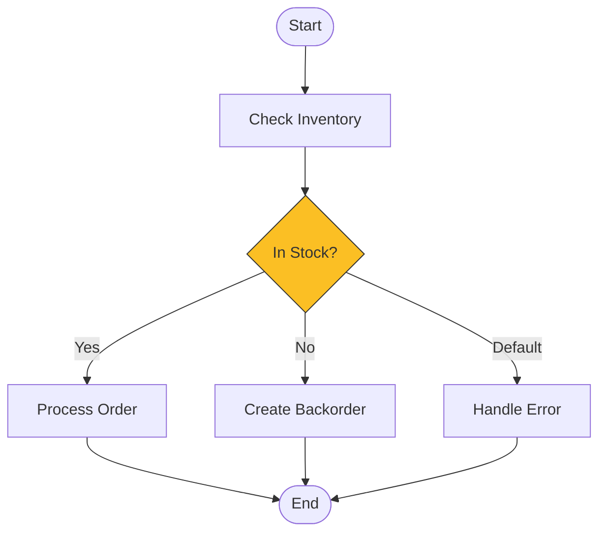
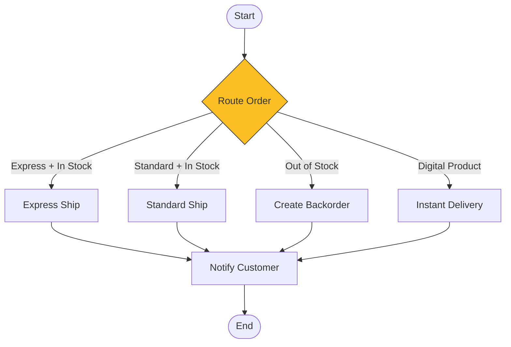
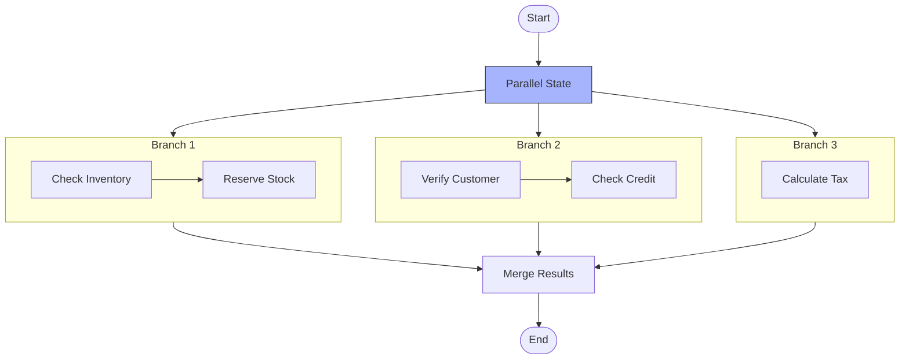
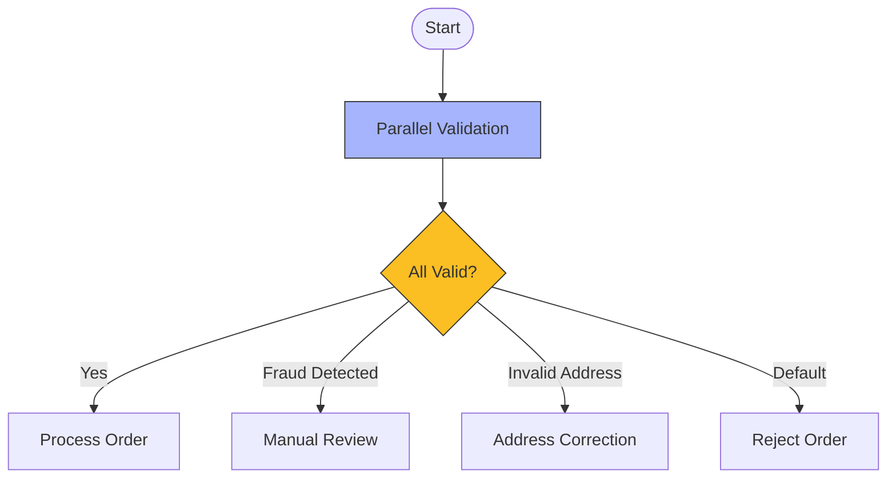

# Choice and Parallel States

## Choice State: Branching Logic

The **Choice** state adds conditional branching to your workflow - like if/else statements in code.



### Choice State Structure

```json
{
  "CheckInventory": {
    "Type": "Choice",
    "Choices": [
      {
        "Variable": "$.inventory.available",
        "NumericGreaterThan": 0,
        "Next": "ProcessOrder"
      },
      {
        "Variable": "$.inventory.backorderAllowed",
        "BooleanEquals": true,
        "Next": "CreateBackorder"
      }
    ],
    "Default": "OutOfStock"
  }
}
```

```info
The **Default** field is required as a fallback when no conditions match. Without it, your workflow will fail if all conditions are false.
```

### Comparison Operators

| Operator | Description | Example |
|----------|-------------|---------|
| `StringEquals` | Exact string match | `"StringEquals": "approved"` |
| `StringMatches` | Wildcard pattern | `"StringMatches": "order-*"` |
| `NumericEquals` | Number equality | `"NumericEquals": 100` |
| `NumericGreaterThan` | Greater than | `"NumericGreaterThan": 0` |
| `NumericLessThanEquals` | Less or equal | `"NumericLessThanEquals": 10` |
| `BooleanEquals` | Boolean match | `"BooleanEquals": true` |
| `IsPresent` | Field exists | `"IsPresent": true` |
| `IsNull` | Field is null | `"IsNull": false` |
| `IsString` | Type check | `"IsString": true` |
| `TimestampEquals` | Time comparison | `"TimestampEquals": "2024-01-01T00:00:00Z"` |

### Combining Conditions

Use `And`, `Or`, and `Not` for complex logic:

```json
{
  "Type": "Choice",
  "Choices": [
    {
      "And": [
        {
          "Variable": "$.order.total",
          "NumericGreaterThan": 100
        },
        {
          "Variable": "$.customer.isPremium",
          "BooleanEquals": true
        }
      ],
      "Next": "ApplyPremiumDiscount"
    },
    {
      "Or": [
        {
          "Variable": "$.order.type",
          "StringEquals": "express"
        },
        {
          "Variable": "$.order.priority",
          "StringEquals": "high"
        }
      ],
      "Next": "PriorityProcessing"
    },
    {
      "Not": {
        "Variable": "$.customer.verified",
        "BooleanEquals": true
      },
      "Next": "VerifyCustomer"
    }
  ],
  "Default": "StandardProcessing"
}
```

## PetTracker: Order Routing with Choice

Alex implements intelligent order routing based on order type and inventory:

:::sidebyside:right:1/2


The Choice state evaluates conditions in order, so put specific conditions before general ones.
:::

```json
{
  "RouteOrder": {
    "Type": "Choice",
    "Choices": [
      {
        "And": [
          {"Variable": "$.product.type", "StringEquals": "digital"},
          {"Variable": "$.payment.status", "StringEquals": "complete"}
        ],
        "Next": "InstantDelivery"
      },
      {
        "And": [
          {"Variable": "$.shipping.type", "StringEquals": "express"},
          {"Variable": "$.inventory.available", "NumericGreaterThan": 0}
        ],
        "Next": "ExpressShipping"
      },
      {
        "Variable": "$.inventory.available",
        "NumericGreaterThan": 0,
        "Next": "StandardShipping"
      }
    ],
    "Default": "CreateBackorder"
  }
}
```

## Parallel State: Concurrent Execution

The **Parallel** state executes multiple branches simultaneously - perfect for tasks that don't depend on each other.



### Parallel State Structure

```json
{
  "ProcessOrderParallel": {
    "Type": "Parallel",
    "Branches": [
      {
        "StartAt": "CheckInventory",
        "States": {
          "CheckInventory": {
            "Type": "Task",
            "Resource": "arn:aws:lambda:...:CheckInventory",
            "Next": "ReserveStock"
          },
          "ReserveStock": {
            "Type": "Task",
            "Resource": "arn:aws:lambda:...:ReserveStock",
            "End": true
          }
        }
      },
      {
        "StartAt": "VerifyCustomer",
        "States": {
          "VerifyCustomer": {
            "Type": "Task",
            "Resource": "arn:aws:lambda:...:VerifyCustomer",
            "End": true
          }
        }
      },
      {
        "StartAt": "CalculateTax",
        "States": {
          "CalculateTax": {
            "Type": "Task",
            "Resource": "arn:aws:lambda:...:CalculateTax",
            "End": true
          }
        }
      }
    ],
    "Next": "ProcessPayment"
  }
}
```

### Parallel Output

The output of a Parallel state is an **array** containing the output of each branch:

```json
// Input to Parallel state
{
  "orderId": "ORD-123",
  "items": [{"sku": "PET-001", "qty": 2}]
}

// Output from Parallel state (array of branch results)
[
  {"inventoryReserved": true, "reservationId": "RES-456"},
  {"customerVerified": true, "creditScore": 750},
  {"taxAmount": 8.99, "taxRate": 0.08}
]
```

```warning
Since Parallel output is an array, you'll often need a Pass state after to restructure the data for subsequent states.
```

### Merging Parallel Results

```json
{
  "MergeResults": {
    "Type": "Pass",
    "Parameters": {
      "orderId.$": "$.orderId",
      "inventory.$": "$[0]",
      "customer.$": "$[1]",
      "tax.$": "$[2]"
    },
    "Next": "ProcessPayment"
  }
}
```

## PetTracker: Parallel Order Validation

Alex speeds up order processing by running validations in parallel:

```json
{
  "ValidateOrderParallel": {
    "Type": "Parallel",
    "Branches": [
      {
        "StartAt": "ValidateItems",
        "States": {
          "ValidateItems": {
            "Type": "Task",
            "Resource": "arn:aws:lambda:...:ValidateItems",
            "End": true
          }
        }
      },
      {
        "StartAt": "ValidateAddress",
        "States": {
          "ValidateAddress": {
            "Type": "Task",
            "Resource": "arn:aws:lambda:...:ValidateAddress",
            "End": true
          }
        }
      },
      {
        "StartAt": "CheckFraud",
        "States": {
          "CheckFraud": {
            "Type": "Task",
            "Resource": "arn:aws:lambda:...:FraudDetection",
            "End": true
          }
        }
      }
    ],
    "ResultPath": "$.validations",
    "Next": "EvaluateValidations"
  }
}
```

**Performance benefit:**

| Approach | Time |
|----------|------|
| Sequential (3 Lambda calls @ 500ms each) | 1.5 seconds |
| Parallel (3 Lambda calls simultaneously) | 0.5 seconds |

## Combining Choice and Parallel

A powerful pattern - validate in parallel, then route based on results:



```json
{
  "EvaluateValidations": {
    "Type": "Choice",
    "Choices": [
      {
        "Variable": "$.validations[2].fraudScore",
        "NumericGreaterThan": 80,
        "Next": "ManualReview"
      },
      {
        "Variable": "$.validations[1].addressValid",
        "BooleanEquals": false,
        "Next": "RequestAddressCorrection"
      },
      {
        "And": [
          {"Variable": "$.validations[0].itemsValid", "BooleanEquals": true},
          {"Variable": "$.validations[1].addressValid", "BooleanEquals": true},
          {"Variable": "$.validations[2].fraudScore", "NumericLessThanEquals": 80}
        ],
        "Next": "ProcessOrder"
      }
    ],
    "Default": "RejectOrder"
  }
}
```

## Key Takeaways

```checklist
Choice state provides if/else branching with multiple conditions
Always include a Default fallback in Choice states
Parallel state runs multiple branches concurrently
Parallel output is an array of branch results in order
Combine Choice and Parallel for powerful validation patterns
```

## Common Mistakes

```mistakes
Forgetting the Default field in Choice states (causes execution failure)
Not handling the array output format from Parallel states
Putting dependent operations in parallel branches (causes race conditions)
Using sequential execution when parallel would significantly improve performance
```

---

*Next: Learn about error handling with Retry and Catch blocks.*

---
*v2.0*
