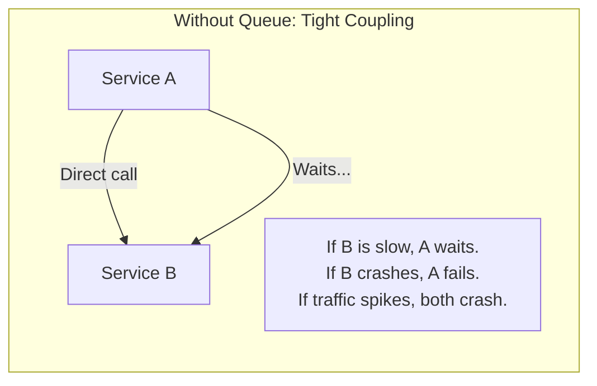
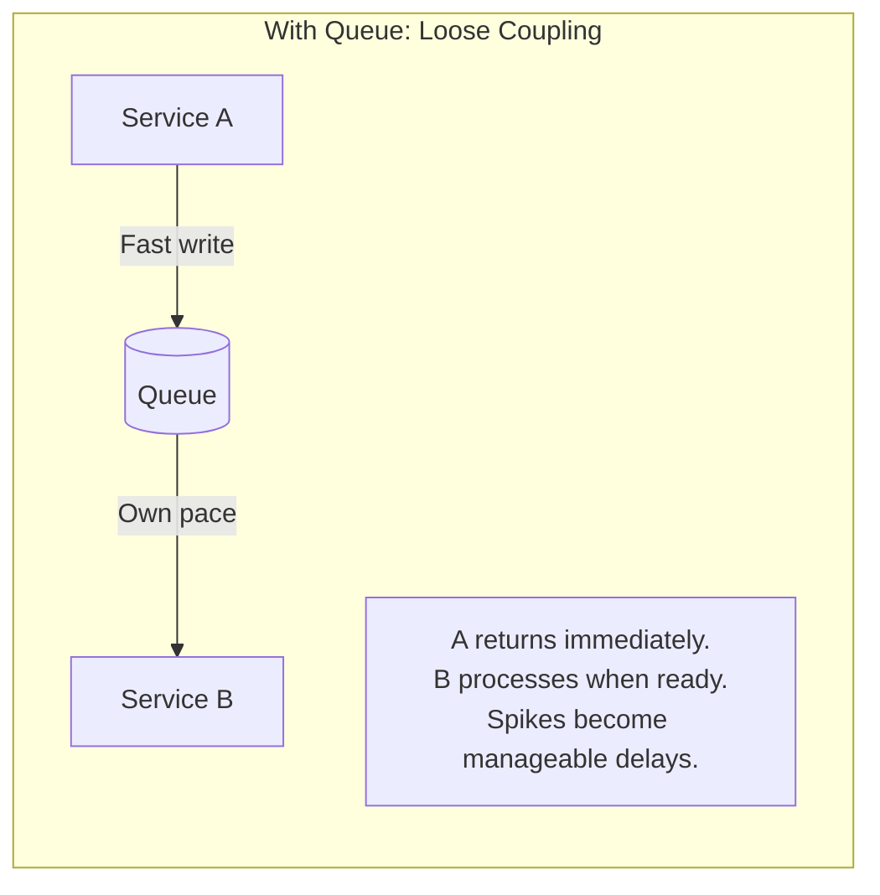
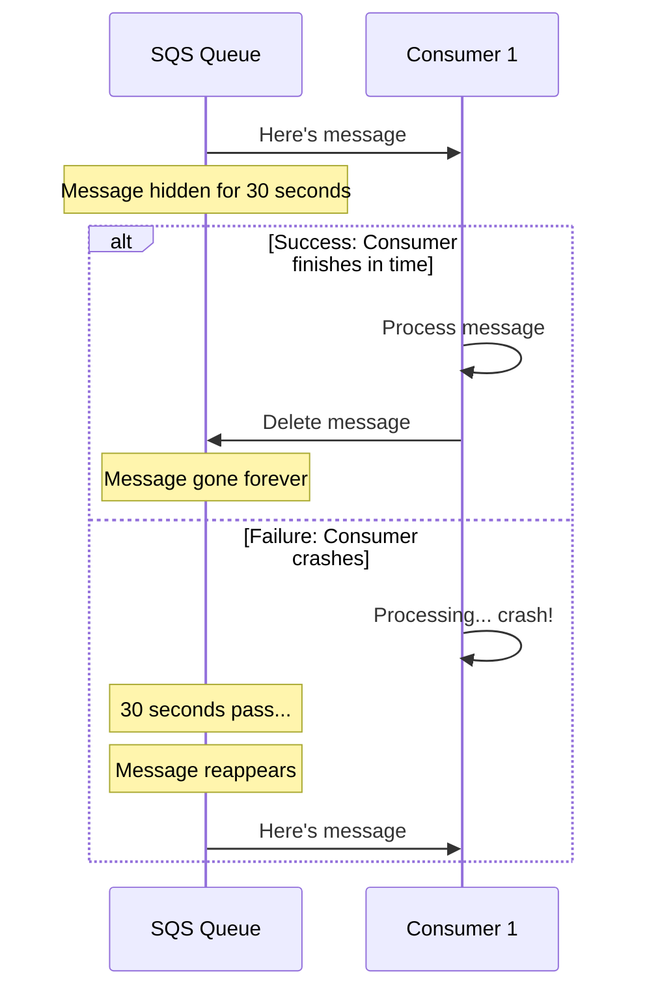
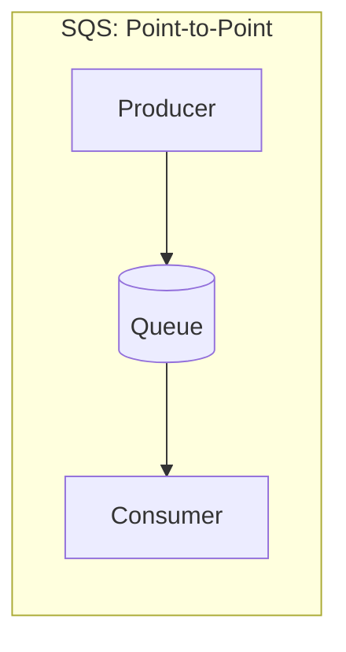
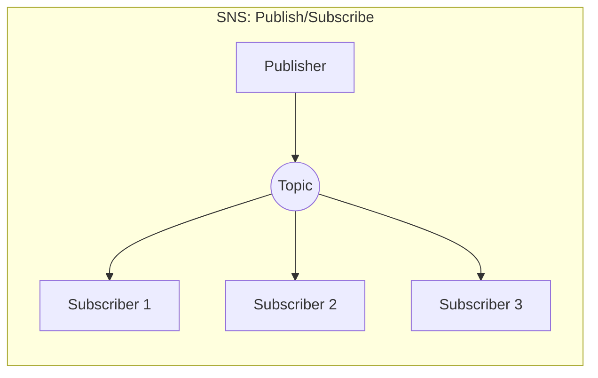
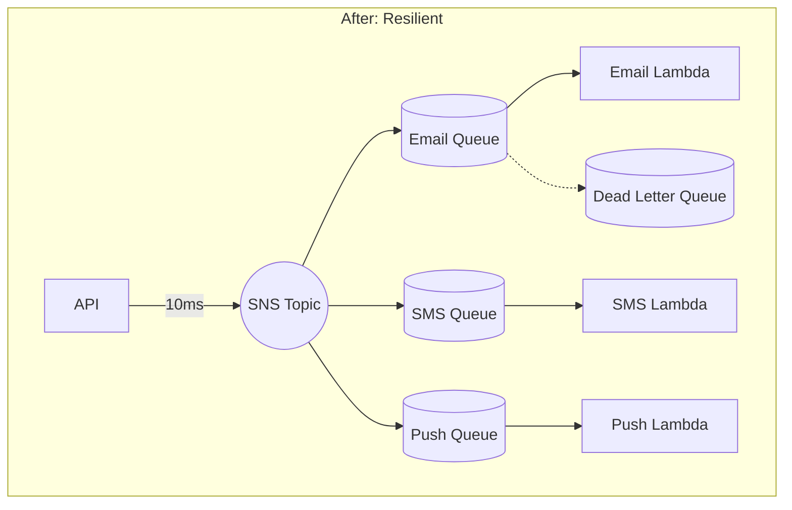

# SQS and SNS Messaging: Building Systems That Don't Break Under Pressure

## What is a Message Queue?

**A message queue is a buffer that sits between services, holding messages until the receiver is ready to process them.**

To truly understand why message queues matter, imagine a busy restaurant on a Saturday night. When 50 customers walk in at once, what happens? The kitchen doesn't try to cook 50 meals simultaneously - that would be chaos. Instead, orders go on a ticket rail. The kitchen works through tickets at a sustainable pace. Customers wait, but everyone eventually gets served.

Now imagine the alternative: the waiter takes an order and stands at the kitchen window, waiting for that meal to be prepared before taking another order. If the kitchen is slow, the waiter is blocked. If the kitchen is overwhelmed, orders get lost. If the waiter gives up waiting, the customer never gets their food.

This second scenario is exactly how most software systems are built. Service A calls Service B directly. Service A waits for a response. If Service B is slow, Service A is blocked. If Service B is overwhelmed, requests fail. If Service A times out, the work is lost.

A message queue breaks this dependency. Service A drops a message in the queue and immediately moves on. Service B picks up messages whenever it's ready, at its own pace. If there's a traffic spike, messages pile up in the queue instead of crashing your services. If Service B is temporarily down, messages wait until it recovers. No data is lost.

**The fundamental insight:** Queues separate "I want this done" from "I'm doing this now." The requester doesn't need to wait. The processor doesn't need to keep up in real-time. The queue absorbs the mismatch.

This pattern has a name: **asynchronous processing**. Instead of synchronous request-response (caller waits), you have asynchronous fire-and-forget (caller continues immediately). The queue guarantees the work will eventually be done, even if "eventually" means "whenever the processor catches up."

---

## "But Why Not Just Use a Database Table?"

This is the question every engineer asks when they first encounter message queues. It seems simpler to just insert rows into a `pending_jobs` table and have workers poll it. Let's examine why this falls apart at scale.

**The database-as-queue approach:**

1. Producer inserts a row: `INSERT INTO jobs (type, payload) VALUES ('email', '{...}')`
2. Worker polls: `SELECT * FROM jobs WHERE status='pending' LIMIT 10`
3. Worker processes and deletes: `DELETE FROM jobs WHERE id = 123`

This works fine when you're processing 100 jobs per day. But here's what happens as you scale:

**Problem 1: Polling is wasteful.** Your worker runs `SELECT * FROM jobs WHERE status='pending'` every second. When the table is empty (most of the time), you're executing queries that return nothing. At 1 query per second, that's 86,400 unnecessary database queries per day. Your database is doing work that produces no value, consuming CPU, memory, and connection pool slots.

**Problem 2: No visibility timeout.** Your worker grabs a job, starts processing, and crashes halfway through. What happens to that job?

- If you deleted it before processing: the job is lost forever
- If you didn't delete it: another worker grabs the same job, and now you're processing it twice

SQS solves this with a "visibility timeout" - messages become invisible (not deleted) when received. If the worker crashes, the message automatically reappears. If the worker succeeds, it explicitly deletes the message. You get retry behavior for free.

**Problem 3: Concurrent workers fight over rows.** Two workers both run `SELECT * FROM jobs WHERE status='pending' LIMIT 10`. They get the same 10 rows. Both try to process them. You've just doubled your work and potentially corrupted data. The fix is `SELECT ... FOR UPDATE SKIP LOCKED`, which introduces database lock contention - exactly what you were trying to avoid by going async.

**Problem 4: No dead letter queue.** A job with invalid data fails. It retries. It fails again. Forever. You have no automatic way to quarantine "poison" jobs that will never succeed. You'll build this yourself, poorly.

**Problem 5: Scaling hits a wall.** Databases are designed for rich queries, not for "give me the next item in line." As your job table grows, indexes slow down, queries take longer, and your processing throughput plateaus. SQS, by contrast, is designed specifically for this use case and handles millions of messages per second without configuration.

| Concern | Database Table | SQS |
|---------|---------------|-----|
| **Polling overhead** | High - constant queries even when empty | None - push or long-poll |
| **Crash recovery** | Manual - you build it | Automatic - visibility timeout |
| **Concurrent workers** | Complex - locking required | Built-in - each message to one consumer |
| **Poison messages** | Manual - you build it | Automatic - Dead Letter Queues |
| **Scale** | Plateaus at thousands/sec | Millions/sec, no config |
| **Cost** | Database CPU + storage | $0.40 per million messages |

**When to use a database:** When you need to query job history, join jobs with other data, or when volume is very low (under 100/day).

**When to use SQS:** When you need reliable async processing, automatic retry, scale, or any kind of background work.

---

## The Day Everything Fell Apart

It was National Pet Day - PetTracker's biggest day of the year. Marketing had promoted it for weeks. Traffic spiked 10x as users flooded in to update pet profiles, schedule vet appointments, and share photos.

Then the notifications started failing.

Alex watched the error logs scroll by, each line representing a user who wouldn't get their vaccination reminder. Each line representing a pet owner who wouldn't be alerted that their dog's medication was running low. The error message was always the same: "Connection timeout - SendGrid API not responding."

In just two hours, the logs showed 38,000 failed notification attempts. That's 317 per minute, and the number kept climbing. When Alex checked SendGrid's status page, everything showed green. The problem wasn't SendGrid - it was PetTracker's architecture.

Here's what was happening: PetTracker's notification service made synchronous HTTP calls to SendGrid. Under normal load, SendGrid responded in 200-300 milliseconds. But during the spike, PetTracker was sending 10x more requests than usual. SendGrid started throttling responses, taking 3-5 seconds instead of 200ms.

Each pending notification held an open HTTP connection, consuming memory. With 10x traffic and 15x longer response times, memory usage exploded. When the server hit 95% memory utilization, the Linux OOM killer terminated the notification service. The 847 notifications that were in-flight at that moment? Gone. They weren't persisted anywhere.

The service restarted, the same pattern repeated, and 38,000 notifications were lost before anyone could react.

"What happened?" Dr. Chen asked in the post-mortem.

"Our notification service calls SendGrid directly," Alex explained. "When SendGrid slowed down, we couldn't adapt. Requests piled up in memory. When we ran out of memory, the service crashed. The notifications in flight weren't saved anywhere - they just disappeared."

Sam, the team's DevOps mentor, drew a diagram. "You built a system where if any part slows down, everything breaks. What you need is a buffer - a waiting room for your messages."

That's when Alex learned about SQS.

---

## How SQS Changes Everything

Amazon Simple Queue Service (SQS) is a fully managed message queue. You don't run servers, configure clusters, or manage capacity. You send messages, SQS stores them, and consumers retrieve them when ready.

But SQS is more than just storage. Let's understand what makes it special:

### Layer 1: Durability You Can Count On

When you send a message to SQS, it's immediately replicated across multiple data centers (Availability Zones). AWS guarantees 99.999999999% durability - that's eleven nines. To put this in perspective: if you stored 100 billion messages, you'd statistically lose one. In practice, messages don't get lost to infrastructure failure.

This durability is automatic. You don't configure it, you don't pay extra for it, and you can't turn it off. Every message is always replicated.

### Layer 2: The Visibility Timeout Magic

Here's where SQS solves the database-as-queue problems. When a consumer receives a message, **SQS doesn't delete it**. Instead, SQS makes the message invisible to other consumers for a period called the "visibility timeout."

If the consumer processes successfully and deletes the message - great, it's gone. But if the consumer crashes, the message automatically becomes visible again after the timeout expires. Another consumer picks it up. The message is never lost.

This is automatic retry with zero code. You don't build it, you don't manage it, it just works.

### Layer 3: Infinite Scale

SQS has no throughput limit. You could send a million messages per second without any configuration. There's no capacity planning, no "scaling up" your queue, no database sharding. AWS manages a distributed system behind the scenes, and you just use it.

The 50,000 message spike that crashed PetTracker? That's about 2 cents worth of SQS traffic.

---

## Standard vs. FIFO: Choosing Your Queue Type

SQS offers two queue types, each with different trade-offs.

### Standard Queues: Maximum Throughput

Standard queues optimize for speed. Messages might arrive slightly out of order (though usually they don't), and occasionally you might receive the same message twice.

"Wait," Alex interrupted when Sam explained this. "Duplicates? How is that acceptable?"

"Because for most workloads, it's fine," Sam explained. "Think about sending notifications. If someone gets the same email twice, it's annoying but not catastrophic. You can also make your code *idempotent* - doing something twice has the same effect as doing it once."

"Like pressing an elevator button?"

"Exactly. Press it 10 times, you still only go to floor 5. For notifications, you might check: 'Did I already send email X to user Y in the last hour?' If yes, skip it."

Standard queues handle unlimited throughput. There's genuinely no upper limit - AWS auto-scales behind the scenes.

### FIFO Queues: Guaranteed Order

FIFO (First-In-First-Out) queues guarantee that messages are delivered in exactly the order they were sent, and each message is delivered exactly once. No duplicates, ever.

The trade-off is throughput: FIFO queues support 300 messages per second (3,000 with batching, up to 70,000 with high-throughput mode).

"When would I need order guarantees?" Alex asked.

"Think about processing banking transactions," Sam said. "If someone deposits $100, then withdraws $150, the order matters. Process them out of order and you might reject a valid withdrawal."

| Feature | Standard | FIFO |
|---------|----------|------|
| **Throughput** | Unlimited | 300-70,000/sec |
| **Order** | Best effort | Guaranteed |
| **Duplicates** | Possible | Never |
| **Queue name** | `my-queue` | `my-queue.fifo` |
| **Best for** | High volume, idempotent ops | Order-critical workflows |

For PetTracker's notifications, Standard is the right choice. Users don't care if they get the vaccination reminder before the welcome email - they just need to get both.

---

## What is SNS? The Pub/Sub Partner

So far we've talked about SQS: one producer, one queue, one consumer. But what if multiple services need to react to the same event?

**SNS (Simple Notification Service)** is a pub/sub messaging service. You publish a message to a "topic," and SNS delivers copies to everyone who has "subscribed" to that topic.

**The key difference:** With SQS, each message goes to exactly one consumer. With SNS, each message is copied to every subscriber.

SNS and SQS work beautifully together. The common pattern is:
1. Publish to an SNS topic
2. Subscribe SQS queues to that topic
3. Each queue receives its own copy of every message
4. Each queue has its own consumer processing independently

This "fan-out" pattern gives you broadcast (SNS) plus durability (SQS). If one consumer is slow, it doesn't affect the others. If one consumer crashes, its queue holds messages until it recovers. The architecture is resilient by design.

---

## What You'll Learn in This Chapter

This chapter follows Alex's journey from the National Pet Day disaster to building a notification system that:

- **Never loses messages** - even during 10x traffic spikes
- **Processes independently** - email delays don't affect SMS
- **Retries automatically** - transient failures resolve themselves
- **Fails gracefully** - problem messages are quarantined, not lost
- **Scales infinitely** - from 100 to 100 million messages

| Concept | What It Solves |
|---------|---------------|
| **SQS Queues** | Messages wait safely until you're ready |
| **SNS Topics** | One event triggers multiple reactions |
| **Fan-Out Pattern** | SNS + SQS for multi-consumer durability |
| **Dead Letter Queues** | Quarantine messages that keep failing |
| **FIFO Queues** | Process in exact order when it matters |
| **Lambda Integration** | Serverless message processing |

## The Architecture We're Building

Each notification channel processes independently. A slow email service doesn't delay SMS. A crashing push service doesn't lose messages - they wait in the queue. If a message fails repeatedly, it goes to the Dead Letter Queue for investigation instead of retrying forever.

## Why This Matters for the Exam

The DVA-C02 exam loves messaging questions. Expect:

- **4-6 direct questions** about SQS and SNS behavior
- **Architecture scenarios** where messaging is the correct answer
- **Troubleshooting questions** about visibility timeout and dead letters
- **Decision questions** about choosing Standard vs. FIFO

| Topic | What the Exam Asks |
|-------|-------------------|
| **SQS vs SNS** | When to use each, how they combine |
| **Visibility Timeout** | Why messages process twice, how to fix |
| **Dead Letter Queues** | When to use, how to configure |
| **FIFO vs Standard** | Order guarantees, throughput trade-offs |
| **Lambda + SQS** | Event source mappings, batch processing |

---

*Ready to dive in? The first lesson explores SQS fundamentals - how queues work, what makes them reliable, and how to create your first queue.*
