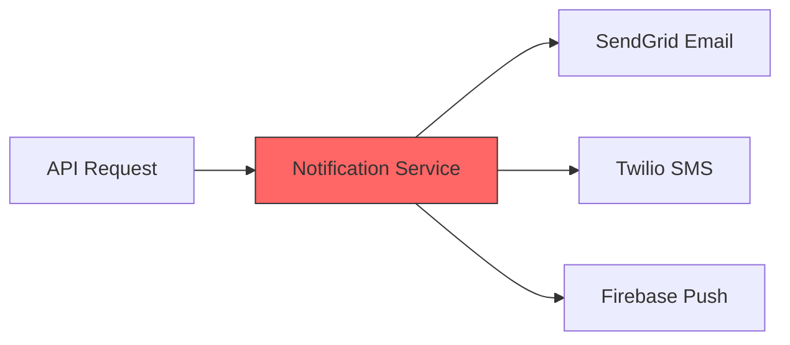
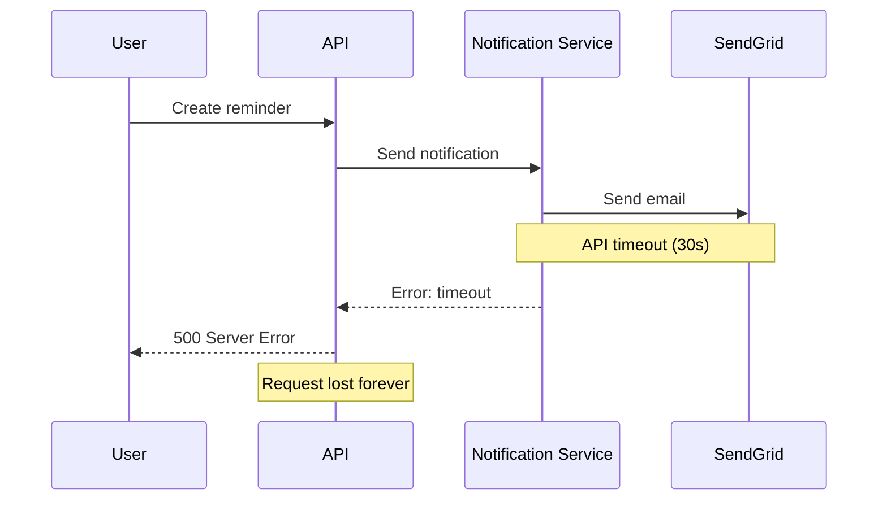
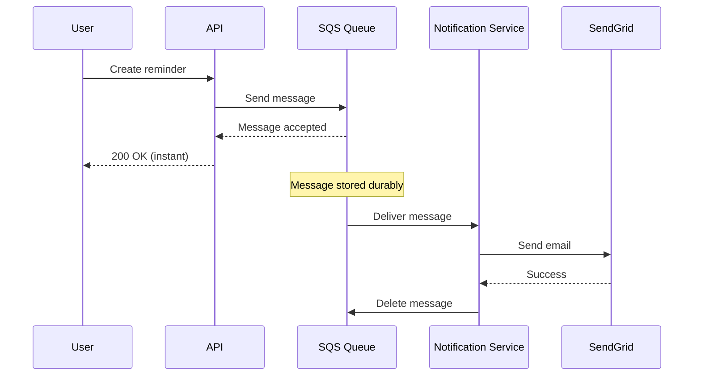

# Alex's Challenge: Lost Notifications

## The Day Everything Went Wrong

It's National Pet Day, and PetTracker is trending on social media. User signups triple overnight. Alex watches the dashboard with a mix of pride and growing concern.

"Traffic is 10x normal!" Maya, the frontend developer, announces excitedly.

Then the first alert fires. The notification service is overwhelmed. Users aren't receiving their vaccination reminders. The activity summary emails have stopped completely.

Alex checks the logs:

```terminal
$ kubectl logs notification-service-7d9f4c8b6-x2k4n --tail=50
[ERROR] 2024-03-23T14:32:17Z Connection timeout calling SendGrid API
[ERROR] 2024-03-23T14:32:18Z Connection timeout calling Twilio API
[ERROR] 2024-03-23T14:32:19Z Request dropped - queue full (5000/5000)
[ERROR] 2024-03-23T14:32:19Z Request dropped - queue full (5000/5000)
[WARN]  2024-03-23T14:32:20Z Memory usage critical: 95%
[ERROR] 2024-03-23T14:32:21Z OOM killed - restarting...
```

## The Root Cause

Alex examines the notification architecture:



**The Problem:** The notification service calls external APIs synchronously. When those APIs slow down:

1. Requests pile up in the service's memory
2. Memory usage spikes
3. The service crashes
4. All pending notifications are **lost forever**

"We processed 50,000 notification requests today," Alex reports grimly. "But only 12,000 were actually delivered. That's a 76% failure rate."

## The Business Impact

| Metric | Normal Day | National Pet Day |
|--------|------------|------------------|
| Notification requests | 15,000 | 50,000 |
| Successfully delivered | 14,850 (99%) | 12,000 (24%) |
| **Lost notifications** | 150 | **38,000** |
| Support tickets | 5 | 847 |

Users are furious. The #PetTrackerFail hashtag starts trending.

## Sam's Diagnosis

Sam, the DevOps mentor, reviews the architecture.

"Your system has **tight coupling**," Sam explains. "The API, the notification service, and the external providers are all connected synchronously. When any part slows down, everything fails."



"What you need," Sam continues, "is **loose coupling** with a message queue."

## The Solution Preview

Sam sketches a new architecture:



"See the difference?" Sam asks. "The API immediately acknowledges the request. The message is safely stored in the queue. Even if the notification service is slow or down, no messages are lost."

## What Alex Needs to Learn

To fix PetTracker's notification system, Alex needs to understand:

1. **Amazon SQS (Simple Queue Service)**
   - How message queuing works
   - Standard vs FIFO queues
   - Message visibility and retention

2. **Amazon SNS (Simple Notification Service)**
   - Pub/sub messaging patterns
   - Fan-out to multiple subscribers
   - Message filtering

3. **Integration Patterns**
   - Decoupling with queues
   - Dead letter queues for failures
   - Lambda as a message processor

## The Challenge

Help Alex rebuild the notification system to be:

- **Resilient**: Messages survive service crashes
- **Scalable**: Handle traffic spikes gracefully
- **Reliable**: Retry failed deliveries automatically
- **Observable**: Track what's happening in the system

By the end of this chapter, PetTracker will have a notification system that never loses a message, even under 100x normal load.

## Key Terms to Know

| Term | Definition |
|------|------------|
| **Synchronous** | Caller waits for response before continuing |
| **Asynchronous** | Caller continues without waiting for response |
| **Tight Coupling** | Components directly dependent on each other |
| **Loose Coupling** | Components communicate through intermediaries |
| **Message Queue** | Buffer that stores messages between sender and receiver |
| **Pub/Sub** | Publisher sends to topic, multiple subscribers receive |

---

*Next: Let's dive into Amazon SQS and learn how message queuing works.*
