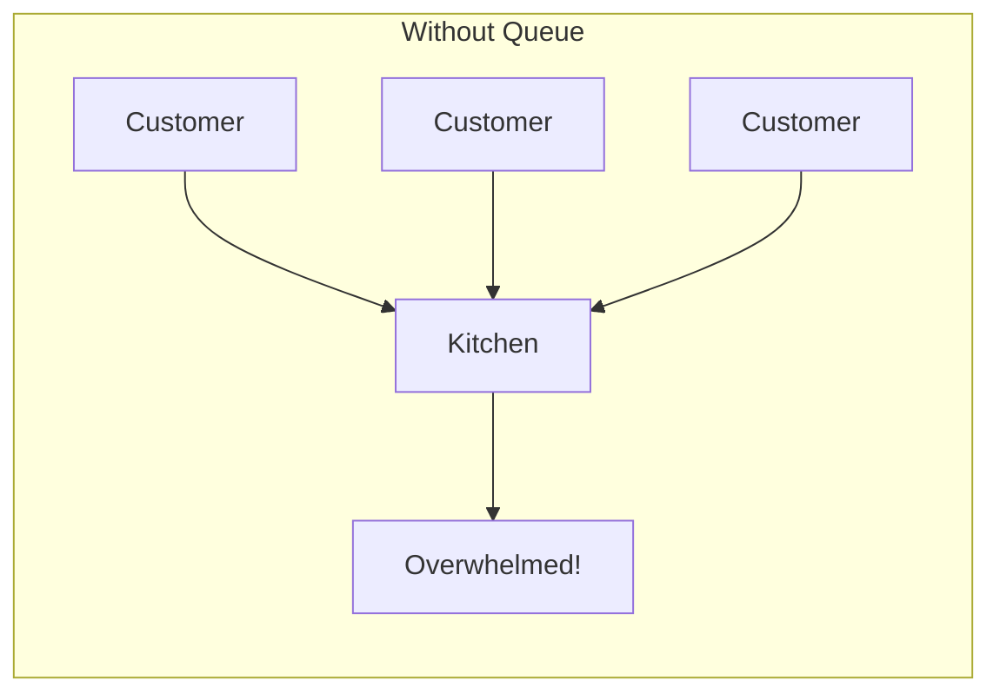
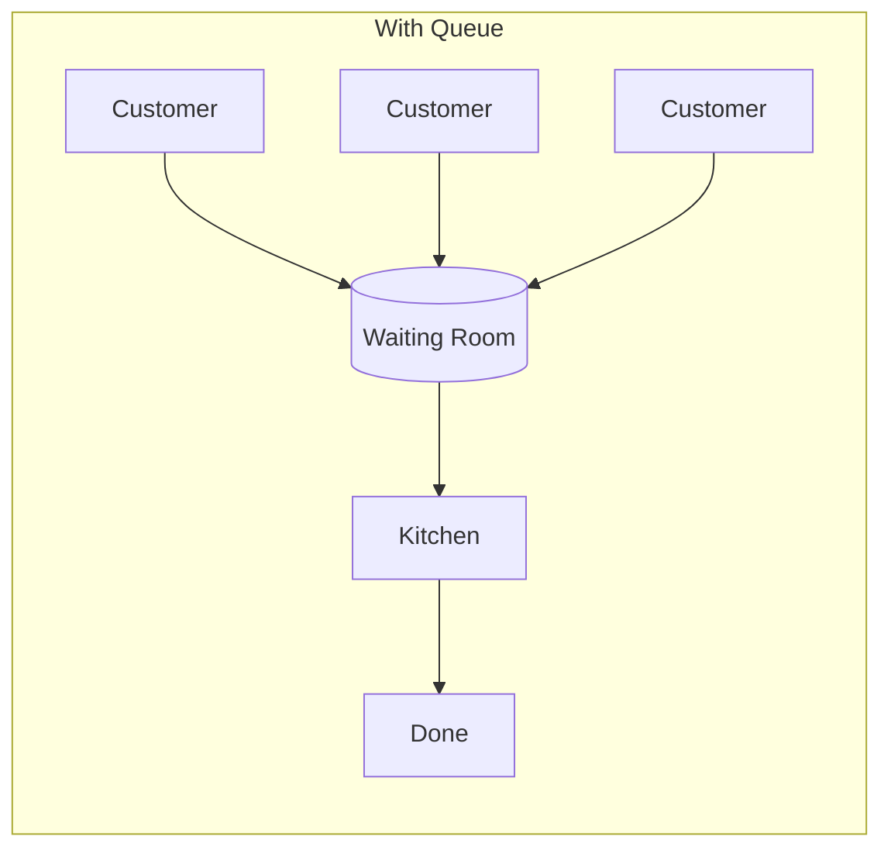
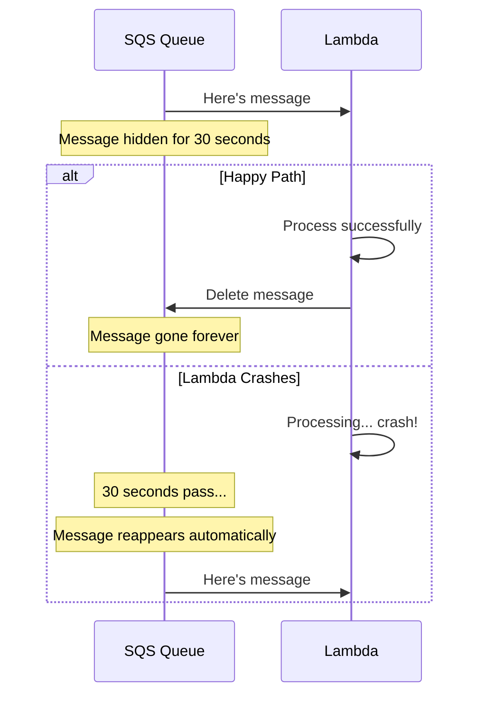
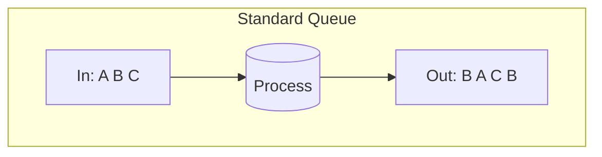
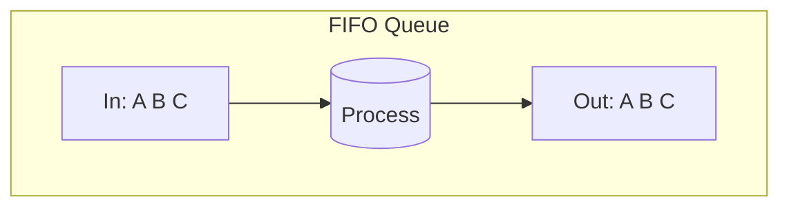
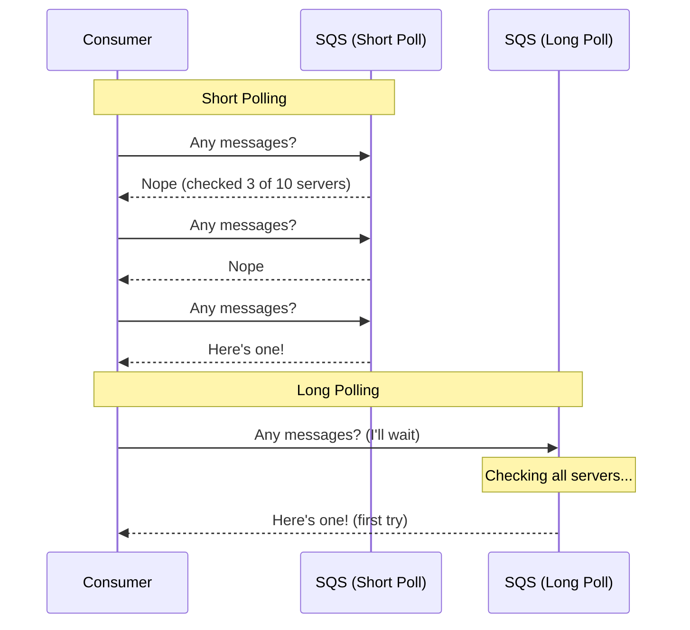

# SQS Fundamentals

## Sam Explains Queues

The team gathers around Sam's whiteboard after the National Pet Day disaster. Nearly 40,000 notifications were lost. Alex looks defeated.

"Let me show you something," Sam says, picking up a marker.

---

## The Waiting Room Analogy

"Imagine a busy restaurant," Sam draws a simple diagram. "Customers arrive. What happens when the kitchen is overwhelmed?"

"Orders get lost?" Maya guesses.

"Worse. Customers leave angry. The waiter crashes from stress." Sam draws an X through the diagram. "That's your current notification system. API takes orders, tries to process them immediately, and when the kitchen - your email service - is slow, everything falls apart."

"So what's the alternative?"

Sam draws a new diagram with a box in the middle. "A ticket system. Customers arrive, get a number, sit in the waiting room. The kitchen processes orders at its own pace. No one leaves until they're served."





"That waiting room," Sam says, tapping the box, "is Amazon SQS."

---

## What Amazon SQS Actually Is

"So it's just a queue?" Alex asks.

"It's a *very smart* queue," Sam corrects. "Here's what makes SQS different from just shoving messages into Redis or a database table."

Sam writes on the whiteboard:

### Layer 1: The Basics

At its simplest, SQS is a place where messages wait. A producer sends a message, SQS stores it, and a consumer picks it up when ready. Messages go in, messages come out. Nothing fancy so far.

But the basics matter: SQS stores messages as simple blobs of text (up to 256KB). You can put any data you want in there - JSON, XML, plain text, base64-encoded binary. SQS doesn't care what's inside. It just stores and delivers.

### Layer 2: Durability That Matters

"Here's where it gets interesting," Sam continues. "When you send a message to SQS, it doesn't go to one server. It's immediately copied to multiple data centers."

Every message you send is replicated across at least three Availability Zones (data centers) within a region. This happens synchronously - your `SendMessage` call doesn't return until the message is safely stored in multiple locations.

AWS guarantees 99.999999999% durability. That's eleven nines. To put this number in perspective: if you stored 100 billion messages, statistically you would lose one. In practical terms, messages don't get lost to infrastructure failure. If an entire data center burns down, your messages survive because they're already replicated elsewhere.

Alex blinks. "That's a lot of nines."

"It means you stop worrying about message loss. Once SQS acknowledges your send, that message exists. Period."

### Layer 3: The Visibility Magic

"This is the clever part," Sam says. "When your Lambda function receives a message, what should happen?"

"It processes it and deletes it?"

"Right. But what if Lambda crashes halfway through?"

Maya thinks. "The message is gone but wasn't processed. We lost it?"

"Not with SQS." Sam draws a timeline. "When you receive a message, SQS doesn't delete it. It *hides* it for a period called the visibility timeout. If you don't delete it within that window, it automatically reappears."

Let's walk through what happens step by step:

1. **Consumer calls ReceiveMessage** - SQS picks a message and returns it
2. **Message becomes invisible** - No other consumer can see it for the visibility timeout duration (default: 30 seconds)
3. **Consumer processes the message** - Whatever work needs to happen
4. **Consumer calls DeleteMessage** - The message is permanently removed

But here's the magic: if step 4 never happens (consumer crashes, times out, throws an exception), the message automatically becomes visible again when the timeout expires. Another consumer receives it and tries again.



"That's built in?" Alex asks.

"Zero code required. SQS handles all the retry logic for you. This is why message queues exist - they provide reliability guarantees that you'd otherwise have to build yourself."

### Layer 4: Infinite Scale

"Here's something that took me years to appreciate," Sam says. "SQS has no throughput limit."

This sounds like marketing speak, but it's architecturally true. Standard SQS queues are distributed across many servers. When you send more messages, AWS automatically adds more servers. You don't configure this, you don't pay extra for it, and there's no "scaling event" that might fail.

"You could send a million messages per second. You don't need to provision anything. No capacity planning. No database sharding. SQS just handles it."

"That sounds expensive."

Sam shakes his head. "About $0.40 per million messages. Your National Pet Day traffic - 50,000 messages - would cost about 2 cents."

For context: running a self-managed RabbitMQ cluster that could handle the same throughput would cost $500-1000/month in EC2 instances alone, plus your time to operate it. SQS eliminates that operational burden entirely.

---

## The Two Types of Queues

"One thing I don't understand," Maya says. "You mentioned 'first in, first out - mostly.' What does mostly mean?"

Sam draws two queue types:

### Standard Queues

Standard queues optimize for maximum throughput. To achieve unlimited scale, SQS distributes messages across many servers. This distribution means:

**Best-effort ordering:** Messages usually arrive in the order sent, but not always. If you send messages A, B, C, you might receive them as A, C, B. This is because different messages might be stored on different servers, and network latency varies.

**At-least-once delivery:** Occasionally, you might receive the same message twice. This happens because SQS uses redundancy for reliability - if there's any doubt whether a message was successfully delivered, SQS keeps a copy just in case.



"This seems broken," Alex says.

"It's a trade-off," Sam explains. "Standard queues can handle unlimited throughput because they don't need to coordinate across servers. That coordination is what limits FIFO queues."

### FIFO Queues

FIFO (First-In-First-Out) queues guarantee:

**Exact ordering:** Messages are delivered in precisely the order they were sent. A, B, C will always be received as A, B, C.

**Exactly-once processing:** Each message is delivered exactly once. No duplicates, ever. SQS tracks which messages have been successfully processed and never re-delivers them.



The cost of these guarantees is throughput. FIFO queues support 300 messages per second (3,000 with batching, up to 70,000 with high-throughput mode and multiple message groups).

| Feature | Standard | FIFO |
|---------|----------|------|
| **Throughput** | Unlimited | 300-70,000/sec |
| **Order** | Best effort | Guaranteed |
| **Duplicates** | Possible | Never |
| **Name** | `my-queue` | `my-queue.fifo` |
| **Best for** | High volume, idempotent | Order-critical |

### Choosing Between Them

Alex considers this. "For notifications, does order matter?"

"Do your users care if they get the 'vaccination reminder' before the 'welcome email'?"

"Not really. As long as they get both."

"Then Standard is perfect. FIFO is for things like financial transactions or command sequences where order is critical."

The decision tree is straightforward:

1. **Can your consumer handle duplicates?** If yes (or you can make it idempotent), Standard is fine
2. **Does processing order matter?** If no, Standard is fine
3. **Do you need more than 70,000 messages/second?** If yes, you must use Standard

For PetTracker's notification system, Standard queues are the right choice. Notifications are naturally idempotent (sending the same reminder twice is annoying but not catastrophic), and order doesn't matter.

---

## Understanding Idempotency

"Wait," Maya interrupts. "You said Standard might send duplicates. Isn't that a problem?"

"Only if your processing isn't *idempotent*," Sam says, then catches Alex's blank stare. "Idempotent means doing something twice has the same result as doing it once."

The concept is simpler than it sounds:

**Idempotent operations:**
- Setting a user's name to "Alice" - do it twice, their name is still "Alice"
- Pressing an elevator button - press it 10 times, you still only go to floor 5
- Deleting a file - delete it twice, it's still deleted

**Non-idempotent operations:**
- Adding $100 to an account - do it twice, they have $200 instead of $100
- Sending an email - send it twice, user gets two emails
- Incrementing a counter - do it twice, you've incremented by 2

"Like... pressing an elevator button?"

"Exactly! Press it 10 times, you still only go to floor 5. For notifications, you might send the same email twice - annoying but not catastrophic. For financial transactions, charging a credit card twice is a disaster. That's why Standard queues work for notifications but you'd want FIFO for payments."

**Making operations idempotent:**

Even non-idempotent operations can be made idempotent with a little design:

```python
def send_notification_idempotent(user_id, notification_id, content):
    # Check if we already sent this exact notification
    already_sent = db.query(
        "SELECT 1 FROM sent_notifications WHERE notification_id = ?",
        notification_id
    )

    if already_sent:
        return  # Skip - already processed

    # Send the notification
    send_email(user_id, content)

    # Record that we sent it
    db.execute(
        "INSERT INTO sent_notifications (notification_id) VALUES (?)",
        notification_id
    )
```

By tracking which notifications we've already sent, we can safely process the same message twice without sending duplicate emails.

---

## Did You Know?

Before wrapping up, Sam shares some lesser-known facts:

**Messages have a lifespan, and it matters more than you think.** By default, SQS keeps messages for 4 days. After that, they're automatically deleted - processed or not. This isn't a bug; it's by design. The retention period is configurable from 1 minute to 14 days.

Here's why this matters: if your consumer is broken for a week, you might come back to find all your messages have expired and disappeared. There's no error, no alert, no Dead Letter Queue - they just silently vanish when retention expires. That's why 4 days is the default - long enough to recover from most outages, short enough that you notice the problem before messages expire.

For critical messages, either set longer retention (up to 14 days) or implement additional safeguards like copying messages to S3 before processing.

**You can delay messages, and it's different from visibility timeout.** Want a message to become available in 5 minutes? Set a delay. But understand the distinction:

- **Delay** happens BEFORE a message is first available. When you send a message with a 5-minute delay, it sits invisible for 5 minutes, then becomes available for the first time.
- **Visibility timeout** happens AFTER a message has been received. It's how long the message stays hidden while a consumer is processing it.

Use delay for scheduled tasks (send this reminder in 10 minutes), rate limiting (don't process more than X per minute), or exponential backoff when re-queuing failed messages (wait 1 min, then 5 min, then 15 min). You can set delay per-message or as a queue default, up to 15 minutes.

**There's no way to browse a queue, and that's intentional.** SQS isn't a database. You can't query it, peek at messages, or browse contents without receiving them. When you receive, you get up to 10 messages (configurable) from somewhere in the queue - not necessarily the oldest ones in Standard queues.

This design is intentional. It forces you to build stateless consumers that don't care which message they get, which is exactly what enables horizontal scaling. If you need to inspect messages for debugging, use a Dead Letter Queue to capture problematic messages, or temporarily log message contents before processing.

---

## Creating the PetTracker Queue

"Let's actually build this," Sam says, moving to the terminal.

First, let's create a basic queue. The AWS CLI makes this straightforward:

```terminal
$ aws sqs create-queue \
    --queue-name pettracker-notifications
{
    "QueueUrl": "https://sqs.us-east-1.amazonaws.com/123456789012/pettracker-notifications"
}
```

"That's it?" Alex asks.

"That's it. Queue exists. Ready to receive millions of messages. No servers, no configuration, no capacity planning."

The response contains the Queue URL, which is the unique identifier you'll use for all future operations. Notice it includes your account ID and region - queues are regional resources.

### Tuning the Settings

"But we should tune some settings," Sam adds, pulling up more options.

```terminal
$ aws sqs set-queue-attributes \
    --queue-url https://sqs.../pettracker-notifications \
    --attributes '{
        "VisibilityTimeout": "180",
        "MessageRetentionPeriod": "345600",
        "ReceiveMessageWaitTimeSeconds": "20"
    }'
```

Let's understand each setting:

| Setting | Alex's Value | Why |
|---------|--------------|-----|
| `VisibilityTimeout` | 180 (3 min) | Our Lambda takes up to 30 seconds. 6x buffer for retries. |
| `MessageRetentionPeriod` | 345600 (4 days) | Default. Long enough to recover from outages. |
| `ReceiveMessageWaitTimeSeconds` | 20 | Long polling. Reduces costs and empty responses. |

### Understanding Long Polling

"What's long polling?" Alex asks.

"Ah, this is a good one," Sam says. "Without it, every time you check the queue, SQS samples some of its servers and returns immediately. You might get an empty response even when messages exist elsewhere."

Here's the problem with short polling (the default): SQS is distributed across many servers. When you call `ReceiveMessage`, SQS queries a subset of those servers. If the messages happen to be on servers that weren't queried, you get an empty response even though messages exist.

Short polling also costs more because you're making more API calls. If you poll every second and the queue is usually empty, you're paying for 86,400 API calls per day that return nothing.

**Long polling fixes both problems:**

With long polling (`ReceiveMessageWaitTimeSeconds` > 0), SQS:
1. Queries ALL servers, not just a sample
2. If no messages are found, waits up to the specified time for one to arrive
3. Returns immediately as soon as a message is available



**Always enable long polling.** Set `ReceiveMessageWaitTimeSeconds` to 20 (the maximum). There's virtually no downside, and the benefits are significant: lower costs, faster message delivery, and no empty responses.

---

## Sending Your First Message

Alex is eager to try. "How do I send a message?"

Here's a complete example in Python that shows the key concepts:

```python
import boto3
import json

# Create an SQS client
sqs = boto3.client('sqs')

# The queue URL from when we created the queue
queue_url = 'https://sqs.us-east-1.amazonaws.com/123456789012/pettracker-notifications'

# Send a notification request
response = sqs.send_message(
    QueueUrl=queue_url,
    MessageBody=json.dumps({
        'type': 'vaccination_reminder',
        'user_email': 'pet-owner@example.com',
        'pet_name': 'Max',
        'vaccine': 'Rabies',
        'due_date': '2024-03-30'
    })
)

print(f"Message sent! ID: {response['MessageId']}")
```

Let's understand what happens when this code runs:

1. **The message is sent to SQS** - Your code makes an HTTPS request to the SQS endpoint
2. **SQS replicates the message** - Before responding, SQS stores the message across multiple Availability Zones
3. **SQS returns confirmation** - You get a MessageId (unique identifier) and MD5 hash (for verification)
4. **The message waits** - It's now in the queue, available for any consumer to receive

"That's the entire API?" Alex asks.

"For sending, yes. The message is now stored redundantly across multiple AZs. Even if we crashed right now, that notification request is safe."

The `MessageId` returned is useful for tracking. You can't look up a message by its ID (remember, SQS isn't a database), but you can use it for logging and correlation.

---

## The Paradigm Shift

Maya leans back. "So instead of our API calling SendGrid directly..."

"Your API sends to SQS in milliseconds," Sam finishes. "A separate consumer picks up the message and calls SendGrid. If SendGrid is slow, the message waits. If SendGrid is down, the message waits and retries. Your API doesn't know or care."

This is the fundamental paradigm shift:

| Before (Synchronous) | After (Asynchronous) |
|---------------------|---------------------|
| API calls SendGrid directly | API sends to SQS |
| API waits 200-3000ms for response | API returns in ~10ms |
| If SendGrid slow, API slow | If SendGrid slow, messages queue |
| If SendGrid down, API fails | If SendGrid down, messages wait |
| Lost messages on crash | Messages survive crashes |

"What if we get 50,000 messages during a spike?" Alex asks, remembering National Pet Day.

"They queue up. Your consumer processes them at whatever rate it can handle. Users might wait an extra 30 seconds for their notification, but everyone gets one. No failures. No lost messages."

The key insight is trading latency for reliability. Users get slightly delayed notifications (seconds to minutes during spikes) instead of lost notifications. For almost every use case, that's the right trade-off.

Alex starts to smile. "That's... actually brilliant."

"It's the oldest pattern in distributed systems," Sam says. "Decoupling. And SQS makes it trivially easy."

---

## Exam Tips

**Key points for DVA-C02:**

1. **Standard queues** offer unlimited throughput with at-least-once delivery. They may deliver messages out of order or more than once. This is the default and correct choice for most workloads.

2. **FIFO queues** guarantee exact ordering and exactly-once processing, but are limited to 300-70,000 messages per second. They must have names ending in `.fifo`.

3. **Long polling** reduces costs and empty responses. Always enable it by setting `ReceiveMessageWaitTimeSeconds` to 20 (maximum).

4. **Message size limit** is 256KB. For larger payloads, store the data in S3 and send the S3 reference through SQS.

5. **Default retention** is 4 days. Configurable from 1 minute to 14 days. Messages that exceed retention are deleted without notification.

**Common exam question patterns:**

> "An application sends messages but occasionally receives duplicates..."
> → Answer: This is expected behavior for Standard queues. Either use FIFO queue or make processing idempotent.

> "A company wants to reduce SQS API costs..."
> → Answer: Enable long polling (ReceiveMessageWaitTimeSeconds > 0)

> "Messages larger than 256KB need to be processed..."
> → Answer: Store payload in S3, send S3 reference in SQS message

> "Messages need to be processed in exact order..."
> → Answer: Use a FIFO queue (name must end in .fifo)

---

## Key Takeaways

The team reviews what they learned:

1. **SQS is a managed message queue with zero operational burden.** You don't run servers, configure clusters, or plan capacity. AWS handles replication, durability, and scaling automatically. You pay about $0.40 per million messages, which is dramatically cheaper than running your own message broker. The 50,000-message spike that crashed PetTracker would cost 2 cents on SQS. The key insight: SQS lets you focus on your application logic instead of infrastructure management.

2. **Messages are durable by design - eleven nines of durability.** Every message is immediately replicated across at least three Availability Zones before SQS acknowledges your send. If a data center fails, your messages survive because they're already stored elsewhere. This durability is automatic and included in the base price. The practical implication: once SQS acknowledges your `SendMessage` call, that message will not be lost to infrastructure failure. You can stop building retry logic for message storage.

3. **Visibility timeout provides automatic retry without any code.** When a consumer receives a message, SQS hides it (doesn't delete it) for the visibility timeout duration. If the consumer succeeds and calls `DeleteMessage`, the message is gone. If the consumer crashes, the message automatically reappears and another consumer can try again. This is the killer feature that makes SQS worth using - you get reliable message processing without building retry logic. The default timeout is 30 seconds, but you should set it to 6x your average processing time.

4. **Standard queues trade strict ordering for unlimited throughput.** Messages might arrive out of order and might be delivered twice. This sounds scary but is fine for most workloads - notifications, background jobs, event processing. The trade-off enables unlimited throughput (AWS handles scaling automatically). FIFO queues guarantee order and exactly-once delivery but are limited to 300-70,000 messages/second. Choose Standard unless you specifically need ordering guarantees.

5. **Long polling is mandatory for production use.** With short polling (the default), you make frequent API calls that often return empty. Long polling queries all SQS servers and waits up to 20 seconds for a message. This reduces costs (fewer API calls), improves latency (messages delivered faster), and eliminates empty responses. Set `ReceiveMessageWaitTimeSeconds` to 20 on every queue. There's no downside.

"Tomorrow," Sam says, "we'll dive into visibility timeout and message lifecycle. Understanding how messages move through the queue is key to building reliable systems - and avoiding the 2 AM wake-up calls."

---

*Next: **The Journey of a Message** - Understanding visibility timeout, message states, and why Alex's duplicate notifications happened.*

---
*v2.0*
