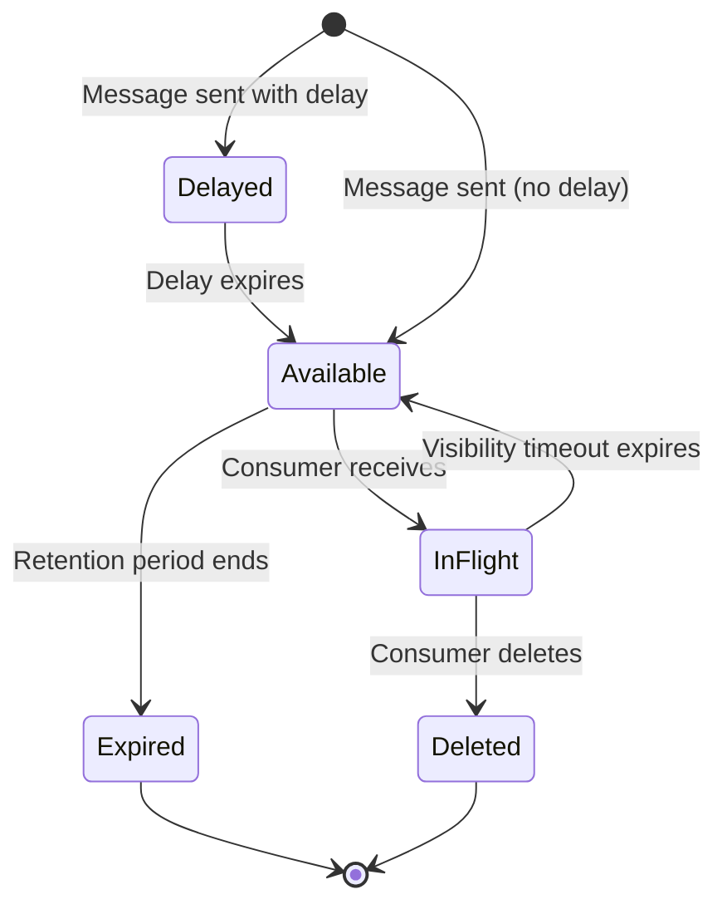
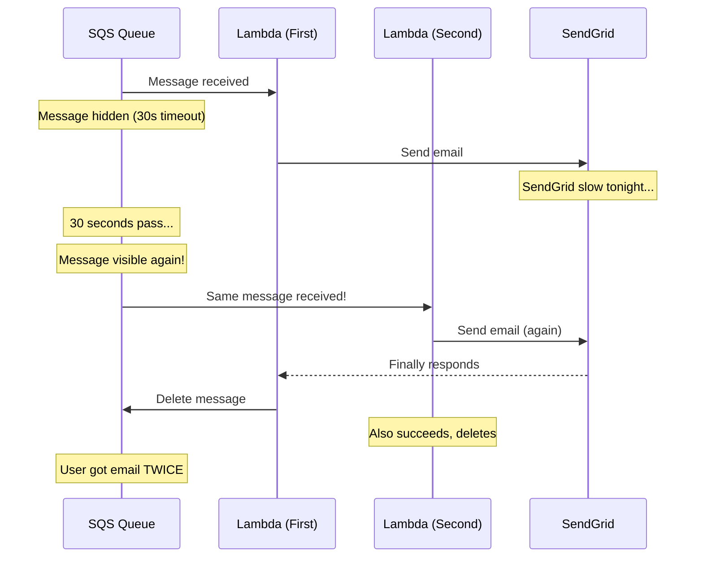
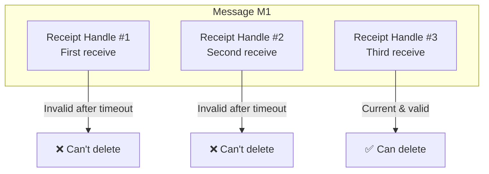

# The Journey of a Message

## Alex's 2AM Wake-Up Call

The PagerDuty alert comes at 2:47 AM. Alex fumbles for the phone.

```pager
@critical | 2:47 AM | PagerDuty
CRITICAL: Duplicate notifications detected
847 users received the same vaccination reminder twice. Service: pettracker-notifications
```

"Not again," Alex mutters, pulling open the laptop.

The next morning, Sam finds Alex staring at CloudWatch logs, dark circles under tired eyes.

"Rough night?"

"Messages are being processed twice. I thought SQS was supposed to prevent this."

Sam pulls up a chair. "SQS does prevent message loss. But understanding *when* and *how* messages move through the queue - that's what prevents duplicates. Let me show you the lifecycle."

---

## The Five States of a Message

Every message in SQS exists in one of five states. Understanding these states is the key to understanding what happened to Alex last night - and how to prevent it from happening again.

Sam draws on the whiteboard:

:::sidebyside:right:medium


"A message can be in one of five states," Sam explains. "Understanding these states is the key to understanding what happened last night."

**The five states are:**

1. **Delayed** - Message is hidden, waiting for delay to expire
2. **Available** - Message can be received by consumers
3. **In-Flight** - Message received, hidden during visibility timeout
4. **Deleted** - Message permanently removed after successful processing
5. **Expired** - Message automatically removed after retention period

The most critical transition to understand is between **Available** and **In-Flight**. This is where Alex's duplicate problem originated.
:::

### State 1: Delayed

When you send a message, it can start hidden. This is the delay period - the message exists in SQS, but no consumer can see it yet. The message sits in this state until the delay expires.

"Why would I want that?" Alex asks.

Delays are useful for several scenarios. Imagine you're building a reminder system: "Send this notification in 10 minutes." Instead of storing the reminder in a database and polling for due reminders, you send it to SQS with a 10-minute delay. SQS handles the timing for you.

Delays are also essential for exponential backoff. When a message fails processing, you might want to wait before retrying - 1 minute, then 5 minutes, then 15 minutes. By re-sending the message with increasing delays, you implement backoff without building your own scheduling system.

The maximum delay is 15 minutes. If you need longer delays, you'll need a different approach (like Step Functions or a scheduled Lambda).

### State 2: Available

Once any delay expires (or immediately if there's no delay), the message becomes *available*. This is the only state where consumers can receive it.

Available messages sit in the queue waiting. They're visible to any consumer that calls `ReceiveMessage`. Multiple messages can be available simultaneously - there's no limit to how many messages can be in this state.

When a consumer calls `ReceiveMessage`, SQS picks one or more available messages (up to 10) and returns them. The selection in Standard queues is roughly random - you don't necessarily get the oldest messages first.

### State 3: In-Flight

"Here's where your problem started," Sam points to the diagram. "When a consumer calls `ReceiveMessage`, the message doesn't disappear. It becomes *in-flight* - hidden from other consumers for a period called the visibility timeout."

This is the most important state to understand. The message still exists in SQS. It's just invisible. No other consumer can see it or receive it.

"So it's still in the queue?" Alex asks.

"Exactly. It's just invisible. This is SQS's safety net."

The in-flight state exists because message processing can fail. If SQS deleted messages immediately upon receipt, and then your consumer crashed, the message would be lost forever. By keeping the message (but hiding it), SQS ensures that failed processing can be retried.

The visibility timeout is how long the message stays in-flight. Default is 30 seconds. When this timeout expires without the message being deleted, the message transitions back to Available - and another consumer can receive it.

### State 4: Deleted

"Only when the consumer explicitly calls `DeleteMessage` is the message truly gone. This is the *only* way to remove a message intentionally."

Deletion is permanent and immediate. Once you call `DeleteMessage`, the message is removed from all SQS servers within seconds. There's no undo, no recycle bin, no recovery option.

This is why the pattern is always: receive, process, then delete. You only delete after successful processing. If you delete before processing and then crash, the work is lost.

### State 5: Expired

"If a message sits in the queue longer than the retention period - default is 4 days - SQS automatically deletes it. No warning, no notification. It's just gone."

Expiration is silent. SQS doesn't send you an alert, doesn't move the message to a Dead Letter Queue, doesn't log anything special. The message simply disappears.

This matters because if your consumers are broken for longer than the retention period, you'll lose messages. Suppose your Lambda function has a bug that causes it to crash on startup. Messages pile up in the queue. After 4 days, they start expiring and disappearing. You might not notice until you fix the Lambda and wonder where all the messages went.

For critical workloads, monitor the `ApproximateAgeOfOldestMessage` metric. If messages are sitting in the queue for hours or days, something is wrong.

---

## The Visibility Timeout: Where Alex Went Wrong

"Now let's look at your configuration," Sam pulls up the queue settings. "What's your visibility timeout?"

Alex checks. "30 seconds."

"And how long does your Lambda take to process a notification?"

Alex pulls up the Lambda metrics. The graph shows a clear pattern: most invocations complete in 15-20 seconds, but there are spikes up to 45 seconds when SendGrid is slow.

"Oh no."

"You see it now?"

Here's exactly what happened during Alex's 2 AM incident:

:::sidebyside:left:large


**The sequence of events:**

1. **Lambda 1 receives the message** at 2:47:00 AM. The message becomes in-flight with a 30-second visibility timeout.

2. **Lambda 1 calls SendGrid** to send the email. Normally this takes 200-300ms, but tonight SendGrid is slow.

3. **30 seconds pass** while Lambda 1 is still waiting for SendGrid. The visibility timeout expires at 2:47:30 AM.

4. **The message becomes visible again**. It's back in the Available state, even though Lambda 1 is still processing it.

5. **Lambda 2 receives the same message** at 2:47:31 AM. Lambda 2 doesn't know Lambda 1 is still working on it.

6. **Lambda 2 calls SendGrid** to send the same email. Now two emails are in flight to the same user.

7. **Both Lambdas eventually succeed**. Both try to delete the message. The message is deleted (only once), but the user received two emails.
:::

Exactly. And once that happens, both Lambdas succeed, both try to delete - the message is gone, but the damage is done.

---

## The 6x Rule

"So how do I set the right timeout?" Alex asks.

"Rule of thumb: visibility timeout should be at least 6 times your average processing time," Sam says.

Why 6x? Several factors can extend processing time beyond the average:

1. **Network variability** - External API calls (like SendGrid) can be 10x slower under load
2. **Cold starts** - Lambda cold starts add 100ms to several seconds
3. **Retries** - Your code might retry failed operations
4. **Garbage collection** - Memory-intensive processing can pause for GC
5. **Batch processing** - If you process 10 messages at once, the batch takes longer

"You process most messages in 20 seconds, with occasional spikes to 45. What would 6x give you?"

"About 2 to 3 minutes."

"Let's be safe and go with 180 seconds - 3 minutes."

```terminal
$ aws sqs set-queue-attributes \
    --queue-url https://sqs.us-east-1.amazonaws.com/123456789012/pettracker-notifications \
    --attributes VisibilityTimeout=180
```

With a 3-minute visibility timeout, even if SendGrid takes 45 seconds, there's still over 2 minutes of buffer before the message becomes visible again.

"But what about the spikes?" Alex asks. "What if SendGrid takes 4 minutes?"

---

## Extending the Timeout Mid-Flight

"Smart question," Sam nods. "You can extend the visibility timeout while processing. It's called `ChangeMessageVisibility`."

Sometimes you know a particular message will take longer than usual. Maybe it's a large batch, or the payload indicates complex processing, or you're calling an external API that's responding slowly.

Instead of setting an extremely long default timeout (which delays retries when processing actually fails), you can extend the timeout for specific messages that need more time.

```python
import boto3
import time

sqs = boto3.client('sqs')

def process_with_heartbeat(queue_url, message):
    """Process message with visibility timeout extension."""
    receipt_handle = message['ReceiptHandle']

    # Start processing
    start = time.time()

    try:
        # Begin the work
        result = start_processing(message)

        # If we've been working for more than 2 minutes, extend the timeout
        elapsed = time.time() - start
        if elapsed > 120:  # 2 minutes
            sqs.change_message_visibility(
                QueueUrl=queue_url,
                ReceiptHandle=receipt_handle,
                VisibilityTimeout=300  # Add 5 more minutes
            )

        # Continue processing
        finish_processing(result)

        # Success - delete the message
        sqs.delete_message(
            QueueUrl=queue_url,
            ReceiptHandle=receipt_handle
        )
    except Exception as e:
        # Don't delete - let it retry automatically
        print(f"Failed: {e}")
        # Message will become visible again when timeout expires
```

The key insight: you can call `ChangeMessageVisibility` multiple times. Some teams implement a "heartbeat" pattern - a background thread extends the timeout every minute while the main thread is processing. This way, as long as processing is making progress, the message never becomes visible to other consumers.

```python
import threading

def heartbeat_thread(queue_url, receipt_handle, stop_event):
    """Continuously extend visibility while processing."""
    while not stop_event.is_set():
        time.sleep(60)  # Every minute
        if not stop_event.is_set():
            sqs.change_message_visibility(
                QueueUrl=queue_url,
                ReceiptHandle=receipt_handle,
                VisibilityTimeout=120  # Reset to 2 minutes
            )

def process_with_heartbeat(queue_url, message):
    receipt_handle = message['ReceiptHandle']
    stop_event = threading.Event()

    # Start heartbeat in background
    heartbeat = threading.Thread(
        target=heartbeat_thread,
        args=(queue_url, receipt_handle, stop_event)
    )
    heartbeat.start()

    try:
        # Do the actual processing - take as long as needed
        process_message(message)

        # Success - delete
        sqs.delete_message(QueueUrl=queue_url, ReceiptHandle=receipt_handle)
    finally:
        # Stop heartbeat thread
        stop_event.set()
        heartbeat.join()
```

---

## The Receipt Handle: Your Message's Ticket

Alex looks at the code. "What exactly is the `ReceiptHandle`?"

"Think of it as a ticket for a specific receive operation," Sam explains. "Every time you receive a message, you get a new receipt handle. It's like getting a new ticket stub each time."

The receipt handle is a long, opaque string that SQS generates when you receive a message. It's not the message ID - it's specific to this particular receive operation.

Here's why this matters:

:::floating:right:medium


"So if I receive the same message twice..."

"You get two different receipt handles. And here's the clever part: only the most recent receipt handle can delete or extend the message."

If the visibility timeout expires and another consumer receives the message, the new consumer gets a new receipt handle. The old receipt handle becomes invalid. If the original consumer tries to delete using the stale receipt handle, the operation silently fails (no error, but nothing happens).

"This prevents race conditions," Sam continues. "If the first Lambda tries to delete with an old receipt handle after the message was re-delivered, the delete silently fails. No errors, no problems."
:::

"So even if two Lambdas process the same message, only one can delete it?"

"Right. But they both might *send* the email. That's why visibility timeout is so important - we want to prevent the race in the first place."

The receipt handle mechanism is SQS's way of handling the inherent race conditions in distributed systems. It doesn't prevent duplicate processing (that's the visibility timeout's job), but it ensures that the message state remains consistent even when multiple consumers are involved.

---

## Message Retention: The Clock is Ticking

"What happens if a message never gets processed?" Alex asks.

"Eventually, it expires," Sam says. "Every queue has a retention period."

| Setting | Value |
|---------|-------|
| **Minimum** | 60 seconds |
| **Default** | 4 days (345,600 seconds) |
| **Maximum** | 14 days (1,209,600 seconds) |

"After the retention period, the message is automatically deleted. No notification, no DLQ - just gone."

This is one of the most dangerous aspects of SQS if you're not aware of it. The retention clock starts when the message is sent, not when it becomes available, not when it's first received. From the moment `SendMessage` returns, the countdown begins.

"That seems dangerous."

"It can be. Four days is usually plenty for transient issues, but if you have a systemic problem - like a broken Lambda - messages could expire before you fix it."

Consider this scenario:
- Friday 5 PM: A bug is deployed that causes all message processing to fail
- Messages start piling up in the queue
- The bug isn't discovered until Monday morning
- By then, messages have been sitting for 63 hours (2.6 days)
- You have less than 1.5 days to fix the bug and drain the queue before messages start expiring

"Can I make it longer?"

```terminal
$ aws sqs set-queue-attributes \
    --queue-url https://sqs.us-east-1.amazonaws.com/123456789012/pettracker-notifications \
    --attributes MessageRetentionPeriod=1209600
```

"14 days is the max. For critical messages, you might want additional safeguards - like sending to S3 or a database before acknowledging."

The pattern for critical workloads:
1. Receive the message
2. Store a copy in S3 or DynamoDB (now you have a backup)
3. Process the message
4. Delete from SQS
5. Optionally delete the backup (or keep for audit trail)

This way, even if messages expire from SQS, you have a copy to recover from.

---

## Alex's Fixed Configuration

Alex updates the queue settings:

```terminal
$ aws sqs set-queue-attributes \
    --queue-url https://sqs.us-east-1.amazonaws.com/123456789012/pettracker-notifications \
    --attributes '{
        "VisibilityTimeout": "180",
        "MessageRetentionPeriod": "604800",
        "ReceiveMessageWaitTimeSeconds": "20"
    }'
```

"Let me explain each one," Sam reviews:

| Setting | Alex's Value | Why |
|---------|--------------|-----|
| `VisibilityTimeout` | 180 seconds | 6x the typical 30-second processing time. Gives buffer for slow SendGrid responses. |
| `MessageRetentionPeriod` | 604800 (7 days) | Week-long buffer. Gives time to discover and fix issues before messages expire. |
| `ReceiveMessageWaitTimeSeconds` | 20 seconds | Long polling. Reduces costs and ensures we receive messages quickly. |

---

## The Next Morning: Victory

Alex checks CloudWatch the next morning. Zero duplicate invocations. The graph shows clean, single-delivery patterns.

Maya stops by Alex's desk. "The support team says no one complained about duplicate notifications last night. First time in a week."

"I learned about visibility timeout the hard way," Alex admits.

"We all did," Maya laughs. "Ask Sam about the time he set it to 5 seconds on a batch processing job."

Sam overhears from across the office. "That was seven years ago. Let it go."

---

## Did You Know?

**In-flight limits exist, and they're lower than you might expect.** Standard queues can have up to 120,000 in-flight messages (messages that have been received but not yet deleted). FIFO queues allow 20,000. If you hit this limit, `ReceiveMessage` returns an error.

This limit matters when you have a slow consumer and a fast producer. Imagine messages coming in at 1,000/second, but your consumer processes at 100/second. After 2 minutes, you have 120,000 messages in-flight. New `ReceiveMessage` calls fail. Your consumer can't get new work even though the queue is full.

The solution isn't to increase the limit (you can't). The solution is to either add more consumers (horizontal scaling) or increase your processing speed. If messages are genuinely slow to process, you might need to reduce the visibility timeout so that unprocessed messages return to Available state faster.

**You can't "peek" at messages without affecting them.** There's no way to look at a message without receiving it (which starts the visibility timeout). SQS isn't a database - it's designed to be drained, not browsed.

This surprises developers who want to debug by inspecting queue contents. If you need to see what's in the queue, you have a few options: (1) set a very short visibility timeout temporarily so messages quickly return to available, (2) use a Dead Letter Queue to capture problematic messages, or (3) log message contents when you receive them.

**Deletion is permanent, fast, and silent.** There's no undo, no recycle bin. Once you call `DeleteMessage`, it's gone from all data centers within seconds. This is by design - SQS is optimized for throughput, not recovery.

If you need an audit trail, send messages to S3 or CloudWatch Logs before deleting. If you need to be able to "undelete," keep a copy in DynamoDB with a TTL. But don't expect SQS to provide recovery options - it won't.

**Purging is surprisingly slow and has restrictions.** If you need to empty a queue, `PurgeQueue` takes up to 60 seconds to complete and can only be called once per minute. During that time, messages might still be deliverable. If you're in a hurry, it's often faster to delete and recreate the queue (but you'll lose any in-flight messages and need to update any subscriptions or Lambda event source mappings).

---

## Exam Tips

**Key points for DVA-C02:**

1. **Visibility timeout**: Default is 30 seconds, maximum is 12 hours. This is how long a message stays hidden after being received. If processing takes longer than visibility timeout, messages are processed twice.

2. **The 6x rule**: Set visibility timeout to 6x your average processing time. This accounts for variance in processing time and prevents duplicate processing.

3. **ChangeMessageVisibility**: Extend timeout mid-processing for long-running tasks. Can be called multiple times. Only the most recent receipt handle is valid.

4. **Message retention**: Default 4 days, maximum 14 days. Messages that exceed retention are silently deleted - no DLQ, no notification.

5. **In-flight limits**: 120K for Standard, 20K for FIFO. Hitting this limit means `ReceiveMessage` fails.

6. **Receipt handle**: Changes with each receive. Only the current receipt handle can delete or extend the message. Old handles silently fail.

**Common exam question patterns:**

> "Messages are being processed multiple times..."
> → Answer: Visibility timeout is too short for processing time. Increase it to 6x average processing time.

> "Need to process messages for longer than default timeout..."
> → Answer: Use `ChangeMessageVisibility` to extend the timeout while processing.

> "Messages disappearing without being processed..."
> → Answer: Check retention period - messages might be expiring. Also check if consumers are deleting before processing completes.

> "ReceiveMessage returning errors when queue has messages..."
> → Answer: In-flight limit reached. Add more consumers or reduce visibility timeout.

---

## Key Takeaways

Alex summarizes what was learned:

1. **Messages have a lifecycle, and understanding it prevents bugs.** Messages move through states: Delayed → Available → In-Flight → Deleted (or Expired). The critical insight is that receiving a message doesn't remove it - it hides it temporarily. If your consumer doesn't delete the message before the visibility timeout expires, the message returns to Available and another consumer can receive it. This is intentional (it enables retry), but it causes duplicates if your timeout is too short.

2. **Visibility timeout is the single most important setting for preventing duplicates.** The timeout must be longer than your maximum processing time, not your average. If your Lambda typically takes 20 seconds but occasionally takes 45 seconds (slow external API, cold start, GC pause), a 30-second timeout will cause duplicates during those slow runs. The 6x rule (timeout = 6 × average processing time) gives you buffer for variance. For PetTracker, 180 seconds (3 minutes) handles the 20-second average with room for the 45-second spikes.

3. **You can extend visibility timeout mid-processing for long-running tasks.** If you realize mid-processing that you need more time, call `ChangeMessageVisibility` to extend the timeout. Some teams implement a "heartbeat" pattern - a background thread extends the timeout every minute while processing continues. This way, as long as your consumer is making progress, the message never becomes visible to other consumers. Just remember: you need the receipt handle from the most recent receive operation.

4. **Retention is a silent cliff - messages disappear without warning.** After the retention period (default 4 days), messages are deleted whether processed or not. There's no error, no DLQ, no notification. If your consumer is broken for a week, you'll lose messages. Monitor `ApproximateAgeOfOldestMessage` in CloudWatch - if messages are sitting for hours or days, something is wrong. For critical workloads, copy messages to S3 before processing.

5. **The receipt handle mechanism prevents chaos in distributed systems.** Every time you receive a message, you get a new receipt handle. Only the current receipt handle can delete or extend the message. If two consumers receive the same message (because visibility timeout expired), only the second consumer's receipt handle is valid. This doesn't prevent duplicate processing, but it ensures the message state remains consistent. The first consumer's delete attempt silently fails, and the message is deleted only when the second consumer succeeds.

---

*Next: **When Messages Go Wrong** - What happens when a message keeps failing? Alex discovers poison messages and the solution: Dead Letter Queues.*

---
*v1.0*
