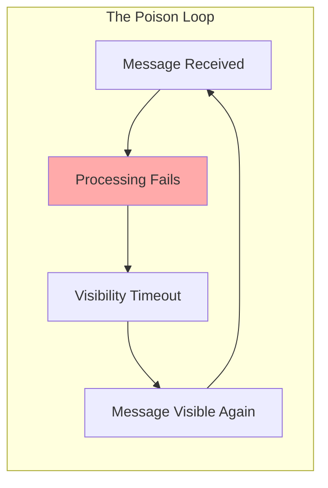
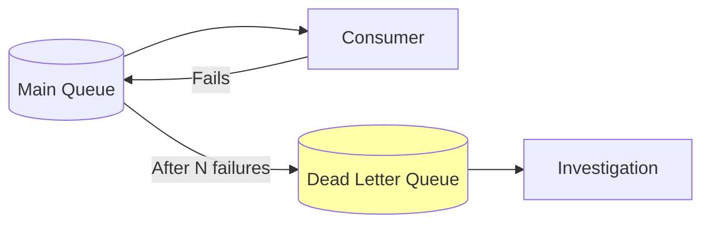
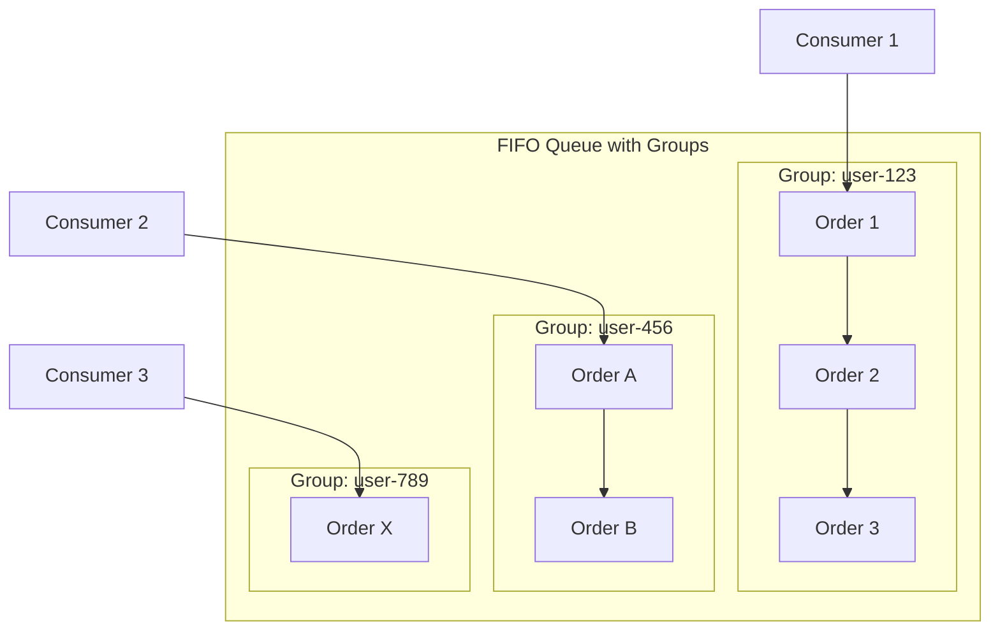
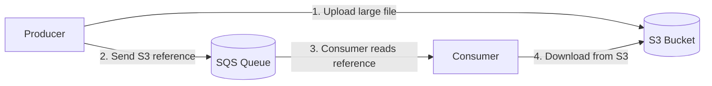

# When Messages Go Wrong: Advanced Queue Features

## Alex's Mysterious Loop

A week into the new SQS setup, Alex notices something strange in the CloudWatch metrics. One message has been received 47 times in the past hour.

"Sam, I think something's broken," Alex pulls up the logs. "This message keeps coming back."

Sam looks at the message content. It's a notification for a user who deleted their account - the email address no longer exists.

"Not broken," Sam says. "That's a poison message. And you need a Dead Letter Queue."

## What is a Poison Message?

"A poison message is one that can never be processed successfully," Sam explains. "It fails, becomes visible, fails again, becomes visible again... forever."



"In your case, the user's email is invalid. SendGrid rejects it. Lambda throws an error. The message returns to the queue. Lambda picks it up again. SendGrid rejects it again. Repeat forever."

"That's wasting Lambda invocations," Alex realizes.

"And CloudWatch costs, and API calls to SendGrid. A single poison message can cost you money indefinitely."

## The Dead Letter Queue Solution

"The solution is a Dead Letter Queue - DLQ for short," Sam draws on the whiteboard.



"Instead of retrying forever, you tell SQS: 'After this message fails N times, move it to a separate queue where I can investigate.'"

"So the poison messages stop clogging up the main queue?"

"Exactly. And you can monitor the DLQ. If messages start appearing there, you know something needs attention."

## Setting Up a DLQ

Alex creates the dead letter queue:

```terminal
$ aws sqs create-queue \
    --queue-name pettracker-notifications-dlq
{
    "QueueUrl": "https://sqs.us-east-1.amazonaws.com/123456789012/pettracker-notifications-dlq"
}
```

"Now you need to get the DLQ's ARN and set up a redrive policy on your main queue," Sam guides.

```terminal
$ aws sqs get-queue-attributes \
    --queue-url https://sqs.../pettracker-notifications-dlq \
    --attribute-names QueueArn
{
    "Attributes": {
        "QueueArn": "arn:aws:sqs:us-east-1:123456789012:pettracker-notifications-dlq"
    }
}
```

```terminal
$ aws sqs set-queue-attributes \
    --queue-url https://sqs.../pettracker-notifications \
    --attributes '{
        "RedrivePolicy": "{\"deadLetterTargetArn\":\"arn:aws:sqs:us-east-1:123456789012:pettracker-notifications-dlq\",\"maxReceiveCount\":\"3\"}"
    }'
```

"What's `maxReceiveCount`?" Alex asks.

"The number of times a message can be received before it's moved to the DLQ. You set it to 3, so after 3 failed attempts, the message goes to the DLQ instead of retrying."

## The maxReceiveCount Sweet Spot

Maya joins the conversation. "Why 3? Why not 1? Or 10?"

Sam considers. "Good question. It depends on your failure types."

| maxReceiveCount | Best For |
|-----------------|----------|
| **1** | Failures that won't recover (invalid data, deleted users) |
| **3-5** | Transient failures (network issues, service hiccups) |
| **10+** | Flaky dependencies (unreliable APIs, rate limiting) |

"If a message fails once because SendGrid had a momentary hiccup, you want to retry. But if it fails 3 times, something is probably fundamentally wrong."

"For notifications, 3 seems right," Alex decides. "If the email fails 3 times in a row, there's probably a real problem."

## Monitoring the DLQ

"A DLQ is useless if you don't monitor it," Sam warns. "Set up an alarm."

```terminal
$ aws cloudwatch put-metric-alarm \
    --alarm-name "DLQ-Not-Empty" \
    --metric-name ApproximateNumberOfMessagesVisible \
    --namespace AWS/SQS \
    --dimensions Name=QueueName,Value=pettracker-notifications-dlq \
    --statistic Sum \
    --period 300 \
    --threshold 1 \
    --comparison-operator GreaterThanOrEqualToThreshold \
    --evaluation-periods 1 \
    --alarm-actions arn:aws:sns:us-east-1:123456789012:ops-alerts
```

"This alerts us whenever there's even one message in the DLQ?" Alex asks.

"Exactly. A message in the DLQ means something needs human attention. Maybe it's a bug, maybe it's bad data, maybe it's a configuration issue. Either way, you want to know."

## Processing DLQ Messages

"So what do we actually do with DLQ messages?" Alex asks.

"Several options," Sam lists them:

### Option 1: Manual Investigation

```python
# Read DLQ messages without deleting
response = sqs.receive_message(
    QueueUrl=dlq_url,
    MaxNumberOfMessages=10,
    VisibilityTimeout=60  # Give yourself time to look
)

for message in response.get('Messages', []):
    print(f"Failed message: {message['Body']}")
    # Investigate why it failed
    # Then decide: fix and replay, or delete
```

### Option 2: Automatic Redrive

"AWS recently added a redrive feature," Sam explains. "You can move messages from the DLQ back to the main queue after fixing the underlying issue."

```terminal
$ aws sqs start-message-move-task \
    --source-arn arn:aws:sqs:us-east-1:123456789012:pettracker-notifications-dlq \
    --destination-arn arn:aws:sqs:us-east-1:123456789012:pettracker-notifications
```

### Option 3: Dead Letter Queue Consumer

"For more sophisticated handling, you can have a Lambda that processes DLQ messages differently," Sam shows.

```python
def dlq_handler(event, context):
    """Process failed messages with special handling."""
    for record in event['Records']:
        message = json.loads(record['body'])

        # Log for investigation
        log_failed_message(message)

        # Notify ops team
        send_ops_alert(message)

        # Store in S3 for later analysis
        archive_to_s3(message)

        # Maybe try alternative processing
        if message.get('type') == 'email' and is_invalid_email(message):
            # Email is bad - try SMS instead?
            convert_to_sms_and_retry(message)
```

## FIFO Features: Deduplication

Sam shifts topics. "Since we're talking about advanced features, let me show you something useful for preventing duplicate sends - FIFO deduplication."

"I thought Standard queues were fine for notifications?"

"They are. But imagine this: your API has a retry mechanism. User clicks 'Send Reminder', gets a timeout, clicks again. Now you've sent two identical messages."

"Oh. That would send two notifications."

"Unless you use deduplication," Sam explains.

### Content-Based Deduplication

```terminal
$ aws sqs create-queue \
    --queue-name order-events.fifo \
    --attributes '{
        "FifoQueue": "true",
        "ContentBasedDeduplication": "true"
    }'
```

"With content-based deduplication, SQS hashes the message body. If you send the exact same body within 5 minutes, the duplicate is discarded."

```python
# First send
sqs.send_message(
    QueueUrl=fifo_queue_url,
    MessageBody='{"orderId": "123", "action": "confirm"}',
    MessageGroupId='orders'
)

# Retry within 5 minutes - same body = deduplicated
sqs.send_message(
    QueueUrl=fifo_queue_url,
    MessageBody='{"orderId": "123", "action": "confirm"}',
    MessageGroupId='orders'
)

# Only ONE message in the queue
```

### Explicit Deduplication IDs

"What if the message bodies are slightly different but represent the same event?" Alex asks.

"Use explicit deduplication IDs."

```python
import uuid

# Generate a consistent ID based on the event
dedup_id = f"order-{order_id}-confirm-{timestamp}"

sqs.send_message(
    QueueUrl=fifo_queue_url,
    MessageBody=json.dumps({'orderId': order_id, 'timestamp': now}),
    MessageGroupId='orders',
    MessageDeduplicationId=dedup_id  # You control this
)
```

"The deduplication ID is your way of saying 'this is the same logical event, even if the content differs.'"

## Message Group IDs: Parallel but Ordered

"One more FIFO feature," Sam continues. "Message Group IDs."

Alex looks confused. "I thought FIFO meant everything processes in order?"

"It does - within a group. But different groups can process in parallel."



"So user 123's orders process in sequence," Alex follows, "but different users can process at the same time?"

"Exactly. It's the best of both worlds - order guarantees where they matter, parallelism where it doesn't."

```python
# Send orders for different users
for order in orders:
    sqs.send_message(
        QueueUrl=fifo_queue_url,
        MessageBody=json.dumps(order),
        MessageGroupId=f"user-{order['userId']}"  # Group by user
    )
```

## Large Messages with S3

"One last thing," Sam says. "What happens when you need to send something bigger than 256KB?"

"That's the SQS message size limit, right?"

"Right. For large payloads - like images, PDFs, or big data chunks - you use S3 as an intermediary."



```python
def send_large_message(queue_url, bucket, large_payload):
    """Send message larger than 256KB using S3."""
    # Check size
    if len(large_payload.encode()) > 256 * 1024:
        # Upload to S3
        key = f"sqs-payloads/{uuid.uuid4()}.json"
        s3.put_object(Bucket=bucket, Key=key, Body=large_payload)

        # Send reference
        sqs.send_message(
            QueueUrl=queue_url,
            MessageBody=json.dumps({
                's3Bucket': bucket,
                's3Key': key,
                'isS3Reference': True
            })
        )
    else:
        # Send directly
        sqs.send_message(QueueUrl=queue_url, MessageBody=large_payload)
```

"The consumer checks for the S3 reference and downloads if needed," Sam explains. "AWS also provides an Extended Client Library for Java that handles this automatically."

## Alex's Production-Ready Setup

By end of day, Alex has implemented:

| Feature | Configuration | Purpose |
|---------|---------------|---------|
| Dead Letter Queue | maxReceiveCount: 3 | Catch poison messages |
| DLQ Alarm | Threshold: 1 message | Alert on failures |
| DLQ Consumer | Lambda function | Investigate and archive |
| Visibility Timeout | 180 seconds | Prevent duplicate processing |
| Long Polling | 20 seconds | Reduce costs |

"This is actually looking like a production system now," Alex says, satisfied.

"Welcome to distributed systems," Sam smiles. "Tomorrow, we'll look at the other side of the coin - SNS for pub/sub."

## Exam Tips

**Key points for DVA-C02:**

1. **Dead Letter Queue**: Catches messages after `maxReceiveCount` failures
2. **Redrive policy**: Connects main queue to DLQ
3. **FIFO deduplication**: 5-minute window, content-based or explicit ID
4. **Message Group ID**: Order within groups, parallel across groups
5. **256KB limit**: Use S3 for larger payloads

**Common exam patterns:**

> "Application has messages that keep failing and consuming resources..."
> → Dead Letter Queue with appropriate maxReceiveCount

> "Need to process customer orders in order, but customers independently..."
> → FIFO queue with Message Group ID = customer ID

> "Messages larger than 256KB..."
> → Store in S3, send reference through SQS

## Key Takeaways

Alex reflects on advanced SQS features:

1. **Dead Letter Queues catch poison messages** - without a DLQ, a bad message (invalid JSON, deleted user, missing dependency) retries forever, wasting Lambda invocations and API calls. With a DLQ, after N failures the message is quarantined where you can investigate. This is non-negotiable for production - every queue needs a DLQ.

2. **Monitor the DLQ** - a message in the DLQ is a red flag requiring human attention. It might be a bug in your code, bad data from an upstream system, or a transient issue that's now stale. Set up a CloudWatch alarm for `ApproximateNumberOfMessagesVisible > 0` on your DLQ. When it fires, investigate immediately - those messages represent failed business operations.

3. **FIFO deduplication prevents duplicates** - within a 5-minute window, FIFO queues automatically discard messages with the same deduplication ID (or identical content if content-based dedup is enabled). This is powerful for preventing double-submissions, but remember: it only works within the 5-minute window, and it costs you throughput (300-3000 msg/sec vs unlimited).

4. **Message Groups balance order and parallelism** - FIFO doesn't mean "one at a time." Messages within the same MessageGroupId process in order, but different groups can process in parallel. Group by customer ID, order ID, or entity ID to get ordering where it matters without sacrificing throughput. This is how you get "FIFO per-customer" instead of "FIFO globally."

5. **S3 handles large payloads** - SQS has a 256KB message limit. For larger payloads (images, PDFs, large JSON documents), upload to S3 and send the S3 reference through SQS. The consumer reads the reference, downloads from S3, and processes. This pattern also enables payload inspection before processing, which can be useful for security or routing.

---

*Next: Alex discovers there's another messaging service in AWS - SNS. What's the difference, and when do you use each?*

---
*v1.0*
