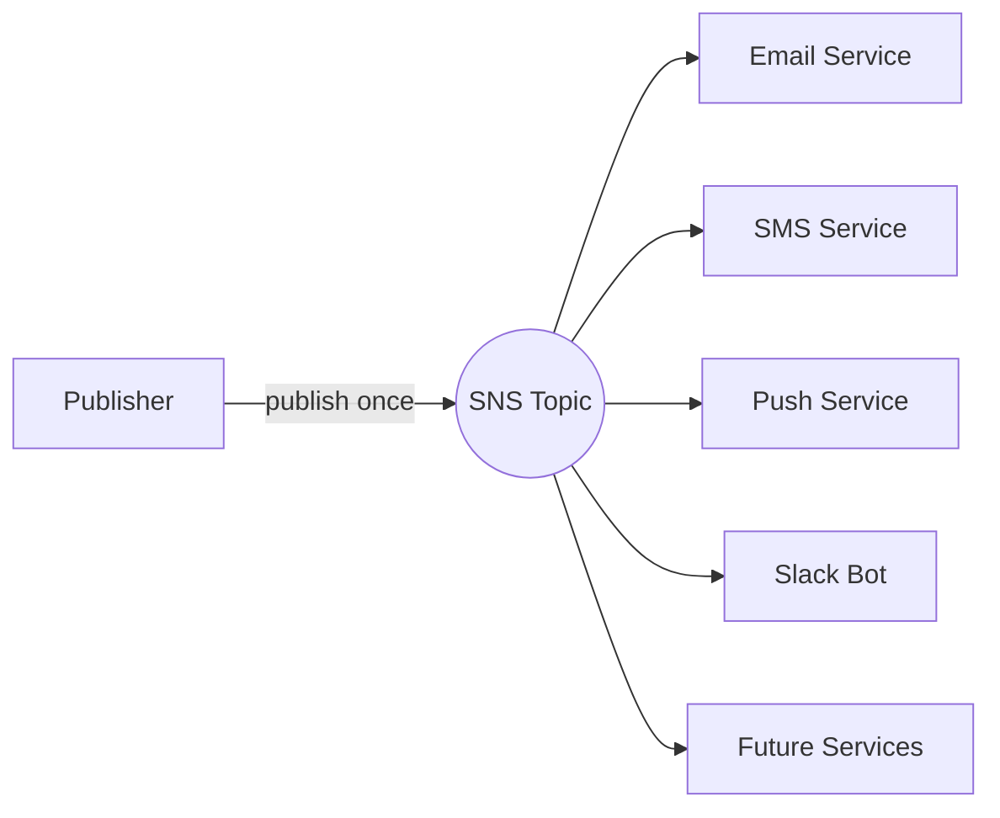
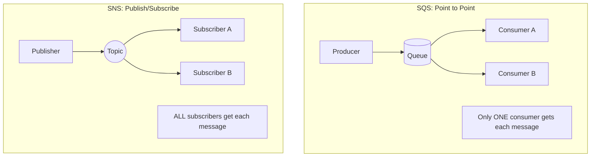
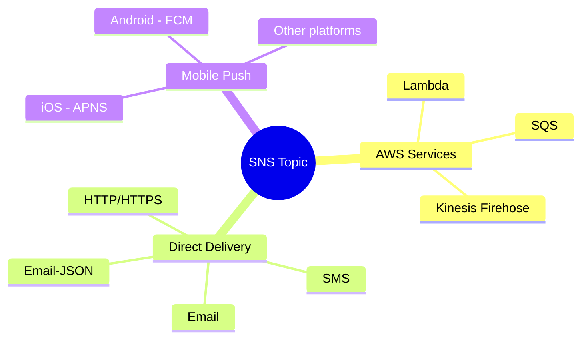
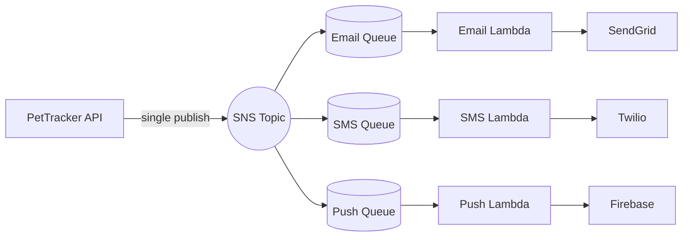
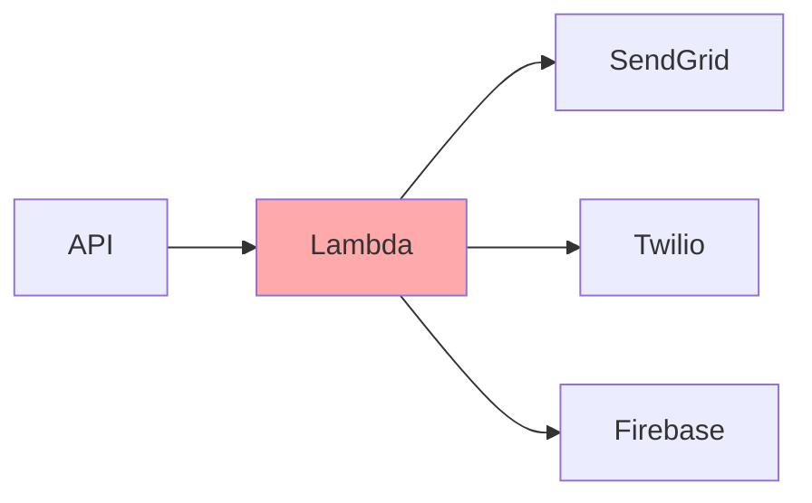
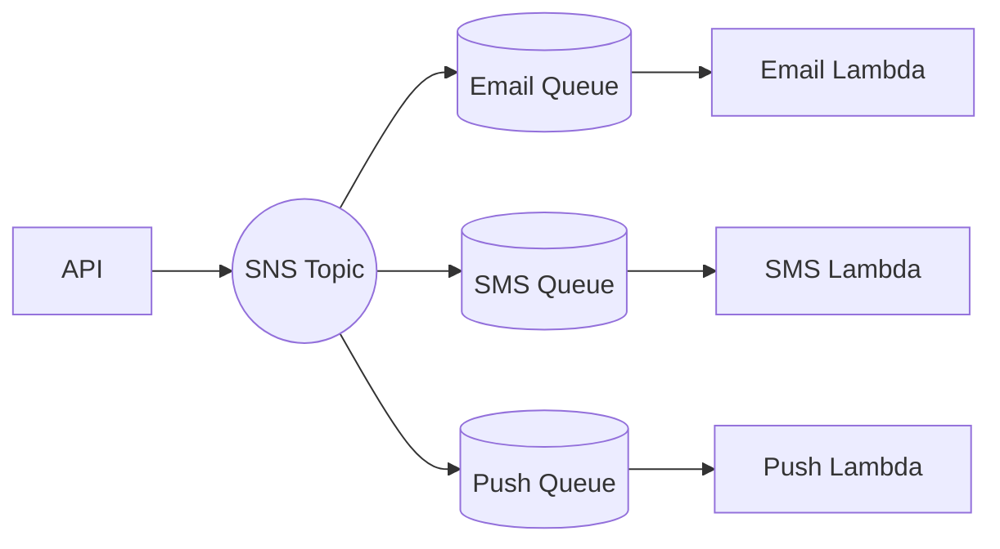

# SNS: When One Message Needs Many Ears

## Alex's Multi-Channel Problem

The notification system is working well. Too well, in fact. Dr. Chen stops by Alex's desk with a new requirement.

"Users are asking for SMS notifications in addition to email. Some want push notifications. Can you add that?"

Alex opens the Lambda code. Currently, it reads from SQS and sends to SendGrid. Adding SMS means adding Twilio calls. Push notifications means adding Firebase. Each message would need to trigger multiple services.

"I could add more code to the Lambda," Alex thinks aloud. "Check the notification type, call the right service..."

Sam overhears and walks over. "Before you go down that road, let me ask you something. What happens when you add Slack notifications next month? And in-app notifications the month after?"

"I'd keep adding more code?"

"And if SendGrid is slow, your SMS and push notifications wait. If Twilio crashes, your Lambda crashes. Everything is coupled together."

Sam pulls up a new AWS console. "Let me show you SNS."

## What is SNS?

**What is Amazon SNS?** A pub/sub messaging service. One message in, multiple messages out. The publisher doesn't know or care who's listening.

"Wait - pub/sub?" Maya asks, joining the conversation.

"Publish/Subscribe," Sam explains. "It's a pattern. The *publisher* sends a message to a *topic*. *Subscribers* register to receive messages from that topic. The publisher doesn't know who the subscribers are - it just publishes. The subscribers don't know who the publisher is - they just receive."

"Like a radio broadcast," Alex suggests.

"Exactly! The station sends out the signal once. Anyone with a radio tuned to that frequency receives it. The station doesn't need to know how many listeners exist."



"So I publish one message to a topic, and all subscribers receive it?"

"Exactly. And here's the beautiful part: adding a new subscriber requires zero code changes. You just add a subscription."

## SNS vs SQS: What's the Difference?

Maya looks confused. "Wait, we already have SQS. Why do we need another messaging service?"

"Different problems, different tools," Sam explains, drawing two diagrams.



"See the difference?" Sam asks. "With SQS, each message goes to *one* consumer. With SNS, each message goes to *all* subscribers."

| Aspect | SQS | SNS |
|--------|-----|-----|
| **Pattern** | Point-to-point | Publish/Subscribe |
| **Message delivery** | One consumer per message | All subscribers get message |
| **Persistence** | Messages stored until processed | Messages pushed immediately, not stored |
| **Consumer type** | Pull (consumer requests) | Push (SNS delivers) |
| **Retry** | Built-in with visibility timeout | Delivery retry policies per subscriber |
| **Use case** | Work queues, task processing | Event broadcasting, fan-out |

"So SQS is a queue - messages wait to be processed," Alex summarizes. "SNS is a topic - messages are broadcast to everyone listening."

"Exactly. And here's the insight: they work beautifully together."

## Creating an SNS Topic

Creating an SNS topic is the first step in setting up pub/sub messaging. The topic is the central hub where publishers send messages and subscribers register to receive them. Unlike SQS where you need to think about queue configuration upfront, an SNS topic has minimal setup - it's just a named endpoint for routing messages.

Alex creates the first SNS topic:

```terminal
$ aws sns create-topic --name pettracker-notifications
{
    "TopicArn": "arn:aws:sns:us-east-1:123456789012:pettracker-notifications"
}
```

The response includes the Topic ARN (Amazon Resource Name), which is the unique identifier you'll use for all future operations - publishing messages, adding subscribers, and configuring policies. Store this ARN in your configuration or environment variables.

"That's it?" Alex asks.

"That's the topic. Now you need subscribers."

## What Can Subscribe to SNS?

SNS can deliver messages to many different endpoint types:



"For your notification system," Sam suggests, "you'll probably want SQS subscribers. Each queue handles one notification channel."

"Wait, why use SQS? Can't SNS deliver directly to Lambda or HTTP?"

"It can, but there's a catch," Sam explains. "SNS doesn't store messages. If a subscriber is down when SNS tries to deliver, what happens?"

Alex thinks. "The message is lost?"

"It might be. SNS retries a few times, but eventually gives up. That's why we combine SNS with SQS - SNS provides the fan-out, SQS provides the durability."

## Setting Up the Multi-Channel System

Alex creates queues for each channel. Each queue will handle one notification channel independently, allowing email, SMS, and push notifications to process at their own pace without affecting each other:

```terminal
# Create queues for each channel
$ aws sqs create-queue --queue-name notifications-email
$ aws sqs create-queue --queue-name notifications-sms
$ aws sqs create-queue --queue-name notifications-push
```

With the queues created, the next step is connecting them to the SNS topic. This is done through subscriptions - each queue "subscribes" to receive copies of messages published to the topic:

Then subscribes each queue to the topic:

```terminal
# Subscribe each queue to the topic
$ aws sns subscribe \
    --topic-arn arn:aws:sns:us-east-1:123456789012:pettracker-notifications \
    --protocol sqs \
    --notification-endpoint arn:aws:sqs:us-east-1:123456789012:notifications-email
```

"So each channel has its own queue and Lambda?" Alex asks.

"Right. They process independently. If the email service is slow, SMS and push keep working."

## The Fan-Out Pattern

"This is called the *fan-out* pattern," Sam draws on the whiteboard.



"One API call, three notification channels. And here's the magic: adding a fourth channel - say, Slack - requires no code changes."

```terminal
$ aws sqs create-queue --queue-name notifications-slack
$ aws sns subscribe \
    --topic-arn arn:aws:sns:us-east-1:123456789012:pettracker-notifications \
    --protocol sqs \
    --notification-endpoint arn:aws:sqs:us-east-1:123456789012:notifications-slack
```

"The API still publishes to the same topic. The new Slack consumer just... appears."

## Publishing to SNS

Now the fun part: publishing messages. The API no longer calls SendGrid, Twilio, and Firebase directly. Instead, it publishes a single message to SNS, and the fan-out pattern handles the rest. The API response time drops from 800ms (waiting for three external services) to about 15ms (one SNS publish).

Alex updates the API code:

```python
import boto3
import json

sns = boto3.client('sns')
topic_arn = 'arn:aws:sns:us-east-1:123456789012:pettracker-notifications'

def send_notification(notification):
    """Publish notification to SNS topic."""
    response = sns.publish(
        TopicArn=topic_arn,
        Message=json.dumps({
            'userId': notification['userId'],
            'type': notification['type'],
            'title': notification['title'],
            'body': notification['body'],
            'data': notification.get('data', {})
        }),
        MessageAttributes={
            'notificationType': {
                'DataType': 'String',
                'StringValue': notification['type']
            },
            'priority': {
                'DataType': 'String',
                'StringValue': notification.get('priority', 'normal')
            }
        }
    )
    return response['MessageId']
```

The `Message` parameter contains the notification payload as JSON. The `MessageAttributes` are key-value pairs that travel alongside the message but aren't part of the body - they're used for filtering and routing. Notice that the API doesn't know or care how many subscribers exist or what they do with the message.

"What are MessageAttributes for?" Maya asks.

"Filtering," Sam answers. "We'll cover that next lesson. They let subscribers choose which messages they receive - so the email queue only gets email notifications, not SMS ones."

## The Gotcha: Queue Permissions

Alex runs a test. The SNS publish succeeds, but no messages appear in the queues.

"What happened?" Alex checks the logs. Nothing.

Sam chuckles. "Classic mistake. Did you give SNS permission to write to your SQS queues?"

"Permission?"

"SNS is a different service. By default, it can't send messages to your queues. You need to add a queue policy."

This is one of the most common mistakes when setting up SNS to SQS fan-out. AWS services are isolated by default - even though both SNS and SQS are AWS services, SNS cannot write to your queue without explicit permission. The queue policy below grants that permission:

```json
{
    "Version": "2012-10-17",
    "Statement": [{
        "Effect": "Allow",
        "Principal": {"Service": "sns.amazonaws.com"},
        "Action": "sqs:SendMessage",
        "Resource": "arn:aws:sqs:us-east-1:123456789012:notifications-email",
        "Condition": {
            "ArnEquals": {
                "aws:SourceArn": "arn:aws:sns:us-east-1:123456789012:pettracker-notifications"
            }
        }
    }]
}
```

The `Condition` block is critical - without it, any SNS topic in any account could send messages to your queue. By specifying the exact source ARN, you ensure only your specific topic can write. Apply this policy to each queue that subscribes to the topic.

"This says: allow SNS to send messages to this queue, but only from this specific topic."

Alex applies the policy, runs the test again. Messages flow into all three queues.

"First try after the permission fix," Alex grins. "This is actually working."

## Did You Know?

Sam shares some SNS insights:

**SNS is regional, but can go global.** You can publish to topics in other regions for geo-redundancy. This matters for disaster recovery - if your primary region goes down, your subscribers in other regions can still receive messages. Some organizations maintain shadow topics in multiple regions, publishing to all of them simultaneously for maximum resilience. The cross-region publish adds a few milliseconds of latency but ensures messages survive regional outages.

**Mobile push is built in.** SNS can send directly to iOS (APNS), Android (FCM), and other platforms without additional services. This is often overlooked because teams assume they need a third-party service like Firebase or OneSignal for push notifications. SNS handles device token management, delivery receipts, and the complexity of platform-specific message formats. For teams already using AWS, this eliminates an external dependency and keeps all notification logic in one place.

**There's a 256KB limit.** Same as SQS. For larger payloads, use S3 references. This limit sounds restrictive, but it forces good design - if your messages are larger than 256KB, you're probably sending too much data through your messaging layer. The standard pattern is to store the large payload in S3, then send just the S3 key through SNS. This also makes your messages cheaper (SNS charges per 64KB chunk) and faster to process.

**SMS has per-country pricing.** Sending to the US is about $0.0065 per message. India is $0.02. International SMS can add up fast. A campaign to 10,000 users in the US costs about $65, but the same campaign to India costs $200. Before implementing SMS notifications, understand your user geography and build cost projections. Many teams implement SMS only for high-priority alerts to control costs, using push or email for routine notifications.

## Alex's Refactored Architecture

### Before: Tightly Coupled



"One Lambda, many dependencies. If Twilio is slow, everything waits."

### After: Loosely Coupled



"Each channel operates independently. Failures are isolated. Scaling is independent."

## Testing the New Architecture

Alex publishes a test notification:

```terminal
$ aws sns publish \
    --topic-arn arn:aws:sns:us-east-1:123456789012:pettracker-notifications \
    --message '{"userId": "test", "type": "vaccination_reminder", "title": "Test", "body": "Testing multi-channel"}'
{
    "MessageId": "abc123-def456-..."
}
```

Checking the queues:

```terminal
$ aws sqs get-queue-attributes \
    --queue-url https://sqs.../notifications-email \
    --attribute-names ApproximateNumberOfMessagesVisible
{
    "Attributes": {
        "ApproximateNumberOfMessagesVisible": "1"
    }
}
```

"One publish, messages in all three queues," Alex confirms. "This is much cleaner."

## Exam Tips

**Key points for DVA-C02:**

1. **SNS is push-based**, SQS is pull-based
2. **Pub/sub pattern** - one publisher, many subscribers
3. **SNS doesn't store messages** - use with SQS for durability
4. **Fan-out pattern** - SNS topic with multiple SQS subscribers
5. **Queue permissions required** - SNS needs `sqs:SendMessage` permission

**Common exam patterns:**

> "Notify multiple systems when an event occurs..."
> → Use SNS topic with multiple subscriptions

> "Decouple microservices while ensuring message durability..."
> → Fan-out pattern: SNS + SQS

> "Add new processing without modifying existing code..."
> → Subscribe new queue to existing SNS topic

## Key Takeaways

Alex reflects on what was learned:

1. **SNS is for fan-out** - one message, many subscribers. Unlike SQS where each message goes to exactly one consumer, SNS broadcasts to all subscribers simultaneously. This is the fundamental difference: SQS is point-to-point (work queue), SNS is publish-subscribe (event broadcast). When you need multiple services to react to the same event, SNS is the right choice.

2. **Pub/sub decouples publishers from subscribers** - neither knows about the other. The publisher sends to a topic ARN, not to specific endpoints. The topic handles routing. This means you can add, remove, or modify subscribers without touching publisher code. When Alex added Slack notifications, the API that publishes vaccination reminders didn't change at all - only the SNS configuration did.

3. **SNS + SQS is the pattern** - fan-out with durability. SNS alone has a weakness: if a subscriber is down, messages might be lost after retry attempts expire. By adding SQS queues as subscribers, you get the best of both worlds - SNS provides the fan-out (one publish, many queues receive), SQS provides the durability (messages wait until consumers are ready). This pattern is so common it has a name: "fan-out queues."

4. **Adding subscribers requires no code changes** - just configuration. This is the real power of decoupling. In a tightly-coupled system, adding a new notification channel means modifying the notification service, testing the changes, and deploying. With SNS, you create a queue, subscribe it to the topic, deploy a new Lambda - and the existing system keeps running unchanged. The time to add a new channel drops from days to hours.

5. **Don't forget queue permissions** - SNS needs access to SQS. This trips up everyone the first time. SNS is a different service from SQS, so by default it cannot send messages to your queue. You must add an SQS queue policy that explicitly allows `sns.amazonaws.com` to call `sqs:SendMessage`. Always include a condition restricting which SNS topic can write - otherwise any topic could send messages to your queue.

---

*Next: Not all messages matter to all subscribers. Alex learns to use SNS filter policies to route messages intelligently.*
