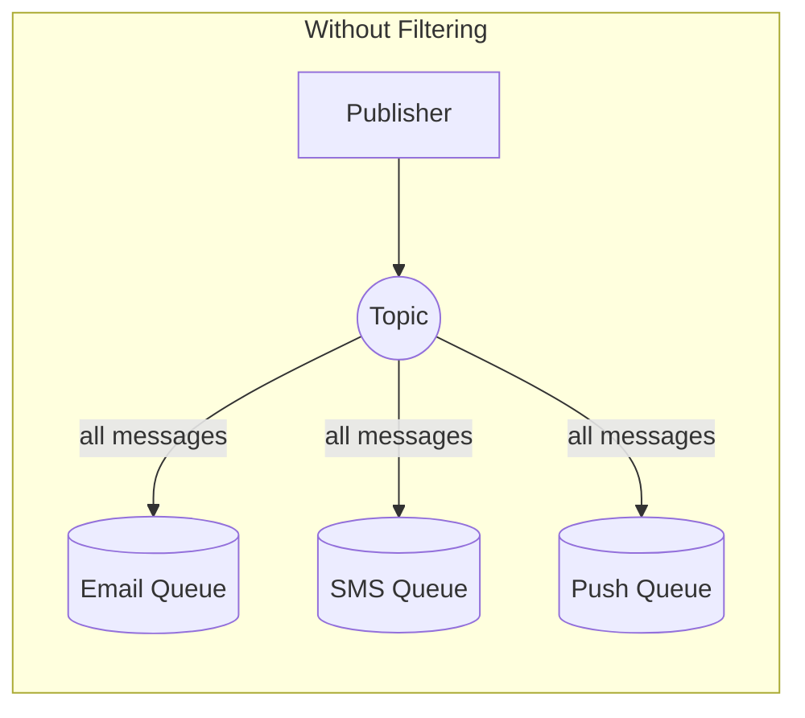
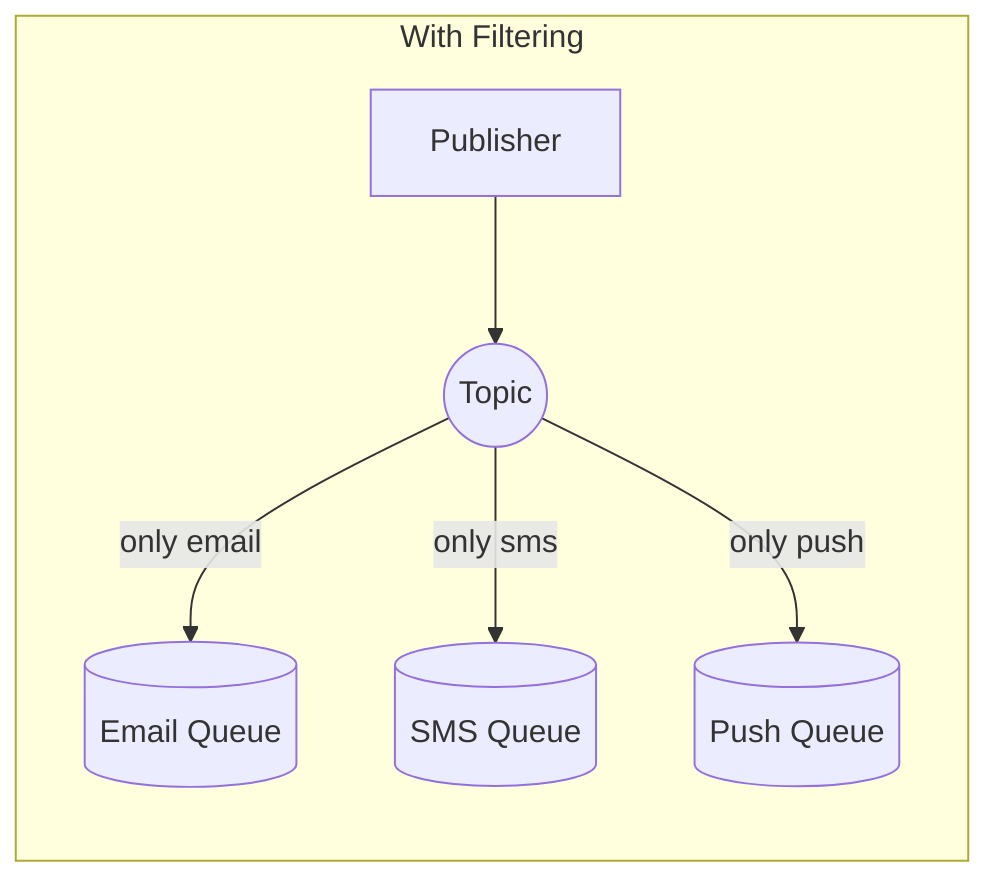

# Message Filtering: Sending the Right Message to the Right Place

## The Unnecessary SMS Problem

The multi-channel notification system is working great. Maybe too great.

"Alex, we're burning through our Twilio budget," Maya shows the invoice. "$450 this month. That's 3x what we expected."

Alex checks the data. Users only signed up for about 15,000 SMS notifications. But the SMS Lambda processed 50,000 messages.

"Wait, that doesn't make sense," Alex digs into the logs. Most of the messages were email notifications. The SMS Lambda received them, checked the user's preferences, realized they didn't want SMS, and discarded them.

"We're paying to process messages we're just going to throw away," Alex realizes.

"There's a better way," Sam says from across the office. "SNS filter policies."

## What Are Filter Policies?

"Instead of sending every message to every subscriber and letting them filter," Sam explains, "you tell SNS: 'Only send this subscriber messages that match these criteria.'"





"So the filtering happens at SNS, before the message even reaches the queue?"

"Exactly. You stop paying for messages you don't need."

## How Filter Policies Work

"A filter policy is a JSON document attached to a subscription," Sam explains. "It matches against the message attributes you set when publishing."

Let's walk through it step by step:

### Step 1: Publisher Adds Attributes

When Alex publishes a message, they include attributes:

```python
sns.publish(
    TopicArn=topic_arn,
    Message=json.dumps(notification),
    MessageAttributes={
        'channel': {
            'DataType': 'String',
            'StringValue': 'email'  # This is the key attribute
        },
        'priority': {
            'DataType': 'String',
            'StringValue': 'high'
        }
    }
)
```

### Step 2: Subscriber Defines Filter

The email queue subscription has a filter policy:

```json
{
    "channel": ["email"]
}
```

This means: "Only deliver messages where the `channel` attribute equals `email`."

### Step 3: SNS Matches

When the message arrives, SNS checks:
- Does the message have a `channel` attribute? Yes.
- Is the value `email`? Yes.
- → Deliver to email queue.

For the SMS queue with filter `{"channel": ["sms"]}`:
- Does the message have a `channel` attribute? Yes.
- Is the value `sms`? No, it's `email`.
- → Don't deliver.

## Setting Up Filter Policies

Alex adds filter policies to each subscription:

```terminal
# Email queue only receives email notifications
$ aws sns set-subscription-attributes \
    --subscription-arn arn:aws:sns:us-east-1:123456789012:pettracker-notifications:abc123 \
    --attribute-name FilterPolicy \
    --attribute-value '{"channel": ["email"]}'

# SMS queue only receives SMS notifications
$ aws sns set-subscription-attributes \
    --subscription-arn arn:aws:sns:us-east-1:123456789012:pettracker-notifications:def456 \
    --attribute-name FilterPolicy \
    --attribute-value '{"channel": ["sms"]}'

# Push queue only receives push notifications
$ aws sns set-subscription-attributes \
    --subscription-arn arn:aws:sns:us-east-1:123456789012:pettracker-notifications:ghi789 \
    --attribute-name FilterPolicy \
    --attribute-value '{"channel": ["push"]}'
```

## Filter Policy Syntax

"Let me show you more advanced filtering," Sam says.

### Exact Match

```json
{
    "channel": ["email"]
}
```

Matches messages where `channel` equals `email`.

### Multiple Values (OR Logic)

```json
{
    "channel": ["email", "sms"]
}
```

Matches messages where `channel` is `email` OR `sms`.

"So values in the same array mean 'any of these'?" Alex asks.

"Right. It's OR logic within an attribute."

### Multiple Attributes (AND Logic)

```json
{
    "channel": ["email"],
    "priority": ["high"]
}
```

Matches messages where `channel` is `email` AND `priority` is `high`.

"And multiple attributes mean 'all of these'?"

"Exactly. It's AND logic between attributes."

### Numeric Matching

"What if I want to filter by priority level, like 'priority 5 or higher'?" Maya asks.

```json
{
    "priority": [{"numeric": [">=", 5]}]
}
```

Matches messages where `priority` is greater than or equal to 5.

You can also do ranges:

```json
{
    "price": [{"numeric": [">", 0, "<=", 100]}]
}
```

Matches messages where `price` is between 0 and 100.

### Prefix Matching

```json
{
    "event_type": [{"prefix": "order."}]
}
```

Matches messages where `event_type` starts with `order.` - like `order.created`, `order.updated`, `order.cancelled`.

"That's useful for event hierarchies," Alex notes.

### Anything-But Matching

```json
{
    "status": [{"anything-but": ["cancelled", "rejected"]}]
}
```

Matches messages where `status` is NOT `cancelled` or `rejected`.

### Exists Check

```json
{
    "urgent": [{"exists": true}]
}
```

Matches any message that has an `urgent` attribute, regardless of value.

## The Publisher's Responsibility

"Wait," Alex pauses. "Who decides what attributes to include?"

"The publisher," Sam says. "And that's an important architectural decision. You need to think about what your subscribers need to filter on."

Maya looks concerned. "So the publisher has to know about subscriber needs?"

"Not *who* the subscribers are," Sam clarifies. "But what *categories* of messages exist. It's like labeling packages - you put 'fragile' on glass items not because you know who's handling them, but because handlers might need that information."

Alex updates the publishing code:

```python
def send_notification(user, notification):
    """Publish notification with attributes for filtering."""

    # Determine which channels this user wants
    user_prefs = get_user_notification_preferences(user['id'])

    for channel in user_prefs['enabled_channels']:
        sns.publish(
            TopicArn=topic_arn,
            Message=json.dumps({
                'userId': user['id'],
                'notification': notification
            }),
            MessageAttributes={
                'channel': {
                    'DataType': 'String',
                    'StringValue': channel  # 'email', 'sms', or 'push'
                },
                'priority': {
                    'DataType': 'String',
                    'StringValue': notification.get('priority', 'normal')
                },
                'notification_type': {
                    'DataType': 'String',
                    'StringValue': notification['type']
                }
            }
        )
```

## Testing the Filters

Alex sends test notifications:

```python
# Send an email notification
sns.publish(
    TopicArn=topic_arn,
    Message=json.dumps({'userId': 'test', 'content': 'Test email'}),
    MessageAttributes={
        'channel': {'DataType': 'String', 'StringValue': 'email'}
    }
)

# Send an SMS notification
sns.publish(
    TopicArn=topic_arn,
    Message=json.dumps({'userId': 'test', 'content': 'Test SMS'}),
    MessageAttributes={
        'channel': {'DataType': 'String', 'StringValue': 'sms'}
    }
)
```

Checking the queues:

```terminal
# Email queue: 1 message (the email notification)
# SMS queue: 1 message (the SMS notification)
# Push queue: 0 messages (no push notifications sent)
```

"Beautiful," Alex smiles. "Each message only goes where it belongs."

## Common Filtering Gotchas

### Gotcha 1: Missing Attributes

"What if a message doesn't have the attribute I'm filtering on?" Alex asks.

"It doesn't match," Sam says. "A filter for `{"channel": ["email"]}` won't match a message that has no `channel` attribute at all."

"So messages without the attribute are silently dropped?"

"Dropped from that subscription, yes. They might still match other subscriptions."

"What if I want 'match if the attribute exists, regardless of value'?"

"Use the exists filter: `{"channel": [{"exists": true}]}`"

### Gotcha 2: Attribute Types Matter

"If you're doing numeric filtering, the attribute must be a Number type, not a String," Sam warns.

```python
# Wrong - priority as string can't be filtered numerically
'priority': {'DataType': 'String', 'StringValue': '5'}

# Right - priority as number
'priority': {'DataType': 'Number', 'StringValue': '5'}  # Note: still StringValue!
```

"Wait, StringValue for a Number?"

"I know, it's confusing. The DataType says `Number`, but you still pass the value as a string. SNS parses it."

### Gotcha 3: Unmatched Messages Are Silent

"What happens to a message that doesn't match any filter?" Maya asks.

"It's dropped. No error, no DLQ, no notification. Just... gone."

"That seems dangerous."

"It can be. That's why you might want a catch-all subscription."

```python
# Create an analytics subscription with no filter - gets everything
sns.subscribe(
    TopicArn=topic_arn,
    Protocol='sqs',
    Endpoint=analytics_queue_arn,
    Attributes={
        'RawMessageDelivery': 'true'
        # No FilterPolicy = receives everything
    }
)
```

## The Cost Impact

A week later, Alex reviews the metrics:

| Metric | Before Filtering | After Filtering |
|--------|-----------------|-----------------|
| Messages to Email Queue | 50,000 | 30,000 |
| Messages to SMS Queue | 50,000 | 15,000 |
| Messages to Push Queue | 50,000 | 25,000 |
| Wasted Lambda Invocations | 55,000 | 0 |
| Monthly SMS processing cost | $450 | $135 |

"The Twilio bill dropped to a third of what it was," Alex shows Maya.

"And we're not wasting Lambda invocations either," Maya adds. "Good habits compound."

## Filtering on Message Body

"Can I filter on the message body instead of attributes?" Alex asks.

"Yes, but it's a different mode," Sam explains.

```terminal
$ aws sns set-subscription-attributes \
    --subscription-arn arn:aws:sns:... \
    --attribute-name FilterPolicyScope \
    --attribute-value MessageBody
```

Then your filter matches against JSON paths in the message:

```json
{
    "user.country": ["US", "CA"],
    "order.total": [{"numeric": [">=", 100]}]
}
```

"When would I use body filtering vs attribute filtering?"

"Attributes are faster - SNS doesn't need to parse the message body. Use body filtering when you can't modify the publisher to add attributes, or when the filtering criteria are deeply nested in the message."

## Exam Tips

**Key points for DVA-C02:**

1. **Filter policies reduce unnecessary delivery** - save costs and processing
2. **Attribute-based is default** and faster than body-based
3. **OR logic within attribute values** - `["a", "b"]` matches a OR b
4. **AND logic between attributes** - all must match
5. **Missing attributes don't match** - unless using `exists`
6. **Unmatched messages are dropped** - silently, no DLQ

**Common exam patterns:**

> "Only send high-priority messages to the SMS queue..."
> → Filter policy with `{"priority": ["high"]}`

> "Send all order events except cancellations..."
> → Filter policy with `{"status": [{"anything-but": ["cancelled"]}]}`

> "Route based on message content, not attributes..."
> → Set FilterPolicyScope to MessageBody

## Key Takeaways

Alex reflects on message filtering:

1. **Filter at SNS, not in consumers** - every Lambda invocation costs money, even if it just checks a condition and returns. SNS filter policies move that check to AWS infrastructure, so filtered messages never invoke your Lambda at all. In PetTracker's case, this cut SMS processing Lambda invocations by 70%, saving $315/month.

2. **Attributes are set by publishers** - filter policies match against message attributes, which means publishers must include the right attributes for filtering to work. This is a design decision: what dimensions will subscribers need to filter on? Channel (email/sms/push)? Priority (high/low)? Event type (order.created/order.shipped)? Plan this schema upfront and document it.

3. **OR within values, AND between attributes** - `{"channel": ["email", "sms"]}` means "channel is email OR sms". `{"channel": ["email"], "priority": ["high"]}` means "channel is email AND priority is high". This lets you build precise filters, but understand the logic or you'll get unexpected results.

4. **Missing attributes = no match** - if your filter requires `priority` and a message doesn't have a `priority` attribute, that message is silently dropped from that subscription. This is a common source of "lost" messages. Either ensure all messages include all filterable attributes, or use `{"attribute": [{"exists": false}]}` to handle missing values explicitly.

5. **Add a catch-all for analytics** - create one subscription with no filter policy to receive all messages. Use this for analytics, auditing, or just as a safety net. If messages are disappearing, check this subscription to see what's actually being published. Never have a system where unmatched messages silently vanish into the void.

---

*Next: Alex puts everything together in the powerful fan-out pattern - SNS plus SQS for parallel, independent processing.*
