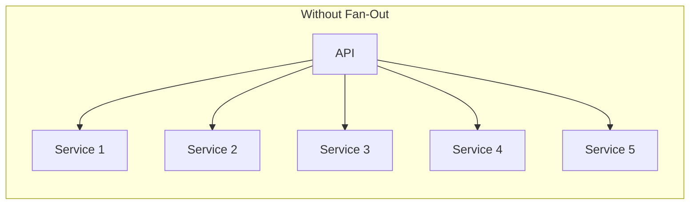
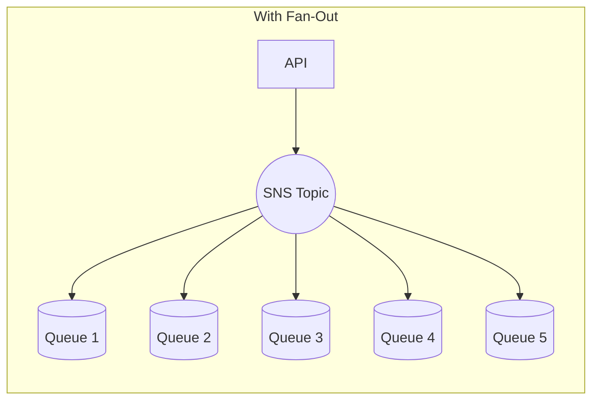
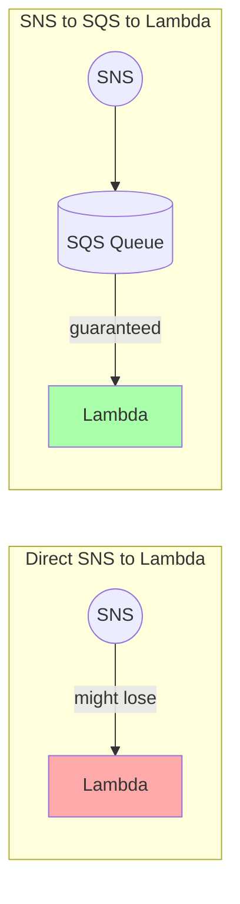
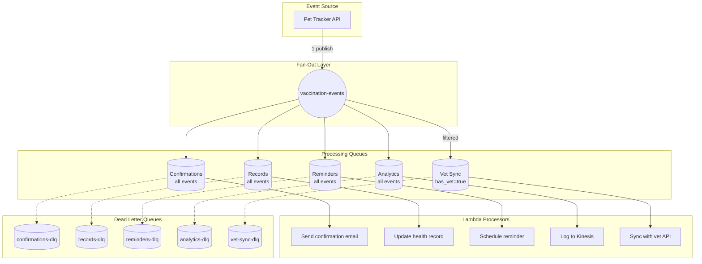

# The Fan-Out Pattern: One Event, Many Reactions

## When Multiple Services Need the Same Information

Alex walks into the Monday standup looking stressed. The week's goal: integrate three new features at once.

"When a user records a pet vaccination," Dr. Chen explains, "we need to:
1. Send a confirmation email
2. Update the pet's health record
3. Schedule the next vaccination reminder
4. Log the event for analytics
5. If it's a clinic-administered shot, sync with the vet's system"

Alex sighs. "So every vaccination triggers five different services."

"And next month, we're adding achievement badges," Maya adds. "That's six services."

"This is the perfect use case for fan-out," Sam says. "Instead of calling five services from your API, you publish one message. The services that care... react."

## What is the Fan-Out Pattern?

"Fan-out is simple," Sam draws on the whiteboard. "One event comes in. Multiple copies fan out to multiple consumers."



"Right now, your API calls each service directly. What happens if Service 3 is slow?"

Alex thinks. "Everything waits?"

"Exactly. And if Service 4 crashes while you're calling it, what happens to Service 5?"

"It never gets called?"

"Right. And you have to handle the partial failure - some services got the message, others didn't. It's a mess."



"With fan-out, your API publishes to a single topic. Done. Each queue receives a copy. Each service processes independently. If Service 3 is slow, the others don't care. If Service 4 crashes, its messages wait in the queue for when it recovers."

## Why SNS + SQS Together?

"Wait," Maya asks, "why do we need both SNS *and* SQS? Can't SNS deliver directly to Lambda?"

"It can," Sam nods, "but there's a critical difference. SNS is like a broadcaster - it sends the message and forgets. If the recipient isn't available..."

"The message is lost?"

"Not immediately - SNS retries a few times. But if your Lambda keeps timing out, eventually SNS gives up. With SQS in between, messages are stored durably. They wait until the consumer is ready."

Alex summarizes: "SNS provides the fan-out. SQS provides the durability."

"Exactly. Best of both worlds."



## Building the Vaccination Event Fan-Out

Alex starts building the architecture for vaccination events:

### Step 1: Create the Topic

The SNS topic is the central hub for vaccination events. Every time a vaccination is recorded, a message goes here, and SNS handles distributing it to all the services that need to know. Creating the topic is straightforward:

```python
import boto3
import json

sns = boto3.client('sns')
sqs = boto3.client('sqs')

# Create the central topic
topic_response = sns.create_topic(Name='pettracker-vaccinations')
topic_arn = topic_response['TopicArn']
print(f"Topic created: {topic_arn}")
```

The `create_topic` call is idempotent - if the topic already exists, it returns the existing ARN instead of creating a duplicate. This makes the code safe to run multiple times without side effects.

### Step 2: Create Queues for Each Service

Each downstream service gets its own queue. This isolation is key - if the email service is slow, it doesn't affect the health records update. If the vet sync fails, reminders still get scheduled. The queues act as buffers, absorbing spikes and failures independently.

```python
# Each service gets its own queue
services = [
    {'name': 'vaccination-confirmations', 'purpose': 'Send confirmation emails'},
    {'name': 'vaccination-records', 'purpose': 'Update health records'},
    {'name': 'vaccination-reminders', 'purpose': 'Schedule next reminder'},
    {'name': 'vaccination-analytics', 'purpose': 'Track statistics'},
    {'name': 'vaccination-vet-sync', 'purpose': 'Sync with vet systems'}
]

queues = {}
for service in services:
    response = sqs.create_queue(QueueName=service['name'])
    queue_url = response['QueueUrl']

    # Get the ARN for subscription
    attrs = sqs.get_queue_attributes(
        QueueUrl=queue_url,
        AttributeNames=['QueueArn']
    )

    queues[service['name']] = {
        'url': queue_url,
        'arn': attrs['Attributes']['QueueArn'],
        'purpose': service['purpose']
    }

    print(f"Created queue: {service['name']}")
```

Notice we store both the queue URL (needed for sending/receiving messages) and the queue ARN (needed for subscriptions and policies). The ARN is the unique identifier across all of AWS, while the URL is specific to the SQS API.

### Step 3: Allow SNS to Send to SQS

"Don't forget the permissions," Sam reminds. "SNS can't send to your queues unless you explicitly allow it."

```python
def create_queue_policy(queue_arn, topic_arn):
    """Policy allowing SNS to send messages to this queue."""
    return json.dumps({
        'Version': '2012-10-17',
        'Statement': [{
            'Sid': 'AllowSNSSend',
            'Effect': 'Allow',
            'Principal': {'Service': 'sns.amazonaws.com'},
            'Action': 'sqs:SendMessage',
            'Resource': queue_arn,
            'Condition': {
                'ArnEquals': {'aws:SourceArn': topic_arn}
            }
        }]
    })

# Apply policy to each queue
for name, queue in queues.items():
    policy = create_queue_policy(queue['arn'], topic_arn)
    sqs.set_queue_attributes(
        QueueUrl=queue['url'],
        Attributes={'Policy': policy}
    )
    print(f"Applied policy to {name}")
```

### Step 4: Subscribe Queues to the Topic

```python
# Subscribe each queue to receive vaccination events
for name, queue in queues.items():
    response = sns.subscribe(
        TopicArn=topic_arn,
        Protocol='sqs',
        Endpoint=queue['arn'],
        Attributes={
            'RawMessageDelivery': 'true'  # Get the message directly, no wrapper
        }
    )
    print(f"Subscribed {name}: {response['SubscriptionArn']}")
```

"What's RawMessageDelivery?" Alex asks.

"By default, SNS wraps your message in metadata - the topic ARN, message ID, subscription ARN, etc. With raw delivery, your queue gets exactly what you published. Simpler for processing."

### Step 5: Publish a Vaccination Event

Now the magic happens. When a vaccination is recorded, the API publishes a single event to SNS. That one `publish()` call triggers all five downstream services - confirmations, records, reminders, analytics, and vet sync. The API doesn't know how many services are listening, and it doesn't wait for any of them to finish.

```python
def record_vaccination(pet_id, vaccine_type, administered_by, vet_id=None):
    """Record a vaccination and trigger all downstream processing."""

    event = {
        'eventType': 'vaccination_recorded',
        'petId': pet_id,
        'vaccineType': vaccine_type,
        'administeredBy': administered_by,
        'timestamp': datetime.utcnow().isoformat()
    }

    if vet_id:
        event['vetId'] = vet_id

    # One publish - five services react
    response = sns.publish(
        TopicArn=topic_arn,
        Message=json.dumps(event),
        MessageAttributes={
            'event_type': {
                'DataType': 'String',
                'StringValue': 'vaccination_recorded'
            },
            'has_vet': {
                'DataType': 'String',
                'StringValue': 'true' if vet_id else 'false'
            }
        }
    )

    print(f"Published vaccination event: {response['MessageId']}")
    return response['MessageId']

# Record a vaccination
record_vaccination(
    pet_id='pet-123',
    vaccine_type='rabies',
    administered_by='owner',
    vet_id='vet-456'
)
```

The `MessageAttributes` enable filtering. The `has_vet` attribute lets the vet-sync subscription filter for only clinic-administered vaccinations. The event_type attribute could be used to distinguish vaccination events from other pet events if this topic grows to handle more event types.

## The Power of Independence

Alex runs a test. The publish takes 12 milliseconds. All five queues receive the message.

"But here's the real power," Sam says. "Shut down the vet-sync service."

Alex simulates a failure - the vet-sync Lambda starts throwing errors.

"Now record another vaccination."

Alex does. The confirmation email goes out. The health record updates. The reminder is scheduled. Analytics logged. But vet-sync...

"The message is sitting in the queue," Alex checks. "Waiting."

"Now fix the vet-sync service."

Alex deploys a fix. Within seconds, the vet-sync Lambda processes its backlog.

"No message lost. No other services affected. That's the power of decoupling."

## Adding Filters to Fan-Out

"Not every queue needs every message," Maya points out. "The vet-sync only cares about vaccinations administered at clinics."

"That's where filter policies come in," Sam says. "You can filter at the subscription level."

```python
# Vet-sync only gets messages with a vet ID
sns.set_subscription_attributes(
    SubscriptionArn=vet_sync_subscription_arn,
    AttributeName='FilterPolicy',
    AttributeValue=json.dumps({
        'has_vet': ['true']
    })
)

# Analytics gets everything (no filter)
# The other services get all vaccinations but filter in their processors
```

"So the vet-sync queue only receives messages where `has_vet` is `true`?"

"Exactly. Home-administered vaccinations don't even touch that queue. Less processing, lower costs."

## The Complete Vaccination Architecture



## Adding a New Service: Zero Code Changes

Two weeks later, the achievement badge feature is ready.

"How do we integrate it with vaccinations?" Maya asks.

Alex smiles. "Easy." They create a new queue and subscribe it to the topic:

```terminal
$ aws sqs create-queue --queue-name vaccination-achievements
$ aws sns subscribe \
    --topic-arn arn:aws:sns:us-east-1:123456789012:pettracker-vaccinations \
    --protocol sqs \
    --notification-endpoint arn:aws:sqs:us-east-1:123456789012:vaccination-achievements
```

"That's it?" Maya asks.

"That's it. The existing code doesn't change. The new service just starts receiving events."

"And if we need to remove a service?"

"Delete the subscription. No code changes needed."

## Benefits of Fan-Out

Alex documents the benefits for the team:

| Aspect | Before (Direct Calls) | After (Fan-Out) |
|--------|----------------------|-----------------|
| **API Response Time** | Sum of all service calls (~2s) | Single SNS publish (~12ms) |
| **Failure Handling** | Partial failures, manual rollback | Independent, automatic retry |
| **Adding Services** | Code change, deploy, test | New subscription only |
| **Removing Services** | Code change, deploy, test | Delete subscription |
| **Service Coupling** | API knows all downstream services | API only knows the topic |
| **Scaling** | Bottlenecked by slowest service | Each service scales independently |

## Exam Tips

**Key points for DVA-C02:**

1. **Fan-out pattern** = SNS topic + multiple SQS subscribers
2. **SNS provides fan-out**, SQS provides durability
3. **Queue policies required** for SNS to SQS delivery
4. **RawMessageDelivery** sends the message without SNS wrapper
5. **Adding/removing consumers** requires no code changes
6. **Filter policies** can route specific messages to specific queues

**Common exam patterns:**

> "Process an event with multiple independent services..."
> → Fan-out with SNS to multiple SQS queues

> "Add a new processor without modifying existing code..."
> → Subscribe new queue to existing SNS topic

> "Ensure messages aren't lost if a service is down..."
> → SNS + SQS (not direct SNS to Lambda)

## Key Takeaways

Alex summarizes the fan-out pattern:

1. **One publish, many consumers** - the core fan-out concept. The API calls `sns.publish()` once. That single call triggers message delivery to every subscribed queue. The API doesn't know how many subscribers exist - it could be 2 or 200. This is fundamentally different from direct calls where the API would need to call each service individually. One publish, fan-out handles the rest.

2. **SNS + SQS = reliability** - fan-out with durability. SNS broadcasts instantly but doesn't store messages. If Lambda is down when SNS tries to deliver, messages might be lost after retries. SQS adds persistence - messages wait in the queue until the consumer processes them. This combination gives you instant fan-out (SNS) plus guaranteed delivery (SQS). It's why this pattern is the default for production systems.

3. **Independence is power** - services don't affect each other. When the vet-sync service crashed during Alex's test, the other four services kept processing normally. Each queue is a buffer that isolates its consumer from problems elsewhere. This is the core benefit of decoupling: a slow email service doesn't delay SMS, a crashing analytics Lambda doesn't affect push notifications. Failures are contained, not cascading.

4. **Zero-code changes for new services** - just add a subscription. Adding the achievements badge service took three commands: create queue, add queue policy, subscribe to topic. No changes to the vaccination recording API. No redeployment of existing Lambdas. No risk to working code. This is what architects mean by "extensible" - you can add capabilities without modifying what already works.

5. **Filter when possible** - reduce unnecessary processing. Not every message matters to every subscriber. The vet-sync service only cares about clinic-administered vaccinations, not home-administered ones. By adding a filter policy (`has_vet: ['true']`), SNS never even delivers irrelevant messages to that queue. Fewer messages = lower costs = less wasted Lambda invocations. Filter at the source, not in the consumer.

---

*Next: What happens when messages keep failing? Alex discovers Dead Letter Queues.*

---
*v1.0*
