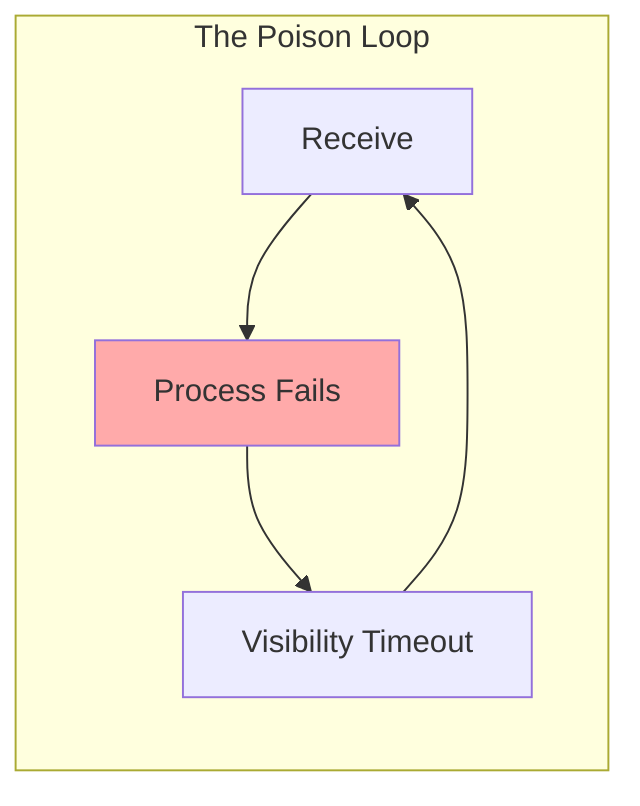
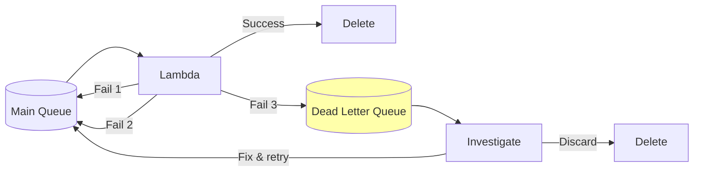
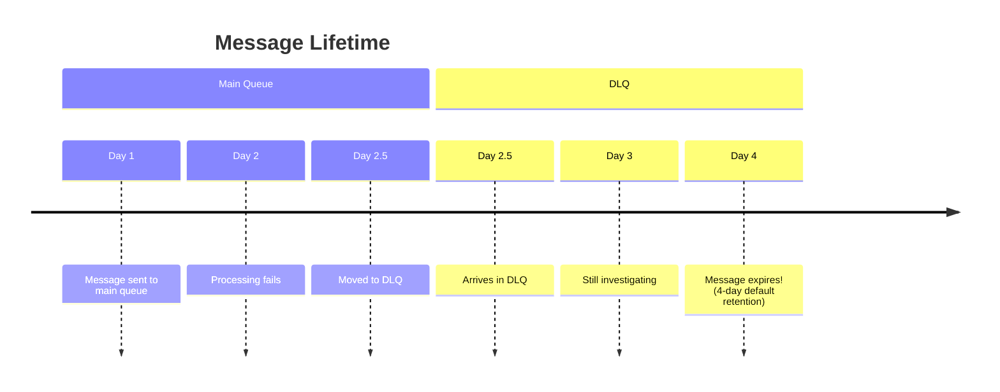
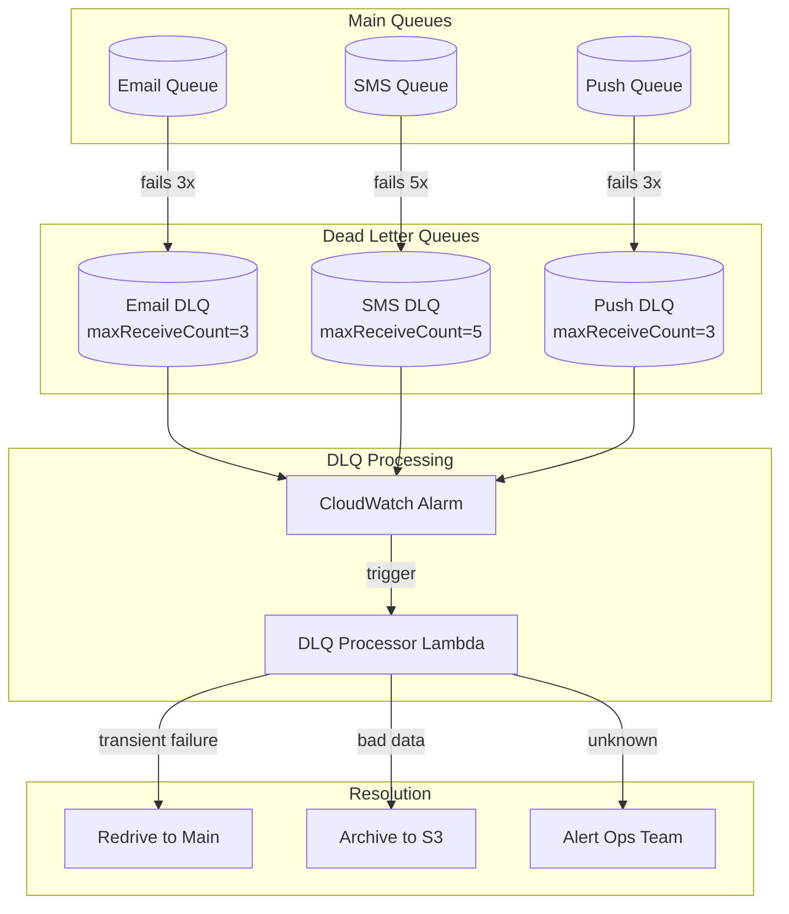

# Dead Letter Queues: Where Failed Messages Go to Wait

## Alex's Mysterious Infinite Loop

Two weeks into the new messaging system, Alex notices something strange in CloudWatch. The Lambda invocation count is through the roof.

"We sent 10,000 notifications yesterday," Alex checks the metrics, "but the Lambda ran 47,000 times. And our costs are spiking."

Sam pulls up the queue metrics. One message has been received 347 times in the past 24 hours.

"You have a poison message," Sam says.

"A what?"

## What is a Poison Message?

"A poison message is one that can never be processed successfully," Sam explains. "Think about it - what happens when your Lambda fails to process a message?"

Alex thinks. "It doesn't delete the message, so after the visibility timeout, it reappears."

"Right. And then?"

"Lambda picks it up again, fails again, reappears again..."

"Forever. That's the poison loop."



"Let me show you what's happening." Sam pulls up the failing message:

```json
{
    "userId": "user-123",
    "email": "this-is-not-an-email",
    "notificationType": "vaccination_reminder"
}
```

"Someone entered an invalid email. When Lambda tries to send to SendGrid, it fails. Every time."

"So this bad message is consuming resources forever?"

"Exactly. And you're paying for every failed attempt. That's why you need a Dead Letter Queue."

## What is a Dead Letter Queue?

"A Dead Letter Queue - DLQ for short - is a parking lot for problem messages," Sam draws on the whiteboard.



"After a message fails processing N times, SQS moves it to the DLQ instead of putting it back in the main queue."

"So the poison loop breaks?"

"Exactly. The bad message is quarantined. Your main queue can process healthy messages. And you can investigate the failed ones at your leisure."

## Setting Up a Dead Letter Queue

"Let's set one up," Sam guides Alex.

### Step 1: Create the DLQ

The DLQ is just a regular SQS queue:

```terminal
$ aws sqs create-queue --queue-name pettracker-notifications-dlq
{
    "QueueUrl": "https://sqs.us-east-1.amazonaws.com/123456789012/pettracker-notifications-dlq"
}
```

### Step 2: Get the DLQ ARN

```terminal
$ aws sqs get-queue-attributes \
    --queue-url https://sqs.../pettracker-notifications-dlq \
    --attribute-names QueueArn
{
    "Attributes": {
        "QueueArn": "arn:aws:sqs:us-east-1:123456789012:pettracker-notifications-dlq"
    }
}
```

### Step 3: Configure the Redrive Policy

"The magic is in the *redrive policy*," Sam explains. "It tells SQS: after this many failures, move the message to that DLQ."

```terminal
$ aws sqs set-queue-attributes \
    --queue-url https://sqs.../pettracker-notifications \
    --attributes '{
        "RedrivePolicy": "{\"deadLetterTargetArn\":\"arn:aws:sqs:us-east-1:123456789012:pettracker-notifications-dlq\",\"maxReceiveCount\":\"3\"}"
    }'
```

"What's `maxReceiveCount`?" Alex asks.

"The number of times a message can be received before it's moved to the DLQ. You set it to 3, so:
- First receive: Lambda fails → message returns to queue
- Second receive: Lambda fails → message returns to queue
- Third receive: Lambda fails → message moves to DLQ

No fourth attempt. The message is out of the main queue."

## Choosing maxReceiveCount

"How do I know what number to use?" Alex asks.

"It depends on why messages fail," Sam explains.

| Failure Type | Recommended maxReceiveCount | Why |
|--------------|----------------------------|-----|
| **Transient** (network hiccups, rate limits) | 5-10 | These usually resolve themselves |
| **Recoverable** (service temporarily down) | 3-5 | Gives time for recovery |
| **Permanent** (bad data, missing dependencies) | 2-3 | Won't fix itself, fail fast |
| **Critical** (must not lose) | 10+ | Maximum retry attempts |

"For notifications, what kind of failures do we expect?" Sam asks.

Alex thinks. "Sometimes SendGrid is slow. Sometimes users have invalid emails. Sometimes... I don't know yet."

"Start with 3. It catches permanent failures quickly but gives transient failures a few chances. You can adjust based on what you see in the DLQ."

## Monitoring the DLQ

"A DLQ is useless if you don't know messages are landing there," Sam warns. "Set up an alarm."

```terminal
$ aws cloudwatch put-metric-alarm \
    --alarm-name "DLQ-Has-Messages" \
    --metric-name ApproximateNumberOfMessagesVisible \
    --namespace AWS/SQS \
    --dimensions Name=QueueName,Value=pettracker-notifications-dlq \
    --statistic Sum \
    --period 300 \
    --threshold 1 \
    --comparison-operator GreaterThanOrEqualToThreshold \
    --evaluation-periods 1 \
    --alarm-actions arn:aws:sns:us-east-1:123456789012:ops-alerts
```

"This fires an alert whenever there's even one message in the DLQ?" Alex asks.

"Right. Messages in the DLQ mean something needs attention. Maybe it's bad data. Maybe it's a bug. Maybe it's a configuration issue. Either way, you want to know."

## Investigating DLQ Messages

The next day, Alex gets an alert. Five messages in the DLQ.

```python
def investigate_dlq():
    """Look at what's failing without removing messages."""
    sqs = boto3.client('sqs')

    response = sqs.receive_message(
        QueueUrl=dlq_url,
        MaxNumberOfMessages=10,
        AttributeNames=['All'],  # Get all message attributes
        MessageAttributeNames=['All'],
        VisibilityTimeout=60  # Short - we're just looking
    )

    for msg in response.get('Messages', []):
        print(f"\n=== Message {msg['MessageId']} ===")
        print(f"Body: {msg['Body']}")
        print(f"Receive Count: {msg['Attributes']['ApproximateReceiveCount']}")
        print(f"First Received: {msg['Attributes'].get('ApproximateFirstReceiveTimestamp')}")

        # Don't delete - let visibility timeout expire
        # so message stays for further investigation

investigate_dlq()
```

Alex runs the script:

```
=== Message a1b2c3d4 ===
Body: {"userId": "user-123", "email": "not-an-email", "type": "reminder"}
Receive Count: 3
First Received: 1711000000000

=== Message e5f6g7h8 ===
Body: {"userId": "user-456", "email": "deleted@example.com", "type": "reminder"}
Receive Count: 3
First Received: 1711000000001
```

"Two invalid emails," Alex notes. "Our validation should have caught these before they entered the queue."

## What to Do With DLQ Messages

"Once you know why messages failed, you have options," Sam explains.

### Option 1: Fix and Redrive

If the issue was transient or you've fixed the underlying bug:

```terminal
# AWS built-in redrive
$ aws sqs start-message-move-task \
    --source-arn arn:aws:sqs:us-east-1:123456789012:pettracker-notifications-dlq \
    --destination-arn arn:aws:sqs:us-east-1:123456789012:pettracker-notifications
```

"This moves all DLQ messages back to the main queue for reprocessing."

### Option 2: Process Differently

Sometimes failed messages need special handling:

```python
def process_dlq():
    """Handle DLQ messages with special logic."""
    for msg in receive_dlq_messages():
        body = json.loads(msg['Body'])

        if is_invalid_email(body.get('email')):
            # Can't send email - try SMS instead?
            convert_to_sms_notification(body)
            delete_message(msg)
        elif is_deleted_user(body.get('userId')):
            # User doesn't exist - just discard
            log_discarded_notification(body)
            delete_message(msg)
        else:
            # Unknown failure - alert for investigation
            alert_ops_team(body, msg['Attributes'])
```

### Option 3: Archive and Discard

For messages that can't be salvaged but should be recorded:

```python
def archive_dlq():
    """Archive failed messages to S3, then delete."""
    for msg in receive_dlq_messages():
        # Archive to S3 for later analysis
        s3.put_object(
            Bucket='pettracker-dlq-archive',
            Key=f"notifications/{date.today()}/{msg['MessageId']}.json",
            Body=json.dumps({
                'message': msg['Body'],
                'attributes': msg['Attributes'],
                'archived_at': datetime.now().isoformat()
            })
        )

        # Now safe to delete
        delete_message(msg)
```

## DLQ Retention: The Hidden Gotcha

"One thing that trips people up," Sam warns. "Message retention in the DLQ starts from when the message was *originally* sent, not when it arrived in the DLQ."



"Wait, the message can expire while I'm still investigating?"

"Yes. The clock started when it was sent, not when it moved to the DLQ."

"So I should set DLQ retention longer?"

"Exactly. I recommend 14 days for DLQs:"

```terminal
$ aws sqs set-queue-attributes \
    --queue-url https://sqs.../pettracker-notifications-dlq \
    --attributes MessageRetentionPeriod=1209600
```

## Alex's DLQ Strategy

Alex implements a comprehensive DLQ approach:



The DLQ processor Lambda:

```python
def dlq_handler(event, context):
    """Automatically process DLQ messages."""
    for record in event['Records']:
        message = json.loads(record['body'])
        source_queue = record['eventSourceARN'].split(':')[-1]

        failure_type = classify_failure(message)

        if failure_type == 'transient':
            # Network issues, rate limits - redrive
            redrive_to_main_queue(message, source_queue)
            log_metric('dlq.transient_redrive')

        elif failure_type == 'bad_data':
            # Invalid email, missing fields - archive
            archive_to_s3(message, source_queue)
            log_metric('dlq.bad_data_archived')

        elif failure_type == 'deleted_user':
            # User no longer exists - discard
            log_metric('dlq.deleted_user_discarded')
            # Just don't redrive - message is deleted by Lambda

        else:
            # Unknown - needs investigation
            send_ops_alert(message, source_queue)
            archive_to_s3(message, source_queue)
            log_metric('dlq.unknown_failure')

def classify_failure(message):
    """Determine why this message failed."""
    if not is_valid_email(message.get('email')):
        return 'bad_data'
    if user_was_deleted(message.get('userId')):
        return 'deleted_user'
    if recent_rate_limit(message.get('channel')):
        return 'transient'
    return 'unknown'
```

## Exam Tips

**Key points for DVA-C02:**

1. **DLQ is just a regular SQS queue** - nothing special about it
2. **Redrive policy** connects main queue to DLQ
3. **maxReceiveCount** determines when messages move
4. **Retention is from original send time** - not DLQ arrival
5. **Set DLQ retention longer** than main queue
6. **Monitor DLQs** - messages there need attention

**Common exam patterns:**

> "Messages are being processed repeatedly consuming resources..."
> → Configure a Dead Letter Queue with appropriate maxReceiveCount

> "Need to investigate failed messages without losing them..."
> → DLQ with CloudWatch alarm

> "After fixing a bug, need to reprocess failed messages..."
> → Use start-message-move-task to redrive from DLQ

## Key Takeaways

Alex summarizes what was learned about DLQs:

1. **Poison messages poison everything** - DLQs quarantine them. A poison message is one that can never be processed successfully - invalid data, deleted user, missing dependency. Without a DLQ, it retries forever: receive, fail, visibility timeout, receive, fail. Each retry costs Lambda invocations, API calls, and cloud resources. With a DLQ, after N failures the message is moved aside, the main queue clears, and you can investigate at your leisure instead of under pressure.

2. **maxReceiveCount is your friend** - balance retries vs fast failure. Set it too low (1), and transient failures like network hiccups become permanent failures. Set it too high (20), and poison messages waste resources for a long time before quarantine. For most workloads, 3-5 is the sweet spot. Alex uses 3 for email (failures are usually permanent - invalid address), 5 for SMS (Twilio rate limits are transient). Tune based on your failure patterns.

3. **Monitor your DLQs** - every message there is a signal. A message in the DLQ means something failed repeatedly. It might be a bug in your code, bad data from an upstream system, a configuration issue, or a third-party service problem. Set up CloudWatch alarms for `ApproximateNumberOfMessagesVisible > 0` on every DLQ. When the alarm fires, investigate immediately - those messages represent failed business operations that users are waiting for.

4. **Retention starts at send time** - give yourself time to investigate. This catches people by surprise. If you send a message Monday, it fails Tuesday, and moves to DLQ Wednesday, the 4-day retention clock started Monday. By Thursday, it's gone - even though you only had one day to investigate. Set DLQ retention to 14 days (maximum) to give yourself time to discover problems, investigate causes, and fix underlying issues before messages expire.

5. **Have a plan for DLQ messages** - redrive, archive, or alert. Don't let messages sit in DLQ indefinitely. Build a process: (1) Classify the failure - is it transient, bad data, or unknown? (2) For transient failures after you've fixed the underlying issue, use `start-message-move-task` to redrive back to main queue. (3) For bad data, archive to S3 for analysis, then delete. (4) For unknown failures, alert the ops team and archive. Every DLQ message should eventually be resolved, not forgotten.

---

*Next: When order matters - Alex learns about FIFO queues for processing events in sequence.*

---
*v1.0*
