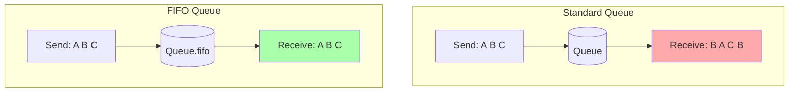
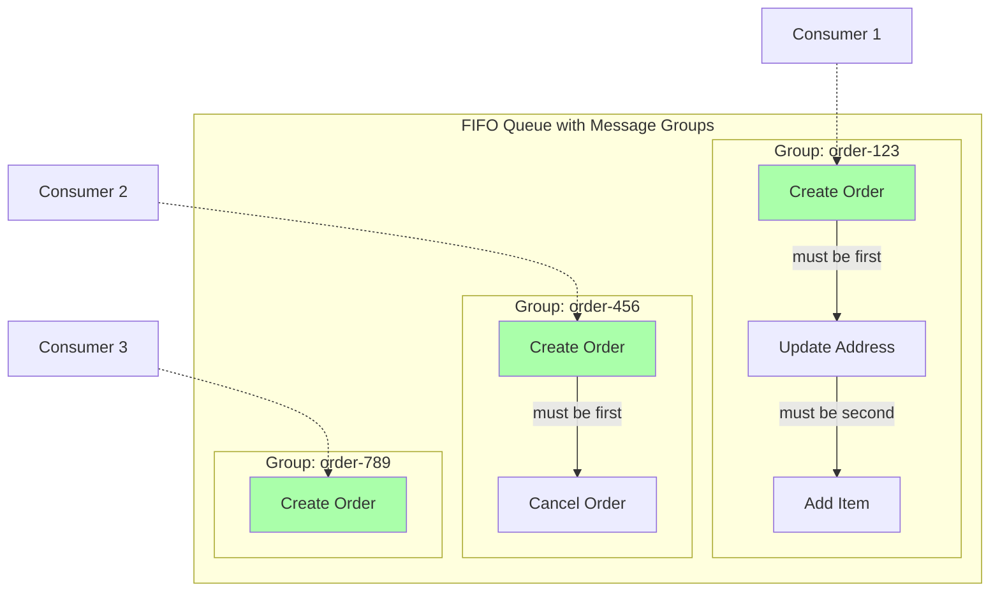

# FIFO Queues: When Order Matters

## Alex's Order Processing Nightmare

PetTracker has grown to include a pet supplies shop. Orders are flowing in, and Alex's team processes them using SQS. But customers are complaining:

> "I updated my shipping address right after placing the order, but my package went to the old address!"

Alex investigates. Here's what happened:

```terminal
# Order placed at 10:00:00
Message 1: {"action": "create_order", "orderId": "123", "address": "123 Main St"}

# Address update at 10:00:05
Message 2: {"action": "update_address", "orderId": "123", "address": "456 Oak Ave"}
```

But the processors received them in the wrong order:

```terminal
Worker 1 at 10:00:03: Processing update_address (Message 2)
Worker 2 at 10:00:04: Processing create_order (Message 1) - overwrites the address!
```

"How is that possible?" Alex asks Sam. "I sent the create first, then the update."

"Standard queues optimize for throughput, not order," Sam explains. "They use best-effort ordering, which means messages *usually* arrive in order, but not always."

"So for orders, where sequence matters..."

"You need a FIFO queue. First In, First Out. Guaranteed."

## What is a FIFO Queue?

"FIFO means exactly what it sounds like," Sam draws on the whiteboard. "Messages come out in the exact order they went in."



"See the difference? Standard queues might deliver out of order, and might deliver duplicates. FIFO guarantees order and prevents duplicates."

"Wait - duplicates?" Maya asks, joining the conversation.

"Standard queues use *at-least-once delivery*," Sam explains. "That means a message might be delivered more than once. Usually it's not, but AWS doesn't guarantee it won't happen."

"And FIFO?"

"*Exactly-once processing*. Each message is delivered once, processed once, deleted once. No duplicates."

| Feature | Standard Queue | FIFO Queue |
|---------|----------------|------------|
| **Throughput** | Unlimited | 300/sec (3000 batched, 70K high throughput) |
| **Order** | Best effort | Guaranteed |
| **Delivery** | At-least-once | Exactly-once |
| **Duplicates** | Possible | Prevented |
| **Queue name** | `my-queue` | `my-queue.fifo` |

## Creating a FIFO Queue

"The first thing to know," Sam says, "FIFO queue names must end in `.fifo`."

```terminal
$ aws sqs create-queue \
    --queue-name pettracker-orders.fifo \
    --attributes '{
        "FifoQueue": "true",
        "ContentBasedDeduplication": "true"
    }'
{
    "QueueUrl": "https://sqs.us-east-1.amazonaws.com/123456789012/pettracker-orders.fifo"
}
```

"What's ContentBasedDeduplication?" Alex asks.

"We'll get to that. First, let me explain Message Group IDs."

## Message Group ID: Order Where It Matters

"Here's the clever part," Sam continues. "FIFO doesn't mean everything processes sequentially. That would be terribly slow."

"So how does it work?"

"You group related messages together using a *Message Group ID*. Messages within the same group are processed in order. Different groups can process in parallel."



"So order 123's messages process in sequence," Alex follows. "But orders 123, 456, and 789 can process at the same time?"

"Exactly. You get order guarantees where they matter, and parallelism where it doesn't."

### Sending with Message Group ID

```python
import json
from datetime import datetime

# All operations for order-123 go in the same group
order_id = 'order-123'

# Message 1: Create order
sqs.send_message(
    QueueUrl=fifo_queue_url,
    MessageBody=json.dumps({
        'action': 'create_order',
        'orderId': order_id,
        'items': ['pet-food', 'leash']
    }),
    MessageGroupId=order_id  # Group by order ID
)

# Message 2: Update address (GUARANTEED to process after create)
sqs.send_message(
    QueueUrl=fifo_queue_url,
    MessageBody=json.dumps({
        'action': 'update_address',
        'orderId': order_id,
        'address': '456 Oak Ave'
    }),
    MessageGroupId=order_id  # Same group = same order
)
```

### Choosing Message Group IDs

| Use Case | Message Group ID | Why |
|----------|------------------|-----|
| Order processing | Order ID | All actions for an order must be sequential |
| User profile updates | User ID | Updates to same user must not conflict |
| Device commands | Device ID | Commands to same device must execute in order |
| Account transactions | Account ID | Balance changes must be sequential |

"The key insight," Sam emphasizes, "is to choose a group ID that represents 'things that can't happen out of order.'"

## The Single Group Anti-Pattern

"What if I just use the same group ID for everything?" Alex asks.

Sam shakes his head firmly. "That's the worst thing you can do."

```python
# DON'T DO THIS - bottleneck!
MessageGroupId='all-orders'  # Every order waits for every other order

# DO THIS - parallel when possible
MessageGroupId=order_id  # Only related messages wait
```

"If everything shares one group, you're back to processing one message at a time. You've thrown away the parallelism that makes FIFO queues usable."

## Message Deduplication

"Now let's talk about preventing duplicates," Sam continues.

"FIFO queues can deduplicate messages within a 5-minute window. If you send the same message twice within 5 minutes, the second one is ignored."

### Content-Based Deduplication

"If you enabled `ContentBasedDeduplication`, SQS generates a hash of the message body. Same body = same message = deduplicated."

```python
# Content-based dedup enabled on queue
sqs.send_message(
    QueueUrl=fifo_queue_url,
    MessageBody='{"orderId": "123", "action": "create"}',
    MessageGroupId='order-123'
)

# Send exact same message again within 5 minutes
sqs.send_message(
    QueueUrl=fifo_queue_url,
    MessageBody='{"orderId": "123", "action": "create"}',
    MessageGroupId='order-123'
)

# Only ONE message in the queue - the duplicate was caught
```

"But what if the body is slightly different each time?" Maya asks. "Like a timestamp?"

"Good question. That's where explicit deduplication IDs come in."

### Explicit Deduplication ID

```python
# You control what counts as "same message"
dedup_id = f"{order_id}-create-{operation_id}"

sqs.send_message(
    QueueUrl=fifo_queue_url,
    MessageBody=json.dumps({
        'orderId': '123',
        'action': 'create',
        'timestamp': datetime.now().isoformat()  # Changes every time!
    }),
    MessageGroupId='order-123',
    MessageDeduplicationId=dedup_id  # YOU define what's a duplicate
)
```

"The deduplication ID is your way of saying 'this is the same logical event, even if the content differs.'"

## High Throughput Mode

"You mentioned 300 messages per second," Alex notes. "That seems low."

"That's the base limit," Sam explains. "But there's high throughput mode."

| Mode | Throughput |
|------|------------|
| Standard FIFO | 300 msg/sec (3,000 with batching) |
| High Throughput FIFO | Up to 70,000 msg/sec |

"To enable it, you set two attributes:"

```python
sqs.set_queue_attributes(
    QueueUrl=fifo_queue_url,
    Attributes={
        'DeduplicationScope': 'messageGroup',
        'FifoThroughputLimit': 'perMessageGroupId'
    }
)
```

"The key is that throughput is now *per message group*. With thousands of different order IDs, you can process thousands in parallel."

## Alex's Order Processing Solution

Alex redesigns the order system with FIFO:

```python
class OrderService:
    def __init__(self, queue_url):
        self.sqs = boto3.client('sqs')
        self.queue_url = queue_url

    def create_order(self, order_id, items, user_id):
        """Create order - always first in the sequence."""
        self._send_order_event(
            order_id=order_id,
            action='create',
            payload={'items': items, 'userId': user_id}
        )

    def update_shipping(self, order_id, address):
        """Update address - guaranteed to happen after create."""
        self._send_order_event(
            order_id=order_id,
            action='update_shipping',
            payload={'address': address}
        )

    def cancel_order(self, order_id, reason):
        """Cancel - respects all previous operations."""
        self._send_order_event(
            order_id=order_id,
            action='cancel',
            payload={'reason': reason}
        )

    def _send_order_event(self, order_id, action, payload):
        """Send event with proper FIFO configuration."""
        timestamp = datetime.utcnow().isoformat()

        message = {
            'orderId': order_id,
            'action': action,
            'payload': payload,
            'timestamp': timestamp
        }

        self.sqs.send_message(
            QueueUrl=self.queue_url,
            MessageBody=json.dumps(message),
            MessageGroupId=order_id,  # All events for this order in sequence
            MessageDeduplicationId=f"{order_id}-{action}-{timestamp}"
        )

# Usage
order_service = OrderService(fifo_queue_url)

# These are GUARANTEED to process in order
order_service.create_order('order-123', ['pet-food', 'toy'], 'user-456')
order_service.update_shipping('order-123', '456 Oak Ave')

# Meanwhile, other orders process in parallel
order_service.create_order('order-789', ['leash'], 'user-101')
```

## Testing the Fix

Alex tests the new system:

```python
# Simulate the original bug scenario
order_service.create_order('order-123', ['cat-food'], 'user-456')
time.sleep(0.001)  # Tiny delay
order_service.update_shipping('order-123', '456 Oak Ave')

# Check processing order
messages = receive_messages(fifo_queue_url, max_messages=2)
print(f"First: {messages[0]['Body']}")   # create_order
print(f"Second: {messages[1]['Body']}")  # update_shipping - ALWAYS
```

"The update always comes after the create, no matter what," Alex confirms. "The bug is fixed."

## Common FIFO Mistakes

### Mistake 1: Forgetting the .fifo suffix

```terminal
# This fails - FIFO queues MUST end in .fifo
$ aws sqs create-queue --queue-name orders --attributes FifoQueue=true
Error: FIFO queue names must end with '.fifo'
```

### Mistake 2: Missing deduplication

```python
# WRONG: No deduplication ID and no content-based dedup
sqs.send_message(
    QueueUrl=fifo_queue_url,
    MessageBody=message,
    MessageGroupId=order_id
    # Missing MessageDeduplicationId!
)

# Error or unexpected behavior if content-based dedup is disabled
```

### Mistake 3: Blocking the group

"When one message in a group fails, what happens to the others?" Maya asks.

"They wait," Sam says. "The message becomes visible again after visibility timeout, and the next message in that group can't process until the first one succeeds or is deleted."

"So a poison message in one group..."

"Blocks only that group. Other groups keep processing. That's another reason to use fine-grained group IDs."

## Exam Tips

**Key points for DVA-C02:**

1. **FIFO queue names must end in `.fifo`**
2. **Message Group ID** enables order within groups, parallelism across groups
3. **Deduplication** prevents duplicates within 5-minute window
4. **300 msg/sec base** (3000 batched, 70K high throughput mode)
5. **No per-message delay** in FIFO queues (only queue-level)
6. **SNS FIFO** can only fan out to **SQS FIFO** (not standard)

**Common exam patterns:**

> "Process transactions in exact order received..."
> → FIFO queue with transaction ID as Message Group ID

> "Different customers can process in parallel, but each customer's orders must be sequential..."
> → FIFO queue with customer ID as Message Group ID

> "Messages appear to be duplicated..."
> → Enable ContentBasedDeduplication or use MessageDeduplicationId

## Key Takeaways

Alex summarizes FIFO queues:

1. **Use FIFO when order matters** - for business operations that must be sequential. The question to ask: "If these two messages arrive out of order, will it break the business logic?" For notifications, usually no - getting email before SMS doesn't matter. For order processing, usually yes - you can't update an order that hasn't been created yet. If the answer is "it depends on which messages," you probably need FIFO with message groups.

2. **Message Group ID is the key** - order within groups, parallelism across groups. FIFO doesn't mean "everything single-threaded." Messages with the same group ID are processed in order. Messages with different group IDs can process in parallel. For Alex's order system, using order ID as the group means order-123's messages are sequential, but orders 123, 456, and 789 process simultaneously. You get correctness where it matters and performance where it doesn't.

3. **Choose granular group IDs** - don't use one group for everything. The single group anti-pattern (`MessageGroupId='all-orders'`) turns your FIFO queue into a single-threaded bottleneck. Every order waits for every other order. Use the most granular identifier that maintains your ordering requirements: order ID for order events, user ID for user profile updates, device ID for device commands. More groups = more parallelism.

4. **Deduplication prevents retries** - 5-minute window, content or explicit ID. FIFO queues automatically reject duplicate messages within a 5-minute window. With content-based deduplication, SQS hashes the message body - identical bodies are deduplicated. With explicit deduplication IDs, you control what "same message" means, even if the content differs (like timestamps). This prevents accidental double-sends from network retries or user double-clicks.

5. **Lower throughput is the trade-off** - but high throughput mode helps. Standard queues have unlimited throughput. Base FIFO is 300 msg/sec (3000 with batching). That's the price of ordering guarantees. If you need more, enable high throughput mode (`FifoThroughputLimit: perMessageGroupId`) which allows up to 70,000 msg/sec when you have many distinct message groups. The throughput scales with group diversity.

---

*Next: Securing your messages - Alex learns about encryption and access control for SQS and SNS.*
