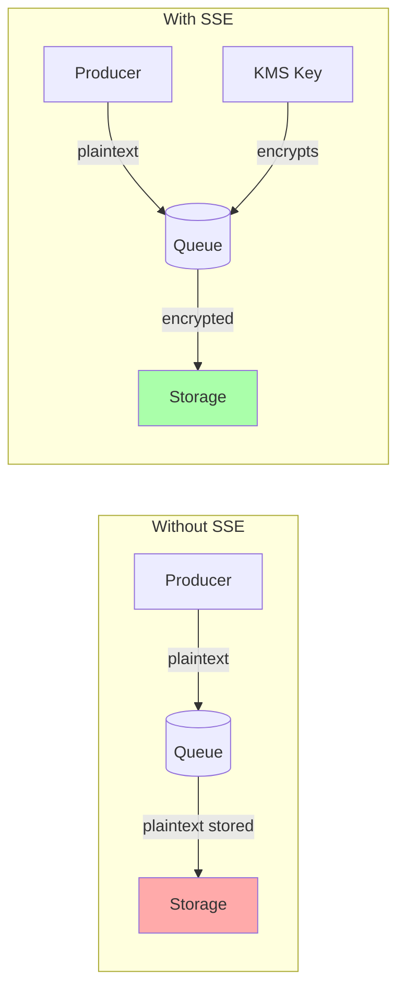
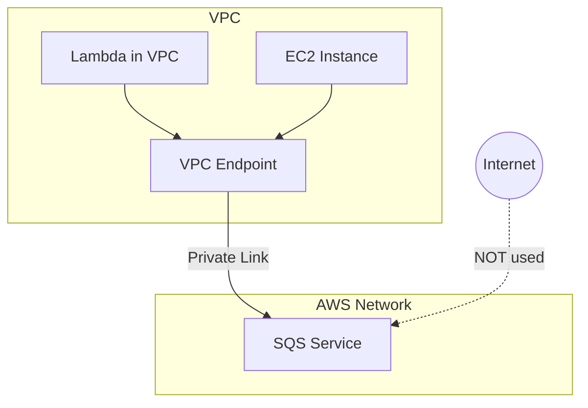

# Security and Encryption

## Alex's Security Audit Wake-Up Call

Jordan, PetTracker's security consultant, conducts a routine audit and finds several issues:

> "Your notification queue contains user PII - email addresses, phone numbers, pet health data. It's all transmitted in plaintext and anyone with AWS console access can read the messages."

Alex reviews the findings:

```terminal
# Anyone with sqs:ReceiveMessage permission can see this
$ aws sqs receive-message --queue-url https://sqs.../pettracker-notifications
{
    "Messages": [{
        "Body": "{\"email\": \"user@example.com\", \"phone\": \"+1234567890\", \"petName\": \"Max\", \"healthData\": {\"weight\": 25, \"medications\": [\"heartworm\"]}}"
    }]
}
```

"We need encryption and proper access controls," Jordan advises. "Let's lock this down."

## Encryption at Rest

**What is encryption at rest?** Messages stored in SQS are encrypted using AWS KMS keys. Even if someone accesses the underlying storage, they can't read the messages without the encryption key.

**Why does it matter?** SQS stores messages across multiple servers in multiple availability zones. Encryption ensures data remains protected in all locations.

**How does it work?** You associate a KMS key with your queue. SQS encrypts messages when they're stored and decrypts when they're delivered. This is transparent to your application.



### Enabling Server-Side Encryption

**Option 1: AWS Managed Key (Simplest)**

```terminal
$ aws sqs set-queue-attributes \
    --queue-url https://sqs.../pettracker-notifications \
    --attributes '{
        "SqsManagedSseEnabled": "true"
    }'
```

This uses the AWS-managed `aws/sqs` key - zero configuration, but limited control.

**Option 2: Customer Managed Key (Recommended)**

```terminal
# First, create a KMS key
$ aws kms create-key --description "PetTracker SQS encryption key"
{
    "KeyMetadata": {
        "KeyId": "1234abcd-12ab-34cd-56ef-1234567890ab",
        "Arn": "arn:aws:kms:us-east-1:123456789012:key/1234abcd-..."
    }
}

# Apply to queue
$ aws sqs set-queue-attributes \
    --queue-url https://sqs.../pettracker-notifications \
    --attributes '{
        "KmsMasterKeyId": "1234abcd-12ab-34cd-56ef-1234567890ab"
    }'
```

With Python:

```python
import boto3

sqs = boto3.client('sqs')
kms = boto3.client('kms')

# Create a dedicated KMS key
key = kms.create_key(
    Description='PetTracker notification queue encryption',
    Tags=[
        {'TagKey': 'Application', 'TagValue': 'PetTracker'},
        {'TagKey': 'Purpose', 'TagValue': 'SQS encryption'}
    ]
)
key_id = key['KeyMetadata']['KeyId']

# Create alias for easier management
kms.create_alias(
    AliasName='alias/pettracker-sqs',
    TargetKeyId=key_id
)

# Enable encryption on queue
sqs.set_queue_attributes(
    QueueUrl=queue_url,
    Attributes={
        'KmsMasterKeyId': key_id,
        'KmsDataKeyReusePeriodSeconds': '300'  # Cache data keys for 5 min
    }
)

print(f"Queue encrypted with key: {key_id}")
```

### Data Key Reuse Period

SQS uses envelope encryption - it generates data keys from your KMS key to encrypt messages. To reduce KMS API calls:

| Reuse Period | KMS Calls | Cost | Security |
|--------------|-----------|------|----------|
| 60 seconds | More frequent | Higher | Highest |
| 300 seconds (default) | Moderate | Moderate | Good |
| 86400 seconds (24hr) | Minimal | Lowest | Acceptable |

```python
# Balance cost and security
sqs.set_queue_attributes(
    QueueUrl=queue_url,
    Attributes={
        'KmsDataKeyReusePeriodSeconds': '300'  # 5 minutes - good balance
    }
)
```

## Encryption in Transit

**What is encryption in transit?** Data is encrypted as it travels between your application and SQS.

**How does it work?** SQS endpoints only accept HTTPS connections. All data is encrypted using TLS 1.2+.

**Is it automatic?** Yes! When using AWS SDKs and CLI, HTTPS is used by default:

```python
# SDK uses HTTPS automatically
sqs = boto3.client('sqs')  # All calls encrypted in transit

# To verify, check the endpoint
print(sqs.meta.endpoint_url)  # https://sqs.us-east-1.amazonaws.com
```

## Queue Access Policies

**What are queue policies?** Resource-based policies that control who can perform actions on your queue.

**Why use them?** IAM policies control what a principal can do. Queue policies control who can access the queue - especially important for cross-account access.

### Basic Queue Policy

```python
import json

policy = {
    "Version": "2012-10-17",
    "Id": "PetTrackerNotificationQueuePolicy",
    "Statement": [
        {
            "Sid": "AllowNotificationService",
            "Effect": "Allow",
            "Principal": {
                "AWS": "arn:aws:iam::123456789012:role/notification-service"
            },
            "Action": [
                "sqs:SendMessage",
                "sqs:ReceiveMessage",
                "sqs:DeleteMessage"
            ],
            "Resource": "arn:aws:sqs:us-east-1:123456789012:pettracker-notifications"
        }
    ]
}

sqs.set_queue_attributes(
    QueueUrl=queue_url,
    Attributes={
        'Policy': json.dumps(policy)
    }
)
```

### Cross-Account Access

Allow another AWS account to send messages:

```python
policy = {
    "Version": "2012-10-17",
    "Statement": [
        {
            "Sid": "AllowPartnerSend",
            "Effect": "Allow",
            "Principal": {
                "AWS": "arn:aws:iam::999888777666:root"  # Partner account
            },
            "Action": "sqs:SendMessage",
            "Resource": "arn:aws:sqs:us-east-1:123456789012:partner-orders",
            "Condition": {
                "StringEquals": {
                    "aws:PrincipalTag/Environment": "production"
                }
            }
        }
    ]
}
```

### Allow SNS to Send to SQS

Required for SNS to SQS fan-out:

```python
policy = {
    "Version": "2012-10-17",
    "Statement": [
        {
            "Sid": "AllowSNSPublish",
            "Effect": "Allow",
            "Principal": {
                "Service": "sns.amazonaws.com"
            },
            "Action": "sqs:SendMessage",
            "Resource": "arn:aws:sqs:us-east-1:123456789012:notification-queue",
            "Condition": {
                "ArnEquals": {
                    "aws:SourceArn": "arn:aws:sns:us-east-1:123456789012:notification-topic"
                }
            }
        }
    ]
}
```

## SNS Topic Policies

SNS topics also have resource-based policies:

```python
import boto3
import json

sns = boto3.client('sns')

policy = {
    "Version": "2012-10-17",
    "Statement": [
        {
            "Sid": "AllowS3Publish",
            "Effect": "Allow",
            "Principal": {
                "Service": "s3.amazonaws.com"
            },
            "Action": "sns:Publish",
            "Resource": "arn:aws:sns:us-east-1:123456789012:image-uploads",
            "Condition": {
                "ArnLike": {
                    "aws:SourceArn": "arn:aws:s3:::pettracker-images"
                }
            }
        },
        {
            "Sid": "AllowEventBridgePublish",
            "Effect": "Allow",
            "Principal": {
                "Service": "events.amazonaws.com"
            },
            "Action": "sns:Publish",
            "Resource": "arn:aws:sns:us-east-1:123456789012:system-alerts"
        }
    ]
}

sns.set_topic_attributes(
    TopicArn=topic_arn,
    AttributeName='Policy',
    AttributeValue=json.dumps(policy)
)
```

## SNS Encryption

SNS supports encryption at rest for topics:

```python
# Create encrypted topic
response = sns.create_topic(
    Name='pettracker-events',
    Attributes={
        'KmsMasterKeyId': 'alias/pettracker-sns'
    },
    Tags=[
        {'Key': 'Application', 'Value': 'PetTracker'}
    ]
)

# Or enable on existing topic
sns.set_topic_attributes(
    TopicArn=topic_arn,
    AttributeName='KmsMasterKeyId',
    AttributeValue='alias/pettracker-sns'
)
```

**Important:** When SNS encrypts with KMS, subscribers need `kms:Decrypt` permission:

```json
{
    "Version": "2012-10-17",
    "Statement": [
        {
            "Effect": "Allow",
            "Action": [
                "kms:Decrypt",
                "kms:GenerateDataKey*"
            ],
            "Resource": "arn:aws:kms:us-east-1:123456789012:key/1234abcd-..."
        }
    ]
}
```

## VPC Endpoints for Private Access

Keep traffic within AWS network - never traverse the internet:



Create SQS VPC endpoint:

```terminal
$ aws ec2 create-vpc-endpoint \
    --vpc-id vpc-1234567890abcdef0 \
    --service-name com.amazonaws.us-east-1.sqs \
    --vpc-endpoint-type Interface \
    --subnet-ids subnet-11111111 subnet-22222222 \
    --security-group-ids sg-12345678
```

**Benefits of VPC endpoints:**
- Traffic stays within AWS network
- No NAT gateway required
- Enhanced security
- Reduced data transfer costs

## Alex's Security Implementation

Alex implements a comprehensive security setup:

```python
import boto3
import json

def secure_queue_setup():
    sqs = boto3.client('sqs')
    kms = boto3.client('kms')

    # 1. Create dedicated KMS key
    key = kms.create_key(
        Description='PetTracker notification encryption',
        KeyUsage='ENCRYPT_DECRYPT',
        Tags=[{'TagKey': 'Application', 'TagValue': 'PetTracker'}]
    )
    key_id = key['KeyMetadata']['KeyId']

    # 2. Create alias
    kms.create_alias(
        AliasName='alias/pettracker-notifications',
        TargetKeyId=key_id
    )

    # 3. Create encrypted queue
    queue = sqs.create_queue(
        QueueName='pettracker-notifications-secure',
        Attributes={
            'KmsMasterKeyId': key_id,
            'KmsDataKeyReusePeriodSeconds': '300',
            'VisibilityTimeout': '30',
            'MessageRetentionPeriod': '345600'
        }
    )

    # 4. Apply restrictive policy
    policy = {
        "Version": "2012-10-17",
        "Statement": [
            {
                "Sid": "DenyUnencryptedTransport",
                "Effect": "Deny",
                "Principal": "*",
                "Action": "sqs:*",
                "Resource": "*",
                "Condition": {
                    "Bool": {"aws:SecureTransport": "false"}
                }
            },
            {
                "Sid": "AllowOnlyNotificationService",
                "Effect": "Allow",
                "Principal": {
                    "AWS": "arn:aws:iam::123456789012:role/notification-service"
                },
                "Action": [
                    "sqs:SendMessage",
                    "sqs:ReceiveMessage",
                    "sqs:DeleteMessage",
                    "sqs:GetQueueAttributes"
                ],
                "Resource": queue['QueueUrl']
            }
        ]
    }

    sqs.set_queue_attributes(
        QueueUrl=queue['QueueUrl'],
        Attributes={'Policy': json.dumps(policy)}
    )

    print(f"Secure queue created: {queue['QueueUrl']}")
    return queue['QueueUrl']
```

## Security Best Practices Checklist

| Practice | SQS | SNS |
|----------|-----|-----|
| Enable encryption at rest | ✅ KmsMasterKeyId | ✅ KmsMasterKeyId |
| Use customer-managed keys | ✅ For audit/control | ✅ For audit/control |
| Apply resource policies | ✅ Queue policy | ✅ Topic policy |
| Use VPC endpoints | ✅ Private access | ✅ Private access |
| Enforce HTTPS | ✅ aws:SecureTransport | ✅ aws:SecureTransport |
| Principle of least privilege | ✅ Minimal permissions | ✅ Minimal permissions |
| Enable CloudTrail | ✅ Audit API calls | ✅ Audit API calls |

## Exam Tips

**Key points for DVA-C02:**

1. **SSE-SQS** uses AWS-managed key, **SSE-KMS** uses customer key
2. **Queue policies** control resource access, **IAM policies** control principal actions
3. **VPC endpoints** keep traffic private
4. **Cross-account** access requires queue/topic policy
5. **SNS to SQS** requires queue policy allowing `sns.amazonaws.com`

**Common exam question patterns:**

> "Encrypt messages at rest with audit capability..."
> → Use SSE-KMS with customer-managed key (CloudTrail logs key usage)

> "Allow Lambda in VPC to access SQS without internet..."
> → Create VPC endpoint for SQS

> "Allow S3 events to publish to SNS topic..."
> → Add topic policy allowing s3.amazonaws.com with source ARN condition

## Key Takeaways

1. **Enable SSE-KMS for encryption at rest with customer-managed keys** - AWS-managed keys work but give you no control or audit trail. Customer-managed KMS keys let you control who can decrypt, set key rotation policies, and see CloudTrail logs of every encryption/decryption operation. For PII (emails, phone numbers, health data in notifications), customer-managed keys are essential for compliance. The overhead is minimal - set it up once per queue and forget about it.

2. **All SQS/SNS traffic uses HTTPS (encryption in transit automatic)** - the AWS SDKs and CLI use HTTPS endpoints by default, so your messages are encrypted in transit without any configuration. But don't assume - verify your endpoint URLs start with `https://`. You can enforce this with queue policies that deny requests where `aws:SecureTransport` is false. This prevents accidental misconfiguration from creating a security hole.

3. **Queue and topic policies control cross-service and cross-account access** - IAM policies control what a principal (user, role) can do. Resource policies (queue policy, topic policy) control who can access the resource. For cross-account access or AWS service access (like SNS writing to SQS), resource policies are required. Always include conditions - restrict which SNS topics can write to a queue, which accounts can access, which source ARNs are allowed.

4. **VPC endpoints provide private access without internet** - by default, Lambda in a VPC must go through NAT gateway (expensive) or internet gateway to reach SQS. VPC endpoints create a private connection within AWS network - traffic never touches the internet. Benefits: better security, lower latency, reduced data transfer costs, no NAT gateway required. For security-sensitive workloads, VPC endpoints are non-negotiable.

5. **Use conditions in policies to restrict access further** - policies support powerful conditions: `aws:SourceArn` limits which resources can access, `aws:PrincipalTag` restricts by role tags, `StringEquals` enforces exact matching. Alex's policy allows SNS to write to SQS only from a specific topic ARN - not from any SNS topic. Conditions are your defense against overly broad permissions.

6. **CloudTrail logs all API calls for auditing** - every `SendMessage`, `ReceiveMessage`, `DeleteMessage` is logged. For compliance and incident investigation, this audit trail is essential. Enable CloudTrail in all regions, send logs to S3, and set up alerts for suspicious patterns (like unusual message volumes or access from unexpected principals). When Jordan's security audit revealed issues, CloudTrail logs showed exactly what needed fixing.

---

*Next: Integrating SQS with Lambda for serverless message processing.*
