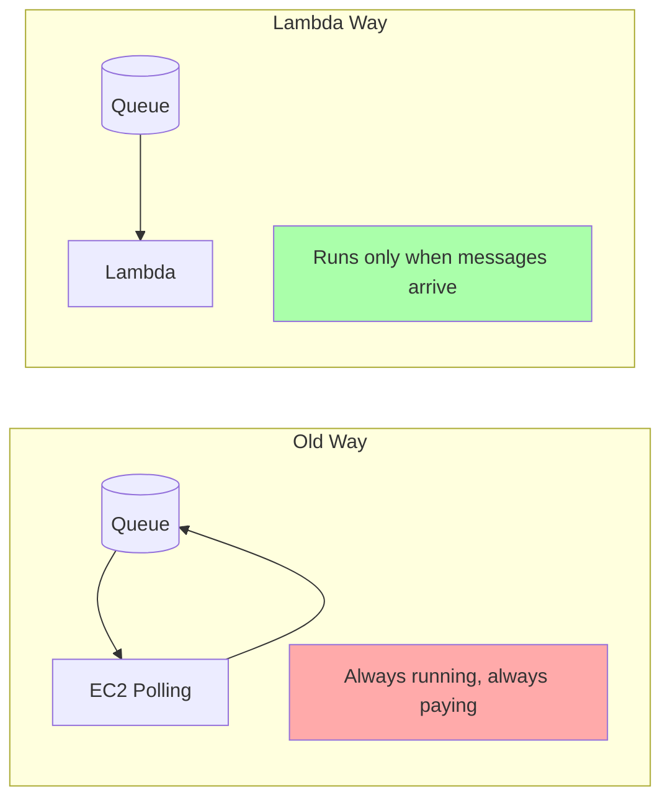
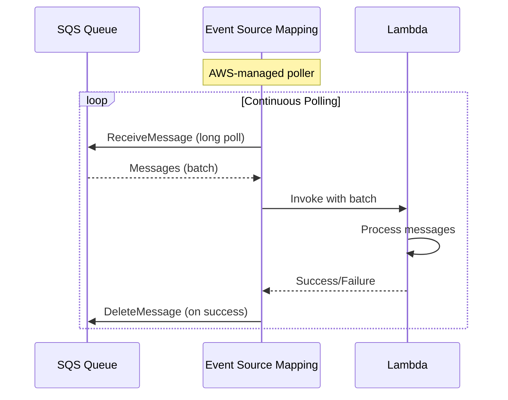
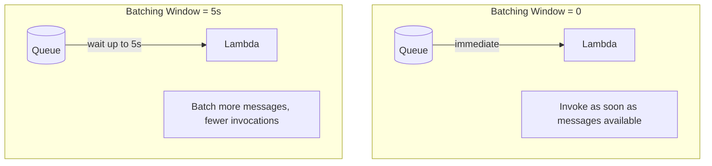
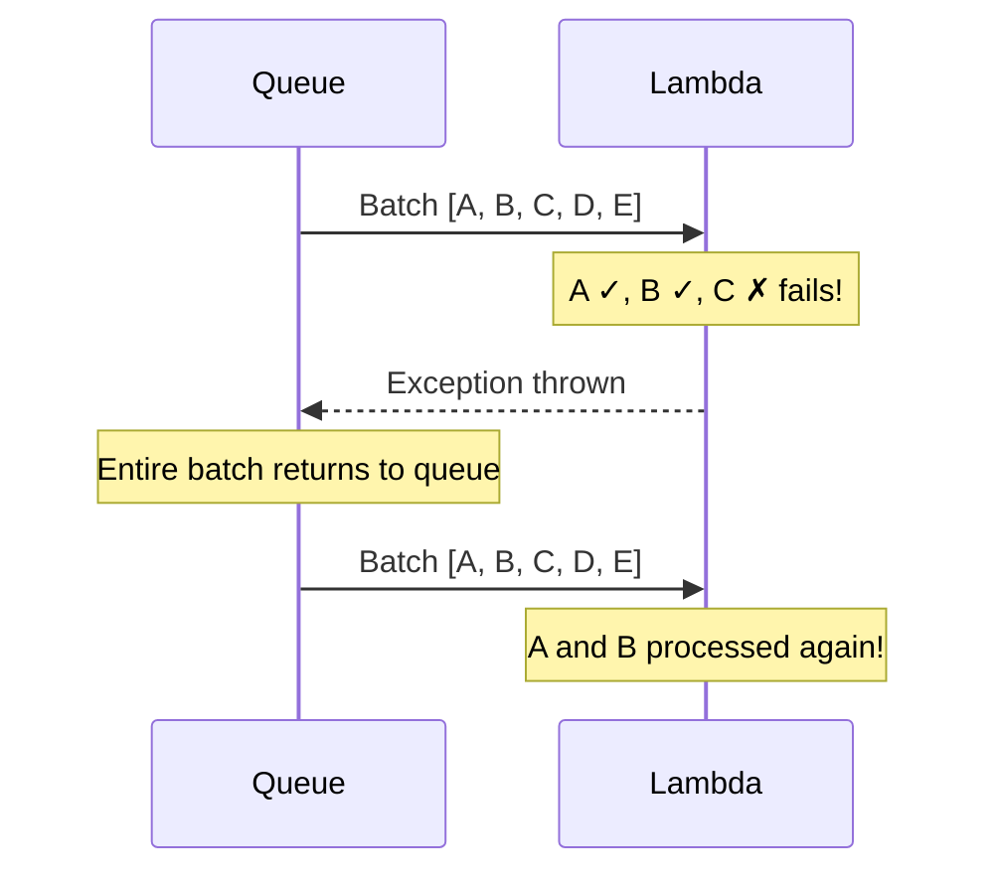
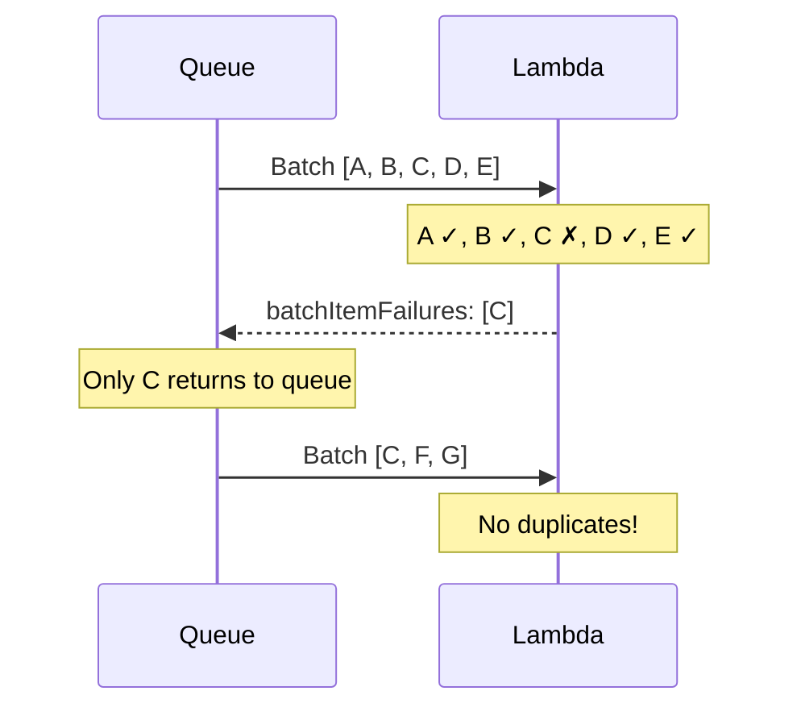
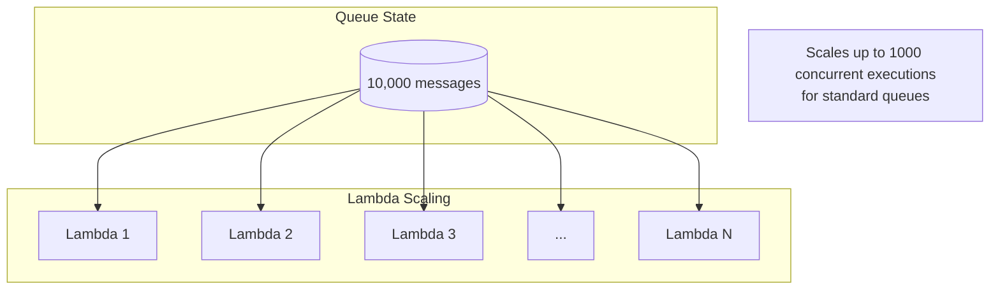
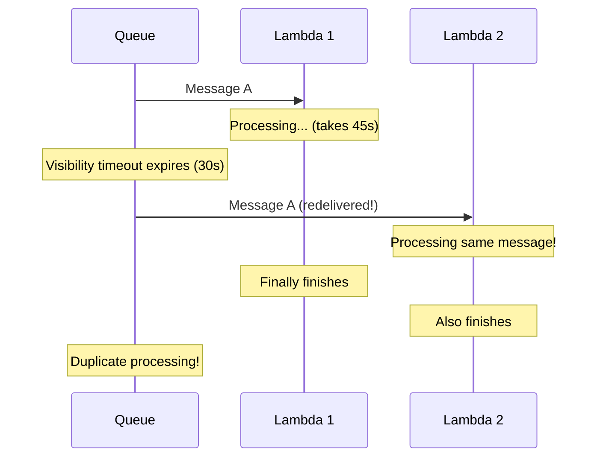

# SQS with Lambda

## Alex Wants Serverless Processing

After implementing the notification queues, Alex faces a new challenge: how to process messages from SQS.

"I could run EC2 instances polling the queue," Alex thinks, "but that means managing servers, scaling, and paying for idle time."

Sam suggests a better approach: "Use Lambda. It automatically polls SQS, scales to match your message volume, and you only pay for actual processing time."



## What is SQS Lambda Integration?

**What is it?** Lambda can automatically poll SQS queues and invoke your function when messages arrive. AWS manages the polling infrastructure - you just write the processing logic.

**Why use it?** No servers to manage, automatic scaling, pay-per-invocation pricing. Lambda handles the complexity of polling, batching, and error handling.

**How does it work?** You create an "event source mapping" that connects your queue to your function. Lambda polls the queue, batches messages, and invokes your function with those messages.



## Creating the Event Source Mapping

### Using AWS CLI

```terminal
$ aws lambda create-event-source-mapping \
    --function-name notification-processor \
    --batch-size 10 \
    --maximum-batching-window-in-seconds 5 \
    --event-source-arn arn:aws:sqs:us-east-1:123456789012:pettracker-notifications
{
    "UUID": "a1b2c3d4-5678-90ab-cdef-EXAMPLE",
    "BatchSize": 10,
    "EventSourceArn": "arn:aws:sqs:us-east-1:123456789012:pettracker-notifications",
    "FunctionArn": "arn:aws:lambda:us-east-1:123456789012:function:notification-processor",
    "State": "Enabled"
}
```

### Using Python/Boto3

```python
import boto3

lambda_client = boto3.client('lambda')

response = lambda_client.create_event_source_mapping(
    EventSourceArn='arn:aws:sqs:us-east-1:123456789012:pettracker-notifications',
    FunctionName='notification-processor',
    BatchSize=10,  # Messages per invocation
    MaximumBatchingWindowInSeconds=5,  # Wait up to 5s to batch
    Enabled=True
)

print(f"Created event source mapping: {response['UUID']}")
```

### Using SAM Template

```yaml
# template.yaml
AWSTemplateFormatVersion: '2010-09-09'
Transform: AWS::Serverless-2016-10-31

Resources:
  NotificationProcessor:
    Type: AWS::Serverless::Function
    Properties:
      Handler: handler.process_notifications
      Runtime: python3.11
      Timeout: 30
      Events:
        SQSEvent:
          Type: SQS
          Properties:
            Queue: !GetAtt NotificationQueue.Arn
            BatchSize: 10
            MaximumBatchingWindowInSeconds: 5

  NotificationQueue:
    Type: AWS::SQS::Queue
    Properties:
      QueueName: pettracker-notifications
      VisibilityTimeout: 180  # 6x Lambda timeout
```

## Writing the Lambda Handler

### Basic Handler Structure

```python
import json

def handler(event, context):
    """Process messages from SQS."""
    print(f"Received {len(event['Records'])} messages")

    for record in event['Records']:
        # Parse the message body
        body = json.loads(record['body'])

        # Process the message
        process_notification(body)

        print(f"Processed message: {record['messageId']}")

    # Return success - Lambda will delete messages
    return {'statusCode': 200}

def process_notification(notification):
    """Handle a single notification."""
    notification_type = notification.get('type')

    if notification_type == 'email':
        send_email(notification)
    elif notification_type == 'sms':
        send_sms(notification)
    elif notification_type == 'push':
        send_push(notification)
    else:
        print(f"Unknown notification type: {notification_type}")
```

### Understanding the Event Structure

```python
# event looks like this:
{
    "Records": [
        {
            "messageId": "059f36b4-87a3-44ab-83d2-661975830a7d",
            "receiptHandle": "AQEBwJnKyrHigUMZj6rYigCgxlaS3SLy0a...",
            "body": "{\"type\":\"email\",\"to\":\"user@example.com\"}",
            "attributes": {
                "ApproximateReceiveCount": "1",
                "SentTimestamp": "1545082649636",
                "SenderId": "AIDAIENQZJOLO23YVJ4VO",
                "ApproximateFirstReceiveTimestamp": "1545082649649"
            },
            "messageAttributes": {
                "NotificationType": {
                    "stringValue": "email",
                    "dataType": "String"
                }
            },
            "md5OfBody": "e4e68fb7bd0e697a0ae8f1bb342846b3",
            "eventSource": "aws:sqs",
            "eventSourceARN": "arn:aws:sqs:us-east-1:123456789012:my-queue",
            "awsRegion": "us-east-1"
        }
    ]
}
```

## Batching Configuration

Lambda can receive multiple messages per invocation. Configure batching for efficiency:

| Setting | Range | Default | Purpose |
|---------|-------|---------|---------|
| `BatchSize` | 1-10 (standard), 1-10000 (FIFO) | 10 | Max messages per invocation |
| `MaximumBatchingWindowInSeconds` | 0-300 | 0 | Wait time to accumulate messages |



**Trade-offs:**

| Higher BatchSize | Lower BatchSize |
|------------------|-----------------|
| Fewer invocations | More invocations |
| Better throughput | Lower latency |
| More complex error handling | Simpler error handling |
| Risk: one failure affects batch | Each message independent |

## Error Handling and Partial Batch Failures

### The Problem

If any message in a batch fails, by default Lambda retries the entire batch:



### The Solution: ReportBatchItemFailures

Enable partial batch response to only retry failed messages:

```python
def handler(event, context):
    """Process batch with partial failure reporting."""
    batch_item_failures = []

    for record in event['Records']:
        try:
            body = json.loads(record['body'])
            process_notification(body)
        except Exception as e:
            # Record failed message ID
            batch_item_failures.append({
                'itemIdentifier': record['messageId']
            })
            print(f"Failed to process {record['messageId']}: {e}")

    # Return failures - only these return to queue
    return {
        'batchItemFailures': batch_item_failures
    }
```

Enable in event source mapping:

```terminal
$ aws lambda update-event-source-mapping \
    --uuid a1b2c3d4-5678-90ab-cdef-EXAMPLE \
    --function-response-types "ReportBatchItemFailures"
```



## Concurrency and Scaling

Lambda automatically scales to process messages:



**Scaling limits:**

| Queue Type | Initial Concurrency | Scale Rate | Max Concurrent |
|------------|--------------------:|------------|----------------|
| Standard | 5 | +60/min | Account limit |
| FIFO | 5 per message group | +60/min | Account limit |

### Reserved Concurrency

Control how many Lambda instances can run:

```terminal
$ aws lambda put-function-concurrency \
    --function-name notification-processor \
    --reserved-concurrent-executions 100
```

**Why limit concurrency?**
- Protect downstream services from overload
- Control costs
- Ensure resources for other functions

## Visibility Timeout Alignment

**Critical:** Set queue visibility timeout to at least 6x your Lambda timeout:

```yaml
# If Lambda timeout is 30 seconds:
VisibilityTimeout: 180  # 30 * 6 = 180 seconds

# Why? Lambda might retry on timeout, and you need buffer for:
# - Lambda cold start
# - Processing time
# - Network latency
# - Retry attempts
```

If visibility timeout is too short:



## Alex's Complete Lambda Setup

```python
import json
import boto3
from typing import List, Dict, Any

ses = boto3.client('ses')
sns_client = boto3.client('sns')

def handler(event: Dict[str, Any], context) -> Dict[str, List]:
    """
    Process notification messages from SQS.
    Returns partial batch failures for retry.
    """
    batch_item_failures = []

    for record in event['Records']:
        message_id = record['messageId']

        try:
            # Parse and validate
            body = json.loads(record['body'])
            notification = validate_notification(body)

            # Route to appropriate handler
            notification_type = notification['type']
            if notification_type == 'email':
                send_email_notification(notification)
            elif notification_type == 'sms':
                send_sms_notification(notification)
            elif notification_type == 'push':
                send_push_notification(notification)
            else:
                raise ValueError(f"Unknown type: {notification_type}")

            print(f"Successfully processed {message_id}")

        except json.JSONDecodeError as e:
            # Bad JSON - don't retry, log for investigation
            print(f"Invalid JSON in {message_id}: {e}")
            # Don't add to failures - let it go to DLQ after max retries

        except ValueError as e:
            # Validation error - don't retry
            print(f"Validation error in {message_id}: {e}")

        except Exception as e:
            # Transient error - retry this message
            print(f"Error processing {message_id}: {e}")
            batch_item_failures.append({
                'itemIdentifier': message_id
            })

    return {'batchItemFailures': batch_item_failures}

def validate_notification(body: Dict) -> Dict:
    """Validate notification structure."""
    required_fields = ['type', 'recipient', 'content']
    for field in required_fields:
        if field not in body:
            raise ValueError(f"Missing required field: {field}")
    return body

def send_email_notification(notification: Dict):
    """Send email via SES."""
    ses.send_email(
        Source='notifications@pettracker.com',
        Destination={'ToAddresses': [notification['recipient']]},
        Message={
            'Subject': {'Data': notification.get('subject', 'PetTracker Notification')},
            'Body': {'Text': {'Data': notification['content']}}
        }
    )

def send_sms_notification(notification: Dict):
    """Send SMS via SNS."""
    sns_client.publish(
        PhoneNumber=notification['recipient'],
        Message=notification['content']
    )

def send_push_notification(notification: Dict):
    """Send push notification via SNS platform application."""
    sns_client.publish(
        TargetArn=notification['recipient'],  # Platform endpoint ARN
        Message=json.dumps({'default': notification['content']}),
        MessageStructure='json'
    )
```

## Monitoring Lambda-SQS Integration

Key CloudWatch metrics to monitor:

| Metric | What It Tells You |
|--------|-------------------|
| `NumberOfMessagesReceived` | Messages Lambda is processing |
| `ApproximateAgeOfOldestMessage` | Processing delay (should be low) |
| `NumberOfMessagesDeleted` | Successfully processed |
| `ApproximateNumberOfMessagesVisible` | Queue backlog |
| Lambda `Invocations` | Function execution count |
| Lambda `Errors` | Processing failures |
| Lambda `Duration` | Processing time |

```terminal
# Check if queue is backing up
$ aws cloudwatch get-metric-statistics \
    --namespace AWS/SQS \
    --metric-name ApproximateAgeOfOldestMessage \
    --dimensions Name=QueueName,Value=pettracker-notifications \
    --statistics Maximum \
    --period 300 \
    --start-time 2024-03-23T00:00:00Z \
    --end-time 2024-03-23T23:59:59Z
```

## Exam Tips

**Key points for DVA-C02:**

1. **Event source mapping** connects SQS to Lambda automatically
2. **Visibility timeout** should be 6x Lambda timeout
3. **BatchSize** controls messages per invocation (max 10 standard)
4. **ReportBatchItemFailures** enables partial batch retry
5. Lambda **automatically deletes** successfully processed messages
6. **FIFO queues** scale per message group

**Common exam question patterns:**

> "Process SQS messages without managing servers..."
> → Lambda with event source mapping

> "Some messages in a batch fail, don't want to reprocess all..."
> → Enable ReportBatchItemFailures, return failed message IDs

> "Messages are being processed twice..."
> → Increase visibility timeout to 6x Lambda timeout

## Key Takeaways

1. **Lambda automatically polls SQS - no server management** - the event source mapping is an AWS-managed poller that runs continuously, checking your queue for messages. You don't manage servers, configure polling intervals, or handle scaling. Lambda takes care of receiving messages, invoking your function, and deleting successful messages. You just write the processing logic. This is the "serverless" in serverless - infrastructure you don't think about.

2. **Event source mapping handles the integration** - the event source mapping is the glue between SQS and Lambda. It controls batch size, batching window, concurrency scaling, and failure handling. You configure it once, and AWS handles the rest. When you need to change behavior (like enabling partial batch failures), you update the event source mapping, not your Lambda code.

3. **Use ReportBatchItemFailures for partial batch retry** - by default, if any message in a batch fails, the entire batch returns to the queue and all messages retry. With `ReportBatchItemFailures` enabled, your Lambda returns a list of failed message IDs, and only those specific messages retry. Successfully processed messages are deleted. This prevents duplicate processing of messages that already succeeded - a common cause of double-sends and data inconsistencies.

4. **Set visibility timeout to 6x Lambda timeout** - if your Lambda has a 30-second timeout, set queue visibility to 180 seconds (30 × 6). Why 6x? Lambda might retry on timeout, cold starts add time, network latency varies, and you need buffer for the event source mapping to handle failures. If visibility timeout is shorter than processing time, messages become visible while Lambda is still working, causing duplicate processing. This is the most common SQS+Lambda misconfiguration.

5. **Batch size controls throughput vs latency trade-off** - higher batch sizes mean fewer Lambda invocations (cheaper, higher throughput) but longer processing time per invocation and more complex error handling. Lower batch sizes mean more invocations (more expensive, lower latency) but simpler code and faster message-by-message processing. Alex uses batch=10 for email (efficient), batch=5 for SMS (rate-limited anyway), batch=50 for push (fast processing).

6. **Lambda scales automatically based on queue depth** - when messages pile up, Lambda adds more concurrent executions (starting with 5, adding 60 per minute). You don't configure autoscaling - it happens automatically. Use reserved concurrency to limit scale if you need to protect downstream services from overload. Monitor `ApproximateAgeOfOldestMessage` to detect if scaling isn't keeping up with incoming messages.

---

*Next: Putting it all together - Alex's complete notification solution.*
